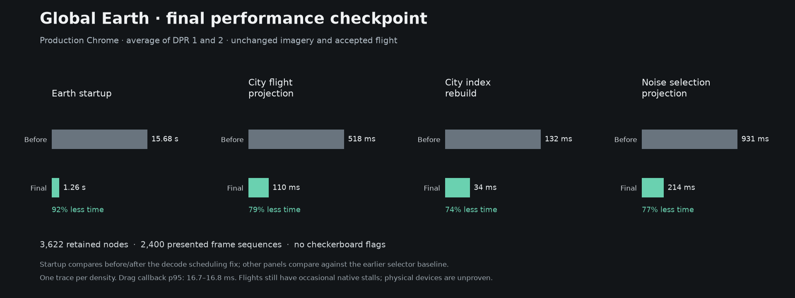
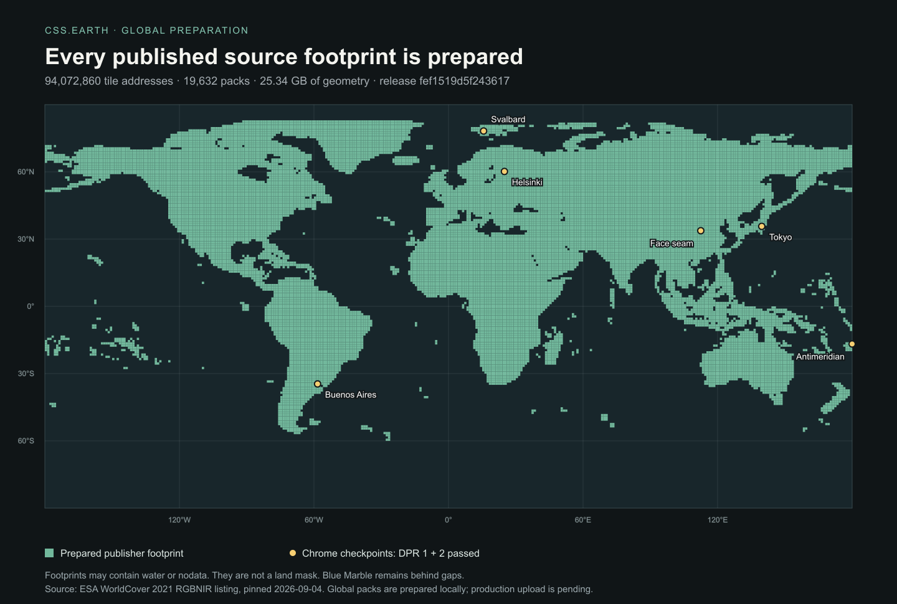
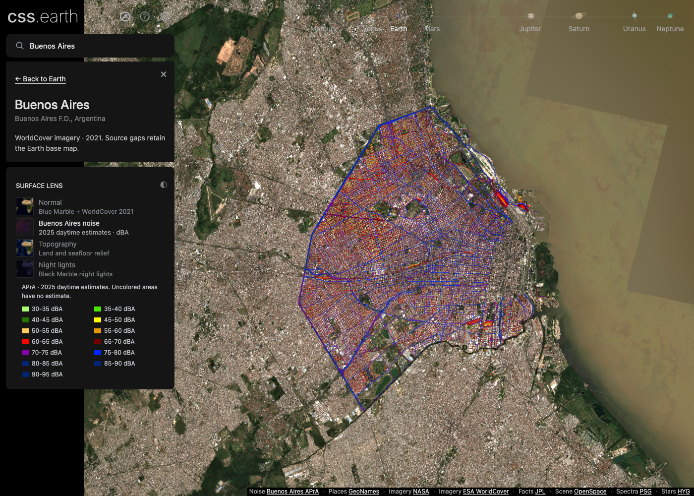

# Global Earth coverage and Buenos Aires noise

Earth can search 34,135 GeoNames cities and fly to their prepared camera poses. Geographic coverage comes from the WorldCover source inventory, independently of the search catalogue. The Buenos Aires noise lens overlays the city's published 2025 daytime estimates.

## Delivery and limits

| Content | Delivery | Bound |
| --- | --- | --- |
| Globe, lenses and shell | Prepared local application assets | One mounted object |
| City names and camera destinations | Lazy local catalogue | 34,135 cities; eight retained result rows |
| WorldCover imagery | Unchanged 256-pixel PNGs from Terrascope WMTS | Four concurrent image loads |
| Geographic placement | Immutable compressed geometry ranges | Three concurrent requests; 96 resident sections; 12 MiB decoded transport data |
| Visible detail and replacement | Fixed retained CSS image pool | 512 slots; 128 MiB RGBA-equivalent reservation |
| Buenos Aires noise | 16 prepared transparent WebP tiles | 32 retained slots; source colours and legend |

The memory limits describe the application's pools and decoded transport data. They do not measure Chrome's full process or GPU memory. The noise overlay reuses the normal surface image bank. It does not decode another copy of the globe textures.

When a wide view needs more image pieces than the fixed pool can hold, it shows the existing Blue Marble surface. Detail resumes as the camera moves closer. Tile groups stay complete and the pool does not grow during flights.

The source listing extends from 60° south to 83° north and includes water and nodata. It is a footprint inventory, not a land mask or a guarantee of valid pixels everywhere. Blue Marble remains behind the available detail. Terrascope's availability and production traffic terms remain external dependencies; unlimited free traffic is unproven.

## Prepared release

`src/planets/earth/source/city/wmts-release.json` pins version `fef1519d5f243617`:

- 94,072,860 tile addresses at levels 5–14, in 19,174 regional packs and 458 coarse packs.
- 106,963,238 prepared image pieces and 25,344,236,995 compressed geometry bytes.
- Exact range responses, compressed and decoded sizes, and SHA-256 hashes checked before publication.
- No imagery downloaded during the global geometry preparation.

PR #2's affine base raster pages and this feature's geographic frames coexist. All 450 geographic frames remained byte-identical across the integration. The migration rechecked every pack hash without building a second full copy of the world. Its proof is pinned in `src/planets/earth/source/city/geographic-rebind.json`.

PR #2 is integrated through `5bfa2d2447a46f82ca5c2369e0b447c7f47c680c`. Earth binds the same `createObjectRuntime` factory as every other object. Its presentation supplies retained frame anchors and prepared page-layer data. The shared owner mounts and retires map transport, forwards camera and selection publications, and applies playback permission. Pinned catalogue loading and destination flights also belong to the shared runtime; the package supplies camera poses, source content and status text. Development page observations are available through `runtime.pages()`.

The regular globe now uses PR #2's seven bounded surface pages. Topography and night lights retain their 8× zoom limit. Normal imagery and the noise lens support the prepared city-detail range. The accepted city flight keeps its 4.5-second pose interpolation; wheel, pointer, Escape and document hiding cancel it, and reduced motion jumps to the destination.

## Reproduction and checks

A fresh checkout can run Earth with `pnpm install`, `pnpm setup:assets --object=earth`,
and `pnpm dev`. This downloads prepared browser assets and reads visible geometry
ranges from the published release; the full local geometry mirror is optional.

To reproduce the outputs from source, use `pnpm prepare:checkout`: it restores pinned source bytes
and the published worldwide geometry release, then runs ordinary preparation.
Existing valid packs are reused. Missing or corrupt packs are downloaded from
the origin, version and filenames bound by the checked-in release inventory;
size and SHA-256 must match before an atomic replacement. Acquisition uses at
most four concurrent pack requests and never authors or publishes a release.
The focused acquisition command is:

```sh
node src/planets/earth/tools/acquire-pinned-global-wmts.mjs
```

`pnpm acquire:planets` includes this acquisition. Its `--verify-only` mode,
including the focused helper's `--verify-only`, reads every pinned pack without
network access or writes and fails if any source or pack is missing or corrupt.
Ordinary `pnpm prepare:planets` verifies the acquired release and regenerates
the coarse runtime binding from its pinned inputs. Its 94,072,860 worldwide
tiles remain acquired geometry; ordinary preparation does not regenerate them.

Run these from the feature checkout:

```sh
pnpm acquire:planets -- --verify-only
pnpm test
pnpm build
pnpm test:browser http://127.0.0.1:4298
pnpm test:earth-global
node src/planets/earth/test/wmts-tree-browser.mjs --global --sample=buenos-aires --noise --mobile
node src/planets/earth/test/city-lens-walkthrough.mjs http://127.0.0.1:4298
node src/planets/earth/test/noise-destination-browser.mjs http://127.0.0.1:4298
pnpm preview --port 4228
pnpm verify:earth-delivery
pnpm test:earth-delivery http://127.0.0.1:4228
```

The shared browser suite needs a development server from this checkout at the supplied URL. The global browser harness starts its own server and exercises the normal app delivery path. It requires the matching local geometry release. Browser harnesses should run sequentially.

`pnpm prepare:earth-global` explicitly authors the worldwide geometry, resumes verified regions, and reserves 8 GiB of disk headroom. Allow approximately 25.4 GB for the release, in addition to sources and preparation space. A changed geometry recipe creates a new version, so account for both versions before rebuilding. The completed-version pointer is written only after refinement and full hash verification. This command is separate from restoring the already published release; a newly authored version requires its own publication before production can use its URLs.

## Deployment boundary

The global packs live outside `public` and `dist`. Development and preview read exact ranges from `.local/wmts-global/<version>/` when present and otherwise retrieve the same ranges from `https://earth-assets.lowpoly.cc/scenes/earth/wmts-<version>/`. Production reads that published release directly.

Version `fef1519d5f243617` was published on 2026-09-05: all 19,632 objects and 25,344,236,995 bytes match the pinned inventory. Every remote object was checked for size, checksum, content type and immutable cache headers. Real Chrome verified the built application with public geometry and direct provider imagery at DPR 1/2. The feature branch still needs its normal review and application deployment.

The publisher verifies every local SHA-256 before writing. Existing immutable objects must match; missing objects can be resumed. A two-pack public sample must demonstrate exact ranges, CORS and a CDN cache HIT before the full release is uploaded. The S3 bulk path verifies all remote sizes and MD5s against the same locally verified inventory. Geometry packs remain outside Git and the application bundle.

```sh
pnpm publish:earth-global --sample
pnpm publish:earth-global --sample --upload
pnpm verify:earth-delivery
pnpm publish:earth-global --upload
pnpm publish:earth-global --verify-only
```

Without S3 credentials, publication uses the existing Wrangler login. The faster bulk path uses installed `rclone` when `EARTH_R2_ACCESS_KEY_ID` and `EARTH_R2_SECRET_ACCESS_KEY` are present in the process environment. Use a temporary credential scoped to `cssearth-assets`, then revoke it. Secrets are never written to publication reports or command arguments. Planning and verification do not upload anything.

The deployed CORS contract is checked in at `src/planets/earth/source/city/r2-cors.json`. It permits the application origin, GET/HEAD and the `Range` header, and exposes range, size, ETag and cache-status headers. The narrowly scoped cache rule is in `r2-cache-rule.json`: immutable successful responses use their origin cache headers, while HTTP errors are not stored. See Cloudflare's [range CORS settings](https://developers.cloudflare.com/r2/buckets/cors/) and [status-code TTL settings](https://developers.cloudflare.com/cache/how-to/cache-rules/settings/#edge-ttl).

`verify:earth-delivery` fetches coarse, regional and detail ranges through the real public custom domain, validates compressed and decoded hashes, and checks browser CORS and cache behavior. `test:earth-delivery` serves the unchanged built application bytes on `https://css.earth` inside its browser harness, while geometry and imagery go to their real public endpoints. It records Buenos Aires, its noise lens and Tokyo at DPR 1/2, checks script hashes against `dist`, and verifies stable scene nodes and identical density-independent selections. This verifies the built application's production-origin delivery path; it does not deploy the live application.

Standard `pnpm preview` now uses Vite's static preview with the same prepared-pack middleware as development. Astro's static preview discards user Vite plugins, which previously left local geometry requests unavailable. The preview test proves built routes and bounded 206/416/405 responses with packs outside `dist`.

The legacy `publish:earth-city` command publishes the earlier city-image experiment; it does not publish this global WMTS geometry release. Provider imagery is loaded directly and is not reuploaded.

## Targeted performance result

The selector projects prepared corners directly into bounds, reuses those projections while relaxing an over-budget selection, and preserves decoded index wrappers across unrelated residency changes. The accepted flight, prepared geometry, image quality and fixed pools are unchanged. A comparison against the accepted implementation matched all 54,960 projection cases exactly.

Chrome traces from 2026-09-05 measured the same search, flight, drag, noise and return scenario before and after the change. Values below are sampled milliseconds at DPR 1 / DPR 2. Projection is inclusive time; index rebuilding is self time, so these measures must not be added.

| Work | Before | After |
| --- | ---: | ---: |
| City-flight projection | 518 / 518 | 111 / 109 |
| City-flight index rebuild | 134 / 130 | 31 / 37 |
| Noise-selection projection | 976 / 886 | 229 / 200 |

The final production traces include the shared runtime and retain all 3,622 scene nodes. No checkerboard or missing-content flags were reported across 2,400 presented frame sequences. Drag callback p95 remained 16.7–16.8 ms. The measured cold city flights took 4.56 seconds, including UI dispatch, with callback p95 of 33.2–33.3 ms. Occasional flight stalls remain: the largest cold-flight task was 108 ms wall time with 7.7 ms of thread CPU under Chrome's frame processing. These are single traced runs per density on desktop Chrome, not proof of uniformly smooth flights or physical-device performance.

The integration initially exposed a production startup regression: repeated raster-time decoding extended readiness to 15.66 / 15.70 seconds. Limiting the mounted image pool to two concurrent decodes reduced final cold readiness to 1.257 / 1.260 seconds, with unchanged assets and layout. Serializing only surface-page decoding did not fix the regression. The final traces use built application files, a local geometry mirror and real provider imagery; separate delivery checks exercise public Cloudflare geometry.



## Visual evidence





The integration recording follows the actual UI: Earth → search Buenos Aires → fly → noise lens → closer zoom. The global Chrome check covers Buenos Aires, Helsinki, Svalbard, the antimeridian, a face seam, Tokyo and a return visit, at DPR 1 and DPR 2. It verifies retained node identity, bounded residency and the exact same canonical data selection at both densities.

Local recording, screenshots and detailed reports are kept under `output/earth-city/global-completion/`, `output/earth-city/finish-line/` and `output/playwright/`. They are excluded from Git. Desktop Chrome and mobile viewport emulation are evidence for those environments; physical mobile devices remain unproven.
