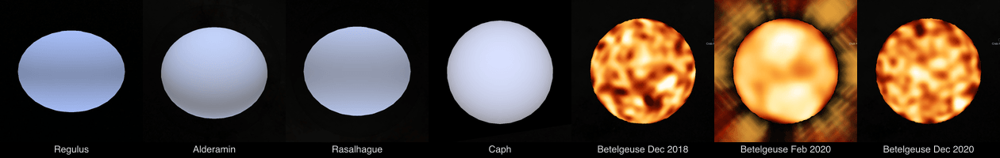

# Interferometric imaging

A star's surface reaches this project as interferometric data, not as a picture. This guide describes how that data becomes a lens, which checks decide whether it may, and what has been measured. Each star's README records its own run.

## Stages

1. **Calibrate.** Most public data are raw exposures in the ESO archive. The calibration tools plan a night from the archive's raw table, download the public frames and reduce them with ESO's own pipelines: `calibrate-pionier.mts` for VLTI/PIONIER, `calibrate-amber.mts` for VLTI/AMBER, `calibrate-gravity.mts` for VLTI/GRAVITY and `calibrate-matisse.mts` for VLTI/MATISSE. PIONIER and AMBER nights are planned from the raw table. GRAVITY and MATISSE need deeper calibration chains, so their tools follow the calibration tree the archive's calselector service gives for the science frame (`eso-associations.mts`). A table per instrument names the recipe for each kind of association, which children it reads, and which header keywords pick between alternatives, such as the dark with the science frame's integration time or the sky in the same beam-commutation state. An author's calibrated file, when one is public, can be used instead.
2. **Select.** `oifits-select.mts` flags channels outside chosen wavelength windows, data outside an MJD range, or every other exposure (`--half even|odd`), applies a published wavelength-scale correction, and can raise errors to a floor (`--error-floor`). The measured values themselves are never changed.
3. **Reconstruct.** SQUEEZE builds a flat sky-plane image. `surface-reconstruction.mts` runs ROTIR, which fits brightness directly on a sphere of known size and limb darkening.
4. **Check.** `spotless-disc.mts` simulates a spotless limb-darkened disc on the same sampling and errors, and the same recipe reconstructs it. A reconstruction may be cast only if it passes three conditions:
   - it fits its own data to a reduced chi-squared of 3 or better, on squared visibilities and on closure phases;
   - its spots are at least twice as strong as those of every spotless twin within 2 percent of the fitted size;
   - its spots come back from two interleaved halves of the data: once each half's own spotless twin is subtracted, the two halves' spots correlate at 0.5 or more.
5. **Cast.** A flat image goes onto the sphere through the `surface-observation` route with a computed camera, as for Betelgeuse and π¹ Gruis. A sphere reconstruction goes through `surface-lens.mts`, which writes the float32 image map the `terrestrial-scientific` lens reads, to be stated with `outputLongitudeOrigin: -90`.

The four CHARA-imaged fast rotators are oblate and gravity-darkened; the three
Betelgeuse epochs are MATISSE reconstructions cast onto the sphere. Both routes
end in the same lens.



## One command per star

`image-star.mts` runs stages 1 to 4 on one season of one star and ends with a verdict:

```bash
node tools/objects/interferometry/image-star.mts tools/objects/interferometry/seasons/pi1-gruis-pionier-2014-09 output/stars/pi1-gruis-pionier-2014-09 --raw output/calibration/raw-pionier
```

A season is a folder under `tools/objects/interferometry/seasons/` with a `season.json` (`cssearth-star-season@1`). It names:

- the instrument and the target's name in the archive;
- the nights (PIONIER, AMBER) or science exposures with any calibrator exposures (GRAVITY, MATISSE);
- AMBER calibrator diameters, each with its source;
- a reference diameter and its source;
- the wavelength windows and error floors;
- the SQUEEZE recipe;
- the limb darkening of the spotless twins;
- optionally an author's calibrated file and image to compare with.

The command then:

1. calibrates each night or exposure, one at a time, into `nights/`;
2. joins every calibrated file and applies the selection;
3. fits a uniform disc within half the reference diameter either way (`disc-fit.mts`). The disc is the start image and the spotless twins' size, and half the mean wavelength over the longest baseline is the beam;
4. writes the two interleaved halves, spotless twins of the season at 0.98 to 1.02 times the fitted size, and each half of the full-size twin;
5. runs SQUEEZE nine times, one run at a time (`squeeze.mts`), and reads the fit SQUEEZE prints for each image;
6. applies the three conditions and, when the season names them, compares the calibrated squared visibilities with the author's file (`author-comparison.mts`: the nearest baseline within a metre, channels in wavelength order) and the image with the shipped one (correlation inside the disc after both are convolved to the beam).

It writes `verdict.json` and prints "cast" or "not cast, because" with the reasons. Stages are kept: calibration steps are reused while their inputs are unchanged, and a SQUEEZE run is reused only while its data, start image and recipe hash the same.

On π¹ Gruis's 2014 season from raw (19 calibrated files, 851 squared visibilities and 593 closure phases), the command gives: cast. The fit is 1.98 and 1.14, the spot ratio 2.18 against the spottiest twin (4.97 against the full-size one) and the halves correlation 0.90. The disc is 18.12 mas, and the image correlates 0.990 with the shipped one. Against the author's file, 828 squared visibilities pair at a median ratio of 0.999 (5th percentile 0.981) and a median difference of 0.08 sigma. None differs by more than 3 sigma. The 44 pairs above a ratio of 3.5 all differ from the author's value by less than their own error (at most 0.76 of it), where the author's file states 5 percent. 44 of the 66 pairs outside 0.67 to 1.5 have author squared visibilities below 0.002. The first run from raw gave "not cast" (fit 101.8 and 6.3, disc 27.3 mas, halves 0.21), because of two calibration faults: the lost fringes below, and error floors without the author's minimum.

`--calibrated <oifits>` skips the calibration and runs stages 2 to 7 on given files. On π¹ Gruis's season with the file Paladini et al. imaged from, the command gives the shipped image again (correlation 1.000 after convolution to the 2.10 mas beam), the same fit (2.45 and 1.06), spot ratio 2.40 (5.38 against the full-size twin) and halves correlation 0.94: cast. The table below has 5.22 and 0.95 for the same file from hand runs whose spotless twins were drawn differently (their closure phases differ by up to 33 degrees). A twin's halves are the halves of the season's twin.

Error floors raise squared-visibility errors to a fraction of the value and to a minimum, and closure-phase errors to a number of degrees. They never lower an error. Raw calibration states the scatter within a block, which misses the calibration error between blocks and nights. In the file Paladini et al. imaged π¹ Gruis from, every squared-visibility error is the largest of its own, 5 percent and 5e-6, and every closure-phase error at least 2 degrees (`--error-floor 0.05:2:5e-6`). The minimum matters past a null. Without it, five points with squared visibilities near 1e-5 and errors near 5e-7 gave 59 percent of the chi-squared of the shipped image against the season from raw.

## Toolchains

`tools/objects/interferometry/toolchains.json` pins every external code: SQUEEZE by commit, ROTIR by commit through a Julia 1.12.7 environment (`rotir/Project.toml` and `rotir/Manifest.toml`), and ESO's instrument kits by URL and sha256. Install one with:

```bash
node tools/objects/interferometry/toolchain.mts install amber
```

Toolchains install under `output/toolchains/`, which git ignores. Downloads are checked against their sha256 and deleted once built. An ESO kit builds with its own installer. PIONIER also builds Yorick from ESO's source package. AMBER's installer stops on Apple clang 17 (`gipaf.c` calls `cx_assert` without its header), so the descriptor states the repair and the tool rebuilds that one package and unpacks the calibration files. MATISSE 2.5.0 compiles its OpenMP loops out on macOS, so `mat_raw_estimates` ran on one core: 759 s for one Betelgeuse LM exposure. On macOS the tool builds LLVM's OpenMP runtime (20.1.8, pinned) into the pipeline prefix and rebuilds MATISSE against it with the guard removed in the slow files. The reduction runs 4 threads: 444 to 479 s for that exposure, at 13.3 to 14.6 GB peak. `mat_opd_wvpo.c` keeps its guard, because threaded it changed the band-edge channel's squared visibility and closure phase. With the rest threaded, the product matches the single-threaded one bit for bit, except the differential-phase error of the band-edge channel at 4.985 µm.

| Toolchain | Install time here | Size |
| --- | --- | --- |
| ROTIR | 2 min 14 s with a warm depot | 1.8 GB |
| PIONIER 4.0.4 | 9 min | 295 MB |
| AMBER 4.4.5 | 9 min 36 s | about 80 MB after the build tree is removed |
| GRAVITY 1.11.0 | 10 min | 279 MB |
| MATISSE 2.5.0 with LLVM OpenMP | 9 min 17 s | 207 MB |

## Measured checks

Measured on 2026-09-16 with the pinned recipes and the spotless simulations the shipped code writes:

| Reconstruction | Reduced chi-squared, V² and closure phase | Spot ratio | Halves correlation | Verdict |
| --- | --- | --- | --- | --- |
| π¹ Gruis, SQUEEZE | 2.45 and 1.06 | 5.22 | 0.95 | cast (shipped) |
| Betelgeuse, SQUEEZE | 0.35 and 1.12 | 2.73 | 0.79 | cast (shipped) |
| Betelgeuse, `image-star.mts --calibrated` on the pinned files, twins at 42.2 to 43.9 mas | 0.31 and 1.20 | 1.24 (2.02 at best) | 0.57 | not cast; lens kept with a label |
| Polaris, SQUEEZE, April 2021 | 1.76 and 2.28 | 1.05 | −0.13 | not cast |
| Polaris, ROTIR sphere, April 2021 | 1.45 and 5.58 | 1.53 | 0.28 | not cast |
| R Dor, SQUEEZE, AMBER continuum | 1.74 and 2.99 | 1.31 | 0.36 | not cast |
| R Aqr, SQUEEZE, PIONIER 2019 from raw, 16 nights, 5% and 2° error floors | 58 and 63 | 15.6 | 0.27 (without floors) | not cast |
| R Aqr, `image-star.mts` on `seasons/r-aqr-pionier-2019`: lost fringes removed, 5%, 5e-6 and 2° floors | 71.8 and 71.9 | 5.76 (10.2 against the full-size twin) | 0.48 | not cast |

The spot ratio depends on the twin's size. On one half of Betelgeuse's February 2020 data, a spotless disc leaves patches with rms 0.03 at 42.0 mas, 0.12 at 42.8 mas and 0.05 at 43.8 mas, against 0.13 in that half's image. More iterations (10 000), four chains and half-size pixels (0.39 mas) did not make a spotty twin clean. π¹ Gruis's twins stay at 0.012 to 0.019 over ±2 percent. The rows above measured with one twin are kept as measured. Since the check judges by the spottiest twin within 2 percent, Betelgeuse's image does not pass it. The Betelgeuse lens is kept by decision and says on the page that its patches are not confirmed.

Single nights are not used for the third condition. π¹ Gruis's first night alone fails the spotless check (ratio 0.99) and its second passes (4.09); each Polaris night alone correlates 0.92 or 0.93 with its spotless twin. Alternate exposures keep nearly the same coverage in both halves, which is why each half's own spotless twin must be subtracted before the halves are compared.

## Calibration oracles

Each calibration tool is compared with an author's published file for the same observation. The comparison tests run whenever the reduction output is present.

**PIONIER, π¹ Gruis, 25 September 2014.** One science block and two calibrator blocks against Paladini et al. (2018): 18 channel points, median squared-visibility ratio 0.991, range 0.969 to 1.004, largest difference 0.58 sigma. Each baseline is paired with the author's nearest one: taking the first within a metre paired some with a neighbouring exposure and gave 0.954 to 0.998 and 0.84 sigma. The planner takes the spectral calibration pndrs itself chooses, the closest `FRINGE,LAMP` scan before the first block, and the wavelengths match the author's to 0.012 percent. Taking them from a star's fringe exposure left them 0.5 to 0.9 percent long.

**AMBER, R Dor, 7 December 2013.** One science block with the Canopus block before it (6.93 ± 0.15 mas, the diameter the paper adopts) against Ohnaka et al. (2019), file DATASET34:

| Baseline | Median squared-visibility ratio |
| --- | --- |
| A1-B2 | 1.05 |
| B2-C1 | 0.98 |
| A1-C1 | 1.15 |

The closure phases differ by a median of −1.1 degrees, and no wavelength lag remains. Two steps make that agreement. The frame selection keeps the best 80 percent by fringe S/N on each baseline separately, as amdlib does, instead of whole frames. The wavelengths are calibrated on the star's own CO lines (`co-wavelength.mts`): ESO's lamp-based table is 2.30 nm long near 2.3 µm, the shift that aligns R Dor's absorption with 12CO v = 2-0 lines computed from molecular constants. The paper calibrated on telluric lines in Canopus instead; both land on the same channels. The comparison smooths our channels over three because the author binned to a resolution of 8000.

**GRAVITY, R Car, 27 January 2018.** The science exposure `GRAVI.2018-01-27T05:30:10.657` against Rosales-Guzmán et al.'s file in the [OiDB collection](https://oidb.jmmc.fr/collection.html?id=7e5740b8-745c-40bd-9740-b8745cd0bd52) (first polarisation, science camera). The authors calibrated with four later exposures of HD 80404, and `--calibrator` names the same four. The median squared-visibility ratio over all 8472 points is 0.994, and closure phases differ by at most 0.2 degrees per triangle. Per baseline the median ratio runs from 0.96 to 1.12, and the two highest are on baselines where the squared visibility is below 0.02. The calibrator exposure the archive tree pairs with this exposure (05:57, the same star) gives 0.955 and 0.5 degrees instead. The pipeline version is not the cause: the authors used GRAVITY 1.0.7 with `vfactor-min-sc=0.1` and `bias-method=MEDIAN`, and rerunning 1.11.0 with those settings left every value unchanged.

**MATISSE, Betelgeuse, 8 February 2020.** The LM-band exposure `MATIS.2020-02-08T00:06:12.142` (beam commuters IN-IN, no chopping) with default settings and the calibrator exposure the archive tree pairs with it (a run by hand with the recipes and frames the tool selects, before the tool existed), against Drevon et al.'s (2024) file for the same exposure. On B2-C1, the one baseline where the squared visibility is high (0.50), the median ratio is 1.048. The other five baselines have squared visibilities below 0.03. There the median difference runs from −0.0052 on B2-D0 to +0.0025 on C1-D0, and B2-D0 differs by 3.7 times the combined errors. Closure phases differ by at most 2 degrees per triangle. The authors reduced with MATISSE 1.5.1 and 1.6.0, without the channel-bias subtraction (`cb`), over the whole 14-exposure block, with three calibrator blocks. Removing `cb` changed nothing. The effect of their three calibrator blocks was not measured. The cause of the difference at low visibility is not identified.

## ALMA: a delivery reduced by hand, and a resolved disc

Most of this guide is about stars, which an optical interferometer measures as a handful of visibilities. ALMA is different: it delivers a measurement set, and a Solar System body can fill hundreds of beams. Two tools cover that route.

**Reading a manual delivery.** ALMA's pipeline deliveries carry a `calapply` record, one `applycal` line per intent, which `alma-calibration.mts` reads. Older and unusual projects were reduced by hand instead, and ship the reduction script a person wrote: twenty numbered CASA steps, plus the tables those steps solved, the CASA log of the run, the two imaging scripts, and the CLEAN mask the reducer drew. `alma-manual-calibration.mts` reads that script into the same kind of validated record — which data were flagged, which table went on which field, what was split out — and `alma-restore-manual.mts` replays it with casatasks 6.7. The 2015 script is never executed: it demands CASA 4.5.0, and running it would re-solve every table the delivery already carries.

One value the script computes rather than states is the Tsys spectral-window map: it calls `tsysspwmap`, which lives in the ALMA analysis recipes and not in casatasks. Nothing here recomputes it. `loggedSpectralWindowMap` reads it out of the delivery's own CASA log, where `applycal` recorded the list it was handed, and a table the log says nothing about stops the route.

Three things differ from the original run by construction, and are stated rather than tuned away: the ASDM is imported lazily, which changes what the disk holds and not what is calibrated; CASA 4's `clean` becomes `tclean`, with `manualTcleanArguments` naming each substitution; and the reducer cleaned interactively, which a headless run cannot, so it is given the mask they drew.

A moving body needs one more thing. Europa crosses several arcseconds during one twenty-minute execution, many times its own 0.77 arcsecond disc, so the image has to follow the ephemeris `importasdm` attaches. The run checks for that ephemeris and images with `phasecenter='TRACKFIELD'`; a field without one stops the route rather than being imaged smeared.

**Self-calibrating on a fitted disc.** Trumbo, Brown & Butler (2018, AJ 156, 161) took ALMA's calibration of four Europa executions and went on in AIPS: three rounds of phase self-calibration down to 8 second solutions, each round starting from a limb-darkened disc whose diameter is known from the observing geometry and whose total flux density and limb-darkening parameter are fitted to the visibilities with OMFIT, imaging more deeply each time, then imaging with robust 0. `alma-disc-selfcal.mts` does the equivalent in CASA.

The disc matters because Europa is wider than the array's largest recoverable scale — 0.77 arcseconds against about 0.65 — so the shortest baselines never measure the whole disc, and a CLEAN that starts from nothing has no zero-spacing flux to anchor it. The model is `I(mu) = mu^p`, the form OMFIT fits: `p = 0` is a uniform disc and larger `p` a darker limb. Its transform needs a Bessel function of order `p/2 + 1`; this module takes the transform by quadrature instead, over the substitution `r/R = sin t`, and the tests check it against `2 J1(x) / x` at the uniform disc's first three nulls and against `2 J2(x)` for `p = 2`.

The diameter is not fitted. It comes from the ephemeris table the observatory attached to the data, interpolated to the middle of the observation, and from the body's stated radius. What is fitted is the total flux density, the limb darkening and where the disc sits relative to the phase centre. The sign of the visibility phase is easy to take the wrong way round, and a sign taken backwards would put the start model a disc's width from the source and quietly spoil every gain solution after it, so the route compares the fitted offset with the centroid of the image the same visibilities make and stops if they are more than a beam apart.

The brightness-temperature map inverts the Planck function, not its Rayleigh–Jeans limit: at 233 GHz and about 100 kelvin the two differ by 5.5 kelvin, close to `h nu / 2k`, which is a large fraction of the structure the image is made to show. The paper states the frequency it works at and no conversion. The cosmic microwave background is not added to the measured intensity; the receipt records what the peak would be if it were, 0.2 kelvin higher.

**Measured on Europa, 2026-09-19.** Execution `uid://A002/Xad2439/Xee6` (project 2015.1.01302.S, member `uid://A001/X2d8/X73`, band 6, 26 November 2015), replayed from the 7.36 GB raw ASDM with casatasks 6.7.6.14.

The restore against the archive's own continuum image, both 2048 pixels of 6.25 mas: correlation 0.982 over 10,356 samples, half-power disc 718.2 mas against 721.5, integrated flux in a one-arcsecond circle 1.4723 Jy against 1.4684. The peak is 7.0 percent higher, 6.696 against 6.261 mJy per beam, through a beam 7.5 percent larger in area — 50.4 by 31.2 mas against 48.4 by 30.2. That difference is CASA 6.7 against CASA 4.5.0 and is stated, not tuned away.

The disc self-calibration runs at robust 0 on the same grid. The ephemeris the data carry puts Europa at 5.60542 au, so the disc is 767.84 mas across.

| Round | Solution interval | Disc flux | Limb darkening | Fit reduced chi-squared | Solutions (flagged) | Residual rms (Jy/beam) | Dynamic range |
| --- | --- | --- | --- | --- | --- | --- | --- |
| 1 | `inf` | 1.4125 Jy | 0.239 | 16.41 | 420 (57) | 1.136e-4 | 41.4 |
| 2 | 30 s | 1.5305 Jy | 0.257 | 4.86 | 840 (116) | 1.059e-4 | 44.4 |
| 3 | 8 s | 1.5363 Jy | 0.258 | 4.75 | 2520 (420) | 1.051e-4 | 44.9 |

Only the 8 second interval is the paper's; the first two are this route's. The first row is the image before any self-calibration, because each round's gains are solved on its own image and applied after it. Most of the gain is in the first round: the disc's own fit improves from reduced chi-squared 16.41 to 4.86 and then barely moves, and the fitted offset settles from 76.8 to 69.0 mas west of the phase centre.

Two choices were settled by measurement rather than taste. Without a CLEAN box, multiscale CLEAN at three thousand iterations wandered over the empty field, stopped on "peak residual increased by more than 3 times from the minimum reached", and left a model whose gains made the data worse — residual rms 4.378e-4 against 1.185e-4. And solved per spectral window at 30 seconds, a fifth of the gain solutions fell below signal-to-noise 3, which is why they are solved across the whole band and mapped back.

The final image, after the 0.907 flux-scale correction applied to the visibilities and measured back at 0.90700: beam 48.2 by 21.4 mas at −80.2 degrees, peak 4.288 mJy per beam, residual rms 9.53e-5, dynamic range 45.0, half-power disc 746.8 mas. The fitted disc is 1.5435 Jy at limb darkening 0.258 before the correction and 1.400 Jy after. Brightness temperature over the disc, Planck at 231.618 GHz: 60.9 to 100.3 kelvin, median 87.3.

Two things do not match the paper and are not explained here. Its Table 1 gives 77 by 52 mas for this date where robust 0 in CASA gives 48.2 by 21.4; AIPS and CASA scale the Briggs robust parameter differently, which is a candidate and is not verified. And its text describes the array as reaching about 5 km, where the delivered data hold projected baselines from 14 to 8040 kilo-wavelengths — 18 m to 10.4 km at this frequency — after the delivery's own flag on spacings beyond 10 km. The paper states no brightness temperatures in its text, and the scale of its Figure 1 was not read.

## Sphere maps on a lens

`surface.jl` writes ROTIR's map on its own coordinates. `surface-lens.mts` turns it into body east longitude, with ROTIR longitude equal to body longitude minus 90 degrees, and leaves unobserved cells and cells beyond 70 degrees of emission as no data. `surface-lens.test.mts` measures that convention. It casts the Polaris map through the production camera and compares it with ROTIR's own sky projection: correlation 0.978 for the derived cast and 0.238 for the mirrored one. The same test reads the written map through the image-map loader and checks that the painter asks for body longitude 0 in the column a camera-cast lens uses.

## Known limits

**A sphere cannot hold light beyond the limb.** π¹ Gruis has 12.8 percent of its flux outside the disc. ROTIR fits it at reduced chi-squared 17.5 on squared visibilities where SQUEEZE reaches 2.45. The sphere backend suits compact photospheres.

**Differential phases do not help a continuum surface.** Across a continuum window, a grey star's Fourier phase is linear in wavenumber on each baseline, and a differential phase has already removed that term. `oifits-observables.test.mts` proves the statistic is unchanged by shifting a grey image. They matter in spectral lines. SQUEEZE 3.0 at the pinned commit also fails to read AMBER's differential visibilities.

**CO wavelengths need a cool star.** The CO calibration refuses a spectrum whose absorption does not correlate at 0.5 or more with the lines: R Dor gives 0.68, Canopus 0.25. A hot target observed with AMBER near 2.3 µm has no wavelength calibration here.

**Calibrator diameters are stated, not looked up.** The AMBER kit's calibrator database has no entry within 60 arcseconds of Canopus, so a calibration names each calibrator's diameter and its source.

**Automatic calibrator choice can be several percent off.** The tree pairs a science exposure with one calibrator exposure. For R Car it gave squared visibilities 4.5 percent below the authors', who chose other exposures of the same star. `--calibrator` reproduces an author's choice; the default is kept, and a new star's calibration should be checked against its calibrators' spread.

**MATISSE at very low visibility.** Where Betelgeuse's squared visibility is below 0.03, MATISSE 2.5.0 and the authors' 1.5.1 differ by up to 0.005, several times the stated errors. Reconstructions from these baselines inherit that difference.

**Service-mode PIONIER nights.** From 2019 the observatory takes lamp and kappa sets the morning after, in three setups one after another (FREE, GRISM and GRISM with the Wollaston), and files calibrator stars as CALIB with no name. `calibrate-pionier.mts` scores lamp and kappa sets as pndrs does (the previous morning preferred by a day), reads each candidate's disperser and detector windows from its archive header and keeps only the science data's setup, and takes calibrators from CALIB blocks or the target's own programme, never another programme's science target. pndrs reads at most 15 files per argument, so nights are calibrated in groups of blocks within that limit, against every transfer-function file of the night.

**Lost fringes.** When a baseline's fringes fall outside PIONIER's scan, pndrs still writes a squared visibility of about zero with an error about as small, and averaging lets it outweigh the good exposures around it. Neither pndrs's scan selection nor scan SNR separates these points from a star's real points past a null: on π¹ Gruis the lost baselines have SNR 2.5 to 20 and the real 60 to 80 m points 7 to 28. `lost-fringes.mts` compares each exposure with the same telescope pair in the previous and next block of the same object instead. A pair is lost when its squared visibility is below a tenth of the larger neighbouring block median, and that median is at least 0.002 (below that, a tenfold change can be a real null). `calibrate-pionier.mts` removes lost pairs, and every closure phase using them, before pndrs averages: it sets FLAG and an error of 1e10, which pndrs ignores. It lists them in `lost-fringes.json`. On 25 September 2014 the rule removes the pairs Paladini et al. removed: telescope 3 in the first science block, and four of six baselines in the two-exposure block at 03:04 UT. Before the rule, pndrs averaged that block into the next one, and the season's disc fit landed at 27.3 mas instead of 18.2. On 29 September it removes two more single pairs, both at noise level.

**A calibrated season is not always one image.** R Aqr's 2019 PIONIER season calibrates consistently: squared visibilities on the shortest baselines agree night to night within 4 percent, and using only calibrators observed within an hour changes nothing. Yet no SQUEEZE reconstruction fits it. With π¹ Gruis's 5 percent and 2 degree error floors the reduced chi-squared is 58 and 63; 20 000 iterations reach the same values as 3 000, a 102 mas field gives 83 and 105, and the three weeks from 21 July give 899 and 401. The spotless twin fits at about 2. Neither calibration fault found on π¹ Gruis explains it. `image-star.mts` on the season removes lost baselines in 59 exposures on 11 of the 16 nights and adds the 5e-6 error minimum, and the fit is 71.8 and 71.9 (spotless twin 1.55 and 5.68). The closure phases, which the minimum does not touch, fit no better. The cause is not identified; a Mira changing over seven weeks is the likeliest, not verified.

**Only public frames.** Raw frames still in their proprietary period answer 401 and are refused. The portal also answers 401 for minutes at a time to public frames, so a 401 is retried like a dropped connection before it is reported. Public ESO archive data are distributed under [CC BY 4.0](https://archive.eso.org/cms/eso-data-access-policy.html): a star cast from our own calibration credits ESO and the programme identifier of its frames, and derived files keep the ESO headers the pipelines copy into them.
