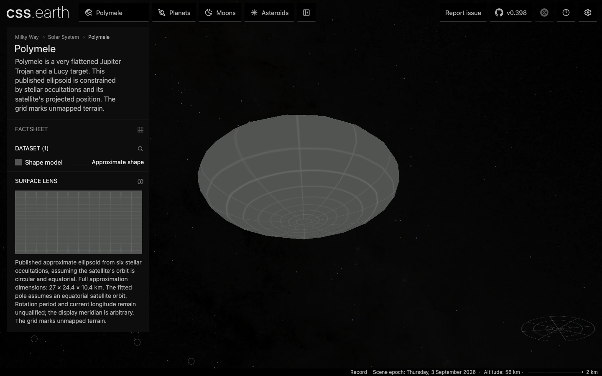
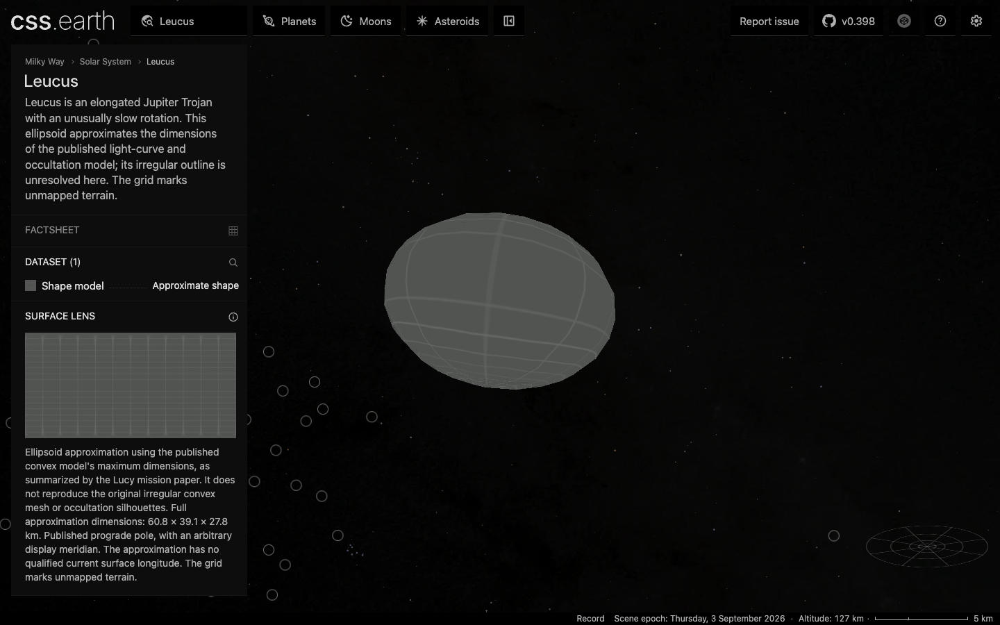
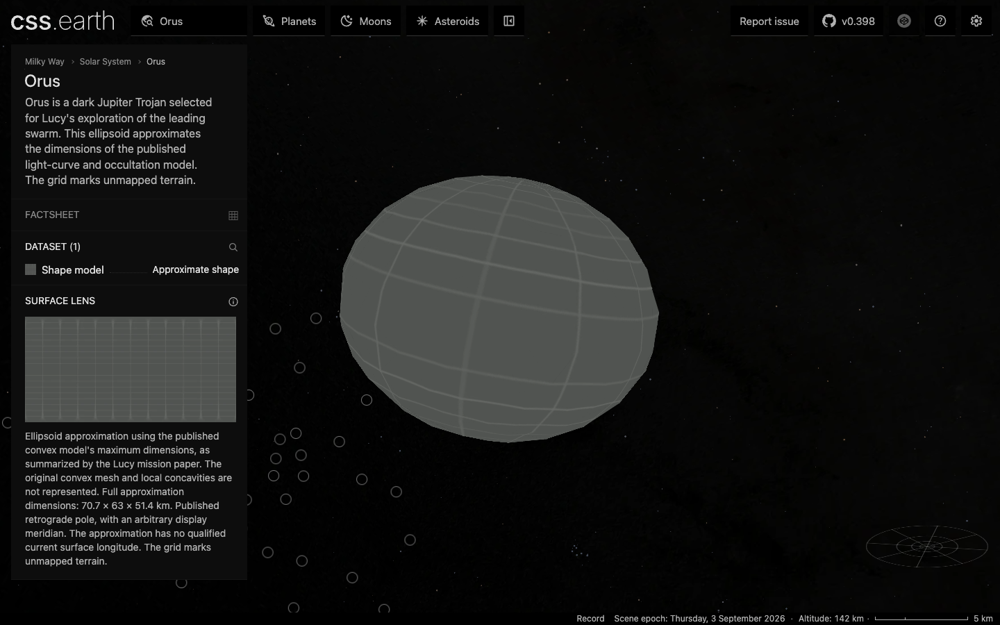
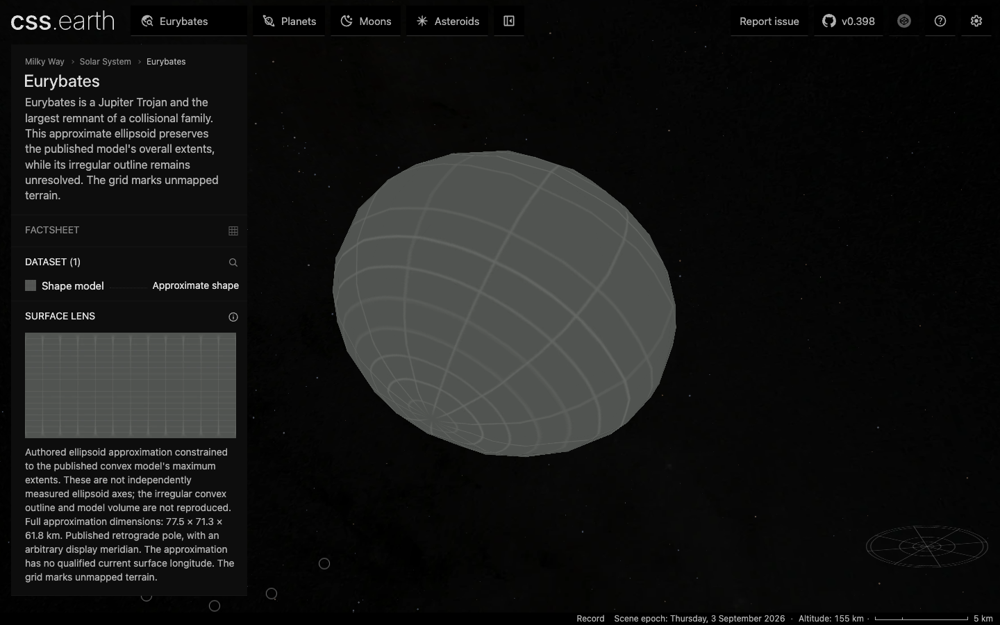
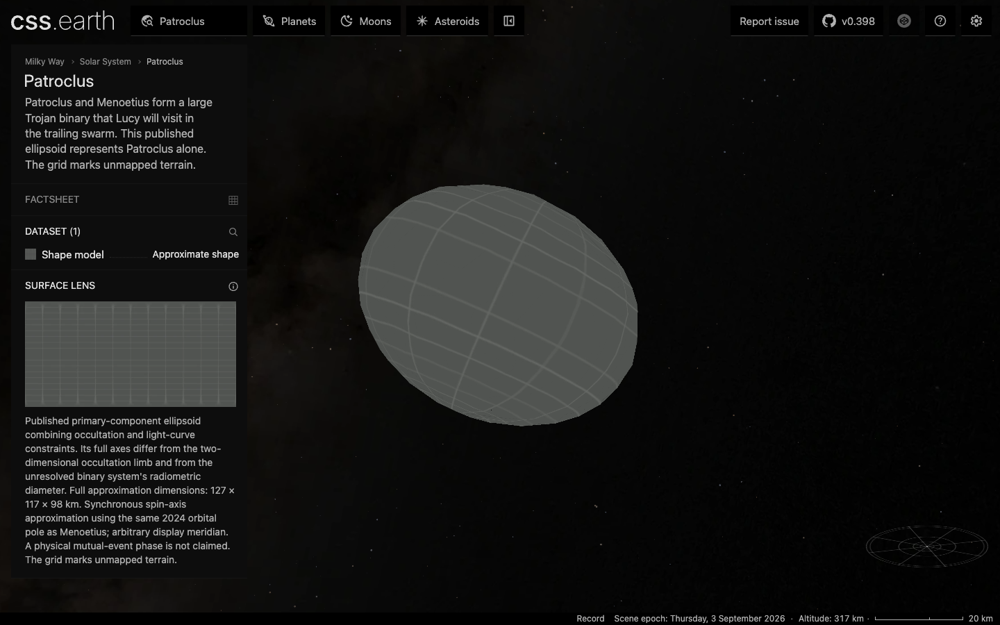
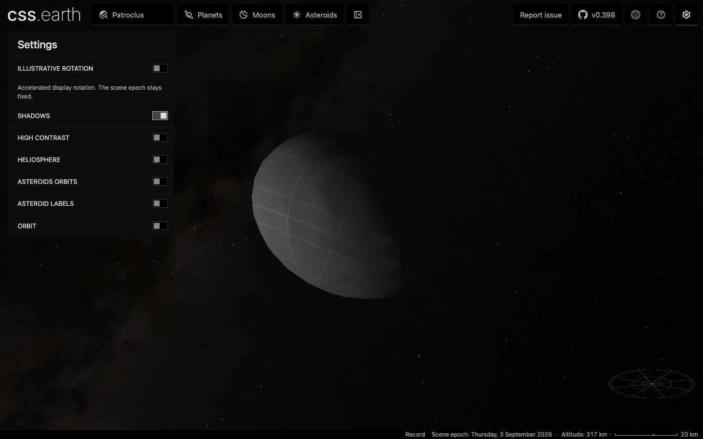

# Lucy target validation

The five local targets are source-constrained approximations using the existing renderer. They are not qualified terrain reconstructions or albedo maps. Dinkinesh remains an acquisition gate described in [the source survey](README.md#dinkinesh-source-gate).

## Verified behavior

- Polymele, Leucus, Orus, Eurybates and Patroclus each have 480 native `u` raster faces. Their simplified meshes remain closed, with one component and Euler characteristic 2. Source dimensions are full lengths and are halved exactly before radius-table generation.
- All five source closures pass: four declared inputs, one generated intermediate and eleven pinned documents per body. The authored tables and PNGs are checked in; downloaded common fonts/panoramas remain reacquirable inputs.
- All five pass headless Chrome checks at DPR 1 and DPR 2: one mounted scene, retained node identity during drag, no topology mutations or forbidden scene renderers. Shadows and Orbit start off.
- All five default views were visually inspected. Patroclus's optional shadow bank was enabled, inspected and switched off again.
- Both marker atlas densities preserve every visible pixel in all 253 existing markers. All 244 changed existing runtime files were structurally compared against the base: only marker bindings differ. The 245 existing descriptor changes are payload hashes plus the Sun's updated context source pin.
- All 259 static routes build successfully with `NODE_OPTIONS=--max-old-space-size=8192 pnpm exec astro build`. The initial default-heap build exhausted Node's 4 GiB heap after preparation; preparation was not repeated for the retry.

## Drag evidence

The same three-cycle, 60-step vertical drag was captured at 1440 × 900 using headless Chrome, the default camera and Shadows off. A CPU source-ownership audit was running in the background. These are local measured cases, not physical-mobile or idle-machine benchmarks.

| Density | rAF median / p95 | Pipeline sequences dropped without presentation | Retained nodes | Interaction requests |
| --- | --- | --- | --- | --- |
| DPR 1 | 16.7 / 16.7 ms | 1 / 411 | Yes | 0 |
| DPR 2 | 16.7 / 16.8 ms | 11 / 573 | Yes | 0 |

Both traces loaded 480 body leaves from the same canonical high-density asset bank and recorded no browser errors. [validation.json](validation.json) retains exact payload, screenshot and trace hashes, mesh errors, browser versions and workload details. Full local trace files and reports are under `output/playwright/lucy/polymele-dpr-{1,2}/`. Reproduce with `node docs/lucy-targets/drag-trace.mjs http://127.0.0.1:4278 1 output/playwright/lucy/polymele-dpr-1 polymele` (use density 2 and its corresponding output directory for the other case).

## Aggregate gate boundaries

The package checks passed: astronomy 668, catalog 8, object contracts 38 and engine 47 tests. The renderer's 343 available tests passed initially; after Deimos's missing prepared payload was generated, its three depth-partition tests also passed in a focused rerun.

The first platform/shell run overlapped initial payload generation and ran without local-server/Chrome sandbox access. Only failed files were selected for recovery after preparation, with bounded concurrency and the necessary access. That recovery recorded 1,188 passes; its canonical-density case still fails on absent Hiʻiaka assets. The ownership file was interrupted as its repeated all-object scan completed; its log records both the global registry closure and all 258 individual camera-owner checks passing. The remaining context-binding checks were then run separately, preserving coverage for both visible Patroclus and a coordinate-only primary representation.

These aggregate gates remain non-green:

- Source verification and runtime assembly stop at unchanged Hiʻiaka's missing local inputs/assets. The five Lucy bodies pass before that stop. The aggregate browser check likewise passes the five new DPR 1 cases, then stops at Hiʻiaka; focused checks cover both densities for all five.
- The existing asteroid-1998-ml14 factsheet requires absent `source/reference/warner-2014.pdf`. Existing Itokawa browser profiles lack the lens-race inputs required by their unchanged validator.
- Ordinary full-source navigation reproduction cannot run with the existing marker inputs missing (first failure: Squannit context image). The carried-forward atlas has separate source-recipe, byte and pixel evidence; equality with a complete full-source re-render is unproven.
- The 155 new runtime files total 35,061,410 bytes. They are available locally but have not been uploaded to `cssearth-assets`. Automatic approval review rejected that external write pending explicit authorization. Fresh-checkout remote delivery remains unproven.

## Visual evidence

### Polymele — default, Shadows off

### Leucus — default, Shadows off

### Orus — default, Shadows off

### Eurybates — default, Shadows off

### Patroclus — default, Shadows off

### Patroclus — optional Shadows enabled for inspection

