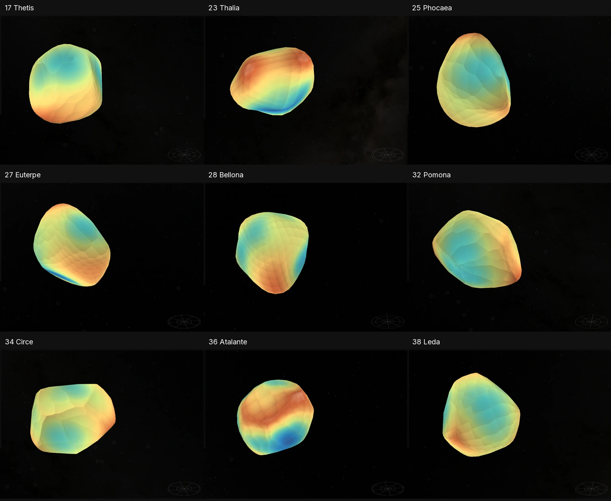
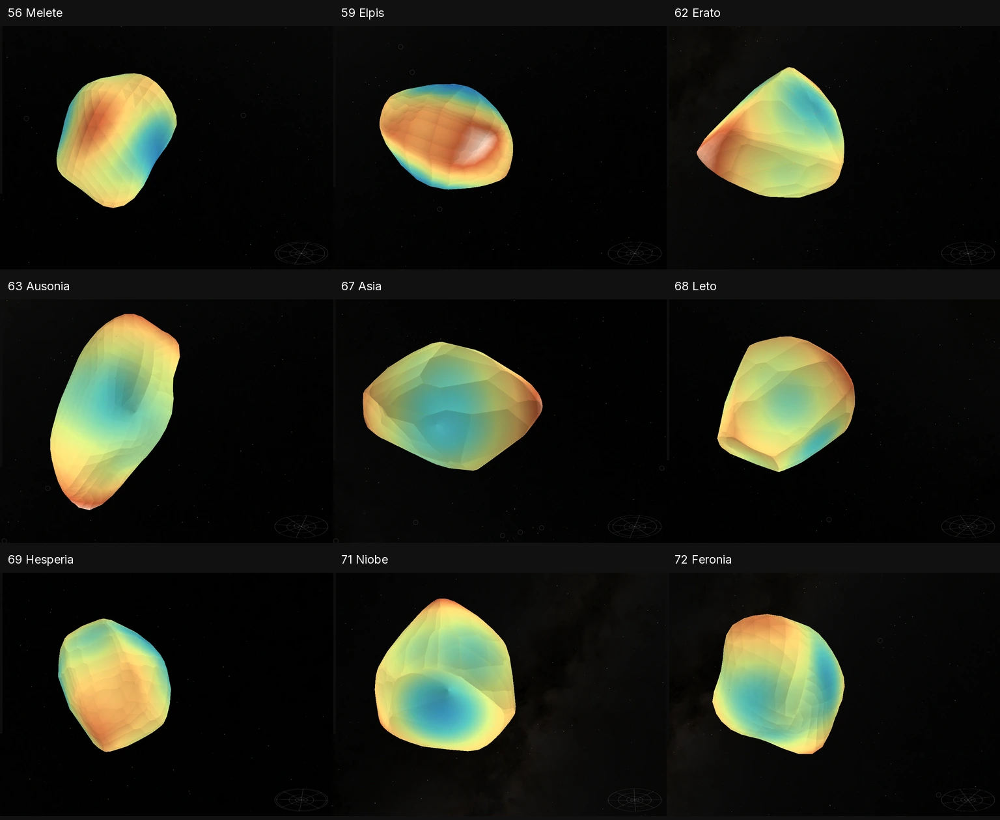

# Main-belt asteroids

This expansion adds 41 published shape models, bringing the registry to **185 asteroids and 299 objects**. Each has a standalone route, search and Solar System entry, source notes, the shared **Shape** grid, and a false-color **Elevation** view. Shadows are off by default. Asteroid orbit visibility stays off by default; enabling it uses the existing trails.

The meshes come from DAMIT, with 11 nonconvex models constrained by resolved imaging and 30 convex light-curve reconstructions. Nineteen have a selected archive size calibration, two use a published shape-aware thermophysical diameter, and twenty use an explicitly approximate AKARI thermal size transfer. These distinctions appear beside the selected view and in each source record. No surface image coverage, albedo, regolith or craters are inferred.

## Added bodies

The diameter uncertainty is the source's reported fit/catalog error; it is **not** a bound on local surface accuracy. The AKARI values additionally omit unquantified shape, spin and thermal-model systematics. Displaying these as mesh volume diameters is an approximation.

| Number | Body | DAMIT model | Shape evidence | Diameter (km) | Size interpretation |
| --- | --- | --- | --- | ---: | --- |
| 17 | [Thetis](../src/planets/thetis/README.md) | [116](https://damit.cuni.cz/projects/damit/asteroid_models/view/116) | Convex light-curve model | 77 ± 8 | Archive calibrated size |
| 23 | [Thalia](../src/planets/thalia/README.md) | [1858](https://damit.cuni.cz/projects/damit/asteroid_models/view/1858) | Resolved-imaging, nonconvex | 114 ± 8 | Archive calibrated size |
| 25 | [Phocaea](../src/planets/phocaea/README.md) | [697](https://damit.cuni.cz/projects/damit/asteroid_models/view/697) | Convex light-curve model | 83.21 ± 0.96 | AKARI approximate scale |
| 27 | [Euterpe](../src/planets/euterpe/README.md) | [441](https://damit.cuni.cz/projects/damit/asteroid_models/view/441) | Convex light-curve model | 109.79 ± 1.54 | AKARI approximate scale |
| 28 | [Bellona](../src/planets/bellona/README.md) | [1839](https://damit.cuni.cz/projects/damit/asteroid_models/view/1839) | Resolved-imaging, nonconvex | 133 ± 7 | Archive calibrated size |
| 32 | [Pomona](../src/planets/pomona/README.md) | [16306](https://damit.cuni.cz/projects/damit/asteroid_models/view/16306) | Convex light-curve model | 89 ± 7 | Archive calibrated size |
| 34 | [Circe](../src/planets/circe/README.md) | [129](https://damit.cuni.cz/projects/damit/asteroid_models/view/129) | Convex light-curve model | 107 ± 10 | Archive calibrated size |
| 36 | [Atalante](../src/planets/atalante/README.md) | [823](https://damit.cuni.cz/projects/damit/asteroid_models/view/823) | Convex light-curve model | 110.54 ± 1.57 | AKARI approximate scale |
| 38 | [38 Leda](../src/planets/leda-38/README.md) | [720](https://damit.cuni.cz/projects/damit/asteroid_models/view/720) | Convex light-curve model | 114.22 ± 1.52 | AKARI approximate scale |
| 39 | [Laetitia](../src/planets/laetitia/README.md) | [1835](https://damit.cuni.cz/projects/damit/asteroid_models/view/1835) | Resolved-imaging, nonconvex | 164 ± 3 | Archive calibrated size |
| 42 | [Isis](../src/planets/isis/README.md) | [1841](https://damit.cuni.cz/projects/damit/asteroid_models/view/1841) | Resolved-imaging, nonconvex | 104 ± 4 | Archive calibrated size |
| 43 | [Ariadne](../src/planets/ariadne/README.md) | [1825](https://damit.cuni.cz/projects/damit/asteroid_models/view/1825) | Resolved-imaging, nonconvex | 60 ± 4 | Archive calibrated size |
| 46 | [Hestia](../src/planets/hestia/README.md) | [4383](https://damit.cuni.cz/projects/damit/asteroid_models/view/4383) | Convex light-curve model | 120.62 ± 1.53 | AKARI approximate scale |
| 47 | [Aglaja](../src/planets/aglaja/README.md) | [3233](https://damit.cuni.cz/projects/damit/asteroid_models/view/3233) | Convex light-curve model | 147.05 ± 3.58 | AKARI approximate scale |
| 49 | [Pales](../src/planets/pales/README.md) | [16309](https://damit.cuni.cz/projects/damit/asteroid_models/view/16309) | Convex light-curve model | 148.02 ± 2.56 | AKARI approximate scale |
| 53 | [Kalypso](../src/planets/kalypso/README.md) | [1732](https://damit.cuni.cz/projects/damit/asteroid_models/view/1732) | Convex light-curve model | 101.9 ± 1.03 | AKARI approximate scale |
| 54 | [Alexandra](../src/planets/alexandra/README.md) | [1817](https://damit.cuni.cz/projects/damit/asteroid_models/view/1817) | Resolved-imaging, nonconvex | 143 ± 5 | Archive calibrated size |
| 55 | [55 Pandora](../src/planets/pandora-55/README.md) | [139](https://damit.cuni.cz/projects/damit/asteroid_models/view/139) | Convex light-curve model | 70 ± 7 | Archive calibrated size |
| 56 | [Melete](../src/planets/melete/README.md) | [1851](https://damit.cuni.cz/projects/damit/asteroid_models/view/1851) | Resolved-imaging, nonconvex | 116 ± 5 | Archive calibrated size |
| 59 | [Elpis](../src/planets/elpis/README.md) | [6156](https://damit.cuni.cz/projects/damit/asteroid_models/view/6156) | Convex light-curve model | 156.18 ± 2.31 | AKARI approximate scale |
| 62 | [Erato](../src/planets/erato/README.md) | [317](https://damit.cuni.cz/projects/damit/asteroid_models/view/317) | Convex light-curve model | 78.62 ± 0.9 | AKARI approximate scale |
| 63 | [Ausonia](../src/planets/ausonia/README.md) | [5924](https://damit.cuni.cz/projects/damit/asteroid_models/view/5924) | Resolved-imaging, nonconvex | 93 ± 3 | Archive calibrated size |
| 67 | [Asia](../src/planets/asia/README.md) | [5668](https://damit.cuni.cz/projects/damit/asteroid_models/view/5668) | Convex light-curve model | 61.63 ± 0.65 | AKARI approximate scale |
| 68 | [Leto](../src/planets/leto/README.md) | [290](https://damit.cuni.cz/projects/damit/asteroid_models/view/290) | Convex light-curve model | 148 ± 25 | Archive calibrated size |
| 69 | [Hesperia](../src/planets/hesperia/README.md) | [319](https://damit.cuni.cz/projects/damit/asteroid_models/view/319) | Convex light-curve model | 109 ± 11 | Archive calibrated size |
| 71 | [Niobe](../src/planets/niobe/README.md) | [1014](https://damit.cuni.cz/projects/damit/asteroid_models/view/1014) | Convex light-curve model | 80.86 ± 0.8 | AKARI approximate scale |
| 72 | [Feronia](../src/planets/feronia/README.md) | [1853](https://damit.cuni.cz/projects/damit/asteroid_models/view/1853) | Resolved-imaging, nonconvex | 93 ± 10 | Archive calibrated size |
| 73 | [Klytia](../src/planets/klytia/README.md) | [142](https://damit.cuni.cz/projects/damit/asteroid_models/view/142) | Convex light-curve model | 45.4 ± 1.3 | VS-TPM fit |
| 74 | [74 Galatea](../src/planets/galatea-74/README.md) | [6181](https://damit.cuni.cz/projects/damit/asteroid_models/view/6181) | Convex light-curve model | 113.09 ± 2.15 | AKARI approximate scale |
| 76 | [Freia](../src/planets/freia/README.md) | [442](https://damit.cuni.cz/projects/damit/asteroid_models/view/442) | Convex light-curve model | 168.36 ± 1.95 | AKARI approximate scale |
| 79 | [Eurynome](../src/planets/eurynome/README.md) | [496](https://damit.cuni.cz/projects/damit/asteroid_models/view/496) | Convex light-curve model | 74.75 ± 0.94 | AKARI approximate scale |
| 82 | [Alkmene](../src/planets/alkmene/README.md) | [146](https://damit.cuni.cz/projects/damit/asteroid_models/view/146) | Convex light-curve model | 58.6 ± 1.2 | VS-TPM fit |
| 83 | [Beatrix](../src/planets/beatrix/README.md) | [6195](https://damit.cuni.cz/projects/damit/asteroid_models/view/6195) | Convex light-curve model | 87.42 ± 0.84 | AKARI approximate scale |
| 84 | [Klio](../src/planets/klio/README.md) | [5792](https://damit.cuni.cz/projects/damit/asteroid_models/view/5792) | Convex light-curve model | 78.32 ± 0.96 | AKARI approximate scale |
| 85 | [85 Io](../src/planets/io-85/README.md) | [1822](https://damit.cuni.cz/projects/damit/asteroid_models/view/1822) | Resolved-imaging, nonconvex | 167 ± 3 | Archive calibrated size |
| 86 | [Semele](../src/planets/semele/README.md) | [5799](https://damit.cuni.cz/projects/damit/asteroid_models/view/5799) | Convex light-curve model | 117.32 ± 1.51 | AKARI approximate scale |
| 91 | [Aegina](../src/planets/aegina/README.md) | [5831](https://damit.cuni.cz/projects/damit/asteroid_models/view/5831) | Convex light-curve model | 100.17 ± 1.23 | AKARI approximate scale |
| 93 | [Minerva](../src/planets/minerva/README.md) | [1797](https://damit.cuni.cz/projects/damit/asteroid_models/view/1797) | Resolved-imaging, nonconvex | 160 ± 3 | Archive calibrated size |
| 95 | [Arethusa](../src/planets/arethusa/README.md) | [294](https://damit.cuni.cz/projects/damit/asteroid_models/view/294) | Convex light-curve model | 147 ± 32 | Archive calibrated size |
| 97 | [Klotho](../src/planets/klotho/README.md) | [321](https://damit.cuni.cz/projects/damit/asteroid_models/view/321) | Convex light-curve model | 85 ± 9 | Archive calibrated size |
| 98 | [Ianthe](../src/planets/ianthe/README.md) | [1088](https://damit.cuni.cz/projects/damit/asteroid_models/view/1088) | Convex light-curve model | 104.24 ± 1.29 | AKARI approximate scale |

Numbered names distinguish **38 Leda**, **55 Pandora**, **74 Galatea** and **85 Io** from the existing moons. Their routes are `/leda-38/`, `/pandora-55/`, `/galatea-74/` and `/io-85/`.

## Source decisions

- **Thalia:** the second pole follows the more likely adaptive-optics fit described by Viikinkoski et al. (2017), section 3. The competing pole remains possible.
- **Pomona:** the selected 2024 archive update includes four occultation comparisons but no linked publication. It is credited to the archive.
- **Euterpe:** the selected model record identifies consistency with the 1993-10-09 occultation.
- **Isis:** the raw table has a 285.89754-source-unit volume-equivalent diameter despite a calibrated-kilometre flag and declared 104 ± 4 km diameter. The existing uniform volume-scaling recipe applies 0.3637666780773104 km/source unit to match that declared diameter. Both raw bytes and the discrepancy are retained. Bellona and Isis each have only one adaptive-optics observation in the original ADAM study.
- **Klytia and Alkmene:** Hanuš et al. (2018), Table A.3, supplies volume-equivalent diameters for the selected pole families. Only the uniform scale is transferred; the varied-model ensemble does not prove identical mesh bytes or local surface accuracy.
- **Minerva:** the source table represents the primary. This addition does not supply its satellites.

Every package records alternative models, exact source bytes, coordinate conventions and reuse terms. Original +Z spin axes and +X reference meridians are retained. Source ecliptic J2000 poles are converted to equatorial J2000 with the existing recipe. Absolute phase and accelerated display spin remain illustrative.

## Preparation

The existing `source-meshoptimizer` recipe starts from each published triangle mesh and prepares **800 native PolyCSS `u` triangles**, each using a 128 px raster cell. Mesh reduction, atlas generation, lighting and scalar interpretation occur before runtime. The same canonical asset bank is selected at DPR 1 and 2.

Elevation is source radius minus the declared volume-equivalent reference radius, in kilometres. It is a shape-derived false-color scalar, not gravitational elevation or independent topography. The existing nearest-source-surface sampler binds atlas values to the original model, including concavities. Each model uses its own declared range and matching legend.

A focused shared preparer correction prevents the minimap fallback from treating irregular triangle atlases as ellipsoid bands. These bodies already publish unwarped maps in `surfaces.json`; their small minimaps come from those maps. No renderer, camera or lighting technique is introduced.

## Validation

The [machine-readable summary](evidence/main-belt-asteroids/summary.json) binds each final mesh, atlas and fresh-asset browser case. The compact [evidence archive](main-belt-asteroids-evidence.tar.gz) contains the qualification helpers, numerical results, source comparisons, logs and representative full browser captures. The [capture inventory](evidence/main-belt-asteroids/browser-capture-inventory.json) distinguishes bundled images from additional captures retained locally.

- All 41 source and package contracts pass, including original coordinates/connectivity, signed volume, scale, pole, closed topology, runtime hashes, legends, both minimaps and default settings. Each body retains 800 raster triangles.
- Every required original input restored to empty temporary destinations through the existing acquisition operations. Shared original bytes were downloaded once and reused across the separate body restorations. Two additional ignored paper references restored independently. New generated navigation source images are checked in.
- Each model has 8,192 area-stratified nearest-surface samples in **each direction** and 8,192 radial intersection probes. The largest sampled deviation is **0.613% of diameter**. This is a sampled fit measurement, not an exhaustive Hausdorff bound or source accuracy estimate.
- **33,998** scalar queries agree with an independent NumPy full-source planar/edge projection: maximum coordinate difference 2.31e-8 m and scalar difference 4.77e-12 km. These are numerical agreement, not measurement accuracy. Decoded atlas interior anchors have at most 6 channel levels of RGB difference, within the existing 12-level tolerance. Shared-edge/bleed RGB is diagnostic because incident normals are nonunique.
- An additional **2,099,200** interior transfer probes found no withheld values. Visual review found a small missing Elevation patch in Ausonia's first regularized reduction. Disabling its existing optional `RegularizeLight` setting kept 800 faces and the unchanged 930 m allowance; the final bidirectional sample maximum is 570 m. Its source comparison, atlases, fresh installation and DPR captures were repeated after that correction.
- **82 final headless Chrome cases** cover every new body at DPR 1 and 2, both views, both shadow states, multiple orientations, canonical density 2 and retained nodes. All use freshly downloaded scene files with checked hashes. Shared shell and JSON came from the current checkout. HMR update/reload messages were suppressed during captures.
- The Solar System category lists **185 asteroids**; all 41 additions pass name search. Thalia and 85 Io navigate with one scene and camera. Shadows and asteroid orbit visibility start off.
- Thalia's initial-shell, lens race, reacquisition, failure/retry and destroy checks pass. A separate 390×844 DPR 2 layout and retained lens-switch capture passes. The wider interaction harness remains **unresolved**: desktop tries to click the Settings action hidden by the existing shell CSS; the DPR interaction sequence fails its empty-sky double-click assertion. Full desktop/mobile conformance is not claimed.
- The focused minimap regression's 5 cases, 24 Solar System astronomy cases and 2 asteroid ephemeris cases pass. The focused navigation/router group has 41 passes and one baseline missing-input failure described below.
- Astro builds **300 static pages** successfully. Production runtime-asset assembly passes for all 41 new bodies. This run uses existing prepared packages and does not claim a passing whole-catalog acquisition/test/assembly suite.

### Navigation preparation boundary

The full navigation regeneration test still lacks the baseline Squannit `source/presentation/context.png`, also reported by the prior asteroid PR. The batch's replay helper uses the existing marker recipe for new bodies and preserves the visible RGBA pixels of all **258 baseline tiles** exactly at both densities. It pins merged baseline `4848897ee01d37987f837351802ec35ca3cd1871`; see the [atlas receipt](evidence/main-belt-asteroids/navigation-atlases.json). Existing body scene geometry is unchanged. Their generated runtime marker indices/counts are refreshed for the larger atlas.

### Delivery and measured cost

All **1,435 final runtime files**, totaling **319,404,774 bytes**, are published and freshly downloaded with hash verification and zero cache reuse. Ausonia's final replacement has its own fresh destination and receipt. Manifest install size is approximately 7.70–7.89 MB per body, including its complete asset bank.

Every body atlas is 2048×6400 pixels: **50 MiB** of calculated RGBA8 storage per atlas. This is not measured GPU residency, and the four available atlases are not asserted to be resident simultaneously.

The [request-size receipt](evidence/main-belt-asteroids/load-cost.json) measures complete development-server response bodies, including shared shell, background, worker and JSON requests, in fresh Chrome contexts. Headers are recorded separately. These are **development traffic**, not a production transfer estimate.

| Body | Cold response bodies | Select Elevation | Enable its shadows |
| --- | ---: | ---: | ---: |
| thetis | 87,117,089 B | 281,242 B | 179,084 B |
| thalia | 87,113,641 B | 320,154 B | 168,790 B |
| io-85 | 87,118,533 B | 306,328 B | 181,022 B |

The [Thalia drag trace](evidence/main-belt-asteroids/thalia-drag.json) uses the existing 3-cycle, 60-step vertical gesture, Elevation and shadows off in headless Chrome at DPR 1. It retains all 82,799 scene nodes and 800 body leaves, with no interaction requests or page errors. Across the 6.235 s interval: rAF p95 16.7 ms, draw cadence p95 18.084 ms, `DirectRenderer::DrawFrame` p95 5.082 ms, and zero dropped-without-presentation sequences among 374. This is one local workload, not all-pose, mobile-device or GPU-saturation evidence.

### Orbit interpretation

The existing two-body preparation uses 41 new JPL Horizons element sets and three vector fixtures per body. Numerical residual at the queried epoch is at most 2.14 mm; this is not physical accuracy at the displayed TT instant. The existing TDB-as-TT approximation is under 2 ms. At the sampled ±30-day endpoints the largest residual is 2,789.65 km, with body-specific regression guards derived from those samples (largest 3,209 km). Endpoint checks do not bound the entire interval or long-term propagation. See the [query/residual records](evidence/main-belt-asteroids/orbit-errors.json).

## Visual review

Shape uses the common grid. Elevation is false color; scenes below use independent framing and do not compare physical diameters.




Complete contact sheets: [Shape 1](evidence/main-belt-asteroids/shape-1.webp), [2](evidence/main-belt-asteroids/shape-2.webp), [3](evidence/main-belt-asteroids/shape-3.webp), [4](evidence/main-belt-asteroids/shape-4.webp), [5](evidence/main-belt-asteroids/shape-5.webp); [Elevation 1](evidence/main-belt-asteroids/elevation-1.webp), [2](evidence/main-belt-asteroids/elevation-2.webp), [3](evidence/main-belt-asteroids/elevation-3.webp), [4](evidence/main-belt-asteroids/elevation-4.webp), [5](evidence/main-belt-asteroids/elevation-5.webp).

Source comparison pairs show original mesh on the left and prepared mesh on the right using the existing snapshot renderer at matched longitude/latitude. Each is normalized by its own maximum radius; they establish shape comparison, not physical scale or native/browser pixel parity. Four views per model are in the archive. Contact sheets: [1](evidence/main-belt-asteroids/source-result-1.webp), [2](evidence/main-belt-asteroids/source-result-2.webp), [3](evidence/main-belt-asteroids/source-result-3.webp), [4](evidence/main-belt-asteroids/source-result-4.webp), [5](evidence/main-belt-asteroids/source-result-5.webp).

Full captures: [Thalia Elevation](evidence/main-belt-asteroids/thalia-elevation.png), [optional shadows](evidence/main-belt-asteroids/thalia-shadows.png), [corrected Ausonia](evidence/main-belt-asteroids/ausonia-elevation.png), [mobile layout](evidence/main-belt-asteroids/thalia-mobile.png), [asteroid category](evidence/main-belt-asteroids/asteroid-category.png).

## Reproduction

The checked-in body recipes use the existing preparers. After normal repository dependency/package setup, this prepares and verifies one body; replace `thetis` with any id in the table:

```sh
node tools/objects/dist/operations.js acquire thetis
node tools/objects/dist/prepare-authored.js thetis --write
node --test tests/objects/unit/thetis/source.test.mjs
pnpm setup:assets --object=thetis
```

Extract the evidence archive at the repository root. Its Python checks require NumPy and Pillow; source preparation also uses the repository's normal tools. The saved helpers retain the local Python runtime paths used for this run, so adjust those paths to the available interpreter when replaying elsewhere.

```sh
tar -xzf docs/main-belt-asteroids-evidence.tar.gz
node output/main-belt-asteroids/catalog-audit.mjs
node output/main-belt-asteroids/qualify-body.mjs thetis
node output/main-belt-asteroids/transfer-coverage.mjs
node output/main-belt-asteroids/prepare-navigation.mjs
```

Fresh-delivery replay uses `verify-runtime-install.mjs` to create an empty destination, followed by `browser-check.mjs` with `CSSEARTH_FRESH_RUNTIME_ROOT` pointing there and the existing preview on port 4278. No source preparation is needed for runtime installation. Runtime publication uses the existing publisher and is a separate write action.

## Main integration

Merged main `ef07fac2d3208e201dafc626374b30ed4644f561` (the 13-moon scientific upgrade) into this branch. The incoming moon scene and source files are preserved byte for byte; the existing preparation writer refreshes navigation marker indices and payload hashes for the expanded catalog. All 41 new asteroid packages remain unchanged. The [merge receipt](evidence/main-belt-asteroids/merge-validation.json) records the incoming and refreshed hashes.

The minimap resolution retains main’s affine-only fallback and both solid-scientific and irregular-surface regressions. The outdated spatial-context assertion now checks explicitly authored Patroclus as a visible primary with Menoetius orbiting it; the separate hidden-primary regression remains intact. Preparation build, 8 minimap tests, 4 spatial-context tests and 14 focused marker/activation tests pass. Canonical world-context regeneration produces no diff. These focused checks supplement the original qualification; they do not represent a rerun of the entire browser suite.

The first CI run after integration also exposed a missing TypeScript declaration for main’s DSK mesh importer (`TS7016`). Adding the declaration leaves acquisition behavior unchanged; `pnpm typecheck:preparation` now passes.

After the typecheck and preparation gates passed, CI’s shell tests exposed missing ignored JSON transports in a fresh checkout. The workflow now restores these from checked-in `runtime.json` through the same serializer used by preparation, accepting only the existing descriptor SHA-256. It does not rebake assets or update pins. All 299 payloads reproduce exactly; the missing-file/tamper regression, 54 shell tests, 301 activation tests and the remaining 234 renderer tests pass locally.
