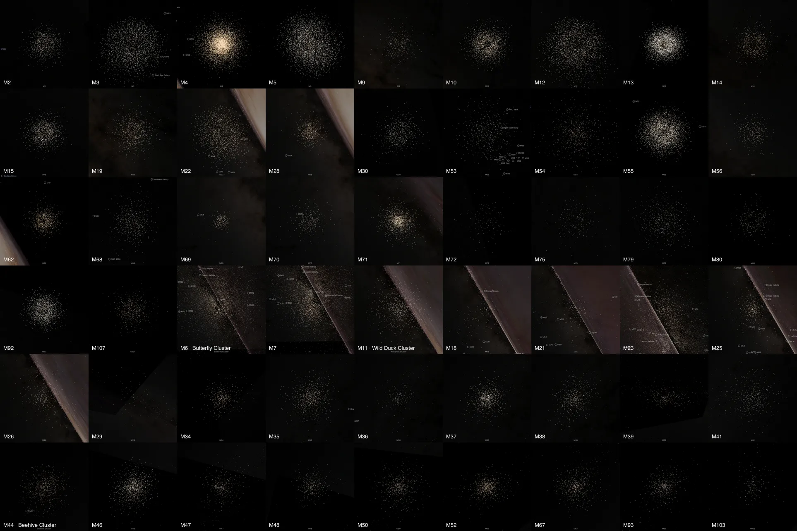
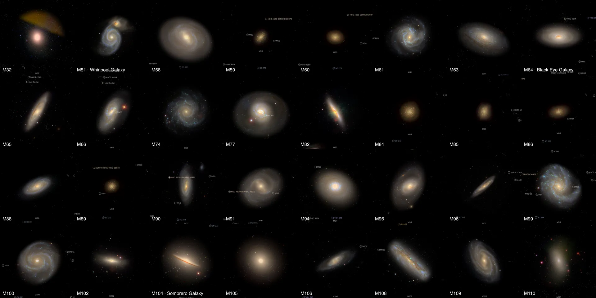
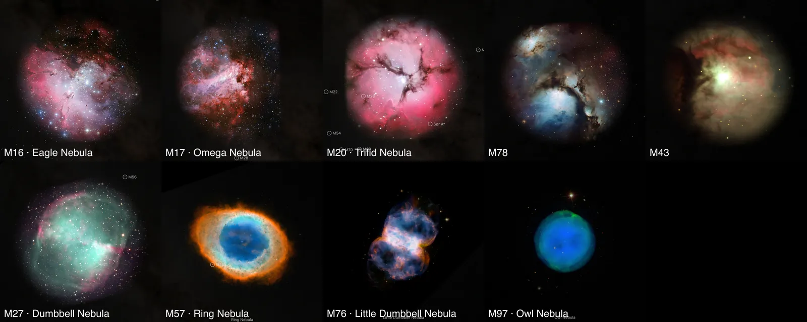

# The Messier catalogue

109 of Charles Messier's 110 objects are places in the world. Each has its own page (`/m13/`, `/m51/`, `/m57/`), found by its Messier number, its NGC number or its common name. M24 is left out; the reason is under [Left out](#left-out).

Twelve were built one at a time, with their own guides: the nebulae M1, M8, M42 and M45 ([nebulae](../nebulae/README.md)) and the galaxies M31, M33, M49, M81, M83, M87, M95 and M101 ([galaxies](../galaxies/README.md)). The other 97 share the four routes below. Each package's README names its own sources, numbers and known problems.

## What is drawn

| Kind | Objects | Drawn as | Measured by |
| --- | --- | --- | --- |
| Globular clusters (29) | M2, M3, M4, M5, M9, M10, M12, M13, M14, M15, M19, M22, M28, M30, M53, M54, M55, M56, M62, M68, M69, M70, M71, M72, M75, M79, M80, M92, M107 | One dot per member star, in its Gaia color | Members: [Hunt & Reffert (2023)](https://cdsarc.cds.unistra.fr/viz-bin/cat/J/A+A/673/A114). Distance and position: [Baumgardt & Vasiliev (2021)](https://doi.org/10.1093/mnras/stab1474) |
| Open clusters (25) | M6, M7, M11, M18, M21, M23, M25, M26, M29, M34, M35, M36, M37, M38, M39, M41, M44, M46, M47, M48, M50, M52, M67, M93, M103 | One dot per member star, in its Gaia color | Members, distance, position and age: Hunt & Reffert (2023) |
| Disc galaxies seen from above (15) | M51, M58, M61, M63, M64, M66, M74, M77, M88, M91, M94, M96, M99, M100, M109 | A Sloan Digital Sky Survey picture laid flat on the measured disc | Tilt: [PHANGS](https://cdsarc.cds.unistra.fr/viz-bin/cat/J/ApJS/257/43) where it lists the galaxy, else [HyperLEDA](http://atlas.obs-hp.fr/hyperleda/). Distance: [Cosmicflows-4](https://cdsarc.cds.unistra.fr/viz-bin/cat/J/ApJ/944/94), else PHANGS or Cosmicflows-3 |
| Ellipticals, lenticulars and steep discs (17) | M32, M59, M60, M65, M82, M84, M85, M86, M89, M90, M98, M102, M104, M105, M106, M108, M110 | A Sloan picture standing flat, facing the Sun | Same distances; no shape is drawn |
| Nebulae (9) | M16, M17, M20, M27, M43, M57, M76, M78, M97 | An ESO, Hubble or NOIRLab photograph standing flat, facing the Sun (M97: a Sloan picture); M16 and M78 also draw their cluster's stars | Distance: Hunt & Reffert (M16, M78), [Kuhn et al. (2019)](https://cdsarc.cds.unistra.fr/viz-bin/cat/J/ApJ/870/32) (M17, M20), Menten et al. (2007) (M43), [Chornay & Walton (2021)](https://cdsarc.cds.unistra.fr/viz-bin/cat/J/A+A/656/A110) (the four planetary nebulae) |
| Stars (2 entries) | M40: HD 238107 and HD 238108. M73: BD-13 5809, HD 358033 and BD-13 5808 | Each star as a body, with its Gaia color and limb | Gaia DR3; the two entries are chance alignments, so neither has a package of its own |







Each tile is the object's own page in headless Chromium at 1440 × 900, device pixel ratio 2, on 2026-10-03, cut to the object.

## Measured, chosen and assumed

| Value | Kind |
| --- | --- |
| Star positions, colors and membership; distances; galaxy tilts, sizes and colors | Measured, each cited in its package |
| A cluster star's depth inside its cluster | Assumed: the cluster is drawn as deep as it is wide on the sky |
| Which edge of a tilted galaxy is nearer | Assumed: no catalogue used here gives it |
| The plane of a flat picture that faces the Sun | Not a shape: it is where a picture of the sky lies |
| Dot size and tone, picture rims, framing radii | Presentation |

## Shared code this added

- `appearance.colorByBpRp` in [prepare-catalogue-points](../../packages/bake/cli/prepare-catalogue-points.mts): a dot's color from its Gaia BP-RP through the fit of Cardiel et al. (2021), the one the nebula star fields already use.
- `geometry.unit: "pc"` in the [image-layer recipe](../../packages/bake/src/image-layers/config.ts): a bank in parsecs. A nebula a few parsecs across is smaller than one CSS pixel in kiloparsecs, and its picture was drawn far too large.
- The `open-cluster` classification beside `globular-cluster`.

## Reproduce

A cluster, from its package directory names:

```sh
node packages/bake/cli/prepare-catalogue-points.mts src/objects/m13-members dots
node packages/bake/cli/prepare-object.mts m13
```

A galaxy or nebula:

```sh
node packages/bake/cli/prepare-image-layers.mts src/objects/m51-layers
node site/build/prepare/prepare-volume-presentation.mts --object=m51-layers
node packages/bake/cli/prepare-object.mts m51
```

Member tables, survey cutouts and photographs are not tracked: each manifest names the query or address that restores them.

## Left out

- **M24**, the Small Sagittarius Star Cloud, is a stretch of the Milky Way seen through a gap in the dust, not an object at one distance. No catalogue used here prints a distance for it, and NGC 6603, the cluster inside it, is not M24.
- **The fourth star of M73** (Gaia DR3 6888762676722910720): Gaia DR3 publishes no temperature or radius for it.

## Known problems

- Gaia misses stars where they crowd, so the core of a globular cluster holds fewer dots than stars.
- A flat picture seen from the side is a line. Volumes for the planetary nebulae and the ellipticals, from their published shapes, are the next step ([ledgers](../../src/objects/m57-layers/investigations.json)).
- The Sloan pictures are shallow: faint outer light is lost and the brightest centres may be saturated.
- The Milky Way's cluster catalogues still draw each of these clusters as one dot of their own.
