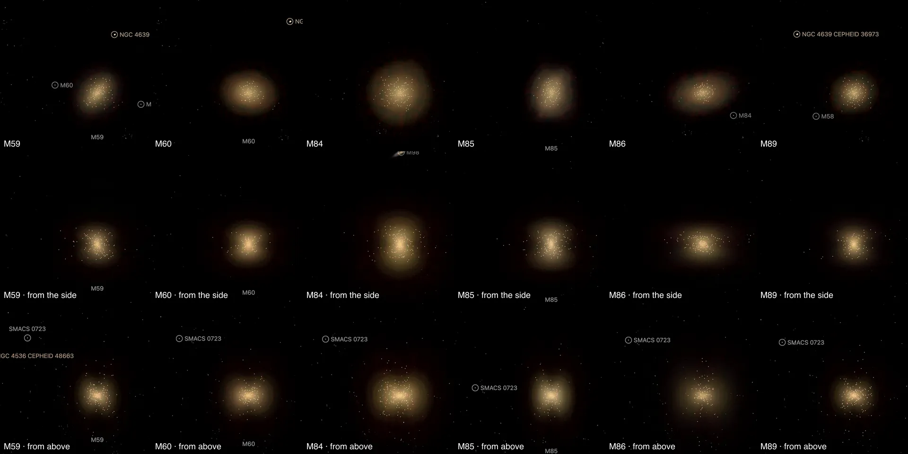
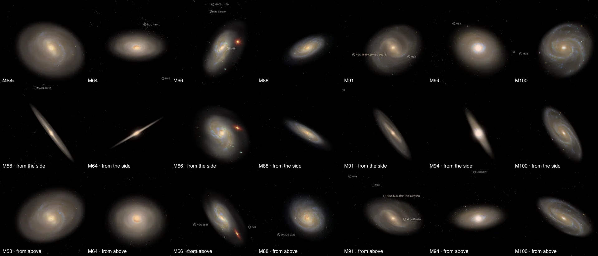
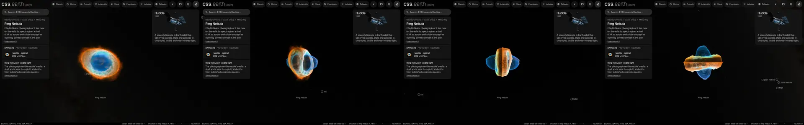

# The Messier catalogue

103 of Charles Messier's 110 objects are places in the world. Each has its own page (`/m13/`, `/m51/`, `/m57/`), found by its Messier number, its NGC number or its common name. M24 is left out, and six nebulae have no page because nothing measures their depth; the reasons are under [Left out](#left-out).

Twelve were built one at a time, with their own guides: the nebulae M1, M8, M42 and M45 ([nebulae](../nebulae/README.md)) and the galaxies M31, M33, M49, M81, M83, M87, M95 and M101 ([galaxies](../galaxies/README.md)). The other 91 share the routes below. Each package's README names its own sources, numbers and known problems.

## What is drawn

| Kind | Objects | Drawn as | Measured by |
| --- | --- | --- | --- |
| Globular clusters (29) | M2, M3, M4, M5, M9, M10, M12, M13, M14, M15, M19, M22, M28, M30, M53, M54, M55, M56, M62, M68, M69, M70, M71, M72, M75, M79, M80, M92, M107 | One dot per member star, in its Gaia color | Members: [Hunt & Reffert (2023)](https://cdsarc.cds.unistra.fr/viz-bin/cat/J/A+A/673/A114). Distance and position: [Baumgardt & Vasiliev (2021)](https://doi.org/10.1093/mnras/stab1474) |
| Open clusters (25) | M6, M7, M11, M18, M21, M23, M25, M26, M29, M34, M35, M36, M37, M38, M39, M41, M44, M46, M47, M48, M50, M52, M67, M93, M103 | One dot per member star, in its Gaia color | Members, distance, position and age: Hunt & Reffert (2023) |
| Disc galaxies seen from above (15) | M51, M58, M61, M63, M64, M66, M74, M77, M88, M91, M94, M96, M99, M100, M109 | A Sloan Digital Sky Survey picture, its stars removed, laid flat on the measured disc. M51, M61, M64, M66, M74, M94, M96, M99 and M100 also draw catalogued objects as dots: star clusters, globular clusters, Cepheids, HII regions, planetary nebulae and supernova remnants, from the tables each bank's README lists. M58, M64, M66, M88, M91, M94 and M100 also draw their bulge as a small volume through the disc, from [S4G's published fit](https://cdsarc.cds.unistra.fr/viz-bin/cat/J/ApJS/219/4) | Tilt: [PHANGS](https://cdsarc.cds.unistra.fr/viz-bin/cat/J/ApJS/257/43) where it lists the galaxy, else [HyperLEDA](http://atlas.obs-hp.fr/hyperleda/). Distance: [Cosmicflows-4](https://cdsarc.cds.unistra.fr/viz-bin/cat/J/ApJ/944/94), else PHANGS or Cosmicflows-3 |
| Ellipticals with a published profile (6) | M59, M60, M84, M85, M86, M89 | A volume of starlight: the Sloan picture, cleaned of stars and neighbours, spread in depth through the galaxy's measured profile, with its globular clusters as dots | Profile and shape: [Kormendy et al. (2009)](https://arxiv.org/abs/0810.1681). Clusters: [Jordán et al. (2009)](https://cdsarc.cds.unistra.fr/viz-bin/cat/J/ApJS/180/54). Same distances |
| Other ellipticals, lenticulars and steep discs (11) | M32, M65, M82, M90, M98, M102, M104, M105, M106, M108, M110 | A Sloan picture, its stars removed, standing flat, facing the Sun. M65, M90, M98 and M104 draw their bulge as a volume through it, from [S4G's fit](https://cdsarc.cds.unistra.fr/viz-bin/cat/J/ApJS/219/4). M32, M82, M102, M104, M105, M106 and M110 draw catalogued objects as dots: globular clusters, star clusters, planetary nebulae, Cepheids and HII regions | Same distances. The disc's tilt, where a bulge needs it: HyperLEDA, PHANGS, or S4G's own edge-on disc |
| Nebulae (3) | M57, M76, M97 | A Hubble photograph, its stars removed, on the nebula's published shape (M97: a Sloan picture): M57 lies on the walls its spectra give ([O'Dell et al. 2013](https://arxiv.org/abs/1301.6636), [Kastner et al. 2025](https://arxiv.org/abs/2501.12223)); M76 lies on its ring and two lobes ([Bryce et al. 1996](https://ui.adsabs.harvard.edu/abs/1996A%26A...307..253B/abstract)); M97 fills its published body ([García-Díaz et al. 2018](https://arxiv.org/abs/1806.04676), [Guerrero et al. 2003](https://arxiv.org/abs/astro-ph/0303056)) | Distance: [Chornay & Walton (2021)](https://cdsarc.cds.unistra.fr/viz-bin/cat/J/A+A/656/A110) |
| Stars (2 entries) | M40: HD 238107 and HD 238108. M73: BD-13 5809, HD 358033 and BD-13 5808 | Each star as a body, with its Gaia color and limb | Gaia DR3; the two entries are chance alignments, so neither has a package of its own |








Each tile is the object's own page in headless Chromium at 1440 × 900, device pixel ratio 2, on 2026-10-03, cut to the object.

## Measured, chosen and assumed

| Value | Kind |
| --- | --- |
| Star positions, colors and membership; distances; galaxy tilts, sizes and colors | Measured, each cited in its package |
| A cluster star's depth inside its cluster | Assumed: the cluster is drawn as deep as it is wide on the sky |
| Which edge of a tilted galaxy is nearer | Assumed: no catalogue used here gives it |
| The depth of an elliptical's light and of its globular clusters | Modelled: the published Sérsic profile, deprojected on a spheroid whose axis lies in the plane of the sky. The light along each sight line is the picture's |
| The plane of a flat picture that faces the Sun | Not a shape: it is where a picture of the sky lies |
| Dot size and tone, picture rims, framing radii | Presentation |

## Shared code this added

- `appearance.colorByBpRp` in [prepare-catalogue-points](../../packages/bake/cli/prepare-catalogue-points.mts): a dot's color from its Gaia BP-RP through the fit of Cardiel et al. (2021), the one the nebula star fields already use.
- `geometry.unit: "pc"` in the [image-layer recipe](../../packages/bake/src/image-layers/config.ts): a bank in parsecs. A nebula a few parsecs across is smaller than one CSS pixel in kiloparsecs, and its picture was drawn far too large.
- The `open-cluster` classification beside `globular-cluster`.
- The image-layer bulge ([bulge.ts](../../packages/bake/src/image-layers/bulge.ts)): `geometry.bulge.secondDisc` and `geometry.bulge.bar` carry the second exponential disc and the Ferrers bar of an S4G fit as disc light. The bulge ends on its own spheroid, on the sky and in depth, not on the box of its slices. On a flat bank the side curtains take over when the camera looks along the disc; before, the face-on slices always won and the bulge looked like a stack of plates. S4G tabulates a disc's central brightness face-on; the recipe takes it as projected on the sky. M81 and NGC 253, whose bulges predate this change, carried the face-on value and are corrected with it ([M81](../../src/objects/m81-layers/README.md#evidence)). `geometry.bulge.galaxyDisc` gives the spheroid the galaxy's own disc where the picture does not lie on it (a picture facing the Sun), and `geometry.bulge.edgeDisc` carries the edge-on disc of a fit like the Sombrero's.
- The image-layer walls ([shape.ts](../../packages/bake/src/image-layers/shape.ts)): `geometry.shape` lays a nebula's picture on the walls its spectra give. Each emission line's published speed along the sight line, over the published expansion law, is a depth; the picture's light inside the outline goes onto the wall in front of the star and the wall behind it, at the picture's own resolution, and from the Sun the two add up to the photograph. An even fill of a published ellipsoid around the flat picture was tried first and dropped: it guessed where the light lies.
- The image-layer body ([body.ts](../../packages/bake/src/image-layers/body.ts)): `geometry.body` spreads a nebula's picture through a published filled body. The outline, the pole and the side of the star each cavity is on come from the papers. The gas is taken to be the same all around the star at one distance, and how much each display channel emits there is read from the picture, shell by shell from the outside in. A pixel dimmer than the middle at its radius passes a cavity; a brighter one passes denser gas at the equatorial plane. The slabs add up to the photograph along the Sun's sight line.

- A parsec bank's leaves are drawn on their quads exactly ([prepare.ts](../../packages/bake/src/image-layers/prepare.ts)). The leaf compiler draws a leaf 0.6 CSS px beyond its quad on every side: 12 pc on a kiloparsec bank, but 0.012 pc on a parsec bank, which drew the nine nebula pictures 0.2 to 5% too large.

- `remove-stars` in the Nebula Lab ([star removal](../../labs/nebula/docs/star-removal.md)): the star-free copy of a bank's picture. NOX removes the stars of the 26 flat galaxy pictures and the nebula photographs before the bake. On a galaxy the glow it leaves around a bright star is measured and filled from the ring around it. On M76 and M97 a second pass over a quarter-size copy takes the saturated stars the first pass leaves. Before, only stars Gaia certifies as Milky Way stars were removed, and the brightest stayed.

The six volumes use the Nebula Lab route of [M49](../../src/objects/m49-volume/README.md#method) unchanged; their recipes are `labs/nebula/models/m59` to `m89`.

## Reproduce

A cluster, from its package directory names:

```sh
node packages/bake/cli/prepare-catalogue-points.mts src/objects/m13-members dots
node packages/bake/cli/prepare-object.mts m13
```

A galaxy or nebula:

```sh
node packages/bake/cli/prepare-image-layers.mts src/objects/m51-layers
node site/build/prepare/catalog/prepare-volume-presentation.mts --object=m51-layers
node packages/bake/cli/prepare-object.mts m51
```

An elliptical's volume, from its lab recipe:

```sh
node labs/nebula/run.mts prepare-emission labs/nebula/models/m60/experiment.json
node labs/nebula/run.mts prepare-nebula-objects --research --object=m60-volume
node packages/bake/cli/prepare-nebulae.mts --object=m60-volume
node packages/bake/cli/prepare-catalogue-points.mts src/objects/m60-volume jordan-gc
node packages/bake/cli/merge-catalogue-points.mts src/objects/m60-volume dots
node packages/bake/cli/prepare-object.mts m60
```

Member tables, survey cutouts and photographs are not tracked: each manifest names the query or address that restores them.

## Left out

- **M24**, the Small Sagittarius Star Cloud, is a stretch of the Milky Way seen through a gap in the dust, not an object at one distance. No catalogue used here prints a distance for it, and NGC 6603, the cluster inside it, is not M24.
- **Six nebulae: M16, M17, M20, M27, M43 and M78.** Each had a page that showed one photograph standing flat at the nebula's distance. A page turns the camera around its subject, and seen from the side a flat picture is a line, so the six were retired on 2026-10-06 ([the rule](../../.agents/skills/celestial-skill/references/scientific-faithfulness.md#a-scene-needs-a-measured-shape)). What was read for each, and what would bring it back:

  | Nebula | What a paper gives | Missing |
  | --- | --- | --- |
  | Eagle, M16 | [Karim et al. (2025)](https://arxiv.org/abs/2511.03978): a cavity about 40 pc wide, drawn "not to scale". [McLeod et al. (2015)](https://arxiv.org/abs/1504.03323): the Pillars' four parts, one behind the cluster's stars and three in front | The depth of the bright gas |
  | Omega, M17 | [Faerber et al. (2025)](https://arxiv.org/abs/2506.16700): an expanding shell around the cluster, 2.50 ± 0.28 pc in radius, 8.7 arcmin across in a picture of 35 arcmin | The depth of the gas outside the shell |
  | Trifid, M20 | Nothing found on 2026-10-03 | Any measured depth |
  | Dumbbell, M27 | [Meaburn et al. (2005)](https://arxiv.org/abs/astro-ph/0501569): a barrel-shaped shell expanding at 35 km/s | The tilt of its axis |
  | M43 | Faerber et al. (2025): an expanding shell, 0.13 ± 0.06 pc in radius; not read further | A reading of that shell against the picture |
  | M78 | Nothing read | Any measured depth |

- **The fourth star of M73** (Gaia DR3 6888762676722910720): Gaia DR3 publishes no temperature or radius for it.

## Known problems

- Gaia misses stars where they crowd, so the core of a globular cluster holds fewer dots than stars.
- A flat picture seen from the side is a line. M32, M105 and M110 are not in Kormendy et al.'s Virgo sample and stay flat pictures; M57 lies on published walls, M76 on its published ring and lobes, and M97 fills a published body.
- A volume's page frames the whole measured profile, so the galaxy arrives smaller on the screen than a flat picture does.
- A bulge is drawn only where S4G fits one and the fitted bulge can be a flattened spheroid in the disc plane at the disc's tilt: M58, M64, M66, M88, M91, M94 and M100. M51, M61, M74, M77, M99 and M109 fail that test; M63 has no bulge in its fit and M96 is not in the table. M65, M90, M98 and M104 stand facing the Sun: only their bulge has depth, so from the side each is a round glow crossed by the line of its picture.
- A bulge is 80-odd small images. Its brightness is the paper's fitted profile, scaled to the photograph, out to 8 half-light radii; the photograph's own structure stays on the flat disc. Where that profile is as bright as the photograph the disc is empty under it, so from the side M58 and M88 show a dark spot at the nucleus. The faint outer glow shows steps at close zoom.
- A volume's depth is modelled. M86's fit has a half-light radius beyond its measured profile, and its paper calls the fit's index unusually large.
- NOX predicts the light under a star; it does not measure it. It also takes a galaxy's own compact knots and clusters, so the arms are smoother than in the survey picture. Where a bright star's glow was filled, a faint patch can show. On M17, M27, M43, M57 and M78 the glow of the brightest stars stays: the second pass that takes saturated stars also took real nebula there, and the galaxies' glow fill erased the gas around the stars that light it.
- The Sloan pictures are shallow: faint outer light is lost and the brightest centres may be saturated.
- The Milky Way's cluster catalogues still draw each of these clusters as one dot of their own.
