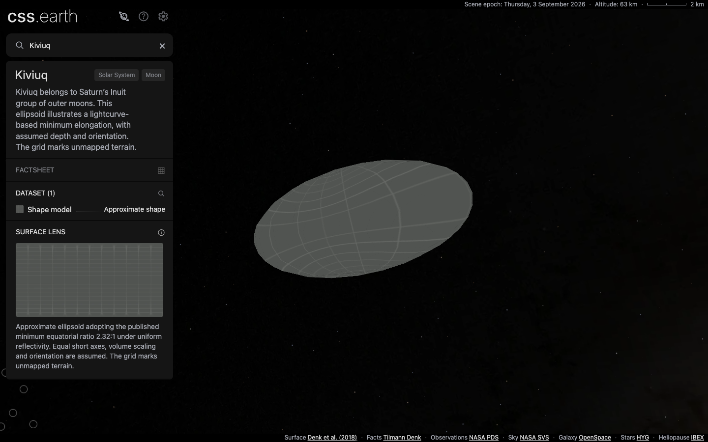
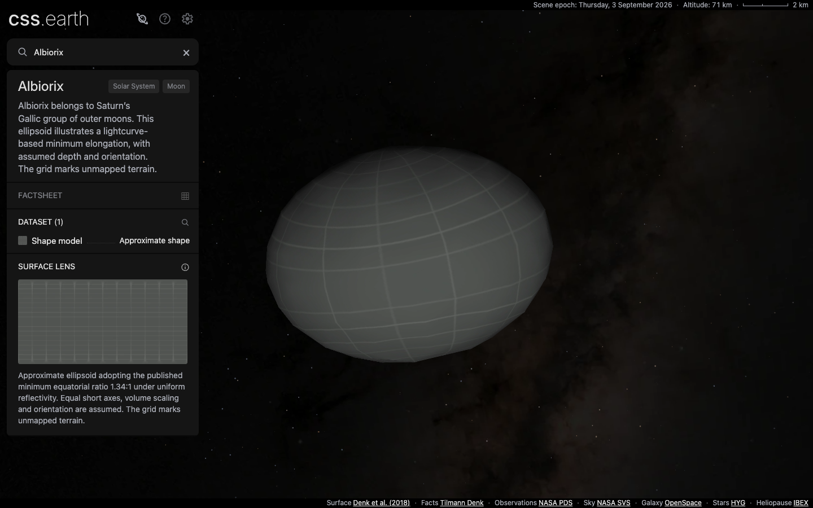

# Kiviuq and Albiorix

The two Saturnian irregular moons use the existing object adapter, shared shell,
and prepared solid-body renderer. Each scene has 480 native CSS triangle leaves,
one **Shape model** view, Shadows, and Orbit. Preparation owns geometry, textures,
lighting and navigation images; the browser retains the mounted scene.





## Scientific scope

| Body | Adopted minimum equatorial ratio | Display radius | Derived semiaxes, km |
| --- | --- | --- | --- |
| Kiviuq | 2.32:1 | 8.4 km | 14.721021 × 6.345268 × 6.345268 |
| Albiorix | 1.34:1 | 14.3 km | 17.380912 × 12.970830 × 12.970830 |

These are approximate ellipsoids constrained by published lightcurve amplitudes
under uniform reflectivity. Equal short axes, equal-volume scaling, pole,
meridian and spin sense are assumptions. The reference radii are uncertain size
estimates, not measured volumes. Neither package reconstructs the measured
lightcurve series or claims resolved terrain. The shared missing-data grid covers
the entire surface; the introductory text and lens description disclose the
assumptions beside the scene.

The [Kiviuq source survey](../../src/planets/kiviuq/SOURCE.md) and
[Albiorix source survey](../../src/planets/albiorix/SOURCE.md) preserve the
primary references, formula, selected inputs and unresolved candidates. The 2026
review reports calculated inversion models with papers in preparation; no
downloadable model for these bodies was qualified. Albiorix's unresolved JWST
spectrum remains a candidate for a future chart, not a surface map.

## Orbital previews

Horizons targets 624 and 626 are fitted relative to Saturn in geometric ICRF.
Kiviuq uses five-day samples from 2020-01-01 through 2031-12-29 and ten bounded
residual harmonics per axis. Albiorix uses daily samples through 2032-01-01,
longitude harmonics and a 512-term cosine residual per axis. The cosine fit is
prepared into the existing periodic-series representation; runtime fitting and
body-specific runtime algorithms are unnecessary.

| Sampled error | Kiviuq | Albiorix |
| --- | --- | --- |
| Maximum position error at six committed fixture epochs | 28,145.69 km | 18,473.58 km |
| Maximum position error at 37 additional epochs | 34,022.83 km | 92,772.09 km |
| Maximum radial error at those additional epochs | 0.1453% | 1.0514% |
| Position error at prepared epoch JD 2461286.5 | 4,462.67 km | 274.05 km |
| Velocity error at prepared epoch | 319.26 km/day | 109.14 km/day |

These are sampled Saturn-relative residuals, excluding the parent ephemeris
error. They are not universal error bounds, precision tracking, endpoint
velocity qualification or extrapolation claims. Both bodies retain the common
2% radial guard. Exact queries, independent vectors and sampling limits live in
each body's `source/validation/orbit-checks.json`. All 66 existing satellite
records are byte-for-byte unchanged.

## Installation and evidence

```sh
pnpm setup:assets --object=kiviuq --object=albiorix
```

The published manifests contain 62 files totaling 14,034,678 bytes. A fresh
installation downloaded all 62, reusing none. Repreparation after integrating
main's five-comet changes preserves every runtime asset hash. Separate empty
source directories restored the pinned ESO panorama and Inter font; the final
source closure verifies 17 records per body, including checked-in authored
shape, material and context inputs.

Application commit `42d8e78e` includes main through `3d76ff39`, with 178 objects.
The final static build and asset assembly pass, producing 179 pages. No new
worktree was created; the existing moons checkout was reused.

Both moons pass all nine [interaction conformance cases](evidence/conformance.json)
in real Chrome. The subsequent 67P lens merge preserves their prepared hashes
and the shared renderer sources. Final [fresh-install captures](evidence/browser-captures.json)
bind actual prepared-response hashes, requested image hashes, camera transforms,
lighting state and native screenshots at DPR 1 and 2 in development and built
views. Both densities load the canonical highest-density body assets. Native
image pixels are preserved. These show the disclosed approximation, without a
photographic or released-inversion-model parity claim.

The [complete gallery run](evidence/browser-gallery-172.json) at `625b9b4b`
passes all 344 object/DPR cases and both retained-navigation checks for that
172-object state. After integration, [18 focused cases](evidence/browser-focused-final.json)
pass for both new moons, all six added asteroids, and the updated 67P at both
DPRs. This distinguishes the earlier complete sweep from the final focused run.
First-party requests were fulfilled from `dist` using the
[replay helper](evidence/route-built-browser.mjs); these are built-application
checks, not production delivery or network measurements.

The [existing-payload audit](evidence/existing-payloads.json), relative to
`3d76ff39`, finds only shared marker index/count changes and matching descriptor
hashes in 334 existing-body files. Existing geometry, materials and controls
are unchanged. [Hash-verified marker rebinding](evidence/marker-rebinding.json)
preserved 171 compiled scenes; Sun and the new asteroid documents went through
normal preparation. [Normal preparation of Saturn and both moons](evidence/preparation-equivalence.json)
reproduces the rebound documents byte-for-byte.

Package tests, all 337 renderer tests, the six moon source/vector tests, and
marker/solar regression checks pass. The default full test command reached two
4 GiB Node heap failures in the ownership and prepared-leaf audits. The other
platform tests passed; rerunning the two affected files sequentially with an
8 GiB heap passes all 54 tests, followed by all 234 shell tests. No assertion or
tolerance changed. The unmodified default command remains non-green in this
environment. The focused retry command was:

```sh
node --max-old-space-size=8192 --test --test-concurrency=1 \
  tools/check-object-runtime-ownership.test.mjs \
  tools/check-prepared-leaf-layouts.test.mjs
NODE_OPTIONS=--max-old-space-size=8192 pnpm test:shell
```

Global source verification stops on missing existing-body inputs: Halley's
ESO panorama and Inter font in this checkout. Both new moons pass all 17 source
records. Package lint reports main's pre-existing 724-line asteroid fixture;
all twelve changed astronomy files are lint-clean. These aggregate limitations
are retained in the PR rather than described as a fully green release gate.
[Log hashes](evidence/gate-log-hashes.json) identify the local verification logs.
