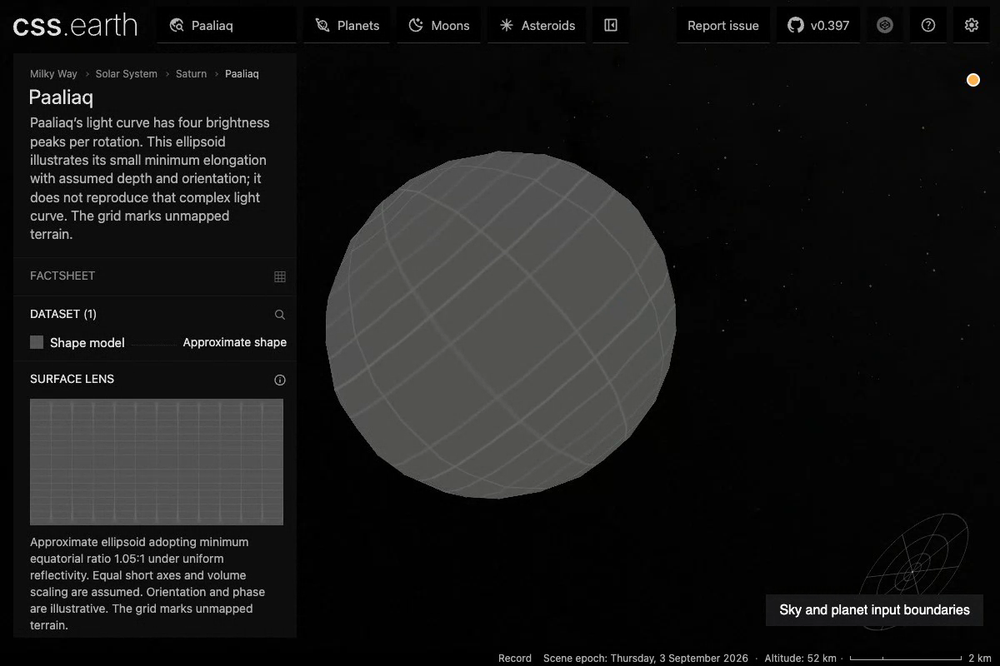
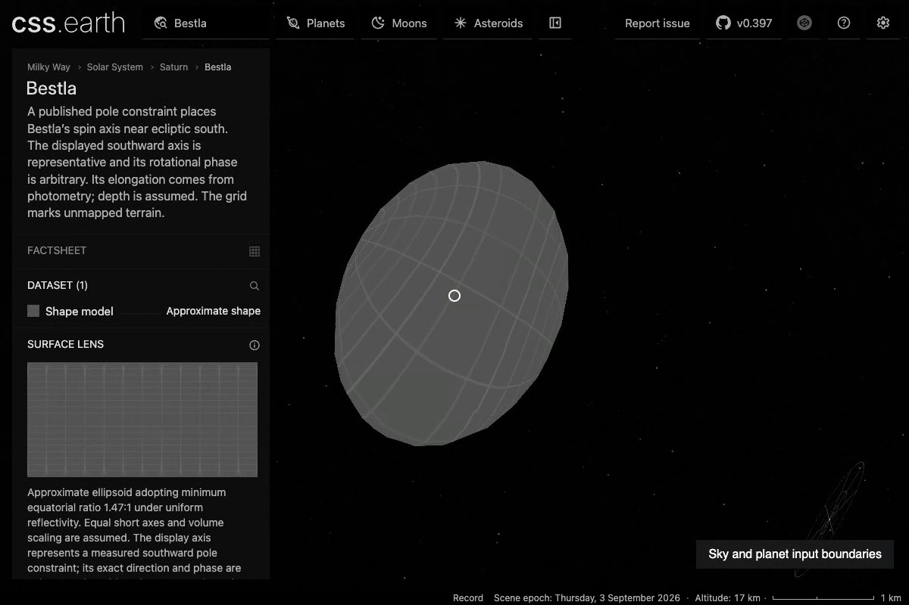
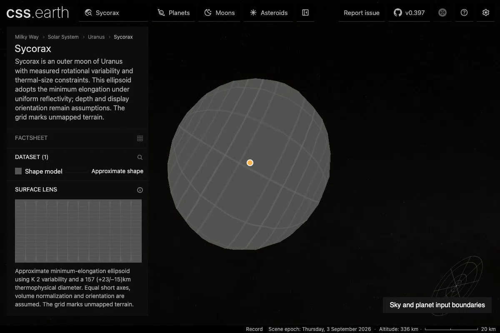
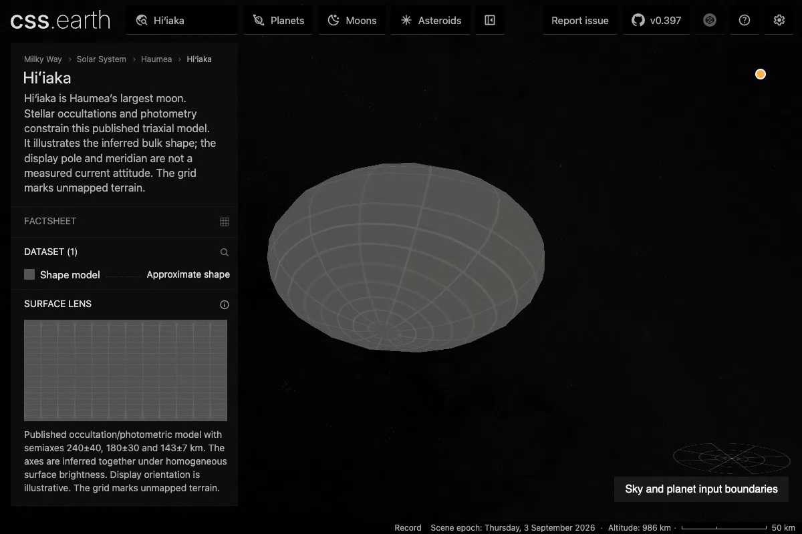
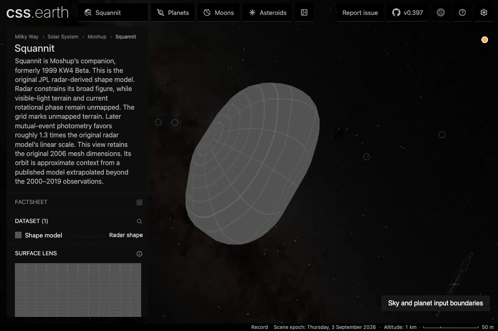
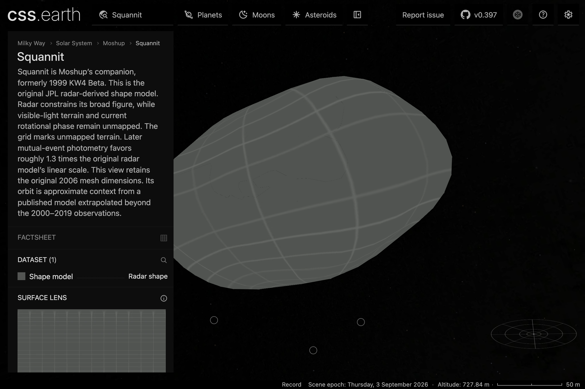
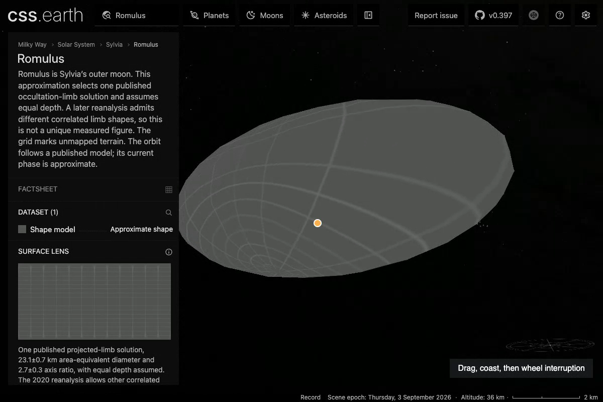

# B1 representative views

These six views show the 26-moon expansion in the integrated explorer. The images are unmodified frames from real Chrome DPR 2 captures. They show the models and their visible scientific limits; they do not establish spacecraft-image parity or independently measured shape accuracy.

The [capture and review record](../qualification-visual-final.json) binds each image to its video timestamp, SHA-256, browser report and source/prepared package pins. Broader [batch qualification](../../B1-EXPANSION.md) records the source, numerical and interaction checks.

## Paaliaq

A small photometric minimum elongation. The displayed depth and orientation are assumptions, and the ellipsoid does not reproduce the observed four-peaked light curve.

## Bestla

A more elongated approximation with its published south-ecliptic pole constraint distinguished from the chosen display axis and phase.

## Sycorax

Thermal-size and rotational constraints inform the minimum-elongation model. Assumed depth and display orientation remain explicit.

## Hiʻiaka

The published occultation/photometric model gives a broad triaxial figure. Its display orientation is not a measured current attitude.

## Squannit

The released radar shape supplies the irregular geometry. Its neutral grid communicates the absence of mapped terrain; the source's spin and orbital limits remain visible.

A source-owned two-sided coverage option removes the fine raster contour without changing the original mesh, its 800 retained triangles or any atlas. The [correction receipt](../qualification-squannit-seam.json) records the exact source/runtime pins and fresh DPR1/2 checks. These unmodified lossless screenshots use the same diagnostic yaw60 view:

| Before | Corrected prepared package |
|---|---|
|  |  |

## Romulus

An explicitly assumption-dependent ellipsoid uses the published occultation constraints. Orbital projection uncertainty remains separate from shape evidence.

