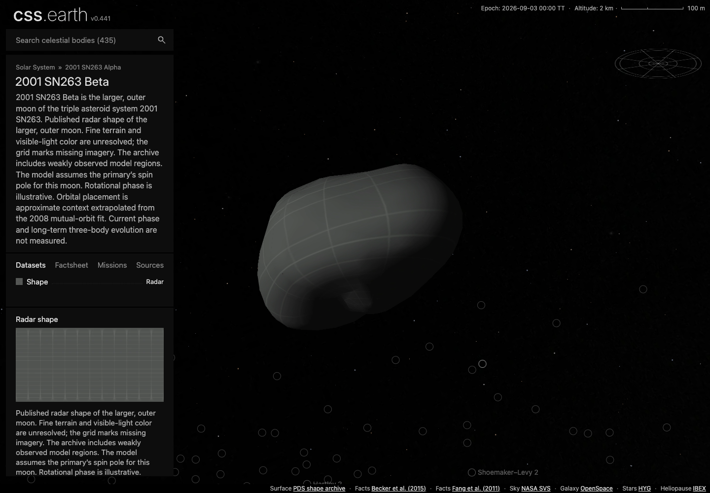

# 2001 SN263: visual and delivery review

The three additions provide published irregular shapes through the existing retained CSS renderer. Alpha has the primary's broad equatorial bulge; Beta is elongated with an uneven waist; Gamma is smaller and asymmetric. The visible grid denotes missing optical imagery. It is not an albedo map or a mask of the radar observations.

## What was inspected

Chrome captures cover all three bodies at 1440 × 1000 CSS pixels, DPR 1 and 2: initial Shape, Shadows off/on, a drag and close zoom. Beta also has a 390 × 844 mobile capture. Source PDS model views were inspected independently; the browser framing is different, so this is a qualitative shape comparison, not a pixel-matched oracle. Numerical source-fit checks are in [shape-fit.json](shape-fit.json).

The selected [screenshots](evidence/screenshots) show closed silhouettes, source-supported shape differences and continuous grid registration at the inspected poses. Close views expose the intentionally coarse source model and 64 px raster cells. No photographic surface detail is claimed. Alpha and the companions visible behind a selected body are the existing prepared context images; only the selected body mounts a detailed scene.

The selector uses **Shape / Radar**. The mobile page has no horizontal document overflow; its long scientific introduction requires scrolling to the dataset details. Both [mobile](evidence/screenshots/sn263-beta-mobile.png) and [selector](evidence/screenshots/sn263-beta-mobile-selector.png) captures are retained. The shared public settings button is hidden on the base branch: Shadows captures exercise its existing input binding programmatically and do not prove a publicly reachable settings button.

The [capture receipt](evidence/browser.json) records camera states, runtime and source hashes, requested image hashes, retained-node counts and the shell navigation sequence. Earlier capture attempts had search-selector mistakes; the final navigation run explicitly selects the existing All category and passes. No scene bytes changed between the six desktop captures and the resumed navigation/mobile capture.

## Shape and interaction cost

Each native model has 2,292 faces. The existing simplifier prepares 798/800/800 native `u` raster leaves, each 64 × 64 px, for Alpha/Beta/Gamma. All three choose canonical prepared density 2 on both tested display DPRs.

| Body | Prepared faces | Sampled radial error, mean / p95 / max | Drag DrawFrame interval, median / p95 |
| --- | ---: | ---: | ---: |
| Alpha | 798 | 5.06 / 15.77 / 39.85 m | 16.74 / 18.88 ms |
| Beta | 800 | 1.42 / 3.91 / 7.01 m | 16.67 / 17.23 ms |
| Gamma | 800 | 0.84 / 2.41 / 3.59 m | 16.62 / 18.52 ms |

The fit sample uses 3,740 rays per body: a 5° direction grid plus original vertex directions. This is a sampled difference from the released mesh, not an exhaustive bound or observational uncertainty. In particular, Alpha's sampled maximum exceeds the simplifier's 35 m internal estimate; that estimate is not a guaranteed radial bound.

The [cost receipt](evidence/cost.json) and [short traces](evidence/traces) use a matched 1440 × 1000, DPR 1, paused, Shadows-off drag with twelve 5 × 2 px steps spaced by 20 ms. They retain Paint/Layout event durations as well as DrawFrame cadence. These are short local trace observations, not a compositor FPS guarantee, hardware-saturation diagnosis or comparison with a previous rendering implementation. Existing DOM cleanliness checks found 116,812/116,802/116,802 total stage nodes, including the shared universe; the new body surface leaf counts alone do not describe the complete application.

## Delivery accounting

The [fresh installation](evidence/fresh-install.json) contains 93 immutable runtime assets totaling **21.17 MB** for all three bodies. Canonical prepared object JSON adds 6.62/6.99/6.99 MB respectively. There is one surface lens, so there is no additional lens-switch download bank.

In the dev-server cold-load measurement, each full page requested about **103 MB across 2,004 responses**, including the development module graph, large shared universe/stars data, HTML, navigation, object JSON and images. This is measured development HTTP response traffic, not production transfer size and not the marginal cost of adding a moon. Object-specific scene JSON and image response bodies in the visual capture total approximately 7.82/8.19/8.19 MB.

The four loaded object image resources at the measured Shadows-off state imply **147.59 MB of uncompressed RGBA storage** per body. Most is the existing 4096 × 8192 lighting atlas; the surface atlas is 1024 × 3200. This calculation excludes other shared images, mipmaps, browser overhead and any GPU copies. It is not measured GPU residency or total page memory. Install bytes, network transfer and decoded image storage must not be conflated.

## Readiness limits

All three package closures, fresh asset downloads, 33 shared browser conformance cases and six DOM-cleanliness cases passed. The [batch report](README.md#qualification) records the outstanding whole-repository package/build checks and the unchanged Phobos fixture assertion. The PR remains draft pending aggregate qualification and visual acceptance.

Evidence log copies trim trailing whitespace for review; the original scientific source bytes retain their archive padding and line endings. Evidence file hashes are listed in [files.json](evidence/files.json).
