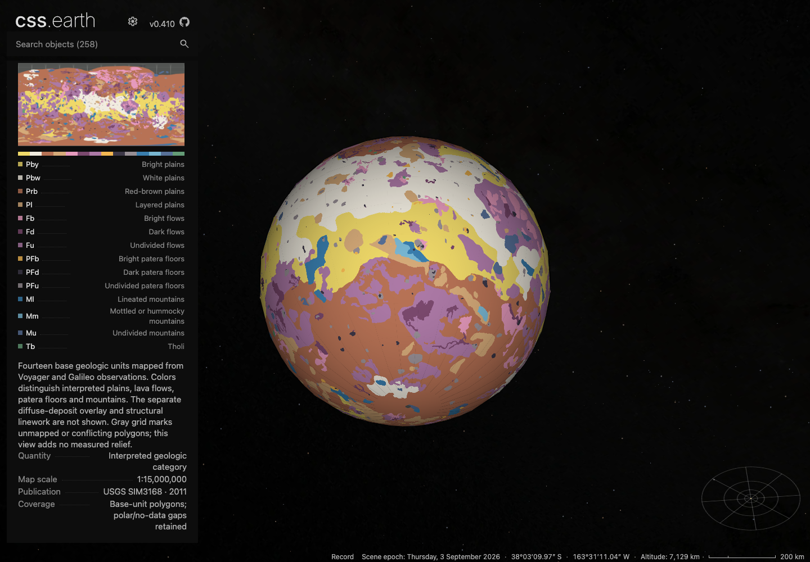
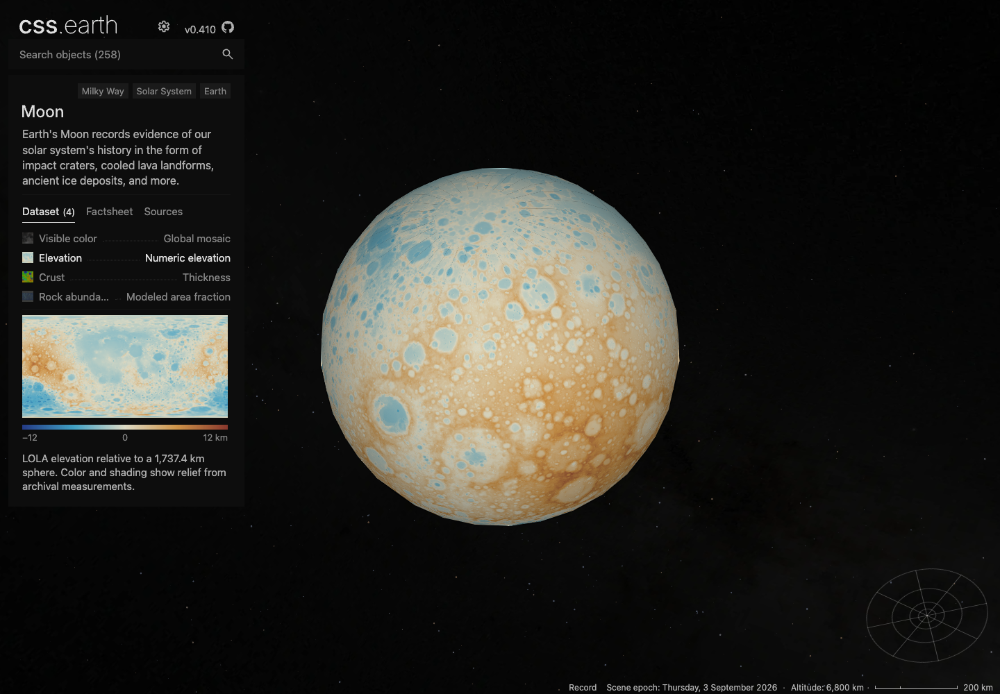
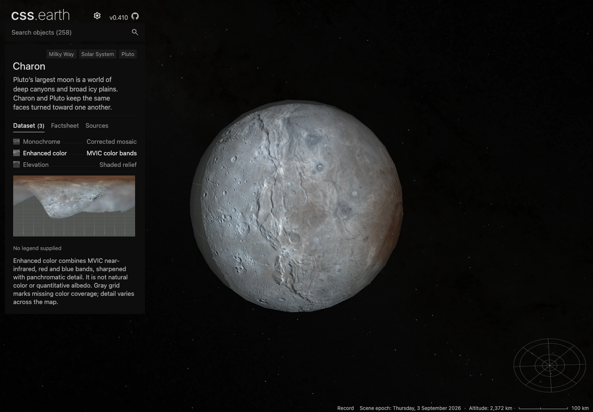

# B2 delivery: scientific surfaces across 13 moons

The approved cohort is Moon, Phobos, Deimos, Dimorphos, Io, Europa, Ganymede, Enceladus, Tethys, Dione, Rhea, Titan and Charon. Titania and Miranda carry into B3 because their selected GIS releases remain inaccessible. These are upgrades to existing worlds; the moon roster remains 95.

The implementation includes numeric LOLA topography and Diviner rock abundance; exact-mesh relative albedo and modeled slopes; Io/Ganymede geologic units; Europa's controlled Agenor terrain; corrected Enceladus and native Saturnian shape models; Titan's separately labeled measured/interpolated heights and coverage distance; and Charon's enhanced MVIC color. Scientific units, datums, source-defined gaps and model limits accompany the actual views. Main's new cards and Dimorphos albedo are retained. The subsequent PR #61 asteroid spectral decoders are integrated additively at `1d372e045`, preserving the B2 source-processing paths.

## Reproducibility and delivery

- [Fresh source restoration](fresh-source-restoration.json): all 13 bodies passed; 424 declared entries. 134 ignored entries (3,356,830,813 bytes) were restored through the existing acquisition APIs, with 290 individually pinned tracked entries (50,089,019 bytes). This includes the real corrected-v2 DSK conversion.
- [Runtime publication](runtime-publication.log): 551 image files, 312,482,154 bytes, published through the existing immutable asset service.
- [Fresh runtime installation](fresh-runtime-installation.json): 551 installed, zero reused, every downloaded byte count and SHA-256 verified. Application/shared-shell traffic is additional; this is total image installation size, not a cold route transfer or decoded-memory measurement.
- [Native binding correction](native-culling-rebind.json): seven closed native meshes retain all prepared facets without changing scene geometry or image bytes. [The Rhea probe](rhea-culling-review.md) records the actual culling defect and bounded visual correction.

- [Fresh runtime routes](fresh-runtime-routes.json): all 13 routes and 19 selected views passed in Chrome, with 162 scene-image responses fulfilled from the fresh installation and verified against published hashes. App code, JSON and shared shell came from the current development server; this does not claim a fresh checkout build or measured production network transfer.

## Browser and visual review

The selected main captures comprise 26 body/DPR cases, 166 lens/lighting states and 86 retained drags. The initial run completed 12 bodies before the server stopped at Charon; the successful Charon replacement is separate. That initial overall INVALID status remains preserved. [Current file comparison](primary-capture-current-files.json) confirms source, object, runtime, images and body CSS still match; the sole later change is the card legend layout.

Manual review found and corrected the new card's fixed-height legend overlap and ellipsized scientific units. The focused replacement card capture passed all 26 body/DPR cases and 86 card views, asserting parent containment, full text and nonoverlapping descriptions. The enhanced-imagery supplement passed 12 cases and 24 lighting states. Manual review accepted the replacements: [scalar cards](reviews/four-body/legend-correction/review.md), [Io/Ganymede categories](reviews/jovian-initial/legend-correction-review.md), [Saturn/Charon](reviews/saturn-final.md), and [Jovian enhanced imagery](reviews/jovian-initial/enhanced-review.md). A [source-footprint-facing Europa capture](reviews/jovian-initial/europa-color-footprint-review.md) also verifies the actual color patch at both DPRs. No outstanding visual blocker remains within these bounded samples. Fine Moon pole/band seams and occasional thin facet lines on other bodies remain; no high-zoom, full-rotation, complete polar, physical-mobile, compositor-FPS or native-pixel-parity qualification is implied. Dimorphos's representative pose shows only a narrow supported albedo strip; Europa's regional numeric colors are easiest to read with Shadows off.

## Required gates

[PR #62](https://github.com/layoutit/cssEarth/pull/62) remains **draft**. The final checks use integration commit `1d372e045` with main `4848897ee` (PR #61). Aggregate readiness is **not established**.

| Check | Result |
| --- | --- |
| B2 source verification and body tests | All 13 source packages verified; 59/59 body tests passed. |
| Shared scientific preparation | 66/66 tests passed, including the merged GeoTIFF/PDS dispatch and independent scientific cases. |
| `pnpm acquire:planets -- --verify-only` | Failed at the first registry body, Polymele: missing starfield and Inter font inputs. B2's separate source checks passed. |
| `pnpm test` | Packages: 761 passed. Renderer: 339 passed, 11 failed across Mercury/Venus loading and Earth paging/navigation/depth checks. Platform and shell not reached. |
| Focused shared-shell checks | 47/53 passed. Failures identify Itokawa's lens-race profile and missing Polymele prepared object; complete B2 card/browser profiles are separately checked. |
| `pnpm test:browser` | Failed before completing a case: Polymele returned HTTP 500, then readiness timed out. [Browser receipt](global-browser-before-build.json). |
| `pnpm build` | Failed with exit 134 during Astro production build at the heap limit. Package, renderer, preparation, all 258 object payloads, minimaps, provenance and spacecraft preparation completed; assembly was not reached. |

The four stale B2 title-source hashes in physical-frame receipts were repaired with unchanged numerical frames; the subsequent 59-test body run passes. Earlier failed and interrupted attempts are retained in `pre-integration-gates/`. Locations outside B2 are not a clean-baseline proof that every aggregate failure is pre-existing. The completed [build attempt and gate logs](release-gates/report.json) remain preserved. [Post-build fingerprint comparison](post-build-fingerprints.json) verifies all 808 captured files: only the already reviewed card CSS differs from the initial capture; B2 sources, payloads, images and body CSS are unchanged. Relevant post-build reruns are recorded separately below.

## Representative captures

## Checks after the build attempt

Regeneration resolved the Mercury/Venus loader failures and missing Polymele prepared-object failures. Renderer rerun: 341/350 passed; the remaining nine failures concern Earth paging, depth partitions and Buenos Aires targeting. Focused shell rerun: 50/53 passed; the remaining failures concern Itokawa's lens-race profile. Four projected-image tests also passed. The [global browser rerun](post-build-checks/global-browser-report.json) again stopped at Polymele HTTP 500 before completing a case. The [final B2 route check](post-build-checks/b2-route-report.json) passed all 13 moons and 19 selected scientific views, verifying 172 actual scene-image responses from the fresh installation. These checks preserve a draft PR with explicit aggregate failures; no production deployment or merge-readiness claim is made.
