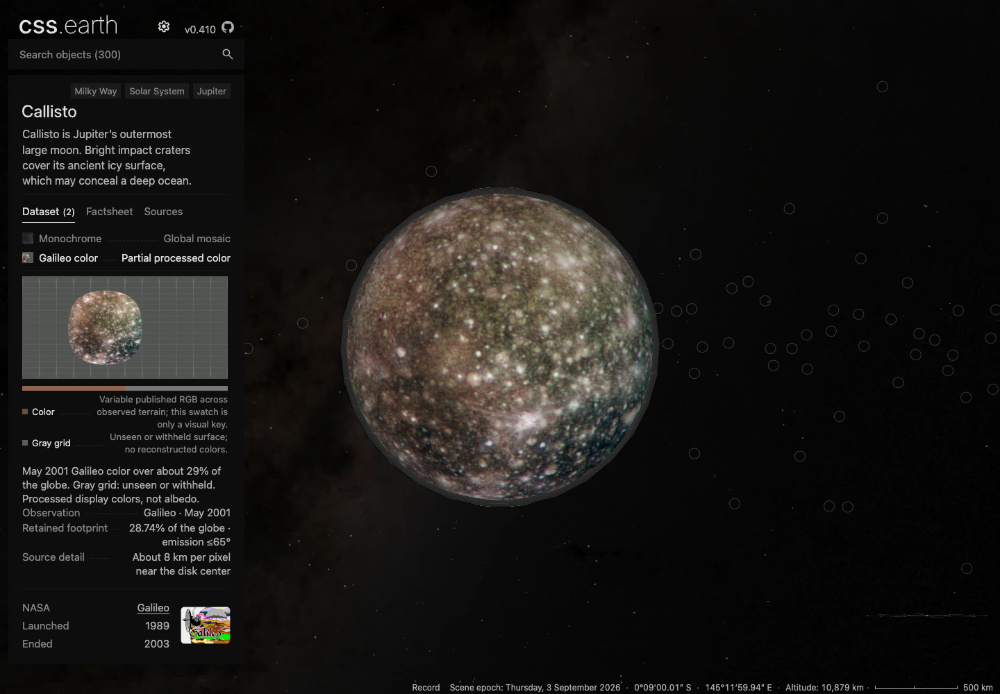
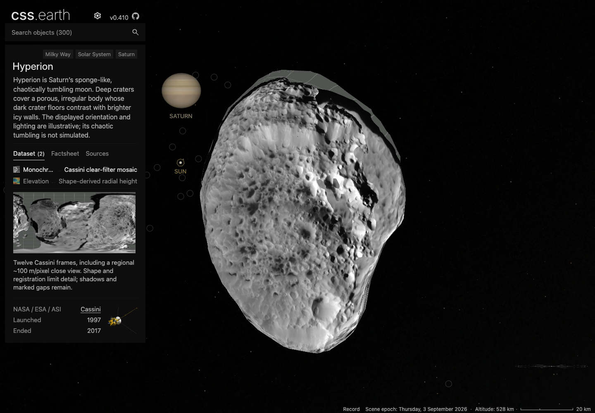
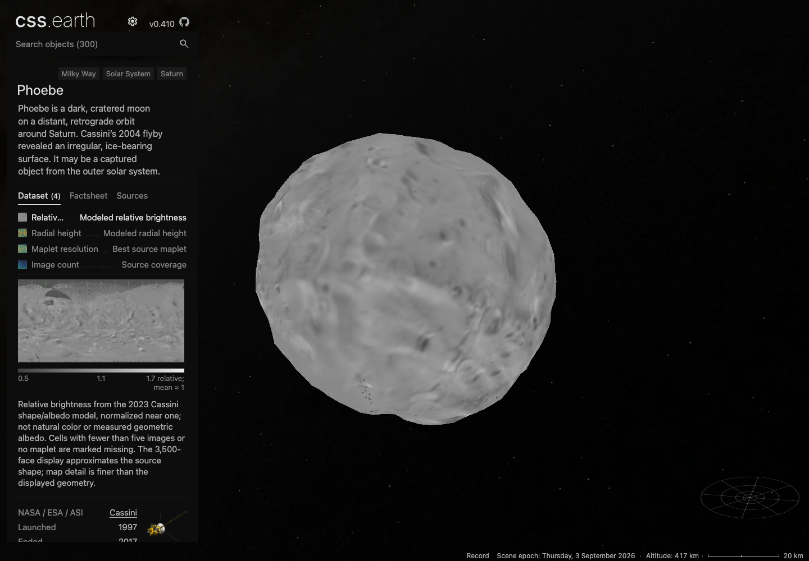
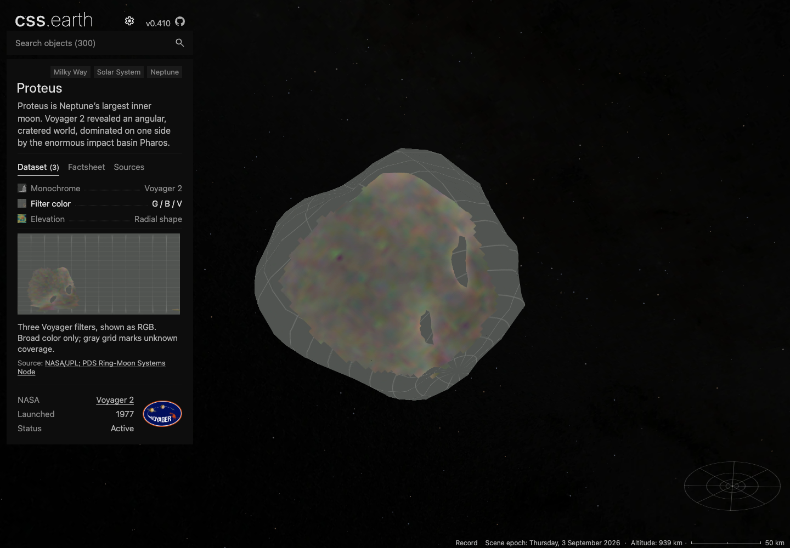
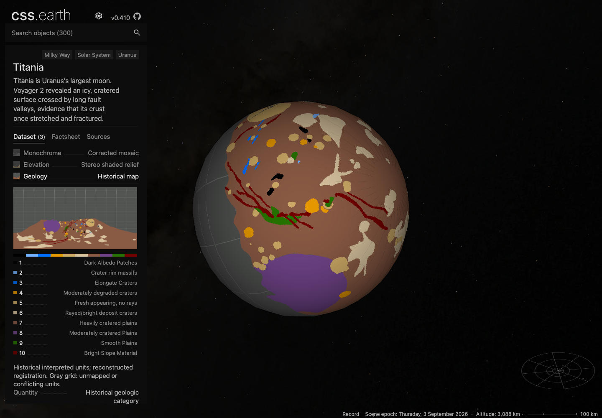
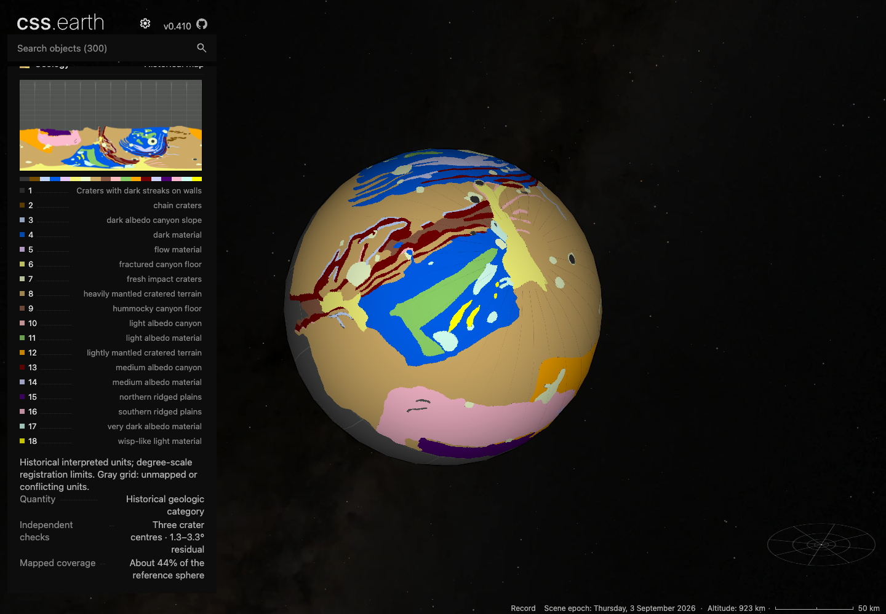

# B3: spacecraft imagery and geologic maps for six moons

Six existing moons gain six new selectable views and three improved views. The original twelve targets are all source-reviewed; the user approved a six-body draft PR and carrying the other six dispositions forward. No new moon scene or roster increase is claimed.

| Moon | Prepared result | Scientific boundary |
| --- | --- | --- |
| Callisto | Galileo color alongside the global monochrome mosaic | Published processed color, conservatively registered over about 28.7% of the sphere; approximately 8 km native sampling near image center. Unseen/withheld areas remain missing. |
| Hyperion | Finer clear-filter imagery within the existing controlled mosaic | A regional 100.52 m/pixel source improves detail, with camera correction checked against separate source regions. It does not increase the existing 81.5% map-pixel footprint or establish global 100 m accuracy. |
| Phoebe | Paired 2023 shape, relative albedo, radial height, maplet resolution and image count | Relative modeled brightness is not natural color or geometric albedo. Albedo/height require at least five contributing images and a valid maplet. Zero image counts remain visible. |
| Proteus | Voyager green/blue/violet filter color | The three filters map explicitly to RGB. Common coverage and conservative camera uncertainty withhold unreliable regions; broad color is not a true-color or composition measurement. |
| Titania | Ten historical geologic units | Original map coordinates are registered to the moon; about 35.3% sampled area coverage. Unknown and unresolved overlapping units remain missing. |
| Miranda | Eighteen historical geologic units | Original polygons, holes and supported overlap order are preserved; about 44.2% sampled area coverage. Registration uncertainty remains explicit. |

The existing generic object contract, retained scene and shared camera remain in use. Selecting a regional observation flies to its prepared geographic target. Source masks and category colors are preserved through preparation, including the native-mesh numeric atlas path.

## Reproducibility

[Final source closure](fresh-source-restoration.json) verifies all 264 entries. The [initial attempt](fresh-source-initial.json) restored four moons but encountered Zenodo HTTP403 for the GIS inputs. [The fresh Uranus replacement](fresh-source-uranus.json) passes with the exact small original archives/previews tracked in the repository. Six subsequent Callisto documentation changes were copied from committed, pinned files and are listed separately; no ignored source was copied from the working checkout.

[Main integration](main-integration.json) preserves all 228 B3 image files while integrating the incoming Earth, asteroid and comet work. Shared numeric masks/registration checks, renderer contracts and incoming comet regression checks pass. The final browser checks pass for the six delivery candidates. Whole-application qualification remains incomplete as described below.

## Final checks

| Check | Result |
| --- | --- |
| Six-body unit tests | 23 passed; [log](body-tests.log) |
| Six-body source/runtime closure | 18 passed; [log](source-closure.log) |
| Fresh source restoration | 264 pinned records verified; original failure and recovery retained above |
| Fresh runtime installation | 228 downloaded, zero reused, 133,530,832 bytes verified against immutable URLs; [receipt](fresh-runtime-install.json) |
| Actual Chrome rendering and input | 34 isolated runs cover 17 views at DPR1/2, 68 lighting states and 34 real drags; [summary](browser-summary.json) |
| Visual inspection | Nine representative DPR1 states across all six moons; [observations and image hashes](visual-review.json) |
| Stable inputs | 371 shared/prepared/source/asset files agree across the isolated captures and current files |
| Whole application | Incomplete: the production build crossed the resource-stop threshold. The renderer run reproduced nine failures on unchanged main inputs before its own resource stop. [Baseline comparison](renderer-baseline.json), [build stop](production-build-resource-stop.json) |

The browser runs started one view and one display density at a time, each with its own Chrome and preview-server lifetime. The largest observed process-tree RSS in a passing run was 5.92 GB. This is test-process evidence, not product-memory or mobile-performance qualification. The full build and renderer resource thresholds are polled stop conditions, not instantaneous hard memory caps. No broad parallel suite is required to reproduce the selected view captures.

The fresh installer downloads the same pinned bytes verified in actual browser responses. It does not establish a fresh-checkout production build. Phoebe accounts for 77.3 MB of prepared runtime imagery; physical mobile delivery is unqualified. Source maps remain limited by their original coverage and registration. Thin facet seams and some DPR1 aliasing remain visible in the categorical/numeric views.

## Reviewed views

## Approved delivery scope

All twelve planned targets have a source disposition. The user approved the six implemented upgrades above as one draft PR. Dactyl, Selam, Thebe, Aegaeon, Nix and Hydra remain in the [explicit research dispositions](../../B3-SPACECRAFT-MAPPING.md); no new scene, new supported footprint or unique registration is claimed for them. The source-research carry-forward has no new implementation commitment until its recorded qualification gaps close.

The evidence was captured against integrated base `b60f5d588` with the final B3 prepared files. Main subsequently gained Earth elevation PR #66 (`e018ba392`); it was inspected for scope but was not integrated or rerun locally. The draft does not claim current-main aggregate readiness.
