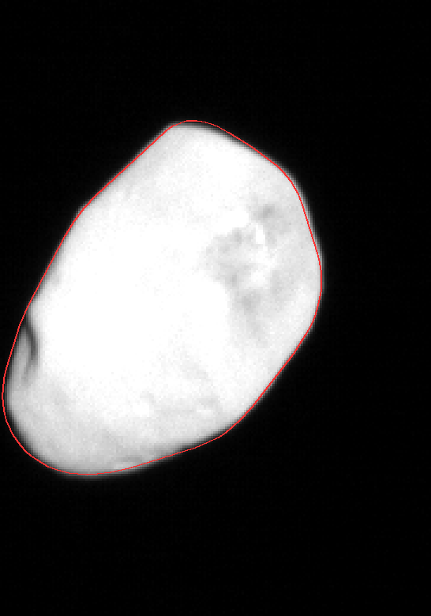
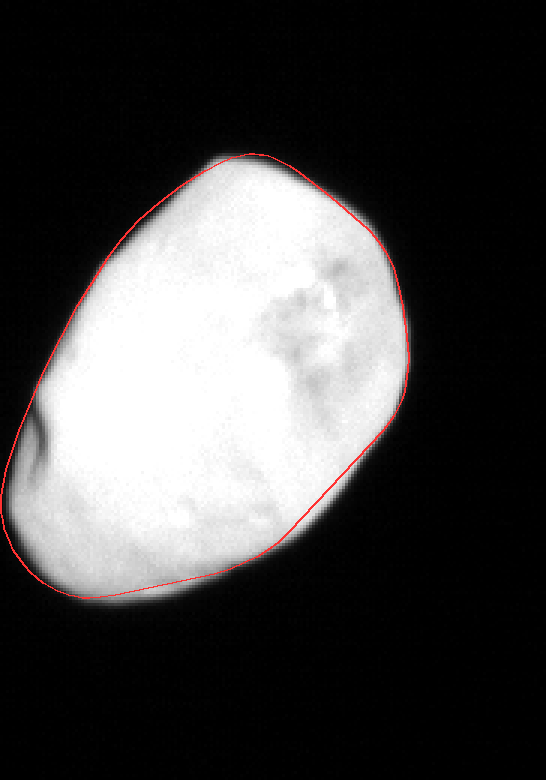
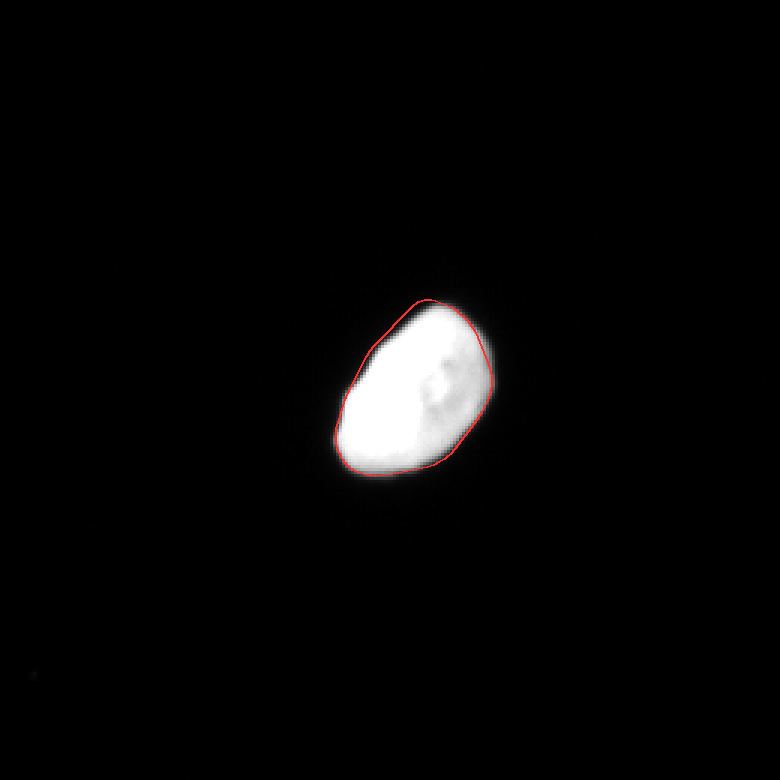
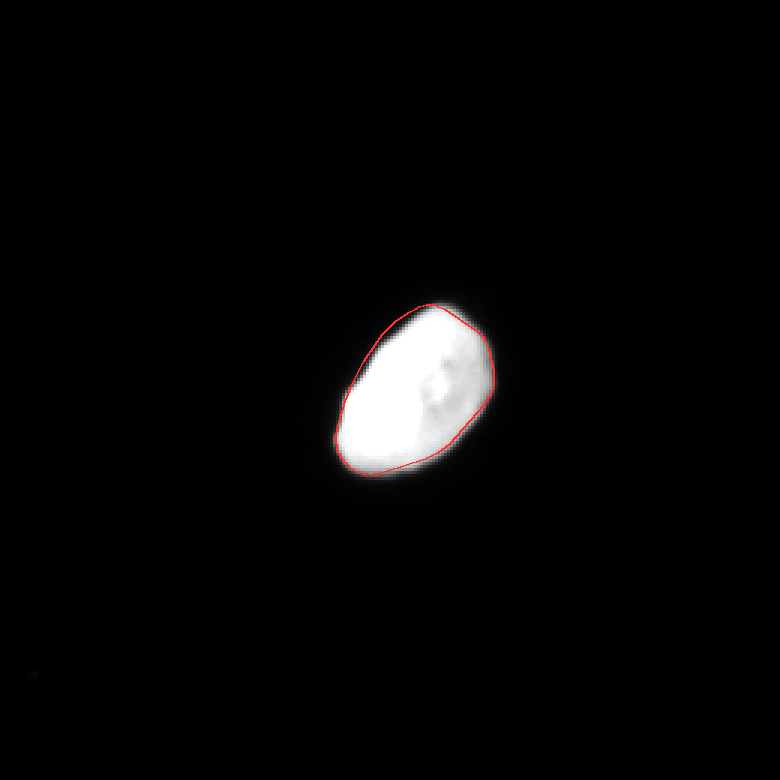

# Nix: actual two-view fit remains geographically ambiguous

**Review recommendation: carry the registered-imagery work and retain the existing honest shape package.** The original12-body B3 cohort remains in scope; this recommendation is not a user-approved scope change. Actual calibrated LORRI data can be decoded and the released Porter mesh can fit both observed outlines. The bounded experiment does not identify a unique meridian or hemisphere for surface mapping. No fitted camera or texture pixels were accepted.

The [machine-readable receipt](nix-registration-feasibility.json) pins the original [high-resolution exposure](https://opus.pds-rings.seti.org/holdings/volumes/NHxxLO_xxxx/NHPELO_2001/data/20150714_029917/lor_0299174134_0x636_sci.fit), the [independent earlier exposure](https://opus.pds-rings.seti.org/holdings/volumes/NHxxLO_xxxx/NHPELO_2001/data/20150714_029916/lor_0299167039_0x630_sci.fit), their geometry, the [Porter v1 mesh](https://doi.org/10.6084/m9.figshare.12779948.v1) and the [Weaver et al.2016 spin prior](https://arxiv.org/abs/1604.05366). The exposures are2015-07-14 10:03:35.806 and08:05:20.706; their native scales are0.30022 and0.77099km/pixel. Both source crops visibly resolve the same cratered face.

Each actual10,529,280-byte FITS product contains1024² calibrated DN, uncertainty and quality planes at byte offsets31,680/4,230,720/8,429,760. Quality uses signed16-bit storage with BZERO32768: zero is usable and34 quality32 pixels per image are withheld. Finite negative calibrated signal is preserved during background analysis. This does not establish an I/F conversion.

The source STL retains40,002 unique vertices/80,000 triangles at fixed0.5km per source unit; scale is not fitted. Source vertices define a convex-support outline at5° image directions. The final evaluation uses every source vertex. A deterministic1,200-pose exploration followed by24 bounded local refinements fits one proper mesh-to-J2000 rotation using only alternating45° sectors of the high-resolution outline. Other sectors are held out. The earlier image is a separate, whole-image shape holdout after solving only its two pointing-translation parameters. Observed extrema within3 pixels of a native image edge are excluded.

Actual FITS CRVAL/CD tangent-camera bases and target geometry carry the orientation between images. The published historical RA350°/Dec42° pole and1.829-day rotation supply the propagation prior; its approximately10° pole uncertainty is not reduced or silently ignored as a physical certainty. OPUS body-fixed longitudes are not treated as Porter-mesh coordinates. The orthographic outer-outline approximation is below approximately0.033 native pixel at the closest range, whereas unmodeled PSF and the phase-dependent limb remain material.

| Final20% contour solution | Reserved high-resolution sectors RMS | Whole independent image RMS | Orientation difference |
| --- | ---: | ---: | ---: |
| Preferred |1.48px |1.25px |0° |
| Alternative |1.95px |1.18px |96.86° |

Those two poses place the observer near mesh east longitudes265.46° and78.97°—a186.49° difference. Reducing the contour from20% to10% of the measured bright-disc interior switches the preferred pose by92.14°. At30%, the preferred pose moves7.96°. These are sensitivity tests, not statistical confidence intervals. The final edge exclusion supersedes the preliminary1.05/1.35px values recorded during the experiment.

The actual overlays below were personally inspected. Both alternatives follow the broad outlines, despite assigning different surface geography. A good-looking silhouette is insufficient to select a map registration.

| Preferred mesh pose | Alternative mesh pose |
| --- | --- |
|  |  |
|  |  |

Images show original NASA/JHUAPL/SWRI calibrated LORRI pixels under a declared diagnostic linear stretch, with the released Porter mesh outline in red. These are source-registration diagnostics, not browser captures or published surface products. Mesh reuse is CC BY4.0; retain source credits.

The next substantive step is full-source concavity/visibility and independently identifiable interior landmarks, with a calibrated PSF/illumination model and a wider angular view or constrained pole. This bounded necessary-condition fit does not prove that stronger registration is impossible. Searching the blocked mission-only SBMT route again would not resolve the measured ambiguity.

Reproduction uses the small [FITS decoder](nix-fit-decode.py) and [bounded fit script](nix-fit-feasibility.py), with commands and exact inputs in the receipt. It does not mutate a body package. Hydra remains separately reviewed but numerically untested: its lower-resolution, rotating pointings require their own fit and cannot inherit either this success or this ambiguity verdict.
