# B4 chart review

Actual shared-panel chart captures. These images contain no mounted scene. All 18 are reviewed; source/data and browser receipts are in the [B4 report](../B4-OBSERVATION-CHARTS.md).

### albiorix-nirspec-prism

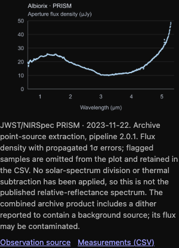

### epimetheus-nirspec-dither-1

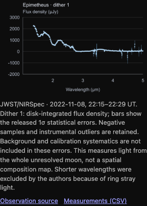

### epimetheus-nirspec-dither-2

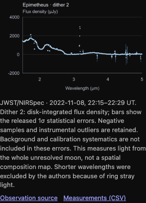

### himalia-nirspec-g235m

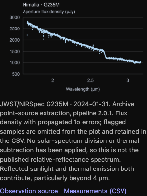

### himalia-nirspec-g395m

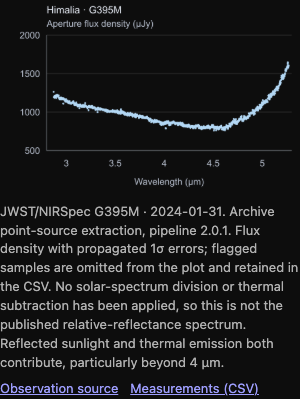

### methone-vims-spectrum

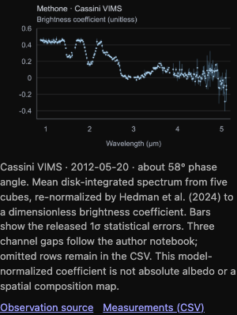

### pallene-nirspec-dither-1-detail

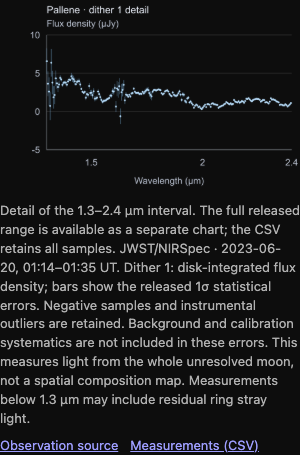

### pallene-nirspec-dither-1

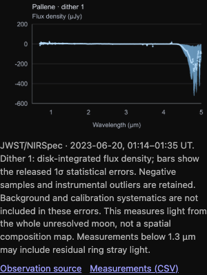

### pallene-nirspec-dither-2-detail

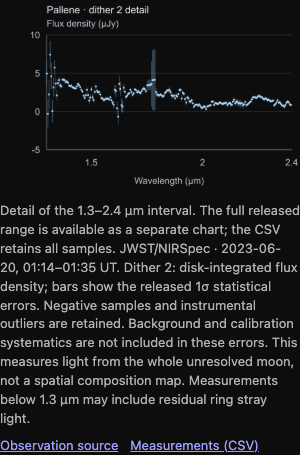

### pallene-nirspec-dither-2

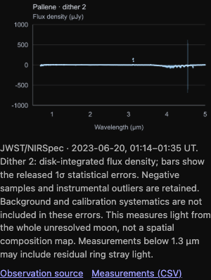

### pandora-nirspec-dither-1

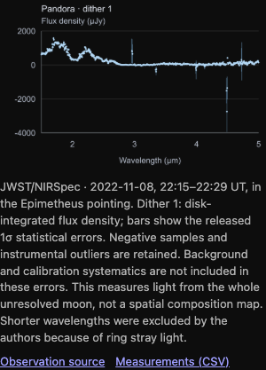

### siarnaq-nirspec-prism

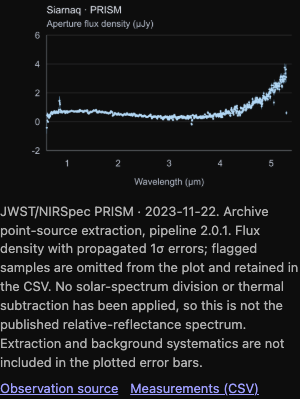

### telesto-nirspec-dither-1

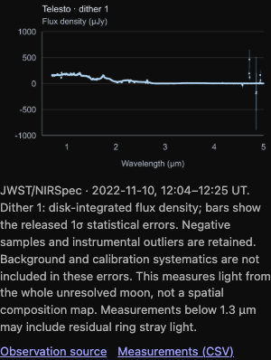

### telesto-nirspec-dither-2

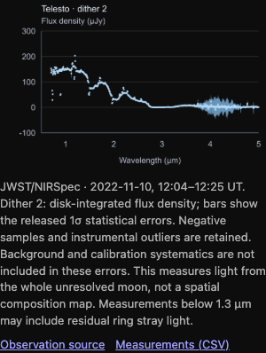

### ymir-165ot_ymirota065

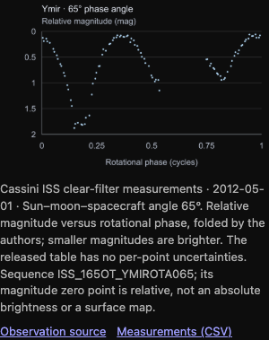

### ymir-165ot_ymirotb065

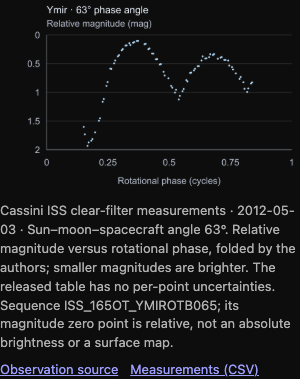

### ymir-168ot_ymirot095

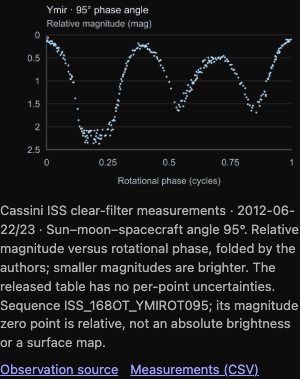

### ymir-218ot_ymicol029

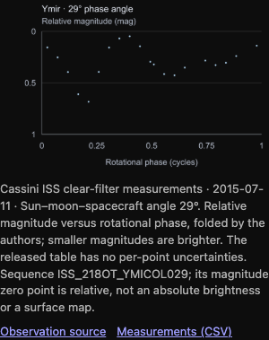
