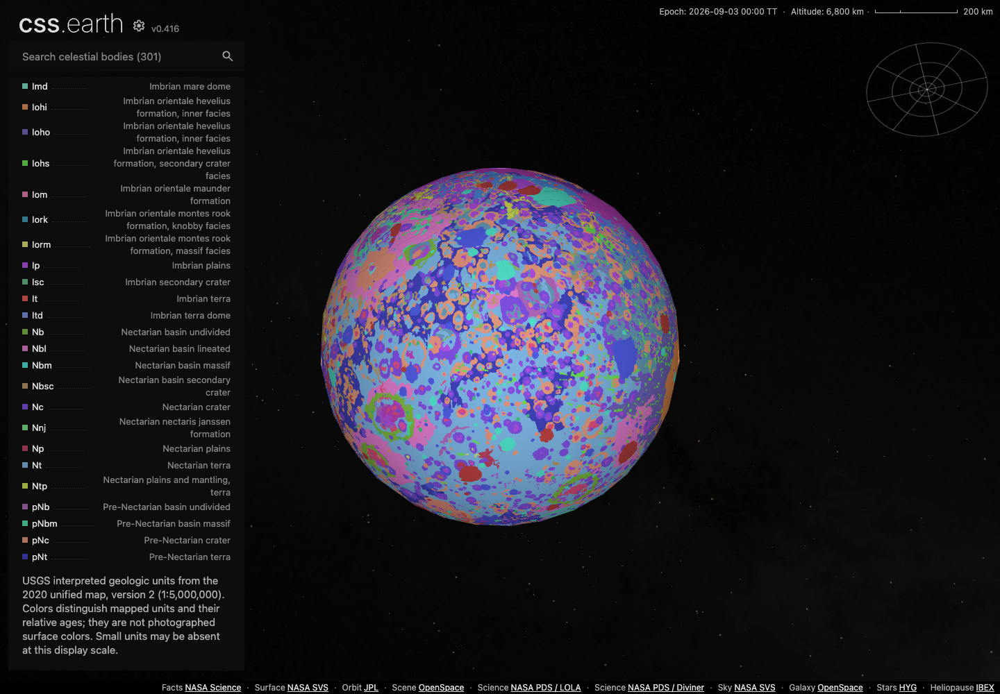
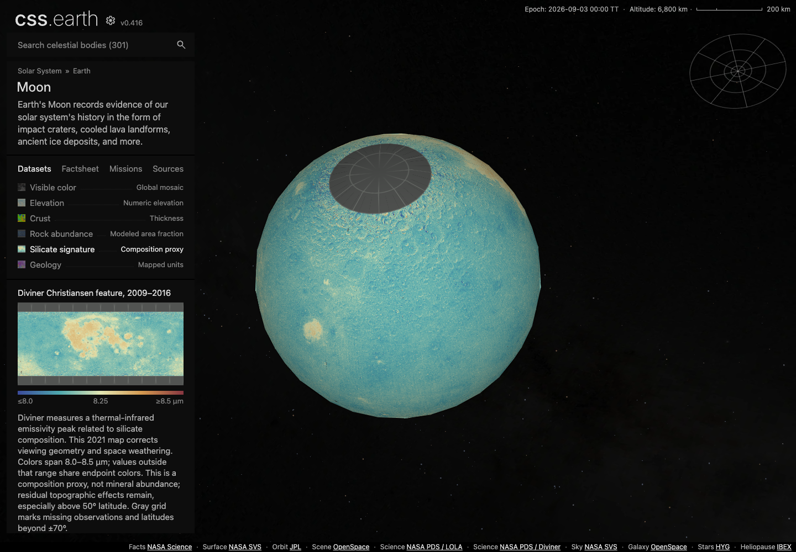
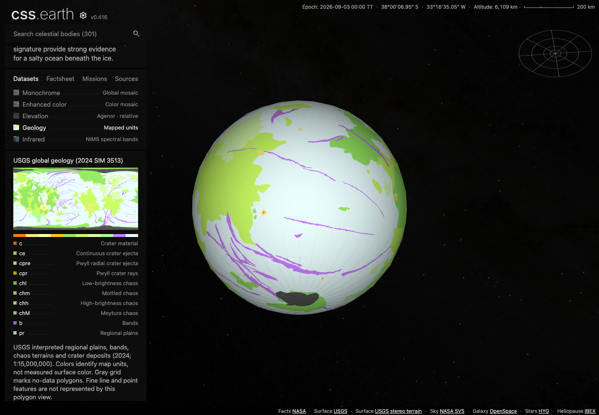
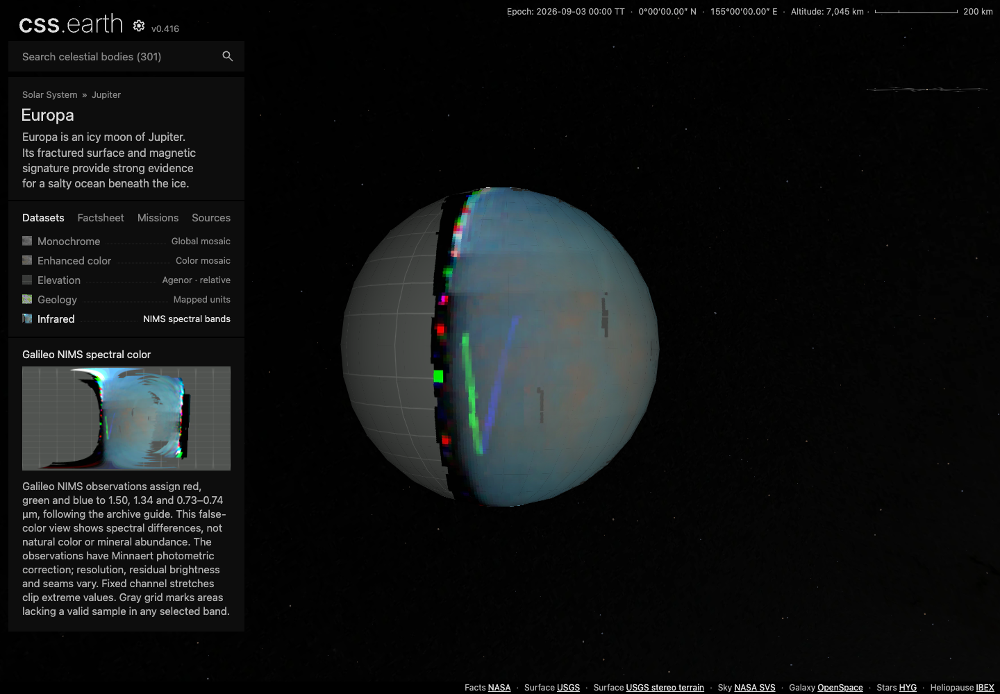
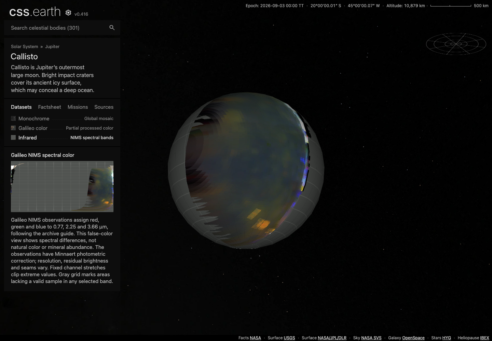
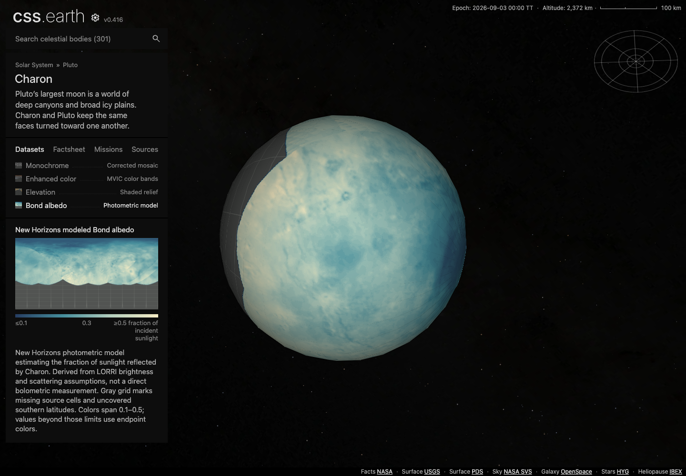

# B6: six mapped scientific views

Six additional datasets now paint the existing globes: Moon geology and Diviner
silicate signature, Europa geology and Galileo NIMS infrared, Callisto NIMS
infrared, and Charon modeled Bond albedo. Their coverage, units and interpretation
are visible beside each map. Existing default views remain available.

**Selected-body qualification at the capture base: PASS.** Source checks, affected package checks,
mounted Chrome checks and fresh runtime delivery passed. The PR remains a draft
pending repository-wide integration gates described below. This document records
the inspected result on 2026-09-09; automated capture receipts deliberately retain
their original `CAPTURED_UNREVIEWED` status.

Main through PR #75 has since been integrated. The combined branch passes 100
affected tests and all four package checks; [integration evidence](INTEGRATION.md)
records the marker-reference conflict resolution and the remaining browser gap.

## The six views

Each globe image below is an unmodified Chrome screenshot. The linked flat map
is generated from the pinned scientific input, before globe packing, for coverage
and orientation review. It is not an independent native-renderer oracle or a
matching camera frame; no pixel-parity claim is made. Independent original-data
checks are recorded separately below.

### Moon geology

The [USGS unified map v2](https://astrogeology.usgs.gov/search/map/unified_geologic_map_of_the_moon_1_5m_2020)
contributes 49 polygon classes at 1:5,000,000 scale. The palette is authored for
this view; it does not reproduce the source map's printed colors. Unit codes and
descriptions remain readable through the existing scrollable legend. Small
features may disappear at the 2K display sampling. Polygon holes, conflicts and
unknown classes are withheld.

[Flat source-derived map](evidence/sources/moon-geology.png) ·
[DPR 2](evidence/screenshots/moon-dpr2-geology-shadows-unsupported-scene.png)

### Moon silicate signature

The [2021 corrected Diviner release](https://zenodo.org/records/4558194) maps the
Christiansen-feature wavelength from 2009–2016 measurements. The 8.0–8.5 µm
display range clips to its endpoint colors. This is a silicate-sensitive
composition proxy; residual topographic effects remain, especially beyond 50°.
Gray polar caps preserve the published ±70° coverage limit. It is not a mineral
abundance map.

[Flat source-derived map](evidence/sources/moon-silicate-signature.png) ·
[DPR 2](evidence/screenshots/moon-dpr2-silicate-signature-shadows-unsupported-scene.png)

### Europa geology

[USGS SIM 3513](https://pubs.usgs.gov/publication/sim3513), published in 2024 at
1:15,000,000 scale, supplies ten mapped units. Regional plains, chaos terrain,
bands and crater deposits retain their class colors and explicit no-data
polygons. The published CMYK palette is converted to RGB. Fine line and point
features are outside this polygon view.

[Flat source-derived map](evidence/sources/europa-geology.png) ·
[DPR 2 with shadows](evidence/screenshots/europa-dpr2-geology-shadows-true-scene.png)

### Europa infrared

Two registered [Galileo NIMS observations](https://doi.org/10.17189/4sz4-5024)
map approximately 1.50, 1.34 and 0.73–0.74 µm to red, green and blue. The
published native registration governs each sample. Coarse limb cells, bright
spectral artifacts, photometric seams and gaps remain visible; fixed channel
stretches clip extreme values. The gray area lacks a valid sample in at least
one selected band. The colors indicate spectral differences, not natural color
or mineral abundance.

[Flat source-derived map](evidence/sources/europa-infrared.png) ·
[DPR 2 with shadows](evidence/screenshots/europa-dpr2-infrared-shadows-true-scene.png)

### Callisto infrared

Two registered [Galileo NIMS observations](https://doi.org/10.17189/4sq6-x165)
map approximately 0.77, 2.25 and 3.66 µm to red, green and blue. The existing
prepared destination focuses the observed region. Coarse, elongated cells near
the observation limb and the large unobserved region are retained. The regional
observation wins overlaps; there is no blending, despiking or gap filling.

[Flat source-derived map](evidence/sources/callisto-infrared.png) ·
[DPR 2 with shadows](evidence/screenshots/callisto-dpr2-infrared-shadows-true-scene.png)

### Charon Bond albedo

The [New Horizons derived product](https://pds-smallbodies.astro.umd.edu/holdings/pds4-nh_derived-v4.0/plutosystem_geophysics/albedo/)
estimates reflected sunlight using LORRI brightness and a scattering model. It
is not a direct bolometric measurement. Display colors span 0.1–0.5 with clipped
endpoints; raw DN zero and uncovered southern latitudes remain gray. The source
label's stray Pluto summary wording is documented in Charon's source notes;
the file title, target, product identifier and data identify Charon.

[Flat source-derived map](evidence/sources/charon-albedo.png) ·
[DPR 2 with shadows](evidence/screenshots/charon-dpr2-albedo-shadows-true-scene.png)

## Source and implementation checks

| Check | Evidence |
| --- | --- |
| 63 original polygon/value probes per map across Moon geology, Diviner, Europa geology and the two NIMS maps; 315 probes total | [Moon](evidence/sources/moon.json), [Europa](evidence/sources/europa.json), [Callisto](evidence/sources/callisto.json) |
| Every one of Charon's 1,062,600 original byte cells preserved in its GeoTIFF wrapper, plus geographic/value anchors | [Charon](evidence/sources/charon.json) |
| Six Python intake regression tests, including native missing-cell behavior at the Callisto limb | [Test log](evidence/checks/b6-intake-tests.log) |
| 98 affected body, preparation, source/runtime closure and router tests | [Test log](evidence/checks/b6-focused-tests.log) |
| All four generic object packages, strict source/runtime closure and browser-profile loading | [Package report](evidence/checks/packages.json) |
| Shared packages, renderer including declarations, and preparation bundles build | [Packages](evidence/checks/b6-build-packages.log), [renderer](evidence/checks/b6-build-renderer-complete.log), [preparation](evidence/checks/b6-build-preparation.log) |
| Preparation typecheck | [Typecheck](evidence/checks/b6-typecheck-preparation.log) |
| Four checked-in runtimes reproduce the exact pinned JSON transports | [Restoration](evidence/checks/b6-json-restore.log) |

The independent NIMS proof caught a real preparation defect: a warp resampler
borrowed a measured neighboring row for a missing Callisto limb cell at
longitude −5.009765625°, latitude 80.068359375°. The final converter projects each
output center directly into its original native grid and selects the containing
source cell. Both NIMS products were regenerated and recaptured after this fix.
It also uses an explicitly angular output grid to avoid version-dependent
ellipsoidal EQC behavior. Original registered source ellipsoids are preserved
inside the native projection. See [reproduction instructions](../../../tools/objects/acquisition/MAPPED-SCIENCE.md).

All four scene files are byte-identical to base
`b3a0410f742501a1a1552dea14d9a3730fce7484`, and their prepared runtime trees are
deep-equal to that base. There are no renderer, site, camera or navigation code
changes. The source verifier now streams file hashes and is outside the shared
runtime closure. Smaller science atlas dimensions preserve normalized band,
gutter and pole addressing through offline preparation.

## Browser and delivery evidence

Chrome 152.0.7977.84 captured all six views at 1440×1000 CSS pixels and DPR 1/2.
Twenty original scene PNGs cover both densities and each supported shadow
state. The Moon has no shadow toggle. Checks exercise actual lens clicks,
prepared destination flights, information tabs, legend scrolling and dragging.
All four moons keep 452 painted surface leaves; owner identity and all existing
DOM nodes remain stable during the checked interactions. Runtime asset hashes,
prepared inputs, shared files and loaded styles are bound in the receipts.
The complete [evidence index](evidence/index.json) links copied artifacts to their
original paths and hashes. Capture processes and servers were closed afterward.

| Body | Added runtime files | Added encoded bytes |
| --- | ---: | ---: |
| Moon | 11 | 3,339,010 |
| Europa | 6 | 199,888 |
| Callisto | 3 | 90,910 |
| Charon | 4 | 140,356 |
| Total | 24 | 3,770,164 |

All 24 new assets were published through the existing immutable delivery
protocol. A fresh installation fetched **all 186 assets**, verified every byte
count and SHA-256, and reused zero local assets. Every previously published
asset is unchanged. See [publication inventory](evidence/publication.json) and
[delivery receipt](evidence/delivery.json). The browser captures reference the
same hashes subsequently verified from delivery.

Encoded file size is not decoded texture memory or GPU residency. This work
does not claim a cold-route byte total, compositor frame rate, native rendering
parity, or a memory benchmark for the application. The browser resource logs
measure an isolated Astro-plus-Chrome process tree. An earlier declaration build
stopped under an agent-selected 1 GiB limit; the ordinary build then completed
alone at 1.33 GB peak sampled RSS. Both [stopped](evidence/checks/b6-build-renderer-stopped.json)
and [completed](evidence/checks/b6-build-renderer-complete.json) receipts are retained.

## Remaining integration gates

The full production site build, aggregate `pnpm test`, all-object source
verification and all-object browser conformance have not run for this PR.
The branch's browser evidence is against its stated capture base, before the
newer main commits from PRs #73, #74 and #75. Those commits are now integrated,
but browser capture has not been repeated against the combined tree. GitHub's shared-universe workflow checks the
merged tree, but does not substitute for those full-site gates. These boundaries
keep the PR in draft; focused qualification alone is not a merge-ready claim.

B4 observation charts remain paused in draft PR #70. B6 adds no moon to the
roster or benchmark denominator.
