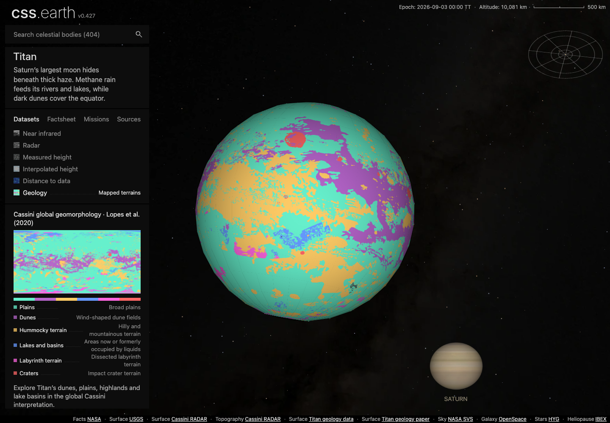
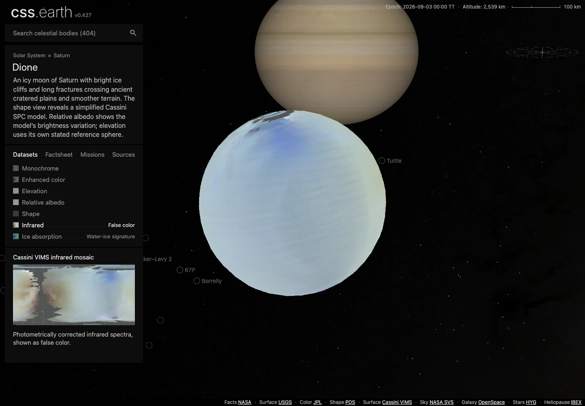
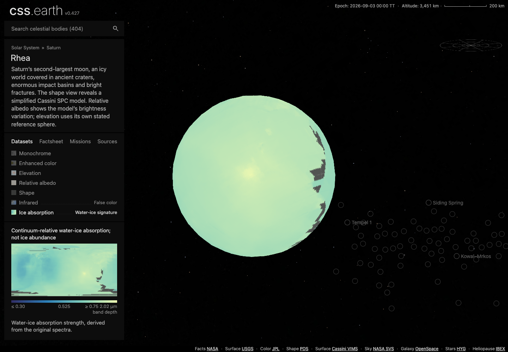

# B7 Cassini surface atlas — review and qualification

Five new views are implemented across Titan, Dione and Rhea. All 32 selected
view/lighting cases passed in real Chrome at DPR 1 and 2 after integrating main
`a5a34bdefa849801d092f10755cf81f6f3f23f5e` (404-object navigation and static
object transport). These are scientific surface maps on the existing scenes.

## Visual findings

| View | Review | Original frame |
| --- | --- | --- |
| Titan geology | Six categorical units, readable legend and consistent minimap; small unit boundaries remain discrete. Fine original detail below the display grid is not promised. | [Flood](evidence/integration/screenshots/titan-dpr1-geology-shadows-false-scene.png), [Shadows](evidence/integration/screenshots/titan-dpr1-geology-shadows-true-scene.png) |
| Dione infrared | Broad spectral color patterns and polar coverage gaps survive on the existing measured mesh. Coarse native data remain visibly coarse. | [Flood](evidence/integration/screenshots/dione-dpr1-infrared-shadows-false-scene.png), [Shadows](evidence/integration/screenshots/dione-dpr1-infrared-shadows-true-scene.png) |
| Dione ice absorption | Distinct scalar map, fixed dimensionless legend, missing cells retained; does not imply ice percentage. | [Flood](evidence/integration/screenshots/dione-dpr1-ice-absorption-shadows-false-scene.png), [Shadows](evidence/integration/screenshots/dione-dpr1-ice-absorption-shadows-true-scene.png) |
| Rhea infrared | Native gaps remain visible and agree with the minimap. No photographic gap filling or invented global coverage. | [Flood](evidence/integration/screenshots/rhea-dpr1-infrared-shadows-false-scene.png), [Shadows](evidence/integration/screenshots/rhea-dpr1-infrared-shadows-true-scene.png) |
| Rhea ice absorption | Different spectral bands yield broader valid coverage than RGB. The default framed hemisphere is mostly night under fixed-epoch Shadows. | [Flood](evidence/integration/screenshots/rhea-dpr1-ice-absorption-shadows-false-scene.png), [Shadows](evidence/integration/screenshots/rhea-dpr1-ice-absorption-shadows-true-scene.png) |

Manual review covered each new view in both lighting states and representative
DPR2 frames in the integrated capture set. The expanded navigation, legends,
coverage gaps and camera framing were inspected again after the main merge.
Minor mesh/antialias seams remain visible at high DPI; this batch
does not change the renderer or claim a new mesh-quality result. Source-pixel
registration uncertainty remains explicit in VIMS content. The
[source review](evidence/source/SOURCE-REVIEW.md) independently checks original
data and orientation; browser screenshots alone do not establish scientific truth.

## What the browser checks prove

[Browser index](evidence/integration/browser-index.json) and its six linked original reports
record Chrome version, viewport, runtime/source/image hashes, actual fetched
response hashes from `/objects/{id}/{sha256}.json` and captured stylesheets.
The 32 cases include the unchanged
baseline view and each new lens at DPR1/2 with both supported lighting states.
Real lens buttons select prepared data; real drags change camera pose without
replacing the runtime owner or retained nodes. Factsheet, Sources and Dataset
tabs are exercised. No runtime/network errors occurred in the final runs.

**Current main hides the Settings button.** The harness records this fact and
exercises motion/Shadows through the existing bound hidden inputs when needed.
This qualifies prepared lighting and bindings, **not public Settings access**.
No hidden control was made visible and no application code was changed. The
public lens controls work normally. Public Settings reachability remains an
upstream qualification blocker.

The original screenshot bytes are retained; no visual difference or native-frame
parity claim is made. The before/after source fingerprints must still match for
the evidence collector to accept a run. Final captures supersede the earlier
Dione/Rhea metadata-order captures. One earlier DPR2 Dione run was stopped at
29% system-wide free memory; its failure is retained in the check receipts.
Later isolated runs passed after memory availability recovered.

## Delivery and remaining gates

The exact image delta is **17 files / 1,873,728 bytes** across the three bodies.
All 153 inventory images (111,632,090 bytes) installed from remote storage into
an empty destination, with zero reuse; [delivery receipt](evidence/delivery.json).
Existing images, scene files, meshes and retained runtime trees remain fixed.
Canonical texture selection is independent of DPR. This byte count describes
new compressed images, not total mounted memory or a performance benchmark.

The selected source acquisition check downloaded all **64 original files** into
an empty destination and reproduced all five checked-in scientific TIFFs byte
for byte. Independent source review checked 140 VIMS anchors, 99 Titan polygon
locations and 512,000 radial texture-coordinate probes per mesh.

The [integrated qualification receipt](evidence/integration/qualification.json)
records successful package, renderer and preparation builds; all three selected
object packages; **zero shared runtime ownership violations**; 11 sampling/atlas
regressions; six selected transport regressions; and the complete 32-case browser
matrix. The ownership findings recorded on the earlier main baseline are
superseded by this passing audit. The main merge changed navigation references
and serialized transport; all 153 image inventory entries retain their exact
bytes ([proof](evidence/integration/images-unchanged.json)).

The [earlier qualification receipt](evidence/qualification.json), at main
`34da5b07`, retains 762 passing package tests, 15 passing scientific Python tests
and broader failed checks. Its preparation/body/router selection had 217 passes
and 11 missing-fixture failures outside this cohort. Renderer, platform and
shell aggregates also failed; its static build stopped at a missing Achilles
transport in this selected checkout. Those aggregate results are historical,
not current integrated passes. Full-repository build/test and all-object browser
conformance remain unqualified on the new integration. Main subsequently
received router fix `0e7af35c`; that later commit is outside these captures.

The PR remains draft until shared public Settings access and outstanding
repository-wide qualification are resolved. No full-registry or production
pass is inferred from this selected-body evidence. Initial integration failures
from incomplete sparse-checkout metadata/assets are retained separately; exact
Git bytes were restored before the final passing runs.

## B6 follow-up on current main

Merged B6 PR #76 was rechecked at main `34da5b07`. All four bodies and six new
scientific views pass the selected DPR1 render/interaction checks: **17
view/lighting cases**. [Reports and six original frames](evidence/b6-current-main/index.json)
retain the current shell, scientific pixels and source hashes. The earlier B6
integrated-rendering gap is closed for this DPR1 scope. The same hidden Settings
limitation applies; the old B6 DPR2 evidence has not been relabeled as a new
current-main capture.

B4 observation charts remain paused in draft PR #70.
