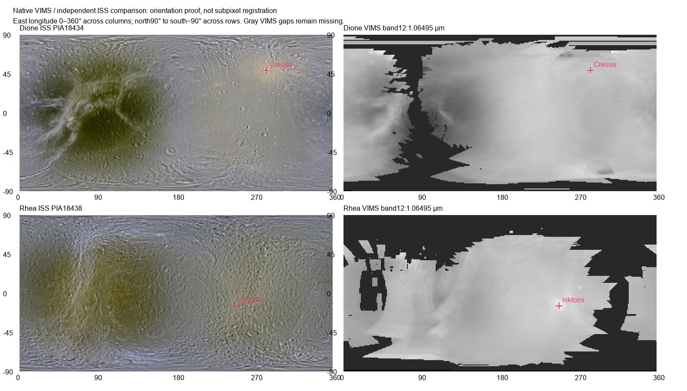

# B7 source review

The recorded checks qualify data transfer and orientation for Titan geology and
the Dione/Rhea infrared and water-ice absorption views. They do not establish
browser readiness or absolute registration finer than a VIMS source pixel.
Original JSON/image evidence was copied unchanged from the working evidence;
[evidence-copies.json](evidence-copies.json) records its paths, sizes and hashes.

| Evidence | Recorded result | Limit |
| --- | --- | --- |
| [Dione native anchors](dione-source-proof.json), [Rhea native anchors](rhea-source-proof.json) | 69 and 71 probes pass: original BSQ byte offsets, RGB quantization, continuum depth, missing/zero values, pole rows and canonical seam | Fixed probes; not an exhaustive cube audit or geodetic proof |
| [Display ranges](display-range-evidence.json) | Shared RGB ranges clip no complete valid native RGB pixel | Display choices do not calibrate abundance |
| [Titan original polygons](titan-source-proof.json) | 99 independent even-odd polygon probes pass, including seam and polar locations | Samples the six-layer release; does not establish every polygon boundary or validate the authors' geological interpretation |
| [Radial normalized UVs](radial-normalized-uv-proof.json) | 512,000 texel-center checks per body, zero normalized UV error | Address mathematics only; does not inspect encoded atlas pixels or rendered frames |
| [ISS comparison](registration-evidence.json) and [comparison image](registration-comparison.png) | Declared orientation matches best; Creusa and Inktomi support northern/southern row placement | Cross-instrument comparison supports orientation, not radiometric equality or subpixel alignment |



## Sources and interpretation

VIMS products come from the [PDS collection, DOI 10.17189/ctqe-ta30](https://doi.org/10.17189/ctqe-ta30),
with its [original preparation guide](https://dwjtvz5c9xobz.cloudfront.net/dione.rhea_cassini_vims_ir-mosaic_scipioni_2022/document/information_file.pdf).
The [full interpretation](../../VIMS-INTERPRETATION.md) records original XML/HDR
discrepancies, wavelength choices and the continuum formula. Native columns are
interpreted as one-degree east-longitude bins and rows as north-to-south bins;
registration within a source pixel remains uncertain. The archived photometric
correction is retained. Absorption strength is affected by mixtures, grain size
and remaining photometric effects; it is not an ice percentage.

Titan uses the authors' [global geomorphology release, version 2](https://doi.org/10.17632/f6jrtyfp66.2).
It is interpreted geological mapping, including areas beyond direct radar
coverage. Competing categories and unmapped cells remain withheld. Authoritative
input pins and conversion receipts remain in each body's source package.

Independent comparison maps are JPL's [Dione PIA18434](https://www.jpl.nasa.gov/images/pia18434-color-maps-of-dione-2014/)
and [Rhea PIA18438](https://www.jpl.nasa.gov/images/pia18438-color-maps-of-rhea-2014/);
[comparison-downloads.json](comparison-downloads.json) pins the original JPEGs.
USGS feature coordinates identify [Creusa](https://planetarynames.wr.usgs.gov/Feature/1331)
and [Inktomi](https://planetarynames.wr.usgs.gov/Feature/14671). Their published
west longitudes are converted explicitly to east longitudes. These ISS images
provide comparison evidence only; they never fill VIMS gaps.

Nearest preparation preserves selected source values without bilinear blending.
Radial atlases sample an intermediate 1024×512 map; its grid quantizes native
boundaries by up to about 0.176°. The UV check confirms that a 256×2000 atlas with
16-pixel tiles addresses the same retained faces as the original 2048×16000 CSS
background with 128-pixel tiles. It does not eliminate source uncertainty.

## Repeating the checks

Run these separately from the repository root after acquiring the pinned body
inputs and preparing their source TIFFs. They read existing inputs and write
only to `output/b7-source-review/`; they perform no downloads, atlas preparation
or browser work. Python requires NumPy, Rasterio, PyShp and Pillow 10.1 or newer.
Keep numerical library threads at one.

```sh
export OPENBLAS_NUM_THREADS=1 OMP_NUM_THREADS=1
python docs/moons/b7-cassini-atlas/evidence/source/verify-native-anchors.py
python docs/moons/b7-cassini-atlas/evidence/source/check-titan.py
python docs/moons/b7-cassini-atlas/evidence/source/registration-check.py
node docs/moons/b7-cassini-atlas/evidence/source/check-radial-uv.mjs
```

Python scripts accept `--repo-root` and `--output-dir`; the Node script accepts
those directories as its first and second positional arguments. Registration
reads only one 360×180 VIMS plane and uses reduced JPEG decoding for ISS. The
recorded comparison image used Arial; an optional `--font` selects a local
TrueType font. Font changes affect labels, not numerical results.

The portable scripts preserve the executed calculations while replacing working
directory paths. The radial producer was preserved from the executed inline
command. Packaging did not rerun these checks. The display-range JSON is a
recorded source-distribution summary; its original inline producer is not included.
