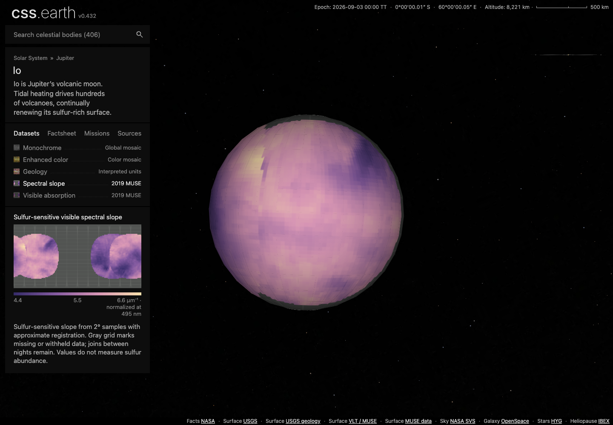
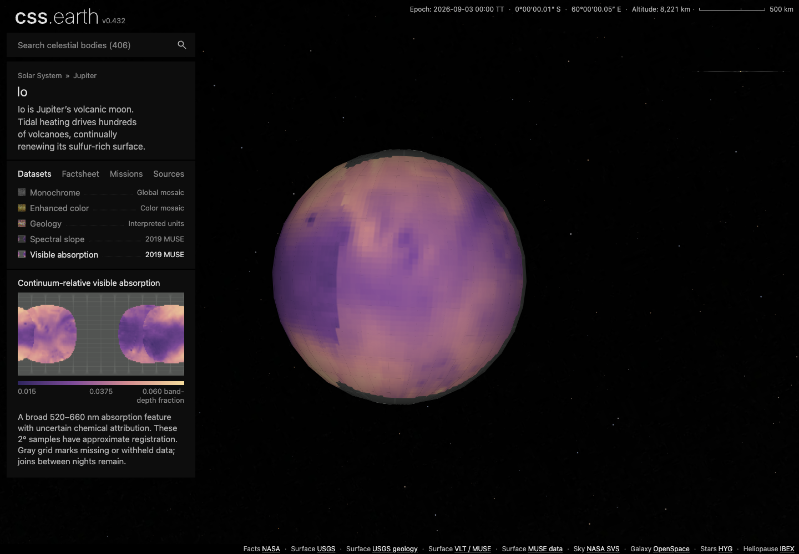
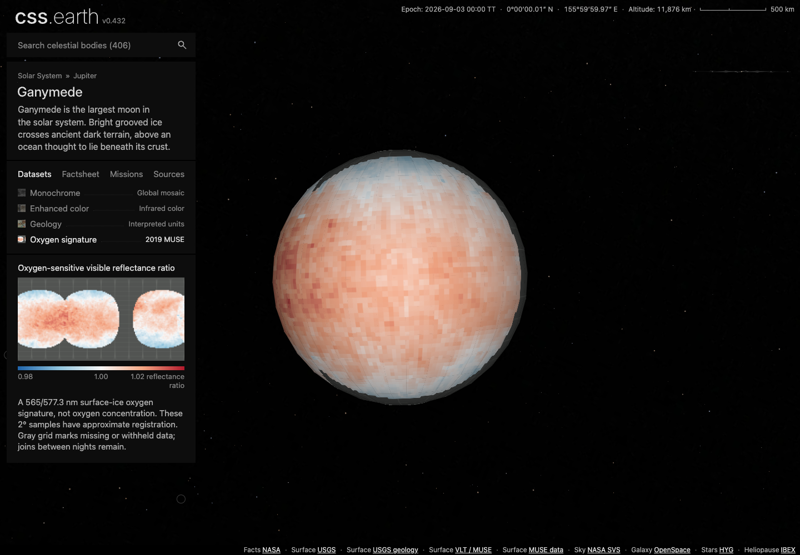
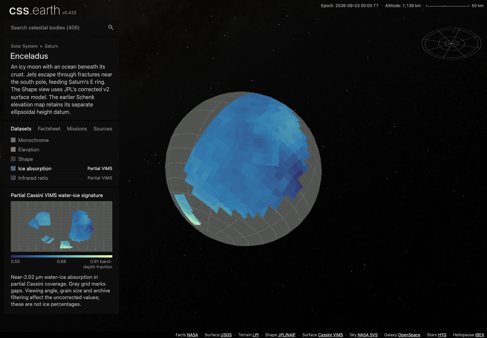
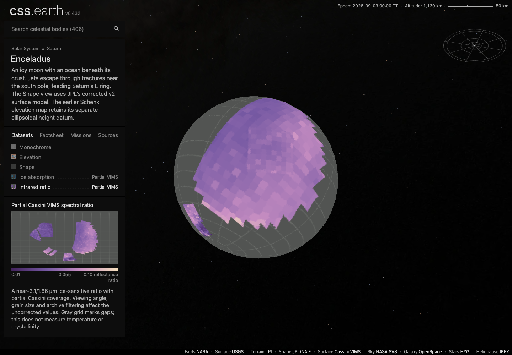

# B8 surface chemistry: visual evidence

Final captured implementation: `b0df1a8ef46ad93a5c4893140a58772a79a80a11`,
including main `1fb76e44d6bf831e7ebcf0516b83c0b10e1716da`. Six sequential Chrome
runs cover Io, Ganymede and Enceladus at DPR 1 and 2, at a 1440×1000 CSS viewport.
All 32 normal/new-view × lighting cases pass their machine checks. The five new
views account for 20 of those cases. These are actual Astro development-server
captures, with exact response bytes verified against the prepared object and
image pins; they are not a production-deployment claim.

The [browser index](evidence/browser-index.json) links unchanged report bytes,
screenshots and consumed styles. Identical screenshot bytes are retained once;
the index maps every original artifact path to its review copy. Reports retain
`CAPTURED_UNREVIEWED` as their original capture-time status. Independent visual
acceptance and its limits are recorded separately in the qualification report.
The final evidence-only commit changes Git-count branding, not the captured
body definitions, images or renderer. Earlier captures without visible caveats
are superseded and are not the evidence retained here.

## Io: two measured visible observables

[Original slope arrays and coverage](evidence/sources/muse/io-spectral-slope-source-panel.png) ·
[Original absorption arrays and coverage](evidence/sources/muse/io-visible-absorption-source-panel.png)

The retained night joins, coarse samples and withheld edges are visible. Gray
missing coverage remains distinct from measured dark-purple values. The cards
state 2° sampling, approximate registration and missing/withheld data; neither
view claims chemical abundance. The absorption legend is explicitly a band-depth
fraction. The source panels independently plot each original night and the
first-valid-night combination; visual agreement is qualitative because the
browser sphere and diagnostic source grid have different projections.

## Ganymede: an oxygen-sensitive reflectance ratio

[Original numerical arrays and coverage](evidence/sources/muse/ganymede-oxygen-signature-source-panel.png)

The coarse blue–white–red field, observation joins and uncovered regions remain
visible. The card separates the 565/577.3 nm wavelengths from the compact
reflectance-ratio legend and explicitly rejects an oxygen-concentration
interpretation. Two degrees is source sampling, not an astrometric accuracy
bound. The pinned source audit corroborates orientation; absolute subpixel
registration remains unresolved.

## Enceladus: partial Cassini spectral footprints

[Archive-native spectral panels](evidence/sources/native-spectral-panels.png) ·
[Projected numerical support](evidence/sources/projected-spectral-panels.png)

These maps retain partial supported footprints rather than filling a globe.
The gray grid is unsupported coverage. Independent source calculations verify
94,916 displayed values per field and 192 source-cell containment probes per
field. The source panels use a shared diagnostic palette; the browser uses each
view's authored palette, so RGB similarity is not the comparison criterion.
The cards expose wavelength, partial coverage, viewing-angle/grain-size/archive
filtering effects and uncorrected values. Neither map claims an ice percentage,
temperature or crystallinity measurement. Source-cell checks do not establish
absolute spacecraft pointing or measured detector footprints.

## Interaction and boundaries

Every capture uses real dataset buttons, prepared entry flights, bound minimaps,
legends, factsheet/source tabs and real pointer input. Both lighting states load
the same canonical DPR-independent dataset. The reports prove fetched byte
identity, painted retained leaves, stable scene ownership and unchanged node
identity through drag and zoom. Every capture context and browser closes.

The shared Settings button is hidden on this base. Lighting tests use its
existing hidden input binding, which proves the prepared shadow states but does
not prove public Settings reachability. Dataset controls are exercised normally.
Separate repository-owned DOM/mobile/selection checks and their exact outcomes
appear in the qualification report.

There is no native-renderer pixel-parity, subpixel astrometry, compositor-FPS or
whole-repository release-readiness claim. Coarse source grids, observation seams,
existing mesh edges, restricted coverage and the scientific limits above remain
part of the delivered representation. See [qualification](QUALIFICATION.md) for
the aggregate gaps and [reproduction](README.md) for executable steps.
