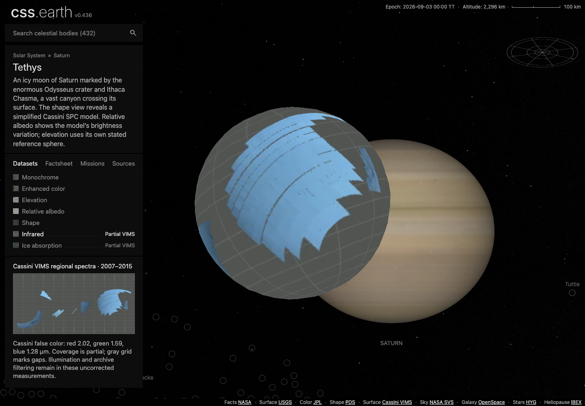
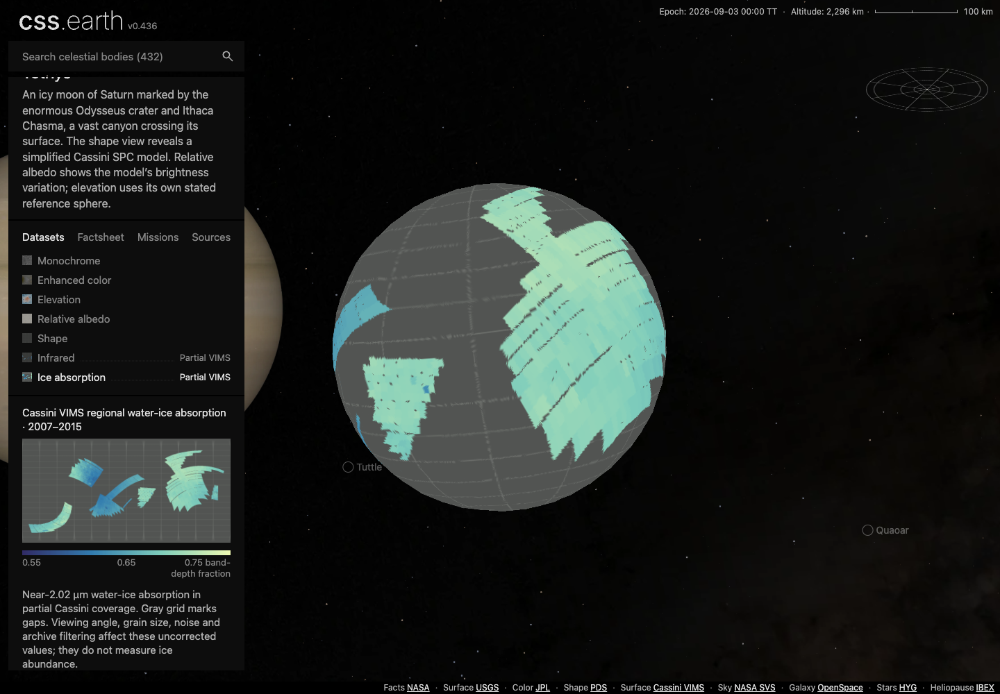
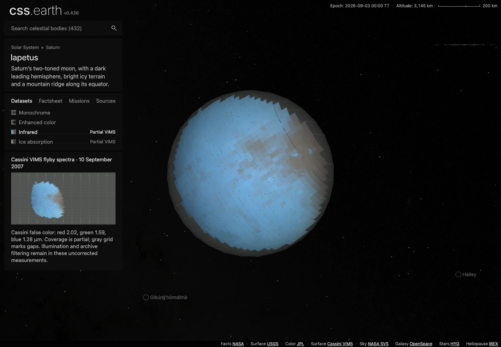
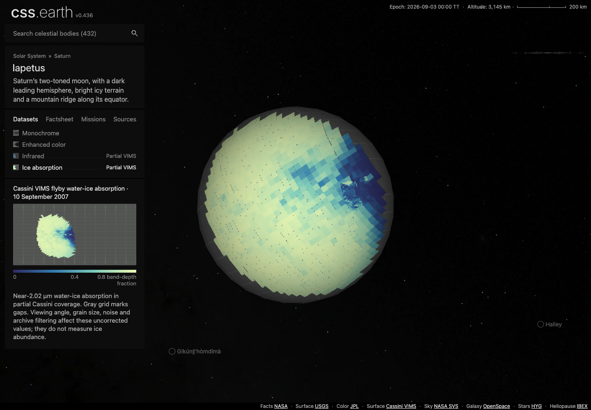
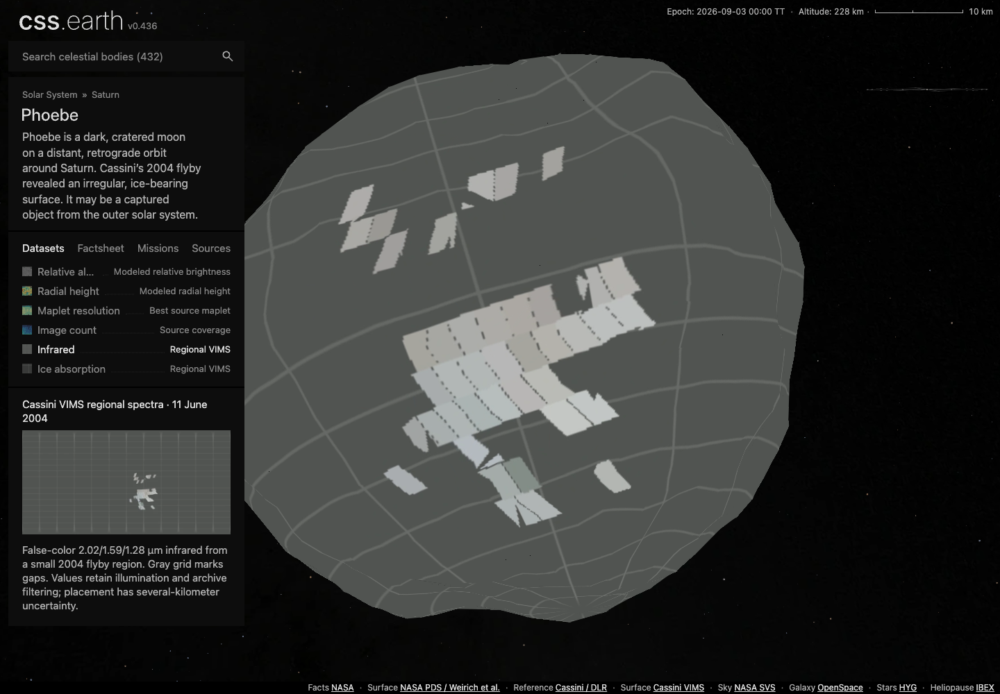
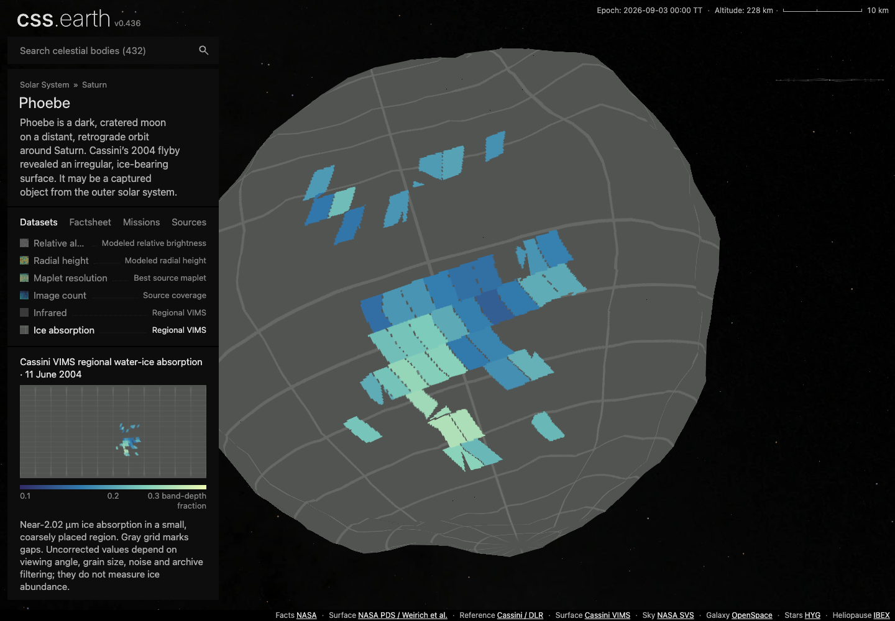

# Cassini surfaces: final visual review

**Accepted on integrated main `80e19c51349f713c9a9a64b8ef1cbb78917f0fc7`.**
All six new views were inspected in actual Chrome at DPR 1 and 2, with both
lighting states and retained drag. Normal views were checked alongside them:
36 view/lighting cases in 18 isolated browser runs. All captured source/asset
pins match the delivered package; the [evidence index](evidence/browser-index.json)
preserves original reports and exact image/style hashes.

These are original unedited DPR1 captures of the new surfaces with Shadows off.
The thumbnails, legends and explanatory text are the actual shared application.

| Body | Infrared | Ice absorption |
| --- | --- | --- |
| Tethys |  |  |
| Iapetus |  |  |
| Phoebe |  |  |

Full acceptance and final report hashes: [Tethys](VISUAL-REVIEW-TETHYS.md),
[Iapetus](VISUAL-REVIEW-IAPETUS.md), [Phoebe](VISUAL-REVIEW-PHOEBE.md).
[Scientific input maps](source-review/source-maps.png) are separate numerical
source diagnostics, not browser or native-renderer screenshots.

No blocking visual defect was found. Gray regions retain missing coverage;
Phoebe deliberately shows only its small qualified region. Existing mesh facets
and fixed directional lighting remain visible, and the photographic WebP path
softens some infrared boundaries. These images do not prove precise absolute
registration, ice abundance, compositor frame rate or whole-site readiness.
The [qualification record](QUALIFICATION.md) details those limits and aggregate
checks. The original machine reports keep their `CAPTURED_UNREVIEWED` status;
these review documents provide the subsequent visual decision.
