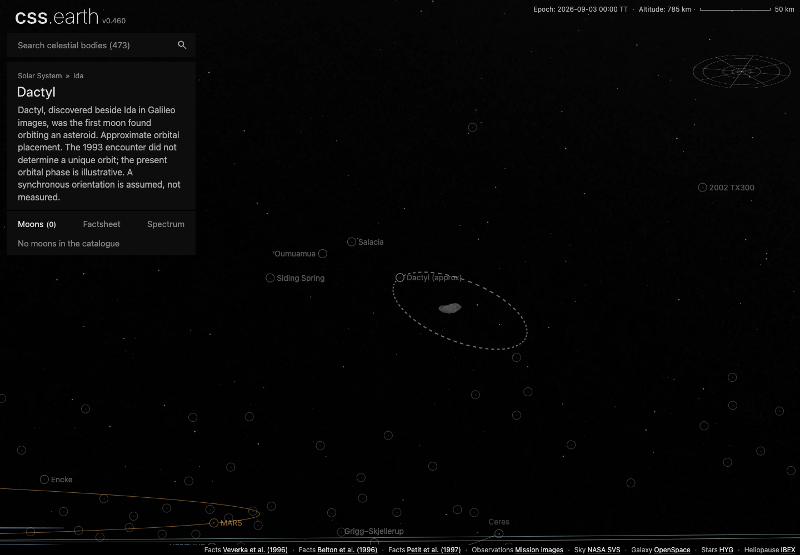
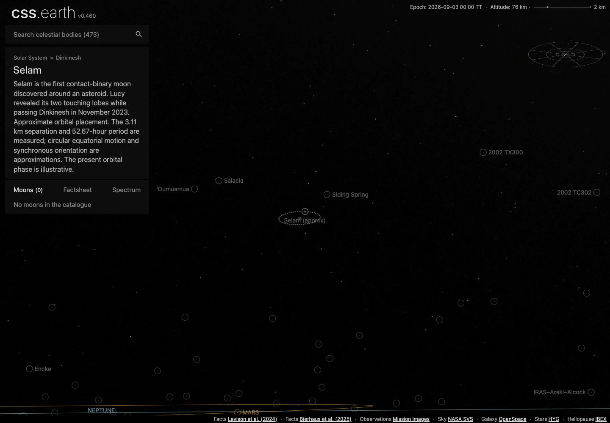
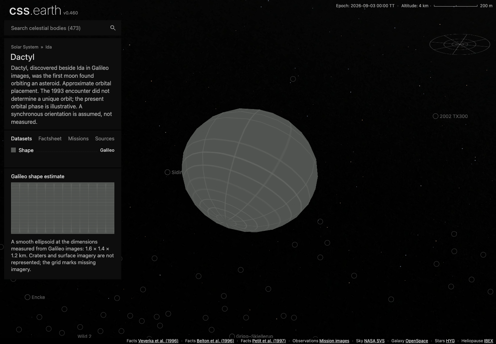
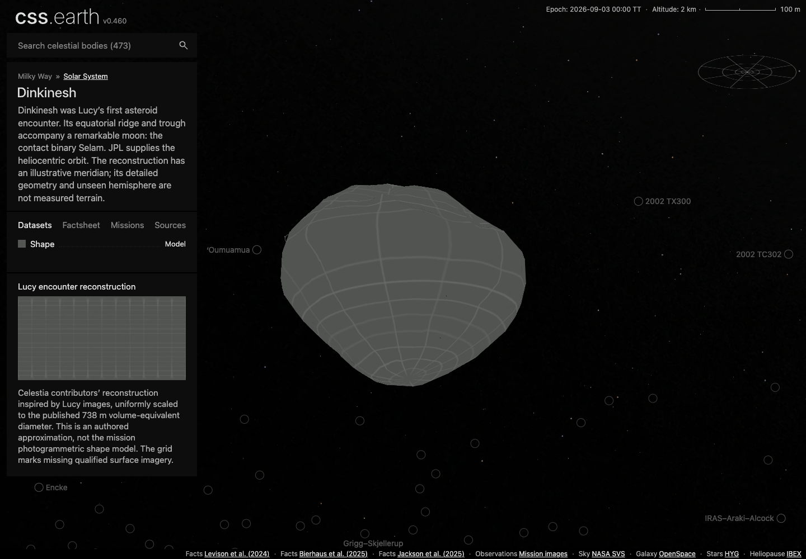
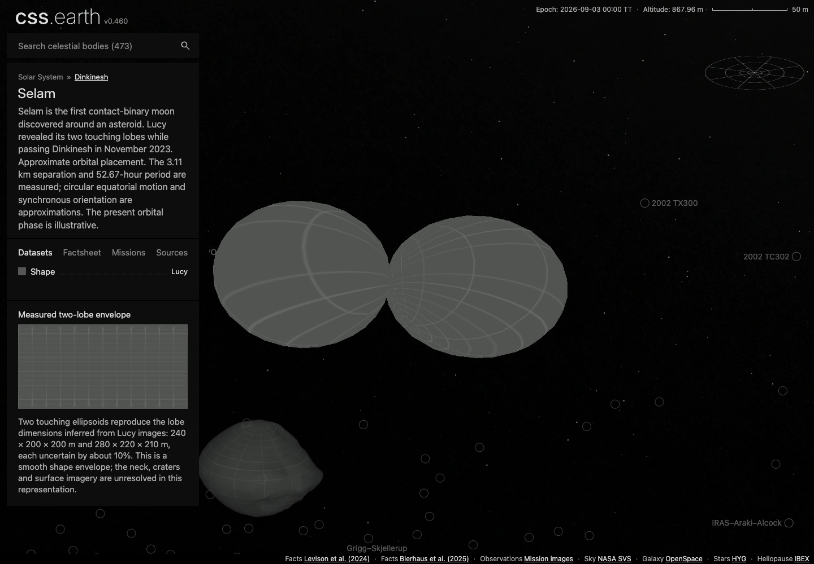

# Dactyl, Dinkinesh and Selam

Three additional destinations use the existing object adapter, shared camera and retained PolyCSS renderer. Dactyl belongs to Ida; Selam belongs to Dinkinesh. Each is independently selectable, with one detailed object scene mounted at a time.

| Body | Displayed shape | Canonical triangles | Selector |
| --- | --- | ---: | --- |
| Dactyl | Smooth 1.6 × 1.4 × 1.2 km envelope from Galileo measurements | 512 | Shape · Galileo |
| Dinkinesh | Attributed Celestia reconstruction, scaled uniformly to the published 738 m volume-equivalent diameter | 1,200 | Shape · Model |
| Selam | Two touching ellipsoids at Lucy’s published lobe dimensions | 1,024 | Shape · Lucy |

The gray grid identifies missing qualified surface imagery. Dactyl’s craters, Selam’s neck and the unseen terrain are not reconstructed from photographs. Dinkinesh’s contributed model is an authored approximation, not the mission photogrammetric model. Shadows use the shared lighting capability and the documented display orientations.

[Dactyl sources and limits](../../../src/planets/dactyl/README.md) · [Dinkinesh sources and limits](../../../src/planets/dinkinesh/README.md) · [Selam sources and limits](../../../src/planets/selam/README.md) · [Reproduction](../../../tools/objects/source-authoring/galileo-lucy/README.md)

## Approximate orbits

Dactyl and Selam have illustrative phases at the shared 3 September 2026 TT scene epoch. Their source records separate published dimensions, separation and period from assumed plane, periapsis and phase. Dashed paths, circular selected indicators and visible “(approx)” labels carry that distinction into the universe view. These marks do not describe an uncertainty region or confidence interval.

The dashed strokes alternate paint on existing retained orbit segments. Geometry, picking corridors, node counts and the shared camera remain unchanged. The browser check verifies the actual transparent gaps and circular indicators after projection.

## Inspected views

Chrome 152.0.7977.84, production-page captures at DPR 1 from commit `ddb4c6cca`, after merging main’s six new distant worlds (`16774548b`) and applying the requested “(approx)” wording (`97c30ed44`). Full browser conformance also covers mobile input and DPR 2. The final documentation commit changes review records and reproduction instructions only.

Directional lighting was also inspected for [Dactyl](images/dactyl-shadows-true.png), [Dinkinesh](images/dinkinesh-shadows-true.png) and [Selam](images/selam-shadows-true.png).

## Evidence

- [Dactyl conformance](evidence/dactyl-conformance.json), [Dinkinesh conformance](evidence/dinkinesh-conformance.json), [Selam conformance](evidence/selam-conformance.json): desktop/mobile input, surface picking, wheel and pinch zoom, shadows, lifecycle, retained identity and DPR 1/2. All cases passed.
- [Production visual and navigation receipt](evidence/production-review.json): both lighting states, dashed paths, circular selected indicators and successful Dactyl → Ida / Selam → Dinkinesh navigation with one mounted scene.
- [Transport refresh](evidence/transports.json): all 473 registered packages use the combined marker atlas; all non-marker runtime fields remain unchanged. [Orbit preservation](evidence/merge-orbit-preservation.json) separately proves that all 327 existing asteroid element records and independent vector fixtures are unchanged.
- [Navigation pixels](evidence/navigation.json): existing decoded visible marker pixels preserved exactly at both densities against the current-main atlas; only the three new recipes are rendered.
- [Delivery receipt](evidence/delivery.json): 93 published assets, 21,219,882 bytes. A fresh download of every file passed byte-count and SHA-256 verification.
- [Dinkinesh orbit comparison](evidence/orbit-errors.json): independent Horizons vectors agree at the fitted epoch within 0.001 km. The measured ±30-day endpoint errors are about 991.49 and 902.83 km; the display conic is not a long-term ephemeris.

Source measurements, native CMOD, conversion receipt, generated OBJ, orbit parameters, original Horizons responses and reuse terms are retained in the body packages. The numerical and closure checks validate those inputs separately from the browser presentation. These screenshots do not establish photographic registration or native mission-model parity.

## Integrated validation

The [final checks](evidence/checks.json) passed after incorporating main: 684 astronomy tests, 532 universe-preparation tests, 559 selected shared shell/router/navigation checks, focused source and closure tests, package/platform/tools/shell/Astro typechecks, the complete static site build and asset assembly for Dactyl, Dinkinesh, Selam, Ida and the Sun. Other bodies’ remote runtime imagery was not downloaded or assembled locally.

The [earlier checks](evidence/checks-before-main-update.json) also passed all 440 shared renderer tests and the remaining strict ownership/preparation/browser-owner checks. Full browser conformance and its six videos were captured at `514f6b497`: [Dactyl DPR 1](evidence/dactyl-dpr-1.webm) / [DPR 2](evidence/dactyl-dpr-2.webm), [Dinkinesh DPR 1](evidence/dinkinesh-dpr-1.webm) / [DPR 2](evidence/dinkinesh-dpr-2.webm), [Selam DPR 1](evidence/selam-dpr-1.webm) / [DPR 2](evidence/selam-dpr-2.webm). These checks remain applicable because the body geometry, three surface asset banks and core input/lifecycle code remain unchanged, while the production review above repeats the affected navigation, orbit cues and both lighting states against the merged catalog. The videos total about 13 MB and retain the input sequences underlying the conformance reports.

The final wording change also passed all 88 world-context renderer tests. [Its build receipt](evidence/label-build.json) records a fresh renderer build, complete static-site build and the same five asset-assembly checks. The [browser review](../../../tests/objects/browser/galileo-lucy.mjs) uses actual wheel input and visible parent links, including production readiness and nonzero label opacity; it does not depend on developer diagnostic globals.
