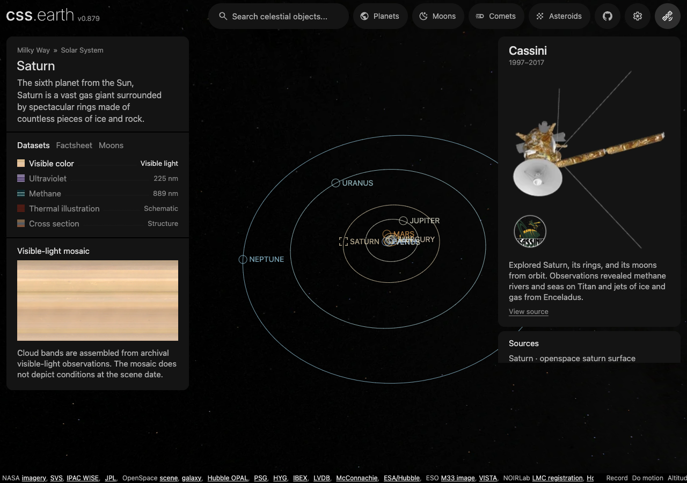

# Native scroll zoom experiment

This experiment uses the existing prepared body scene, shell and styles. A hidden
vertical scroll surface drives its physical camera distance through a CSS scroll
timeline. Scrolling out exposes the shared prepared solar orbits and planet
markers; their ordinary links navigate to another object's single scene. The sky
uses the shared Milky Way cube assets and sky constructor.

It is an opt-in local experiment for the progressive enhancement PR. The normal
site does not start this proxy. Browser scripts are blocked by its response CSP,
so the experiment proves the native interaction independently of client startup.



This Chromium capture shows the surrounding sky and native planet links. It also
shows the unresolved inner-planet label overlap. The local shell includes ongoing
native-control work; only the scroll experiment and its camera prerequisites are
in the zoom commit.

## Run it

Use a checkout whose packages, renderer, generated shell modules and prepared
assets are already available. Follow [CONTRIBUTING](../CONTRIBUTING.md) for setup.
From the repository root, start the existing site and then the experiment:

```sh
pnpm exec astro dev --host 127.0.0.1 --port 4349
pnpm preview:native-scroll
```

Open <http://127.0.0.1:4350/saturn/>. Scroll over the scene to move from body detail
to the solar system. Click Neptune, or focus the scroll surface and use Tab and
Enter to follow its link. Back restores the scroll position when the browser
retains the document. The mobile information panel keeps its own scrolling.

The preview accepts an upstream localhost URL and listening port:

```sh
pnpm preview:native-scroll http://127.0.0.1:4210 4350
```

The launcher bundles its TypeScript into ignored `output/native-scroll/`. It does
not generate body geometry, textures or source data.

## How the same scene moves

The scroll surface has 4,000 CSS pixels of travel. `scroll-initial-target` places
its initial marker at 400 pixels, leaving room to move closer. A registered
numeric CSS property receives logarithmic distance from the scroll timeline;
`exp()` converts it back to physical distance. An independent `translate` on the
existing scene applies the camera dolly without replacing its prepared transform.

The preview publishes the initial physical camera using the shared frame and
material publishers. Saturn starts at a captured demonstration pose; other
arrivals use the shared silhouette fit and each package's prepared orientation.
No new registry or device-specific geometry is introduced.

The context uses the Sun package's prepared world positions and classification
membership, the shared navigation marker presentation, and the existing orbit
bar constructor. CSS projects those fixed positions and orbit chords as distance
changes. Each visible marker has a 44-pixel native link target. CSS timeline
boundaries keep offscreen links out of keyboard navigation.

The sky uses the existing Milky Way descriptor, authenticated volume loader and
prepared near cube. Its camera shares the distance change, at the prepared sky's
parallax scale. There is still exactly one body scene; the surrounding planet
markers are navigation targets.

The platform mechanisms are defined in the CSS specifications for
[scroll timelines](https://drafts.csswg.org/scroll-animations-1/),
[initial scroll targets](https://drafts.csswg.org/css-overflow-5/#scroll-initial-target),
and [exponential functions](https://drafts.csswg.org/css-values-4/#exponent-funcs).
The native path depends on browser support for these features; its local
validation currently covers Chromium desktop and touch emulation.

## Verify interaction

With both servers running:

```sh
pnpm typecheck:renderer
pnpm --filter @cssearth/engine exec tsc -p ../../tools/experiments/native-scroll/tsconfig.json
`pnpm test:shell` (the browser suites were retired; the shell invariants they asserted are checked from the built HTML in `site/test/rendered-page.test.mts`, and scene retention in `site/test/scene-session.test.mts`)
```

The browser checks disable JavaScript, verify the initial centred body, wheel and
touch zoom, the sky, a single scene, native Neptune navigation, Back restoration,
keyboard navigation and independent mobile panel scrolling. They save screenshots,
a desktop video and measurements under `output/playwright/native-scroll/`.
On macOS, `CSSEARTH_CHROME_LOG_STDIO=1` enables the existing browser harness's
Chrome process cleanup workaround.

## Work before integration

- JS must adopt the native camera distance without jumping or replacing the
  scene. The experiment intentionally does not test that handoff yet.
- Inner planet labels overlap, especially on phones. The live collision policy
  is not implemented by this CSS projection.
- Orbit chords hide when either endpoint is behind the camera; this is not exact
  near-plane clipping. All orbit paint uses one depth band behind the selected
  body's detail, rather than the live depth planner.
- Material, facing and silhouette publication is fixed at the initial camera
  distance. Close-up edge alignment and dynamic level-of-detail transitions still
  need work.
- The demonstration only exposes the Sun and prepared planet classification.
  Other context capabilities, orientations and saved views need their own checks.
- Browser support, keyboard access to zoom on every target platform, real mobile
  devices, production packaging and Netlify deployment remain unverified. The
  experiment's scripts-blocked proxy is not the site's deployment architecture.
