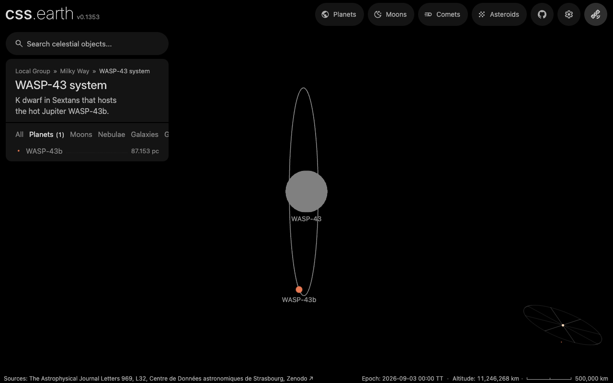

# Navigation identity and evidence

`OBJECTS` is the application inventory of navigable subjects. It combines
registered body packages with subjects from the prepared galaxy, cluster and
nebula catalogues. Search, aliases and classification tabs use this inventory.

| Concept | Meaning and owner |
| --- | --- |
| Scene destination | A body package with a route, prepared world frame and scene loader. |
| Prepared-focus destination | A catalogue subject selected on the existing scene’s shared camera. Its canonical URL records a host scene and `focus` identity. |
| Rendering resource | A volume, image bank, point field or other prepared content. A resource descriptor alone does not publish a destination. |
| Dataset view | A selectable `(objectId, lensId)` presentation, which may combine several products and published sources. |
| Published source | A scientific work, release or product identified in the source catalogue; a local file hash identifies retained bytes separately. |

`SCENE_OBJECTS` filters `OBJECTS` by scene capability. Routes, body preparation
and scene conformance use this filter because a prepared focus does not own
another scene. `requireObject` resolves either destination kind;
`requireSceneObject` rejects a focus when a caller needs a scene loader.

The local-group catalogue’s `m_031` is the Andromeda destination. `m31` names
its image resource through `detailedObjectId`; it does not create a second
navigable Andromeda. Non-navigable context resources remain outside `OBJECTS`.
Adding a classification does not add a renderer, shell or camera owner.

`sceneHostId` identifies the scene displaying a prepared focus. A galaxy's
`hostId` identifies its physical host. Referenced hosts excluded from positional
selection remain in the catalogue's `unpositionedHosts`, with a source reference
and exclusion reason. They acquire no position or destination. The reader rejects
missing hosts, duplicate identities and cycles, including self-hosting.

## Planetary systems

A planetary system is a star and every prepared body whose orbit chain leads
back to it. The Solar System is the Sun's; WASP-43 and its planet WASP-43b form
another. [`object-systems.mts`](../site/object-systems.mts) derives systems from
the prepared world context and the registry, so no list names them. Every
member shares its star's `systemName`, and the derivation fails otherwise. A
star without orbiting bodies, such as Betelgeuse, belongs to no system.

Inside a stellar system, every nonstellar host with prepared satellite children
has a [satellite-system selection](satellite-system-navigation.md). Its
`?view=satellites` URL and `satellite-system:<host-id>` identity name the family;
the plain host and satellite routes name individual bodies. The family uses the
host's mounted scene and the same world camera.

Each system has the same overview, `?overview=system` on its star's route:

- Zooming out of a member past the system's exit distance opens that system's
  overview, never another's. The Sun's exit is 100 AU; other systems scale it
  by their prepared framing radius, so WASP-43's is 0.05 AU.
- Approaching the star opens its card once its disc is 48 px wide and the zoom
  has passed halfway from the system framing to the close-up.
- Orbit lines, markers and labels fade with the camera's distance from their
  own star.
- Breadcrumbs, the overview card, its results and the Milky Way's Systems list
  name the object's own system. The Milky Way, Local Group and Nearby Universe
  are measured from the Sun and stay on its route.

A star or body outside every system keeps its scene until the camera is as far
from it as the Sun is, then hands off to the galactic scopes.

## Distances

The navigation preparer publishes the displayed value, its unit and a common
metre value for sorting together. Runtime only presents and sorts those values.

* Body distances are geometric distances from the Sun, calculated from the
  prepared world position at the frame’s stated Julian date in TT.
* Galaxy and nebula distances retain the adopted catalogue measurements. Their
  measurement epochs are source-specific; the shared navigation epoch is not
  presented as the epoch of those measurements.
* Cluster distances are labelled as redshift-derived **comoving** distances.
  Sorting their numeric values with nearby distances is a navigation convenience,
  not a claim that the scientific quantities are interchangeable.

Catalogue readers check the prepared Cartesian position against the adopted
right ascension, declination and distance in `sun-icrf`. The relative component
tolerance is `1e-10`, allowing the producer's 12-significant-digit rounding.
This checks derivation consistency, not independent scientific accuracy.

A distance describes its row's subject unless `distance.subject` identifies a
different measured subject, its relationship and the adoption reason. M45 records
the Pleiades stellar cluster as the measured subject; navigation carries that
qualification into the distance description. It does not label the cluster's
uncertainty as a measurement of each dust filament.

The legacy descriptor field `catalog.distanceAu` mixed orbital references,
nominal spacing and positions. It is no longer published in an application
object or used by search. Existing nominal Sun-sprite preparation still reads
its authored reference; orbital elements remain in their source-owned recipes.

## Citations and observation attribution

Galaxy references retain the author’s bibliography key. Preparation resolves
that key using the pinned LVDB bibliography, or an explicitly bound separate
source such as the SMC distance paper. The resulting paper link is a citation
transcribed from the retained source, not a claim that the linked paper’s bytes
have the bibliography file’s hash. Unresolved distance, sky-position,
half-light-radius or membership references fail catalogue validation.

Each retained galaxy or cluster bibliography entry also names a canonical
`catalogueId` in `src/sources/`. Spatial measurement citations join the shared
Sources usage graph, keyed by object and quantity; missing or conflicting
bibliography bindings fail preparation. These edges create no dataset view.

Prepared provenance products declare `observationAttribution` as `source-lineage`
or `none`. The former permits a view to credit capture information on its
underlying sources. It does not classify the output as a direct observation or
qualify its physical reconstruction. Illustrative products select `none`;
processing labels and descriptive interpretation text do not drive this
decision. Parent products excluded from observation attribution cannot supply
capture credit to a derived preview. Ordinary source lineage remains intact.
Older documents remain readable, but the contribution compiler rejects products
without an explicit decision and requires regeneration.

Dataset-view lists count selectable presentations, not papers, archive products
or independent observations. The source and product graphs retain those separate
identities. See [object provenance](object-provenance.md) for their lineage.

## Checks

`site/test/navigation-ontology.test.mts` compares every prepared spatial subject
with the registry and search, checks every body distance against its prepared
frame, and resolves the actual galaxy references. The bibliography tests reject
conflicting keys and invalid locators. Contribution tests distinguish view
counts from product counts and reject undeclared observation attribution.

`pnpm test:node` checks the router with injected scene and world-context
owners. Its test preload rejects accidental use of application boot; it does
not prove the Vite-generated context inventory or browser startup.

Scene conformance remains derived from the scene capability filter. Run
`pnpm test:node` (the browser suites were retired; the shell invariants they asserted are checked from the built HTML in `site/test/rendered-page.test.mts`, and scene retention in `site/test/scene-session.test.mts`) to check prepared-focus search, selection, saved links and retained
camera ownership. These checks do not establish the scientific accuracy of a
catalogue measurement or a reconstructed volume.
