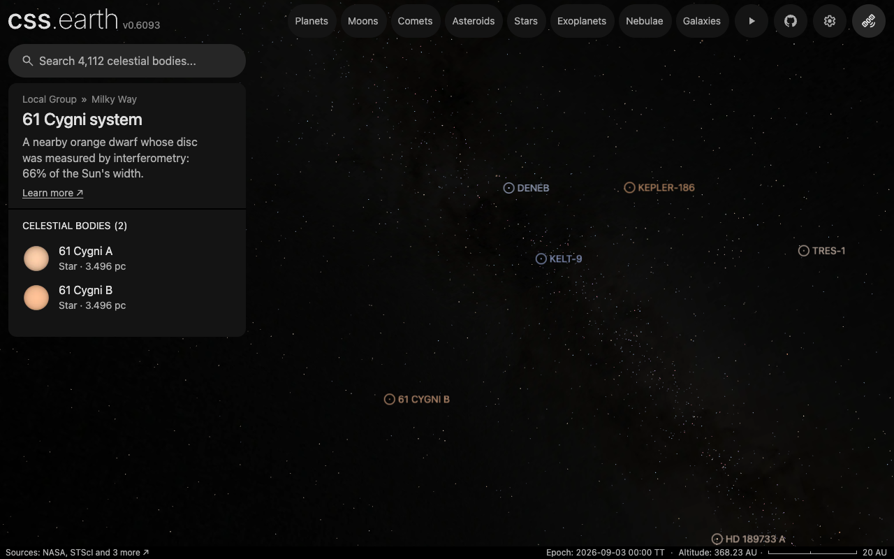

# Navigation identity and evidence

`OBJECTS` is the application inventory of navigable subjects: every object package with a catalogue entry. Search,
aliases and classification tabs use this inventory.

| Concept | Meaning and owner |
| --- | --- |
| Object | A package with a catalogue entry: a route, a prepared world frame and a scene loader. A planet, a star, a system, a galaxy, a nebula and a cluster of galaxies are all this. `?dataset=` selects one of its datasets. |
| Parent | The one object an object is inside (`parent` in its object.json). The Observable Universe is the root, with none. The registry refuses a missing parent, an unknown parent or a loop ([object-tree.ts](../packages/objects/src/registry/object-tree.ts)). |
| Zoom facts | An object seen from inside (the Milky Way, the Local Group, the Nearby and the Observable Universe) authors when the camera's view hands over to it and how its page frames the camera (`properties.zoom`). Its scene has no body and is seen from inside, centred on the star the zoom came from (the Sun on a page opened cold). |
| Rendering resource | A volume, image bank, point field or other prepared content, attached to the object it draws for (`properties.host`). A resource descriptor alone does not publish a destination. |
| Dataset view | A selectable `(objectId, datasetId)` presentation, which may combine several products and published sources. |
| Published source | A scientific work, release or product identified in the source catalogue; a local file hash identifies retained bytes separately. |

Every page is `/<id>/`, one URL system for every object:
[`navigation-scope.mts`](../site/navigation/navigation-scope.mts) reads and
writes them. Every object has a scene of its own, and its page mounts it, except a
system, whose page mounts its host's scene seen out to its members. The page of an
object seen from inside, opened cold, mounts the world host, the Sun, at that zoom.
Its page carries none of the scene's own selections (`dataset`, `feature`), so a
cold open never reads them as the host's.

`OBJECTS` has one entry shape and no kinds. Each entry is built from its package's
own descriptor: a catalogue block, a parent, a world frame and a scene. A galaxy, a
nebula and a cluster of galaxies are objects like any body; their recipe declares no
surface, and their imagery is a context bank a dataset names. The selection is one
object id, and a search row is one object's. The object tree is the only structure:
breadcrumbs are an object's ancestors, the card of an object seen from inside lists
its children, and zooming out of a star's system hands the view to the objects the
star is inside that are seen from inside, nearest first, with the camera kept where
it is; zooming back in returns to the star.

One object has one id. The spatial catalogues (Local Group galaxies, galaxy
clusters, the nearby field) are data the world draws as dots: a row makes no page
and no registry entry, and nothing in the application reads a row for an object's
identity, position or facts. Non-navigable context resources remain outside
`OBJECTS`.
Adding a classification does not add a renderer, shell or camera owner.

A catalogue galaxy's
`hostId` identifies its physical host. Referenced hosts excluded from positional
selection remain in the catalogue's `unpositionedHosts`, with a source reference
and exclusion reason. They acquire no position or destination. The reader rejects
missing hosts, duplicate identities and cycles, including self-hosting.

## Planetary systems

A planetary system is a star and every prepared body inside its system in the
object tree, at any depth. The Solar System is the Sun's; WASP-43 and its planet
WASP-43b form another. Each world row says which object its body is inside: the
object whose file the row arrives in.
[`planetary-system-members.mts`](../site/planetary-system-members.mts) reads each
system's members from that, and
[`object-systems.mts`](../site/object-systems.mts) joins them with the registry,
so no list names the systems and nothing walks orbits or bonds to find them. The
moon systems ([`satellite-systems.mts`](../site/satellite-systems.mts)) and the
set of bodies a selected star opens are read the same way. A star without orbiting bodies, such as Betelgeuse, belongs to no
system. A system is named by its star's system name (the TRAPPIST-1 system, the
Galactic Centre).

A system's classification says what it holds. A star with a planet is a
`planetary-system`. A star with only stars inside its system is a `star-system`:
a companion with an orbit (Sirius B, the S stars of Sgr A*), or one its record
says is bound with no orbit adopted (`star.boundTo` in the astronomy record, with
its source in `sources.binary`: 61 Cygni B, Alpha Centauri B and Proxima). A star
nothing orbits is framed out to the stars bound to it, and the camera aims at the
nearest pair's centre of mass once it is farther out than their separation. A
planet's or small body's moons are a `satellite-system`.
[`system-packages.mts`](../site/build/prepare/system-packages.mts) writes every
system's package, and puts a bound star inside its host's system.

Inside a stellar system, every nonstellar host with prepared satellite children
has a [satellite-system view](satellite-system-navigation.md). Its
`/<host>-system/` address and `object:<host-id>-system` identity name the family;
the plain host and satellite routes name individual bodies. The family uses the
host's mounted scene and the same world camera.

There is one selection: an object, by its id (`site/scene/scene-subject.mts`, `{ objectId }`). A
system is an object of its own, the host's system (`/jupiter-system/`, `/trappist-1-system/`,
`/solar-system/`), whose page mounts the host's scene; how far out that scene is seen (`body`, or
`system` for a host out to what is inside its system) is read from the selected object. Both show
the same card, the host's: the system's header, tabs and list are parts of it
([`SystemCard.astro`](../site/components/SystemCard.astro)), mounted while the system is the view.
A star's planets, a star's companion stars and a planet's moons are one card, read from the
system's object and the objects inside it ([`system-card.mts`](../site/system-card.mts)). An address names a
system by the registry's id rule alone, and whether it is a star's system or a planet's moons is
what its host is ([`scene-subject.mts`](../site/scene/scene-subject.mts)): no table of systems is asked.

Each system has the same overview, its own object's route (`/<star>-system/`):

- Zooming out of a member past the system's exit distance opens that system's
  overview, never another's. The Sun's exit is 100 AU; other systems scale it
  by their prepared framing radius, so WASP-43's is 0.05 AU. An exit is never
  farther than a quarter of where the system's orbits are gone, so its overview
  lasts at least two doublings of distance, wider than a mouse-wheel step; only
  Sgr A*'s, at 0.8 ly, is held by this.
- Approaching the star opens its card once its disc is 48 px wide and the zoom
  has passed halfway from the system framing to the close-up.
- Orbit lines, markers and labels fade with the camera's distance from their
  own star, and the overview gives way to the Milky Way once they have faded,
  by that same distance.
- Every larger scope is measured from that star too, so zooming out gives the
  same sequence of cards whichever way the camera faces (the renderer still
  fades the Milky Way by the distance from the Sun). A star past the Milky Way's
  own boundary, in the Magellanic Clouds, goes from its system to the Local
  Group.
- Breadcrumbs, the overview card and its results name the object's own system. The Milky Way, Local Group and Nearby Universe
  are pages of the Sun's scene, `/milky-way/` and so on, measured from the Sun
  there.
  Another star's scene zoomed out that far takes its system's route, `/<star>-system/`,
  so its URL reopens the scene it shows.

A star or body outside every system keeps its scene until the camera is as far
from it as the Sun is, then hands off to the galactic scopes.

## Distances

The navigation preparer publishes the displayed value, its unit and a common
metre value for sorting together. Runtime only presents and sorts those values.

* Body distances are geometric distances from the Sun, calculated from the
  prepared world position at the frame’s stated Julian date in TT.
* Galaxy and nebula distances retain the adopted catalogue measurements. Their
  measurement epochs are source-specific; the shared navigation epoch is not
  presented as the epoch of those measurements.
* Cluster distances are labelled as redshift-derived **comoving** distances.
  Sorting their numeric values with nearby distances is a navigation convenience,
  not a claim that the scientific quantities are interchangeable.

Catalogue readers check the prepared Cartesian position against the adopted
right ascension, declination and distance in `sun-icrf`. The relative component
tolerance is `1e-10`, allowing the producer's 12-significant-digit rounding.
This checks derivation consistency, not independent scientific accuracy.

A distance describes its row's subject unless `distance.subject` identifies a
different measured subject, its relationship and the adoption reason. M45 records
the Pleiades stellar cluster as the measured subject; navigation carries that
qualification into the distance description. It does not label the cluster's
uncertainty as a measurement of each dust filament.

The legacy descriptor field `catalog.distanceAu` mixed orbital references,
nominal spacing and positions. It is no longer published in an application
object or used by search. Existing nominal Sun-sprite preparation still reads
its authored reference; orbital elements remain in their source-owned recipes.

## Citations and observation attribution

Galaxy references retain the author’s bibliography key. Preparation resolves
that key using the pinned LVDB bibliography, or an explicitly bound separate
source such as the SMC distance paper. The resulting paper link is a citation
transcribed from the retained source, not a claim that the linked paper’s bytes
have the bibliography file’s hash. Unresolved distance, sky-position,
half-light-radius or membership references fail catalogue validation.

Each retained galaxy or cluster bibliography entry also names a canonical
`catalogueId` in `src/sources/`. Spatial measurement citations join the shared
Sources usage graph, keyed by object and quantity; missing or conflicting
bibliography bindings fail preparation. These edges create no dataset view.

Prepared provenance products declare `observationAttribution` as `source-lineage`
or `none`. The former permits a view to credit capture information on its
underlying sources. It does not classify the output as a direct observation or
qualify its physical reconstruction. Illustrative products select `none`;
processing labels and descriptive interpretation text do not drive this
decision. Parent products excluded from observation attribution cannot supply
capture credit to a derived preview. Ordinary source lineage remains intact.
Older documents remain readable, but the contribution compiler rejects products
without an explicit decision and requires regeneration.

Dataset-view lists count selectable presentations, not papers, archive products
or independent observations. The source and product graphs retain those separate
identities. See [object provenance](object-provenance.md) for their lineage.

## Checks

`site/test/navigation-ontology.test.mts` compares every prepared spatial subject
with the registry and search, checks every body distance against its prepared
frame, and resolves the actual galaxy references. The bibliography tests reject
conflicting keys and invalid locators. Contribution tests distinguish view
counts from product counts and reject undeclared observation attribution.

`pnpm test:site` checks the router with injected scene and world-context
owners. Its test preload rejects accidental use of application boot; it does
not prove the Vite-generated context inventory or browser startup.

Scene conformance remains derived from the scene capability filter. Run
`pnpm test:site` (the browser suites were retired; scene retention is checked in `site/test/scene-session.test.mts`) to check search, selection, saved links and retained
camera ownership. These checks do not establish the scientific accuracy of a
catalogue measurement or a reconstructed volume.
