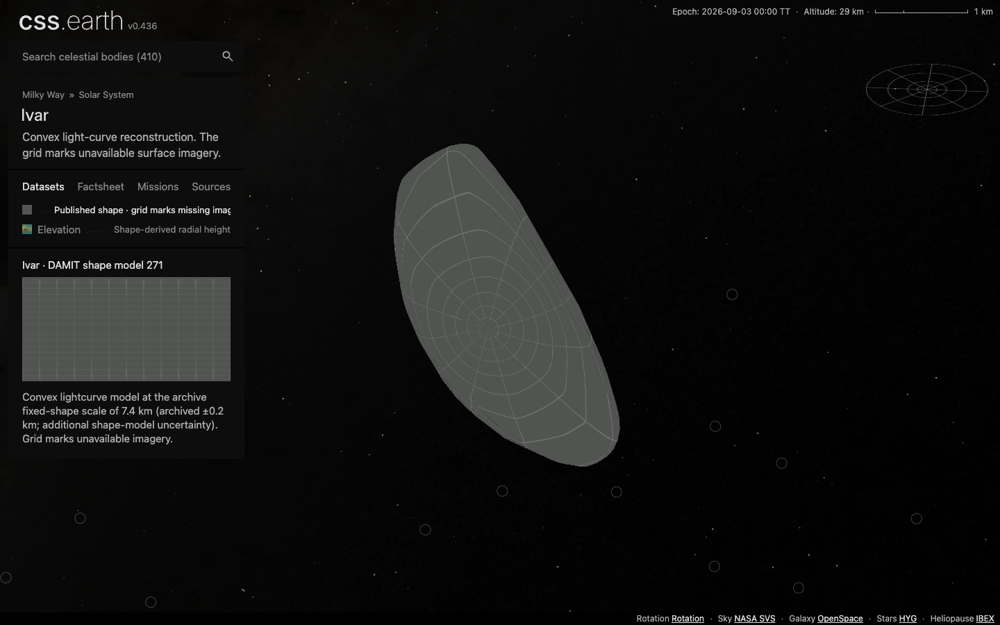
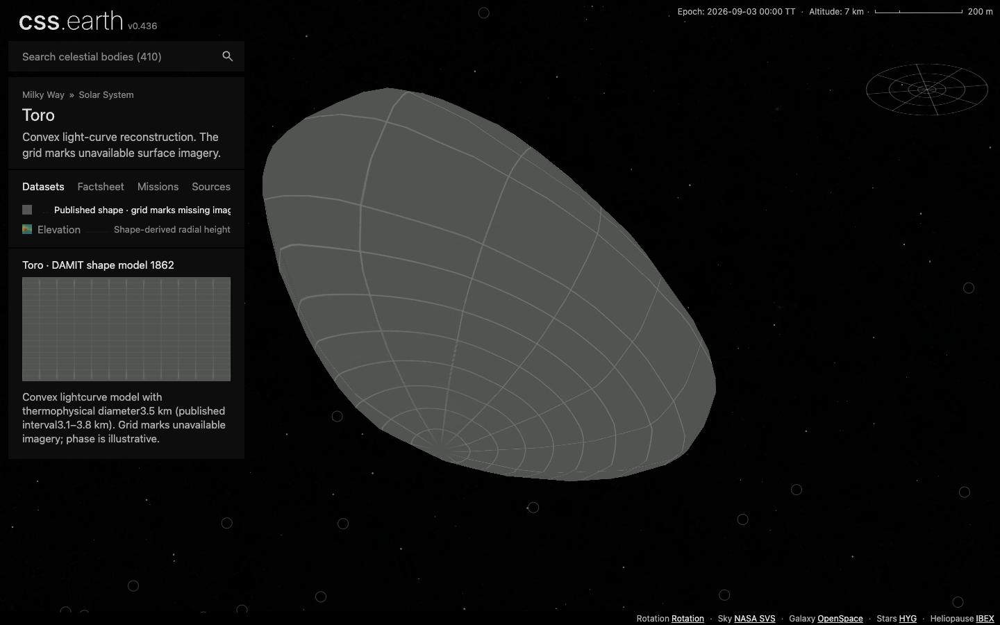
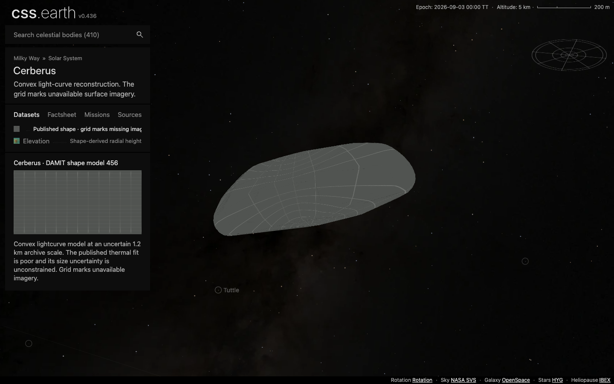
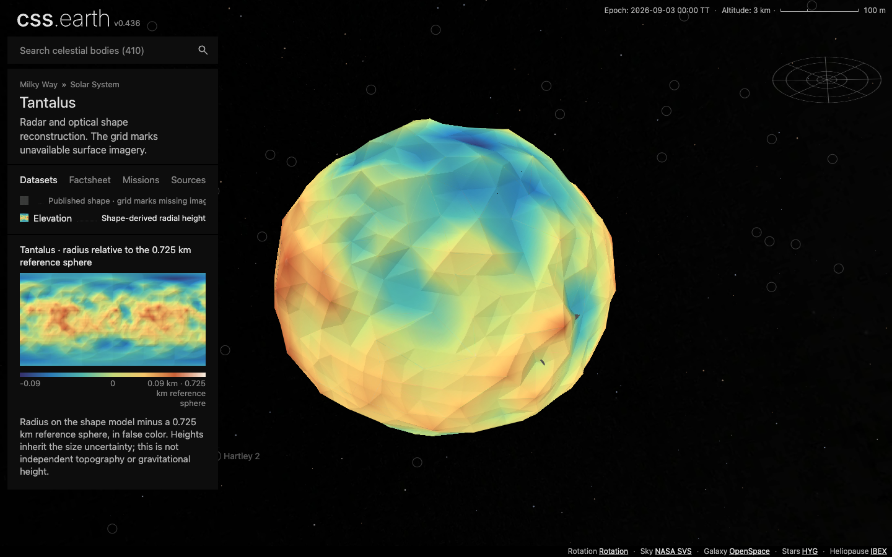

# Near-Earth asteroid models

Adds Ivar, Toro, Cerberus and Tantalus through the established original-mesh/meshoptimizer recipe. Each body uses an original numerical DAMIT mesh. Ivar and Toro have thermal size fits, Tantalus has a radar scale, and Cerberus retains a poorly constrained archive estimate with a visible limitation. Shape uses the normal missing-imagery grid; Elevation is radius relative to the stated reference sphere, not measured geology. Shadows and Orbit start off.

| Body | Model | Diameter | Shape evidence |
| --- | --- | --- | --- |
| Ivar |271|7.4 ±0.2 km|Convex lightcurve model with thermophysical scale|
| Toro |1862|3.5 km; published interval 3.1–3.8 km|Convex lightcurve model with thermophysical scale|
| Cerberus |456|1.2 km; poor fit, uncertainty unconstrained|Convex lightcurve model with archived physical scale|
| Tantalus |6205|1.45 ±0.2 km|Prograde radar/optical reconstruction, preferred by WISE comparison|

These are archive diameter estimates; quoted intervals do not describe local geometry accuracy. Source coordinates and topology remain pinned. Orientation uses the published pole and reference rotation period, with arbitrary display phase. No runtime YORP propagation or impact prediction is claimed. Tantalus retains its retrograde alternative in the source survey. Ivar's older plausible nonconvex alternative is not presented as resolved terrain.

The full non-belt population audit selected separate Centaur, Trojan, Mars-crosser and trans-Neptunian PRs. This near-Earth batch is a bounded complement to them. Apollo, Eger and Eric remain source-review candidates: the first two need matching physical-scale/model selection, and the checked SBDB size for Eric assumes an albedo rather than measuring its diameter. A name-substring result for Soyuz-Apollo was explicitly rejected as a different asteroid.

Source acquisition, original mesh checks, physical interpretation and alternative solutions are retained beside each body. `inputs.json` records the reviewed numerical intake, source hashes and alternatives. `author.py` reuses the accepted counted-mesh preparation recipe, and `finalize-sources.mjs` reuses existing title and source-context owners. The astronomical state is prepared by the existing Horizons generator.

## Reproduction

Use the repository's pinned dependencies and Node version. Run the commands serially. The checked-in source recipes are authoritative; `author.py` records the initial intake and deliberately refuses to overwrite existing packages.

```sh
pnpm install --frozen-lockfile --ignore-scripts
pnpm build:packages
pnpm build:renderer
pnpm build:preparation
node tools/restore-source-inputs.mts --object=ivar --object=toro --object=cerberus --object=tantalus
node docs/near-earth-population/finalize-sources.mts
node tools/prepare-solar-geometry.mts
node docs/lucy-targets/navigation.mts --inputs=docs/near-earth-population/navigation-inputs.json --base=bd265cf3a091c4ef17e9be76dfeb23410364884f --evidence=docs/near-earth-population/navigation-evidence.json
node tools/objects/dist/prepare-authored.js ivar --write
node tools/objects/dist/prepare-authored.js toro --write
node tools/objects/dist/prepare-authored.js cerberus --write
node tools/objects/dist/prepare-authored.js tantalus --write
node docs/near-earth-population/refresh-transports.mts
node site/minimap/prepare.mts
```

The committed Horizons elements and vector fixtures are reproducible through the existing generator using the same four `--object` arguments. Retain the pinned epoch when comparing fixtures.

The four body source contracts run with `node --test --test-concurrency=1 tests/objects/unit/{ivar,toro,cerberus,tantalus}/source.test.mjs`. Focused numerical qualification uses `node docs/near-earth-population/qualify.mjs`; its independent source oracle requires Python with NumPy and Pillow (`CSSEARTH_PYTHON` can select that interpreter). The original closest-triangle oracle, source snapshots and atlas-anchor checks are reused with these four targets. Source fit is sampled in both directions; it is not an exhaustive Hausdorff bound.

Original numerical meshes and primary papers have also been restored into an empty destination through the existing acquisition owner, with every byte count and SHA-256 checked. See [source restoration](source-restoration.json). The four bodies publish 140 content-addressed runtime files (31,143,572 bytes). A fresh empty installation downloaded every file and verified its size and SHA-256; no local asset was reused. See [delivery evidence](fresh-install.json).

## Source-to-result checks

All four models use 800 retained native `u` raster triangles. Numerical sampling independently compares every retained face centroid, six original extrema and atlas anchors against the full pinned source mesh. Decoded interior atlas RGB differs by at most 3 channel values; shared-edge/bleed normal identity is reported diagnostically rather than asserted.

| Body | Two-sided sampled distance p95 | Maximum sampled distance | Withheld interior elevation texels |
| --- | --- | --- | --- |
| Ivar |7.22 m|33.48 m|0 / 5,324,086|
| Toro |4.86 m|12.38 m|0 / 5,522,256|
| Cerberus |0.93 m|3.58 m|0 / 5,206,363|
| Tantalus |5.98 m|16.79 m|1,842 / 5,738,316 (0.0321%)|

Distances use 8,192 deterministic area-weighted samples in each direction, not an exhaustive Hausdorff bound. Tantalus has a 14.5 m meshoptimizer estimate budget and a separate 14.5 m source-transfer cutoff. The measured sampled geometry distance exceeds that estimate in a small region; the existing atlas preparation withholds texels beyond the cutoff. No cutoff was loosened or missing value extrapolated. These numerical deviations do not measure the physical accuracy of the source reconstruction. Full identities, source-fit results and transfer counts are in [qualification.json](qualification.json).

Ivar and Cerberus use the existing `framingScale` camera setting, with the reference radius divided by the maximum original source radius. This keeps their complete elongated silhouettes in the default view. The camera-only refresh reused the solid-scene owner and verified unchanged terrain bytes and runtime image inventories; see [framing evidence](framing-refresh.json). Full preparation consumes the same checked-in setting.

## Production browser evidence

The integrated Astro build on main `3badfb535` emits 822 pages, including the shared navigation routes. All 410 object transports and prepared startup preload sets are byte-verified against their descriptor pins. The four new routes passed at DPR1 and DPR2 with one retained scene/camera, 800 native raster triangles, true default framing, Shadows/Orbit off, source limitations visible, optional lighting, both lenses and a close view. Shared asteroid category, search and body handoff passed. The new scene images were supplied from the independently downloaded installation. The settings action is hidden by current main; optional Shadows was exercised through its existing bound control event.

The representative Tantalus Shape drag at DPR2 ran three 60-step vertical cycles: 370 pipeline sequences, one dropped without presentation (0.27%), rAF p95 16.8 ms, draw p95 8.602 ms and 110,568 retained stage nodes. No interaction-time requests or browser errors occurred. This measures this workload on the recorded M3 Max/Chrome152, not a universal performance guarantee.

[Browser checks](browser-validation.json), [built transports](built-transports.json), [drag report](tantalus-drag-report.json), [image identities](images.json).






Main PR #50 replaced per-body Astro wrappers with the generic `[id]` and navigation routes. These four packages declare their own stylesheet paths in the existing descriptor contract. Marker refresh emits page metadata from the exact refreshed scene SHA through `preparePageMetadata`; it does not recompile source geometry or imagery. Current-main page/router tests pass (46 tests), all source/package closures pass, and all410 object transports plus startup preload sets were verified.

The prepared spatial minimap is regenerated after world-context refresh, so its body list and X-sorted point index include all four additions. The five focused minimap ownership, range and coverage tests pass. The browser evidence above precedes this additive four-point index refresh; body presentation and transport bytes are unchanged.

## Encke and LINEAR integration

Main `bd265cf3a` adds the source-backed Encke and LINEAR comet packages. This branch preserves their incoming scientific data and adds the four near-Earth asteroids to that 408-object baseline: 412 objects, 291 asteroids and 411 Sun destinations. Both navigation atlas densities preserve all 408 baseline markers. The existing marker, context, page metadata and minimap owners refresh their derived bindings without recompiling body presentations.

The [integration receipt](comet-integration.json) verifies every tracked source/scientific payload in the four asteroid packages against the previously qualified branch, and both comet packages against incoming main. Runtime data outside marker bindings is identical. Eight focused page/minimap tests and all four source/package closures pass after this integration. Run `node docs/near-earth-population/verify-comet-integration.mjs` to reproduce the preservation checks.

The earlier build, browser images and drag trace remain evidence of their explicitly recorded revision. They are not new captures of this metadata-only integration; no repeated geometry, scalar, atlas or browser preparation was needed.
