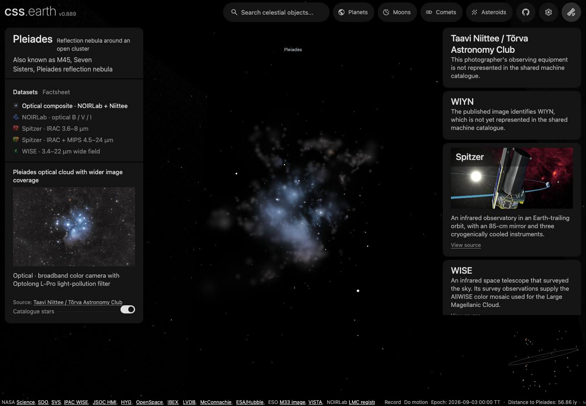
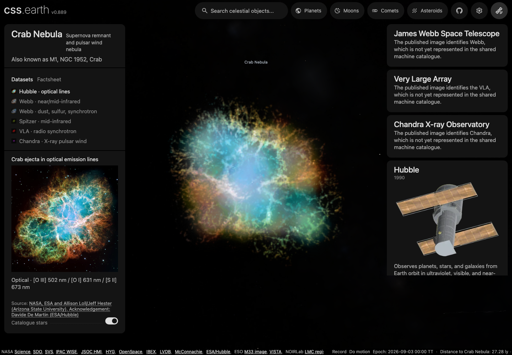
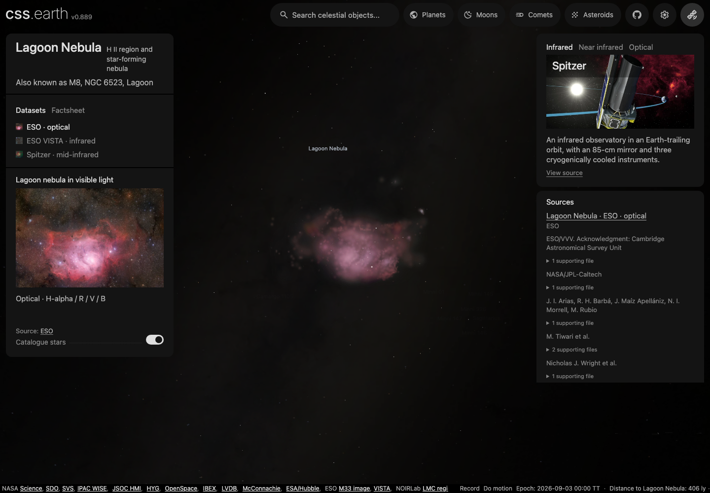

# Prepared nebulae in the shared world

M42, Helix, M2–9, Pleiades, Crab and Lagoon use the retained `volume-lens-bank` capability, shared camera, focus card and source controls. Open `/sun/?focus=m45`, `/sun/?focus=m1` or `/sun/?focus=m8` for the new scenes; the existing `m42`, `helix` and `m2-9` focus links remain available. Double-clicking a scene label uses the same shared navigation.

Search by common name or catalogue alias (Orion/M42/NGC 1976, Helix/NGC 7293, Twin Jet/M2–9, Pleiades/M45/Seven Sisters, Crab/M1/NGC 1952, Lagoon/M8/NGC 6523), or browse the Nebulae category. Search rows come from each object's nebula record; selecting a result uses the current scene's shared fly-to without loading another page.

| Object | Method | Lenses | Adopted distance |
| --- | --- | --- | --- |
| [M42](../../src/objects/m42/README.md) | Image emission with an evidence-guided coherent depth surface | ESO optical and VISTA infrared | 414 ± 7 pc |
| [Helix](../../src/objects/helix/README.md) | Multi-image emission with a molecular velocity scaffold | ESO WFI optical, VISTA infrared, wide optical | 216 −12/+14 pc |
| [M2–9](../../src/objects/m2-9/README.md) | Axially symmetric image-conditioned emission | Hubble optical | 650 pc, uncertain |
| [Pleiades · M45](../../src/objects/m45/README.md) | Authored finite dust-display surface and observed stellar catalogue | NOIRLab + Niittee optical composite, NOIRLab optical, two Spitzer composites, WISE | 136.2 ± 1.2 pc |
| [Crab · M1](../../src/objects/m1/README.md) | Released SITELLE ejecta samples with conditional expansion depth and separate pulsar-wind components | Hubble, two Webb views, Spitzer, VLA, Chandra | 2,000 pc adopted model scale |
| [Lagoon · M8](../../src/objects/m8/README.md) | Authored coherent front with local published structure constraints | ESO optical, VISTA infrared, Spitzer infrared | 1,326 −69/+77 pc |
| [LMC](../../src/objects/lmc/README.md) | Registered image colors on a simulated stellar-density prior | VISTA infrared, Horálek visible light, WISE infrared | The Local Group catalogue owns its distance |

These are **relative display emission** models, not measured 3D gas density. The six Galactic nebulae use [surrounding Gaia/Bailer-Jones stellar fields](stellar-fields.md), independent of source-image boundaries. Their parallax-informed distance estimates retain uncertainty; retained named Pleiades stars, the Crab pulsar and bright Helix image cores keep explicitly conditional display depths. LMC keeps its separate model-conditioned stellar catalogue. Pleiades and Lagoon retain thin-layer and source-coverage artifacts; Crab's historical color-through-depth material defect remains separately documented. Each body README distinguishes those model limits from app integration.

## Reproduce from a clean checkout

Requires Node 24 (or 22.18+) and pnpm 10.33.0. Dependency installation needs internet; the accepted nebula bake uses checked-in compact inputs and needs no native image downloads, Python, NOX or simulation archive. Run from a clean repository checkout.

```sh
pnpm install --frozen-lockfile --ignore-scripts
pnpm build:tools
pnpm prepare:nebulae
pnpm dev
```

`pnpm prepare:nebulae` enters through `tools/nebula/prepare.mts` and the private volume-bake package, without invoking the lab CLI. It handles **all 23 configured lenses**, then regenerates their dataset cards and the shared source/telescope graphs. Success prints `DELIVERY_CACHED` or `BAKE_COMPLETE` for LMC, `NEBULA_OBJECTS_COMPLETE` for the six smaller nebulae, and the prepared mission/facility/dataset totals. A cached invocation hashes every installed texture before reporting `verified`; it does not rerun NOX. Missing derived products are restored or rebuilt. Tracked scientific recipes identify inputs by path; source changes require fresh qualification rather than a claim that a manifest digest rejected them. M2–9 integrates its retained RGB emission grid; the compiler objects replay fitted fields and saved materials. The delivery receipts identify actual output versions; a successful replay is not an independent visual or scientific acceptance.

Source recipes, provenance, requests, compact pre-slice bake inputs and small object descriptors are committed. Textures, prepared descriptors and receipts under each object's `prepared/`, native caches and intermediate results are ignored. Runtime consumes prepared geometry and pixels only.

For work elsewhere in the application, `pnpm dev` no longer runs this full nebula
preparation. Startup checks each volume's bank, textures, previews and presentation
against its existing identities. Missing or invalid packages show an unavailable
3D view with their catalogue facts; installed packages remain usable. This is an
installation state, not a change to the object registry or scientific catalogue.
Production builds require all configured packages, including when invoking
`astro build` directly.

To restore one of the six Galactic nebulae through its existing delivery recipe:

```sh
pnpm install --frozen-lockfile --ignore-scripts
pnpm build:tools
node tools/nebula/prepare.mts --object=helix --if-missing
node tools/prepare/prepare-facilities.mts --catalog-only
```

The processing prerequisites above still apply. Restart the development server
after restoration; available banks are selected once at startup. LMC is selected through the same application entrypoint; the lab research CLI is not part of this replay.

## Spectral datasets and source cards

| Object | Every lens rebuilt by the command | Saved processing choices |
| --- | --- | --- |
| M42 | `eso-optical`, `eso-vista` | `source/request.json`, `source/delivery.json`, and the pinned lab compiler/evidence recipes |
| Helix | `eso-vista`, `eso-wfi`, `eso-wide` | The same compiler contract, including its molecular-velocity evidence |
| M2–9 | `hst-optical` | The symmetry recipe and `source/image-frame.json` |
| M45 | `optical-composite`, `noirlab-optical`, `spitzer-irac`, `spitzer-irac-mips`, `wise-four-band` | Delivery and request records; compiler, observed stellar catalogue and the declared optical-composite recipe |
| M1 | `hubble-optical`, `webb-infrared`, `webb-components`, `spitzer-infrared`, `vla-radio`, `chandra-xray` | Delivery and request records; sampled ejecta/pulsar-wind recipe and per-image registration records |
| M8 | `eso-optical`, `eso-vista`, `spitzer-mid-infrared` | Delivery and request records; selected three-image observations and the local evidence-guided depth recipe |
| LMC | `vista-infrared`, `horalek-widefield`, `wise-wide-infrared` | `labs/nebula/models/lmc/bake.json`, accepted registration, per-image appearance and `source/lenses.json` |

The native images and their completed star-removal or explicit compact-emission-preservation products feed reconstruction. **The source-card previews never feed the cloud bake.** Shared geometry and star positions remain independent of lens selection; each lens carries its registered color treatment and saved display settings. Pleiades' composite reference preview is Niittee's original wide photograph before NOIRLab detail fusion. Crab's Hubble 2017 bridge supports registration and is excluded from selectable lenses. M2–9 gains an independently catalogued surrounding field; its symmetry image does not infer those stellar positions.

Each object owns `source/presentation.json` and a source manifest with image identities, credits, capture evidence and supporting scientific references. `pnpm prepare:nebulae` prepares `prepared/presentation.json`, standard `cssearth-object-provenance@3` lineage and bounded WebP previews, then refreshes shared source usage. `node tools/prepare/prepare-facilities.mts --catalog-only` refreshes the shared catalogue from installed provenance. These generated files are ignored. Volume provenance is inventoried and published with the bake; the layered-body provenance generator does not recreate it. An ordinary rebake takes the current descriptor's output identity; it does not require editing a duplicate presentation hash.

The site reuses the planets' dataset selector, descriptions, details and source/telescope sidebar. Selecting a lens updates that lens's source context and URL while retaining the world camera and scene. Supporting observations remain distinguishable from the selected image; papers do not become spacecraft observations. Horálek's camera remains unidentified in the retained evidence, so its attribution names the photographer without inventing an instrument.

## Using the shared dataset panels

Select a dataset on the left to recolor the retained cloud. Its image credit and supporting observations appear on the right. The catalogue-star toggle preserves the common positions across spectral lenses. Dataset rows show only image names; the selected image dimensions and passbands are in Factsheet. Scene labels follow the top of each projected cloud and retain fading and double-click navigation.



Pleiades: Taavi Niittee / Tõrva Astronomy Club wide optical image, with central
NOIRLab detail. The photo coverage and remaining inferred thin-cloud limitations
are described in the object record above.



Crab: NASA/ESA, Allison Loll, Jeff Hester and Davide De Martin; released SITELLE
spatial samples supply the conditional ejecta structure.



Lagoon: ESO optical. These are main-app captures, with the shared dataset panels,
catalogue fields and labels above the projected clouds. Front and oblique views
are checked separately; a front screenshot does not prove physical depth.

## Distant appearance

Each delivered lens includes transparent, pre-rendered views of its completed cloud. At small projected screen sizes, the renderer uses these billboards; approaching the cloud hands back to the original volume slices. This changes the amount of displayed geometry, not the nebula's physical bounds, adopted distance or close-view resolution. Viewing direction selects from the fixed prepared views; the browser never generates their pixels.

The initial bank contains 26 directions at 256px. Up to three contribute at once below a 128 CSS-pixel projected bounding diameter. Between 128 and 256px, the cloud fades into its retained volume; above 256px, only the original slices render. Hidden slice stacks receive no camera publications. These distant orthographic views approximate parallax and perspective; they are not replacements for the close cloud.

Delivery creates the views after applying the shared sky-frame transform, using that lens's prepared brightness. The same source recipe rebuilds both representations from the completed volume, without another star-removal pass. The delivery receipt pins the generator and volume contract, so `--if-missing` rebuilds after their implementation changes and verifies every generated image on reuse.

## Coordinate handoff

The compiler uses west/north/away angular coordinates. Delivery reflects physical X, then embeds proper east/north/away axes in ICRS. PolyCSS stores physical YXZ, so this reflection changes the second matrix row. Stars receive the same reflection. Delivery restores the local origin offset; one angular unit uses `distancePc × metresPerParsec × π/648000` metres. This tangent-plane approximation does not turn assumed depth into measured geometry.

M2–9 has a published 113.6° AVM rotation and a 58.035″ image width. Its existing caption-removing crop is transferred to the same HST photograph using the recorded registration evidence. The captioned full APOD raster is not used as an angular field.

## Update a delivery

`source/request.json` fixes compiler controls, evidence weights and saved image transforms. `source/delivery.json` names that request and scientific recipe inputs by path, records the assessed result, physical embedding and display framing. Source switching changes prepared star material while retaining every ID/position and the shared camera.

The current checked-in compiler can produce a new immutable result for those settings. The generated receipt records both the historically assessed identity and the actual reproduced identity. A new result still needs front, oblique and side inspection; numerical agreement alone does not establish visual acceptance.

The main site's prepared-resource glob includes the generated proxy PNGs automatically. After preparing updated deliveries and rebuilding a changed renderer, reload the main page to load its new fixed bank; no separate nebula asset-manifest restoration is needed.

## Integration evidence

Every object README links its own investigation ledger and original
processing assessments.

The [retained integration reports](../../site/test/evidence/nebulae/2026-09-14/)
preserve earlier catalogue-field and final Helix/Lagoon visual checks without
rewriting their results. The capture map locates the original images and their
hashes; routine navigation screenshots remain scratch. The final historical
visual report omitted browser version and viewport, a limitation recorded
beside it rather than filled retrospectively.

The screenshots above show the delivered clouds at `5569fa211`. Their original
source-card text predates the attribution corrections. All seven prepared
volume-bank identities remain unchanged during the contract alignment; that
comparison permits reuse of cloud appearance findings, not old metadata claims.

The [earlier integration account](https://github.com/layoutit/css.earth/blob/5569fa211db447927cb9c30284f13d2a37049695/docs/nebulae/README.md#integration-evidence)
retains its original scope and limitations. Cold native-processing replay,
quantitative axis-handoff requalification and unrelated planet suites are not
claimed by a provenance-only update. Existing material defects remain in the
object records and investigation ledgers.

## Volume texture delivery

The seven lens-bank objects (Crab, Orion, Helix, M2–9, Pleiades, Lagoon and LMC)
pack each lens’s original X/Y/Z slices into three WebP atlases. Delivery uses
color quality 80, alpha quality 80, effort 4, and two-pixel clamped gutters.
Packing preserves the leaf transforms, dimensions, order, frame, stars and
saved brightness. Only texture resources and prepared background coordinates
change. No density fitting or star removal occurs in this packaging step.

The existing renderer uses these prepared coordinates unchanged. Distant
billboards remain separate and the volume atlases load through the existing
projected-size handoff. Three requests replace hundreds of individual slice
requests per lens; atlas compression does not reduce decoded RGBA memory or
the number of rendered planes. Q80/A80 is lossy, including alpha: it preserves
geometry, not every pixel or faint-opacity level.

`pnpm prepare:nebulae` restores the atlases as part of normal app preparation.
The compiler/symmetry handoff hashes the atlas implementation into its receipt.
LMC replays pinned accepted slices and compares the regenerated atlases with
its delivery manifest. Generated atlas images stay ignored.

## Compact inputs and research replay

The ordinary bake begins after scientific fitting and material assignment:

- Orion, Helix, Pleiades and Lagoon retain analytic emission components, per-component colors, stars and integration settings.
- Crab retains its sampled/model material inputs; it keeps tracer-specific component support.
- M2–9 retains three compressed RGB emission grids before optical integration.
- LMC retains the small density grid and three registered starless RGB material planes, with the accepted placement and appearance settings. These planes are material inputs, not XYZ slices.

The original acquisition records and full research recipes remain available.
`prepare-nebula-objects --research` and `bake-nebula --research` explicitly rerun
the research route, which can need native downloads and Python. The default
route never silently falls back to that expensive process when compact inputs
are missing or invalid: it reports the broken pin. New scientific fits must
be inspected and explicitly exported before replacing the compact inputs.

Runtime atlases, impostors and slices are generated and ignored. The compact
fields retain provenance and expected texture hashes; they do not make the
inferred depth or material scientifically measured.

To export a newly inspected compiler or symmetry result, start from an installed
checkout with that object's research result already delivered:

```sh
pnpm install --frozen-lockfile --ignore-scripts
pnpm build:packages
node labs/nebula/run.mts export-compact-nebula --object=m42
```

This writes compact inputs and prints their pin; it does not update the accepted
delivery pin or publish. Inspect the input diff, verify replay, then update the
source-owned recipe and manifest. LMC's historical registered-material snapshot
is separately pinned; changing its method remains research work.

## Application provenance without the lab

Application replay and source-catalogue preparation read evidence from each
object's `source/` directory. `source/provenance-references.json` maps the
provenance compiler's retained evidence and recipe copies to their original
research paths, Git revisions, SHA-256 hashes and byte counts. Existing compact
replay copies are reused; the copied JSON bytes and scientific pins are unchanged.
The source manifest covers those copies and the mapping itself.

A research path inside a retained JSON record is historical metadata, not an
instruction for application preparation to load that file. The shared
`src/sources/` records likewise retain their original revision-pinned evidence;
their statement links use GitHub permalinks to that same revision. These records
do not need a second copy merely to cite an earlier processing account. Full
research processing remains an explicit lab operation.

Routine provenance tests verify the retained current bytes, manifest coverage,
revision syntax and portable links without requiring Git history. The separate
`node tools/sources/nebula-provenance-history.gate.mts` audit compares every retained copy
and historical source-record hash with its recorded Git revision. Run that audit
from a checkout containing those revisions; it fails if history is missing rather
than substituting current bytes or skipping verification.
