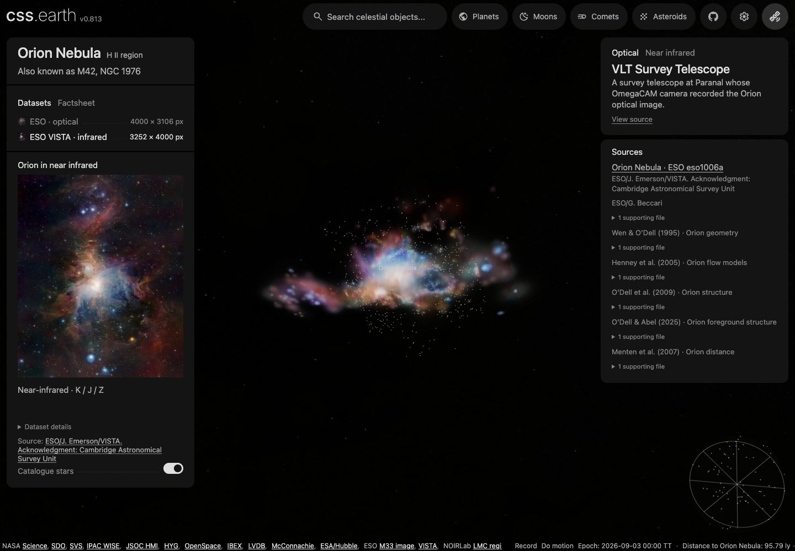
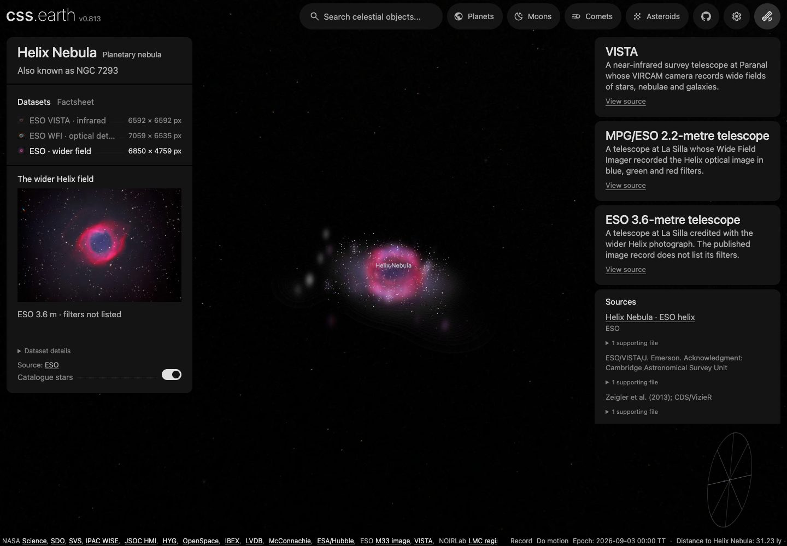
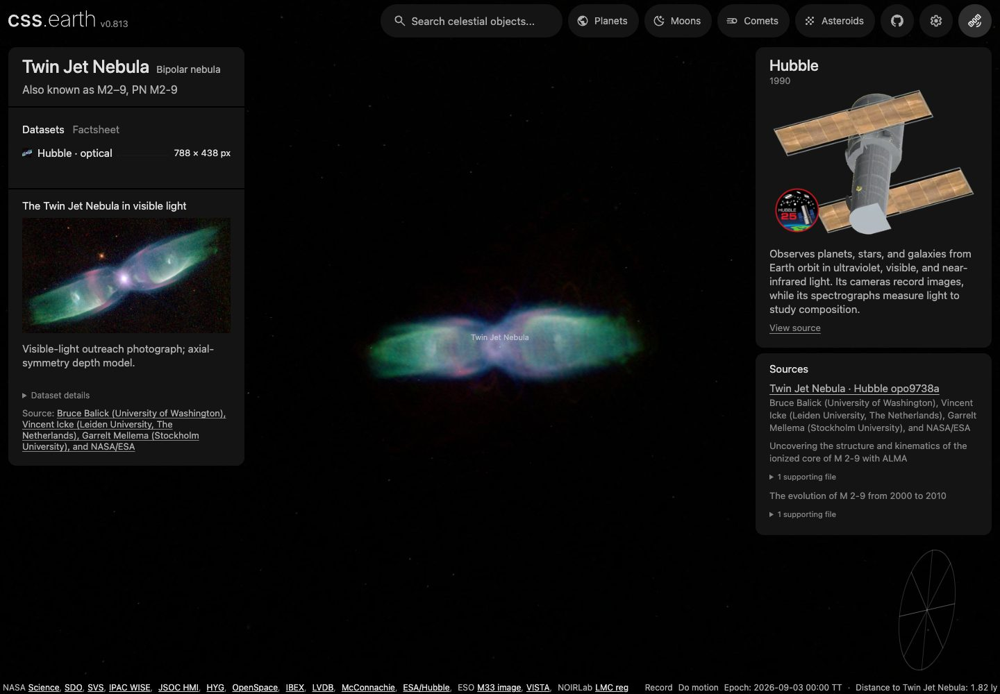

# Prepared nebulae in the shared world

M42, Helix and M2–9 use the retained `volume-lens-bank` capability, shared camera, focus card and source controls. They do not have separate scene owners. Open `/sun/?focus=m42`, `/sun/?focus=helix` or `/sun/?focus=m2-9`, or double-click their scene labels.

Search by common name or catalogue alias (Orion/M42/NGC 1976, Helix/NGC 7293, Twin Jet/M2–9), or browse the Nebulae category. Search rows come from each object's nebula record; selecting a result uses the current scene's shared fly-to without loading another page.

| Object | Method | Lenses | Adopted distance |
| --- | --- | --- | --- |
| [M42](../../src/objects/m42/README.md) | Image emission with an evidence-guided coherent depth surface | ESO optical and VISTA infrared | 414 ± 7 pc |
| [Helix](../../src/objects/helix/README.md) | Multi-image emission with a molecular velocity scaffold | ESO WFI optical, VISTA infrared, wide optical | 216 −12/+14 pc |
| [M2–9](../../src/objects/m2-9/README.md) | Axially symmetric image-conditioned emission | Hubble optical | 650 pc, uncertain |
| [LMC](../../src/objects/lmc/README.md) | Registered image colors on a simulated stellar-density prior | VISTA infrared, Horálek visible light, WISE infrared | The Local Group catalogue owns its distance |

These are plausible **relative display emission** models, not measured 3D gas density. Compact lights retain image positions and display photometry; their conditional depths do not establish stellar distance or membership. The accepted M2–9 baseline has no star catalogue, so none is invented.

## Reproduce from a clean checkout

Requires Node 22.18+, pnpm 10.33.0, Python 3.9–3.12 with pip/venv, a supported TensorFlow wheel, internet access and disk space for native images. Run from the repository root. This uses the existing lab processing environment without opening its UI or restarting a running lab.

```sh
pnpm install --frozen-lockfile
python3 -m venv .local/open-star-removal/venv
.local/open-star-removal/venv/bin/python -m pip install tensorflow==2.16.2 numpy==1.26.4 opencv-python-headless==4.11.0.86 scipy==1.13.1
curl -fL https://github.com/charvey2718/nox/releases/download/v1.1.0/noxGeneratorColor.pb -o .local/open-star-removal/noxGeneratorColor.pb
pnpm prepare:nebulae
pnpm dev
```

`pnpm prepare:nebulae` handles **all nine accepted lenses**, then regenerates their dataset cards and the shared source/telescope graphs. Success prints `DELIVERY_CACHED` or `BAKE_COMPLETE` for LMC, `NEBULA_OBJECTS_COMPLETE` for the three smaller nebulae, and the prepared mission/machine/dataset totals. A cached invocation hashes every installed texture before reporting `verified`; it does not rerun NOX. Missing derived products are restored; changed pinned scientific inputs fail. M2–9 replays its symmetry recipe if its local volume is absent.

Source recipes, provenance, requests and small object descriptors are committed. Textures, prepared descriptors and receipts under each object's `prepared/`, native caches and intermediate results are ignored. Runtime consumes prepared geometry and pixels only.

## Spectral datasets and source cards

| Object | Every lens rebuilt by the command | Saved processing choices |
| --- | --- | --- |
| M42 | `eso-optical`, `eso-vista` | `source/request.json`, `source/delivery.json`, and the pinned lab compiler/evidence recipes |
| Helix | `eso-vista`, `eso-wfi`, `eso-wide` | The same compiler contract, including its molecular-velocity evidence |
| M2–9 | `hst-optical` | The symmetry recipe and `source/image-frame.json` |
| LMC | `vista-infrared`, `horalek-widefield`, `wise-wide-infrared` | `labs/nebula/models/lmc/bake.json`, accepted registration, per-image appearance and `source/lenses.json` |

The native images and their completed star-removal products feed reconstruction. **The small source-card previews never feed the cloud bake.** Shared geometry and star positions remain independent of lens selection; each lens carries its registered color treatment and saved display settings. The accepted M2–9 model has no prepared stars.

Each object owns `source/presentation.json` and a source manifest with image identities, credits, capture evidence and supporting scientific references. `prepare:nebulae` and `prepare:sources` generate `prepared/presentation.json`, standard `cssearth-object-provenance@3` lineage, bounded WebP previews and shared source usage. These generated files are ignored. An ordinary rebake takes the current descriptor's output identity; it does not require editing a duplicate presentation hash.

The site reuses the planets' dataset selector, descriptions, details and source/telescope sidebar. Selecting a lens updates that lens's source context and URL while retaining the world camera and scene. Supporting observations remain distinguishable from the selected image; papers do not become spacecraft observations. Horálek's camera remains unidentified in the retained evidence, so its attribution names the photographer without inventing an instrument.

## Using the shared dataset panels

Select a dataset on the left to recolor the retained cloud. Its image credit and supporting observations appear on the right. The catalogue-star toggle preserves the common positions across spectral lenses; M2–9 has no inferred star catalogue.



Orion, ESO VISTA near infrared (ESO/J. Emerson/VISTA; Cambridge Astronomical Survey Unit).



Helix, ESO wider-field optical observation, with VISTA and WFI retained as supporting observations.



M2–9, Hubble optical (Bruce Balick, Vincent Icke, Garrelt Mellema, NASA/ESA).

These are actual shared-app captures at 1440 × 1000 CSS pixels, DPR 1, from `6d07dface` with the subsequent dependency and browser-readiness corrections. They illustrate the dataset workflow and current appearance, not an independent measurement of 3D shape. The browser probe switches all nine datasets and retains the camera; the source records linked above own the processing and scientific limits.

## Distant appearance

Each delivered lens includes transparent, pre-rendered views of its completed cloud. At small projected screen sizes, the renderer uses these billboards; approaching the cloud hands back to the original volume slices. This changes the amount of displayed geometry, not the nebula's physical bounds, adopted distance or close-view resolution. Viewing direction selects from the fixed prepared views; the browser never generates their pixels.

The initial bank contains 26 directions at 256px. Up to three contribute at once below a 128 CSS-pixel projected bounding diameter. Between 128 and 256px, the cloud fades into its retained volume; above 256px, only the original slices render. Hidden slice stacks receive no camera publications. These distant orthographic views approximate parallax and perspective; they are not replacements for the close cloud.

Delivery creates the views after applying the shared sky-frame transform, using that lens's prepared brightness. The same source recipe rebuilds both representations from the completed volume, without another star-removal pass. The delivery receipt pins the generator and volume contract, so `--if-missing` rebuilds after their implementation changes and verifies every generated image on reuse.

## Coordinate handoff

The compiler uses west/north/away angular coordinates. Delivery reflects physical X, then embeds proper east/north/away axes in ICRS. PolyCSS stores physical YXZ, so this reflection changes the second matrix row. Stars receive the same reflection. Delivery restores the local origin offset; one angular unit uses `distancePc × metresPerParsec × π/648000` metres. This tangent-plane approximation does not turn assumed depth into measured geometry.

M2–9 has a published 113.6° AVM rotation and a 58.035″ image width. Its existing caption-removing crop is transferred to the same HST photograph using the recorded registration evidence. The captioned full APOD raster is not used as an angular field.

## Update a delivery

`source/request.json` fixes compiler controls, evidence weights and saved image transforms. `source/delivery.json` pins that request and scientific recipe inputs, records the assessed result, physical embedding and display framing. Source switching changes prepared star material while retaining every ID/position and the shared camera.

The current checked-in compiler can produce a new immutable result for those settings. The generated receipt records both the historically assessed identity and the actual reproduced identity. A new result still needs front, oblique and side inspection; numerical agreement alone does not establish visual acceptance.

The main site's prepared-resource glob includes the generated proxy PNGs automatically. After preparing updated deliveries and rebuilding a changed renderer, reload the main page to load its new fixed bank; no separate nebula asset-manifest restoration is needed.

## Integration evidence

`site/test/nebula-datasets-browser.mts` checks all nine accepted lenses, preview decoding, image-source links, retained camera/scene, star toggles and responsive dataset/factsheet panels. Shared source/graph tests verify canonical bindings and actual package ownership. This checks delivery and presentation, not the physical validity of inferred depth.

The main-site browser check (`site/test/nebula-world-browser.mts`) exercises all three objects and six lenses through the real shared input surface: label double-clicks navigate with one document load, lens changes retain the camera and scene nodes, and approaching M42/Helix enlarges their prepared compact lights. Front and oblique captures were inspected for this delivery. M2–9 has no prepared star catalogue. Existing image-coverage/background artifacts remain; these checks do not establish measured three-dimensional density.

Deleting one prepared M42 texture and replaying preparation restored its exact original hash and retained the assessed result. The full preparation command verified all three deliveries. A fresh native-image/NOX environment replay was not performed for this integration; the clean-checkout sequence above documents its required dependencies.
