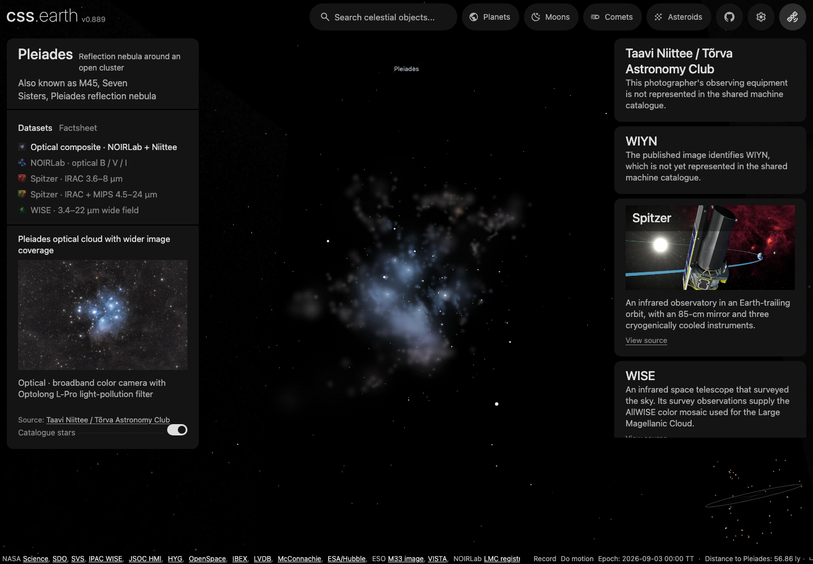
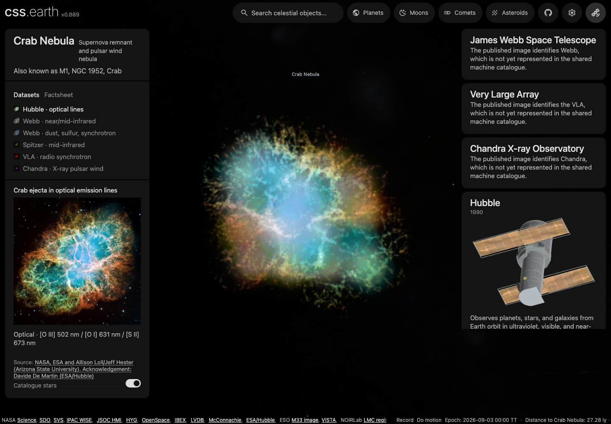
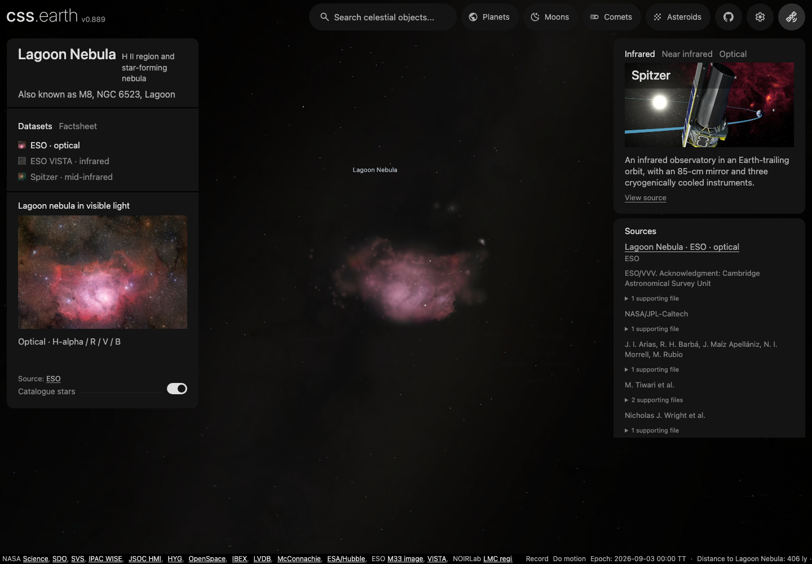
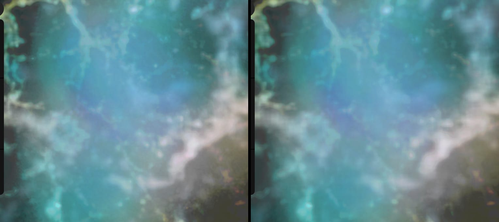

# Prepared nebulae in the shared world

M42, M2–9, Pleiades, Crab and Lagoon use the retained `volume-dataset-bank` capability, shared camera, focus card and source controls. Each has its page, `/m45/`, `/m1/`, `/m8/`, `/m42/` and `/m2-9/`: the shared world with the nebula selected and its card open. Search by common name or catalogue alias (Orion/M42/NGC 1976, Twin Jet/M2–9, Pleiades/M45/Seven Sisters, Crab/M1/NGC 1952, Lagoon/M8/NGC 6523), or browse the Nebulae category.

| Object | Method | Datasets | Adopted distance |
| --- | --- | --- | --- |
| [M42](../../src/objects/m42-volume/README.md) | Image emission with an evidence-guided coherent depth surface | ESO optical and VISTA infrared | 414 ± 7 pc |
| [M2–9](../../src/objects/m2-9-volume/README.md) | Axially symmetric image-conditioned emission | Hubble optical | 650 pc, uncertain |
| [Pleiades · M45](../../src/objects/m45-volume/README.md) | Authored finite dust-display surface and observed stellar catalogue | NOIRLab + Niittee optical composite, NOIRLab optical, two Spitzer composites, WISE | 136.2 ± 1.2 pc |
| [Crab · M1](../../src/objects/m1-volume/README.md) | Released SITELLE ejecta samples with conditional expansion depth and separate pulsar-wind components | Hubble, two Webb views, Spitzer, VLA, Chandra | 2,000 pc adopted model scale |
| [Lagoon · M8](../../src/objects/m8-volume/README.md) | Authored coherent front with local published structure constraints | ESO optical, VISTA infrared, Spitzer infrared | 1,326 −69/+77 pc |
| [LMC](../../src/objects/lmc-volume/README.md) | Registered image colors on a simulated stellar-density prior | VISTA infrared, Horálek visible light, WISE infrared | The Local Group catalogue owns its distance |

These are relative display emission models, not measured 3D gas density. The five Galactic nebulae use [surrounding Gaia/Bailer-Jones stellar fields](stellar-fields.md), independent of source-image boundaries. Each body README distinguishes its model limits from app integration. The Helix Nebula left this route on 2026-10-07: its four photographs lie on the nebula's two published rings as [image layers](../../src/objects/helix-layers/README.md).

## Reproduce from a clean checkout

Requires Node 24 (or 22.18+) and pnpm 10.33.0. Dependency installation needs internet; the nebula bake uses checked-in compact inputs and needs no native image downloads, Python, NOX or simulation archive.

```sh
pnpm install --frozen-lockfile --ignore-scripts
pnpm build:preparation
pnpm prepare:nebulae
pnpm dev
```

`pnpm prepare:nebulae` enters through `packages/bake/cli/prepare-nebulae.mts` and the nebula delivery bake in [`@cssearth/bake/nebula`](../../packages/bake/README.md), with the volume bake in `@cssearth/bake/volume/node`. It handles all 20 configured datasets and regenerates their dataset cards and the shared source/telescope graphs. A successful replay is not an independent visual or scientific acceptance.

Source recipes, provenance, requests, compact bake inputs and small object descriptors are committed. Everything under each object's `prepared/`, native caches and intermediate results are ignored. Runtime consumes prepared geometry and pixels only.

`pnpm dev` does not run the full nebula preparation. Startup checks each volume's bank, textures, previews and presentation; missing or invalid packages show an unavailable 3D view with their catalogue facts. Production builds require all configured packages, including when invoking `astro build` directly.

To restore one of the five Galactic nebulae:

```sh
pnpm install --frozen-lockfile --ignore-scripts
pnpm build:preparation
node packages/bake/cli/prepare-nebulae.mts --object=m42-volume --if-missing
node site/build/prepare/catalog/prepare-facilities.mts --catalog-only
```

Restart the development server after restoration; available banks are selected once at startup.

## Spectral datasets and source cards

| Object | Every dataset rebuilt by the command |
| --- | --- |
| M42 | `eso-optical`, `eso-vista` |
| M2–9 | `hst-optical` |
| M45 | `optical-composite`, `noirlab-optical`, `spitzer-irac`, `spitzer-irac-mips`, `wise-four-band` |
| M1 | `hubble-optical`, `webb-infrared`, `webb-components`, `spitzer-infrared`, `vla-radio`, `chandra-xray` |
| M8 | `eso-optical`, `eso-vista`, `spitzer-mid-infrared` |
| LMC | `vista-infrared`, `horalek-widefield`, `wise-wide-infrared` |

The source-card previews never feed the cloud bake. Shared geometry and star positions do not depend on dataset selection; each dataset carries its registered color treatment. Each object owns `source/presentation.json` and a source manifest with image identities, credits and supporting references. `node site/build/prepare/catalog/prepare-facilities.mts --catalog-only` refreshes the shared catalogue from the installed presentations.

Selecting a dataset recolors the retained cloud and updates its source context and URL while keeping the camera and scene. Horálek's camera remains unidentified, so its attribution names the photographer without inventing an instrument.



Pleiades: Taavi Niittee / Tõrva Astronomy Club wide optical image, with central
NOIRLab detail.



Crab: NASA/ESA, Allison Loll, Jeff Hester and Davide De Martin; released SITELLE
spatial samples supply the conditional ejecta structure.



Lagoon: ESO optical. A front screenshot does not prove physical depth.

## Distant appearance

Each dataset includes transparent, pre-rendered views of its completed cloud. The bank contains 26 directions at 256px. Below a 128 CSS-pixel projected diameter, up to three of these billboards draw; between 128 and 256px the cloud fades into its volume; above 256px only the original slices render. The browser never generates their pixels.

## Coordinate handoff

The compiler uses west/north/away angular coordinates. Delivery reflects physical X, then embeds east/north/away axes in ICRS. One angular unit uses `distancePc × metresPerParsec × π/648000` metres. This tangent-plane approximation does not turn assumed depth into measured geometry.

## Update a delivery

`source/request.json` fixes compiler controls, evidence weights and saved image transforms. `source/delivery.json` names that request and the scientific recipe inputs by path, and records the physical embedding and display framing. A new result needs front, oblique and side inspection; numerical agreement alone does not establish visual acceptance.

## Volume texture delivery

The seven dataset-bank objects pack each dataset's X/Y/Z slices into three WebP atlases at color quality 80, alpha quality 80, effort 4, with two-pixel clamped gutters. Three requests replace hundreds of slice requests per dataset. Atlas compression does not reduce decoded memory or the number of rendered planes, and it is lossy, including alpha.

Each slab is cropped to its emission, so decoded atlas size follows how much of its bounds a cloud fills. Compiler slabs are 512 pixels wide unless a scene's saved sampling names a smaller `imageWidth` (128 to 512). The Crab saves 256: its diffuse emission fills every slab, and its sampled grid has 256 cells along the longest axis, so a wider slab only interpolates between cells. At 512 its three atlases per dataset were 30 to 34 megapixels each, about 390 MB decoded, and failed to decode in a memory-limited browser; at 256 they are 7.6 to 8.6.



## Compact inputs and research replay

The ordinary bake begins after scientific fitting and material assignment:

- Orion, Pleiades and Lagoon retain analytic emission components, per-component colors, stars and integration settings.
- Crab retains its sampled/model material inputs.
- M2–9 retains three compressed RGB emission grids.
- LMC retains the small density grid and three registered starless RGB material planes.

`prepare-nebula-objects --research` and `bake-nebula --research` explicitly rerun the research route, which can need native downloads and Python. The default route never falls back to it: it reports the broken input. The compact fields do not make the inferred depth or material scientifically measured.

To export a newly inspected compiler or symmetry result, start from a checkout with that object's research result delivered:

```sh
pnpm install --frozen-lockfile --ignore-scripts
pnpm build:packages
node labs/nebula/run.mts export-compact-nebula --object=m42
```

This writes compact inputs; it does not publish. Inspect the input diff, verify replay, then update the source-owned recipe and manifest.

## Application provenance without the lab

Application preparation reads evidence from each object's `source/` directory. `source/provenance-references.json` maps retained evidence and recipe copies to their original research paths. A research path inside a retained JSON record is not an instruction to load that file.
