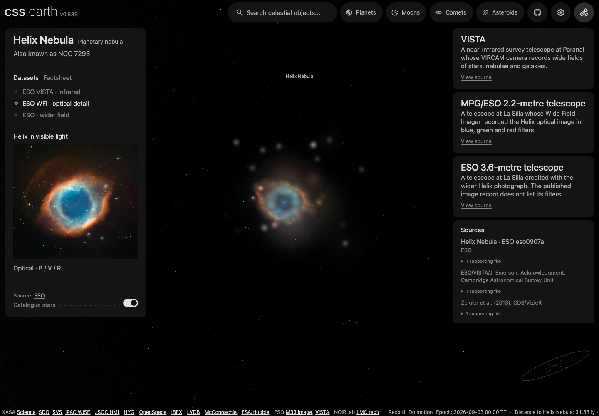

# Stars around nebulae

The main application prepares a spherical stellar neighbourhood around Orion,
Helix, M2–9, Pleiades, Crab and Lagoon. The source photograph does not select its
boundary or assign stellar depth. Each object keeps its compact catalogue extract
and display settings in `source/stellar-field.json`; `source/delivery.json` pins it.
The lab's image residuals and reconstruction caches remain separate.

## Sources and meaning

| Input | Used values | Limits |
| --- | --- | --- |
| [Gaia DR3, through GAVO](https://dc.zah.uni-heidelberg.de/tableinfo/gaia.dr3lite) | ICRS position, J2016.0 proper motion, G/BP/RP photometry, parallax/error and RUWE | Optical selection, quality cuts and bright-source incompleteness; not a membership catalogue |
| [Bailer-Jones et al. (2021)](https://doi.org/10.3847/1538-3881/abd806) | Geometric posterior median and asymmetric 16th/84th-percentile distances | Parallax-informed estimates with a Galactic prior; individual depths remain uncertain |
| [Cardiel et al. (2021), Table 1](https://doi.org/10.1093/mnras/stab2124) | Gaia BP−RP to relative RGB magnitudes | Used only within −0.5 < BP−RP < 2.0; neutral display color elsewhere. Extinction and metallicity can invalidate the reference calibration's precision |

The GAVO distance catalogue is CC-BY-4.0. Credit ESA/Gaia/DPAC;
Bailer-Jones, Rybizki, Fouesneau, Demleitner and Andrae; and GAVO. The source
records retain query text, original response identity, release and acquisition
date. Native response caches are ignored; the compact scientific extracts are
committed so a clean bake does not depend on a live archive query.

## Preparation

1. Query a bounded sky cone with the per-object G limit below, RUWE < 1.4 and
   parallax/error > 5. Fetch matching distance estimates, apply the actual
   three-dimensional spherical selection and sort by brightness. Two-stage
   acquisition rejects a capped response instead of silently truncating the field.
2. Use the distance median to place each star in ICRS metres. Advance reported
   tangent proper motions from J2016.0 to the scene epoch. Hold distance fixed;
   missing radial velocities do not become invented motion.
3. Transform into the same physical local frame as the nebula. Keep foreground,
   background and off-image stars; do not clamp them to volume slices or a photo.
4. Apply a smooth outer-radius taper and a faint-magnitude taper. Their radii,
   brightness threshold and bounded point budget are authored display choices.
5. Scale displayed disc area with G-band flux and use the declared RGB display
   approximation. These are exaggerated light footprints, not stellar radii.
   The shared point renderer supplies perspective scaling as the camera moves.

Explicit retained sources preserve the bright Pleiades catalogue stars, Crab
pulsar and 34 bright Helix image cores from the registered optical/infrared union. These keep their previous model-conditioned depths; they are not relabelled
as Bailer-Jones distances. Nearby Gaia directions are excluded within the declared
angular matching radius to avoid doubled lights. All spectral lenses share the
same surrounding optical starfield; changing a nebula's false-color lens does not
change stellar positions or claim optical photometry in radio/X-rays.

## Delivered selection · 14 September 2026

| Object | Sphere radius | G limit | Source rows | Displayed points |
| --- | ---: | ---: | ---: | ---: |
| M42 | 50 pc | 14 | 2,780 | 1,500 |
| Helix | 50 pc | 16 | 6,627 | 1,500: 1,466 Gaia + 34 image cores |
| M2–9 | 10 pc | 14 | 7 | 7 |
| M45 | 20 pc | 12 | 414 | 420, including eight retained HIP stars |
| M1 | 50 pc | 16 | 280 | 281, including the pulsar |
| M8 | 60 pc | 12 | 226 | 226 |

Each query completed without truncation. Larger/fainter archive queries timed out
for some fields; these bounded selections retain real distances rather than
inventing missing sources. Brightness ordering limits Orion and Helix to 1,500
points. M45 removes two directional Gaia duplicates of retained named stars.
Helix retains 28 cores from the top 40 reference-image aperture-light ranks,
with Gaia directions matched within 6″ and one point per matched identity. Six
additional compact detections come from the wider VISTA/optical coverage. The
union considers 2,000 candidates; only these 34 anchors enter the app budget. It
includes the central star. One VISTA edge detection has positive compact-source
photometry but no close Gaia association; the evidence preserves that distinction. Most matched counterparts are outside the neighbourhood; their
residual halos were already baked into the conditional cloud. The cores keep
those illustrative depths to stay attached to the halos, rather than falsely
claiming the catalogue distances are the same. Matches, aperture evidence and distance intervals
remain in the source provenance. Anchor-source photometry stays visible across
lens changes, even where the selected image has no coverage. Infrared source
colors are display choices, not optical stellar photometry. A 10″ authored match radius avoids double lights
near broad or saturated image peaks. This is an explicit display limitation;
removing stellar halos from the cloud is a separate material-cleanup task.

Magnitude limits, neighbourhood radii and completeness differ between objects;
sparse M2–9 and Lagoon fields are not a complete view of every surrounding star.

## Rebuild and inspect

The normal clean-checkout [nebula preparation command](README.md#reproduce-from-a-clean-checkout)
rebuilds the points alongside the cloud. An intentional catalogue refresh uses
`node tools/prepare-nebula-field-catalogues.mts --two-stage m42 helix m2-9 m45 m1 m8` and requires
updating the delivery/source pins after inspecting the new selection. It is not
part of ordinary installation. Refresh reuses the saved radius and magnitude
limit unless an explicit override is supplied.

Inspect both the reference direction and an orbit around each object. Points must
continue outside the source raster and span foreground/background distances.
Lens switches and the Catalogue stars toggle must retain the same positions.
The geometric tests check known independent ICRS positions, proper motion, distance
ordering and soft boundaries; they do not establish cluster membership or exact
physical depth.

The 14 September app inspection shows the added upper-halo cores in the WFI
lens, including cores detected beyond that image’s coverage. Front and oblique
views of all three lenses retain their geometry and source appearance. Their
roughly one-pixel cores are intentionally subtle; existing coarse halos remain.

[`site/test/rendered-page.test.mts`](../../site/test/rendered-page.test.mts)
walks each object's dataset context rail across every lens and checks that
switching lenses keeps its own attribution visible in the rail, keeps the same
document and stage, retains the shared camera, and updates the `focusLens` URL
parameter. The merged-visibility regression this guards against was a
`prepared-sky-runtime` fix ([af4dc9282](https://github.com/layoutit/css.earth/commit/af4dc9282db2fbcf563dc463edfca04a9f92b9b0)),
not something a dataset-rail screenshot shows.
