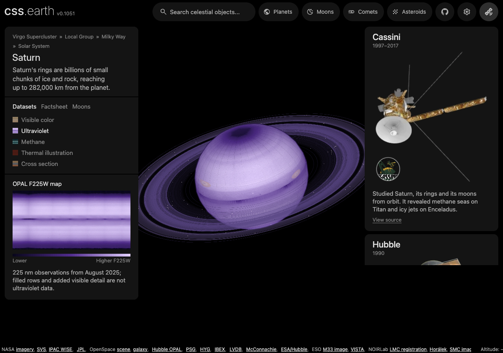
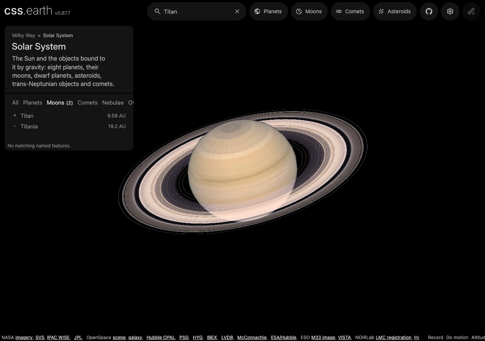
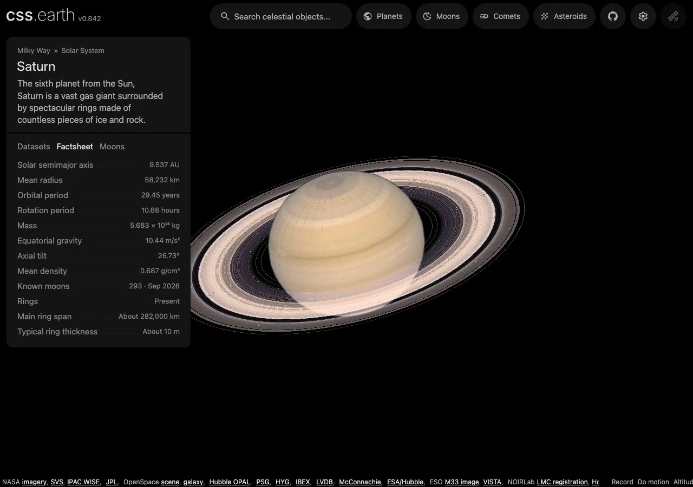

# Prepared page and navigation ownership

Object pages and navigation fragments come from `ObjectPage.astro` and the same
shared shell components. `OBJECTS` supplies all static route identities; `/` is
an Earth alias. Object packages declare their authored stylesheet order in
`object.json` → `properties.page.stylesheets`. Astro emits only that package's
CSS, followed by the shared planet shell CSS. The offline presentation compiler
consumes the same list. There is no page-source regex or second object registry.

Preparation writes `prepared/page.json` from the finalized scene definition.
Its descriptor pin validates the small metadata file and its `sceneSha256`
binds controls/preloads to the full scene transport. A first-load page also
decodes the authenticated scene during the build and serializes its prepared
tree into the existing `.planet-stage`. Navigation fragments use the small page
metadata without including another scene. The `/objects/<id>/<sha256>.json` endpoint still
verifies the complete transport's hash independently. Changing prepared scenes
must update both outputs through `writeObjectJson`.

Navigation fetches `/navigation/<id>/`: the same panels, attribution, metadata
and styles, without a repeated object catalog. The existing shell, card selection
ownership, stylesheet nodes and world camera stay retained.

## One scene before and after JavaScript

`serialize-prepared-scene.mts` publishes the package's prepared reference pose,
initial variant and texture addresses. It does not generate another mesh or
process source images. The page remains the same shell at the same URL.
Information tabs use native radio selection, including body overview, prepared
focus and dataset credit cards. Their labels use the existing shared tab styles;
CSS selects the panels. The mobile information sheet uses a checkbox, and
ordinary object/source links remain links. Prepared surface previews use native
lazy image loading. JavaScript observes selection where a map or dataset context
needs it; it does not install the information tabs' click or arrow-key behavior.

The interactive renderer verifies the prepared object revision, node identities,
tags, parents and sibling order, then takes ownership of those exact elements.
Its normal camera, material and animation publishers update that tree. An early
startup failure restores the original attributes and children on the same
elements. No second scene is kept as a fallback. Successful startup releases the
initial attribute snapshot; subsequent navigation uses the existing lifecycle.

Settings opens through a native popover. Its prepared object settings submit a
GET form; sky contrast follows its checkbox directly in CSS. Dataset attribution
cards are already present, and CSS owns their placement and visibility. Startup
preserves open settings, early selections and these same elements.

The response can restore a saved camera URL and select a prepared focus volume.
JavaScript adds camera input, animation, live filtering, dataset changes in place
and continuing world navigation. The separate [native camera experiment](native-resize-input.md)
explores scroll zoom and resize rotation; it is not enabled in the normal site.
This change does not claim a smaller JavaScript bundle or unchanged performance.

The prepared-object decoder retains one module worker across successful jobs.
Jobs are serialized and their bytes transfer only on activation. Cancelling an
active job terminates its worker and starts the next queued job; queued
cancellation never disturbs another decode. Page disposal rejects pending jobs
and releases the worker. Failed validation never falls back to main-thread
scene decoding.

## Native dataset selection and search on Netlify

Dataset buttons submit an ordinary GET form to the current object's route, for
example `/saturn/?dataset=ultraviolet`. The response uses the same prepared
decoder and scene serializer as the initial page. It verifies the descriptor
embedded in that page, fetches the complete content-addressed object,
and applies the requested prepared variant, including material banks, visibility
and cross-section state. It replaces the existing stage markup and selects the
existing dataset description and button. The response contains exactly one scene;
there are no alternate scene templates or dataset-specific styles.

Native choices survive reload, Back, search and Clear search. Dataset source
links use the query URL too; previously shared `#dataset` links still work with
JavaScript. The server cannot read fragments. While scripts load or after a
startup failure, the same buttons remain usable as submits. Once ready, the
renderer intercepts those buttons and updates the retained scene in place.
Startup adopts the dataset rendered by the server as its first selection,
without publishing the default dataset first.

Prepared focus volumes, such as Orion under `/sun/?focus=m42`, use the same
request path. Their dataset buttons submit `focusLens`; the response selects
the authenticated bank inside the existing scene and fills the shared focus
card. Catalogue transport is separate pinned JSON, shared by the response and
browser. Construction-order identities let the live volume publisher adopt
the response's elements and selected lens. Responsive CSS lengths retain the
prepared camera's projection until the browser resolves its viewport.

The existing search field is a GET form. Submitting `q` keeps the object URL and
returns matches in the same shell. Category buttons submit that form too, and
Clear search is an ordinary link. An empty submission lists all objects. Object
names, nebula aliases and named features use the same matching code as live
search. Earth's GeoNames cities are named features of Earth, found from any body
by any of their alternate names. Feature results are links to their owning body
with a `feature` parameter (`city-<id>` for a city). The response selects
a compatible dataset and publishes the same feature caption used by live labels;
JavaScript adds the camera flight after that body is ready.

`netlify/edge-functions/search-route.ts` routes requests containing `q`, `dataset`,
`settings`, `feature`, `v`, `focus` or `focusLens` to the Node function in
`netlify/functions/search.ts`. It keeps optional category
and view parameters, and passes ordinary pages and assets straight through.
The search work runs in Node because parsing the shell and searching the index
can exceed Netlify's edge CPU budget. The application continues to build static
pages; it does not need an Astro server adapter.

The function fetches the current object's prebuilt page without a query and
updates the retained search controls and rows between the `search-shell`
boundaries. Search alone passes the scene through unchanged; dataset, setting,
saved-view and focus requests also update the existing stage between the
`prepared-scene` boundaries. The
head, stylesheet bytes and application scripts pass through unchanged. The
function fetches existing prepared data and never regenerates it. The feature
index is checked against its byte count and SHA-256 pin from that same page;
warm function instances cache only authenticated index data. Query responses
are not cached and carry `noindex, follow`. An index failure leaves object
search usable and displays a retry message in the existing feature section.

Live search asks `netlify/functions/find.ts` instead of downloading anything:
`?q=<query>&object=<body>` returns the rows to show and `?place=<id>&object=<body>`
returns one city's record for its flight. The page therefore never downloads the
cross-body index (3.3 MB) or Earth's places catalogue (14.8 MB); a query answer is
a few hundred bytes to about 2 KB. The function reads both files once per warm
instance, each checked against the byte count and SHA-256 pinned at build time
(the places catalogue from the deploy's asset bucket). A city that a named
feature already carries within 50 km is listed once, as that feature, and its
alternate names find it. The page waits one animation frame after typing, so
keystrokes that arrive faster than it draws send one request for the newest
text.

JavaScript adopts the submitted query and selected category, keeps the form and
result elements, and adds live filtering and in-place navigation. Both native
and enhanced controls use the same styles. Settings and view context carry across
native submits; a small form binding refreshes that context after interactive
camera movement. Feature flights and continuous camera input require JavaScript
in the normal site.

`tools/cli/search-server.mts` calls the same routing and request handlers in Astro
dev. `astro preview` does not run Vite's preview hooks, so neither search works
there; use dev, or a Netlify deploy. `netlify.toml` declares the production build, Node function
and edge route. Deployment is deferred: before launch, verify a real Netlify
Deploy Preview, prepared asset restoration, query routing and the initial page
with JavaScript disabled. No site has been deployed by this PR.

For image/DOM leases, read [prepared navigation ownership](prepared-navigation-ownership.md).
For the camera handoff and interruption behavior, read [flight lifecycle](flight-lifecycle.md).

## Checks

After building the packages and renderer, check page metadata with:

```sh
node --test site/test/object-page-data.test.mts
node --test tools/prepared/serialize-prepared-scene.test.mts
node `site/test/rendered-page.test.mts` http://127.0.0.1:4210
node --test site/test/search-response.test.mts
node `site/test/rendered-page.test.mts` http://127.0.0.1:4210
node --test site/test/dataset-response.test.mts site/test/dataset-url.test.mts
node `site/test/rendered-page.test.mts` http://127.0.0.1:4210
node `site/test/rendered-page.test.mts` http://127.0.0.1:4210
```

Worker reuse, cancellation and disposal are covered by
[prepared-object-worker-client.test.ts](../src/renderers/css/prepared-object-worker-client.test.ts)
in the renderer suite. Browser checks should hold a destination's actual scene
request and verify an immediate complete card, one scene swap, retained camera
and correct interruption behavior.

The progressive enhancement browser check disables JavaScript at desktop and
phone widths, exercises native controls and links, then holds and releases
scripts on one page to verify retained element identity, unchanged tab styles,
selection-dependent dataset context and exactly one scene.
It also aborts the object transport to check that the base scene stays usable.

The search browser check submits the form, clears it, uses category buttons,
matches aliases, and follows named-feature and city links with JavaScript
disabled at desktop and phone widths. It then delays startup and verifies the
same scene, form, result rows, query and computed result styles before exercising
live search. Native feature links stay usable while the client index loads.
The request tests cover parameter routing, escaping, pinned-index
failure and unchanged scene bytes. Netlify's local function build checks the
server bundle; it does not prove a deployed site's configuration.

The native dataset browser check switches Saturn textures and cross-sections,
returns to the default, reloads, goes Back, searches and clears that search with
JavaScript disabled at desktop and phone widths. Delayed startup verifies the
same scene and button elements, identical computed button styles and the selected
dataset as the first live presentation. It also verifies in-place switching and
native submission after failed object transport. The request tests reject
unknown or ambiguous datasets and altered prepared bytes.

The native shell browser check covers desktop and phone settings, keyboard
dismissal, persistent object settings and native dataset cards. Delayed and
failed startup cases verify that settings, choices and scene elements survive.





The earlier [continuous Saturn capture](../site/test/evidence/progressive-enhancement.mp4)
was recorded at commit `05ed6415b`, before native dataset submits were added.
At 1280×900, application scripts are held for the first ten seconds,
while the existing information tabs work by click and keyboard. Script startup
then adds camera input and dataset switching to those same 972 scene elements.
The capture's assertions verify element identity and exactly one detailed scene.
It illustrates this implementation; it is not a matched camera-pose comparison.



The [404-object migration and matched captures](https://github.com/layoutit/cssEarth/blob/cc01831f595e0b73ab6699d6235cf7b466f76cfc/docs/page-navigation-transport.md#synchronized-natural-navigation-comparison)
retain their measurements, source pins, failures and later integration scope.
