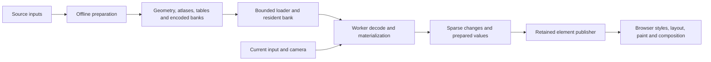

# cssGraphics techniques for cssEarth performance

Source review and focused verification: **2026-09-09**.

Implementation: [prepared point frames and one flight publisher](point-frame-publication.md).

The strongest reusable design is a small main-thread publisher backed by prepared
data: decode bounded amounts of data, produce sparse changes before publication,
retain element identity, and write only the final values that changed. Moving
calculation to a worker is one part of this design. It does not remove the
browser's style, layout, paint, and compositor work after those writes.

For cssEarth, the latest stress trace makes that distinction concrete: an 87.1 ms
main-thread task contained 65.3 ms of style recalculation. A worker reply sent
during that task waited 91.4 ms for delivery, then took only 0.49 ms to handle.
The next optimization must reduce the browser work caused by publication as well
as the work needed to prepare a publication.

## 1. Source scope and evidence

The primary reference is cssGraphics `origin/main` at
[`a16aa807b252607130ec56249d2d9ccd3c4ba802`][graphics-revision], inspected in an isolated
checkout. This includes the recent Cityflow changes. The scope is the main-line
adapters below, not Flowerbox experiments or an abandoned standalone cssmario
checkout. A main-line implementation is not, by itself, proof of which bytes the
live website currently serves; deployment parity was not audited here.

| Reference | Concrete mechanism inspected | Evidence available here |
| --- | --- | --- |
| Super Mario 64 title head | Prepared sparse frame rows, indexed transforms, seek reconstruction, visibility and lighting state | Preparation and player source |
| Galaxy | Separate bank/block windows, worker decoding and materialization, transferable sparse schedules, direct retained writes | Source and 7 passing focused tests |
| Flocks | Checkpoint/delta transport, bounded materialization, cancellation ownership, stable roots | Source and 11 passing tests, including numerical source/projection comparison |
| Cloth | Partial readiness, resumable materialization, bounded main-thread adoption | Source; browser behavior not rerun |
| Cityflow | Factored transform tables, sparse final colors, visibility toggles, deadline scheduling | Source and 7 passing scheduler tests |
| Chaos / Dysts | Prepared trajectories and handoff controls, worker formatting, transferable coordinates | Source and 7 passing transport/playback tests |
| Blackhole / Luminet | Shared prepared trajectory samples plus indexed descriptors and sparse repairs; chunked worker output | Source; numerical/browser qualification not rerun |

The cssEarth comparison uses the working source rooted at `d8d058662f692daf1cbc20a4bc8a4738ba752a30`
plus its existing uncommitted performance changes. These are not all changes in
that commit. The trace matched the existing candidate build's bundle names;
that match is not an exact source-map or clean-commit attribution.

Supplementary local PolyCSS files are identified separately in section 6. They
are untracked workspace evidence, not files claimed to exist at the PolyCSS
repository's HEAD.

## 2. The preparation-to-publication path



The input/camera branch is cssEarth's requirement. A prerecorded adapter can
prepare almost every frame value; cssEarth cannot enumerate every future camera
position. It can prepare source geometry, imagery, hierarchy, atlas mappings and
static metadata, then project those prepared facts for the current view. Moving
that projection between threads does not authorize runtime generation of geometry,
textures, lighting assets or source data.

### Prepared sparse state instead of full frame traversal

**Mario:** the preparer compiles the 820-frame title-head sequence into
`flat-delta-index-v1`. It validates input hashes and topology, fits atlas
transforms during preparation, and records changes by stable shape/leaf index.
The player updates indexed state and writes only the row's changes. A seek walks
intermediate logical rows without DOM publication, collects affected indices,
and publishes their final values once. Lighting and visibility have prepared
state tables rather than being regenerated for normal playback.
Sources: [packet compiler][mario-packet], [player][mario-player], [scene publication][mario-scene].

**Cityflow:** transforms are factored into prepared numeric component tables and
expanded once. Each box tracks its last transform index; unchanged indices avoid
both lookup and publication. Colors have a final-value dictionary and a sparse
transition schedule: frame offsets, face indices and color indices. Normal
playback does not rebuild color declarations for every face on every frame.
Sources: [transform encoding][cityflow-table], [player and state validation][cityflow-player].

**cssEarth application:** preserve prepared identities and make the worker result
describe changed channels, not ask the DOM owner to reconstruct a full scene.
The baseline for a delta must be the last **committed** view. A canceled or
unpublished worker result must not silently advance the baseline. New or newly
visible leaves must receive complete current state before reveal.

This does not mean baking a video of the user's camera path. It means making
the prepared bank and the committed presentation state explicit.

### Transfer ownership explicitly; distinguish numeric buffers from strings

**Galaxy:** a persistent worker registers a prepared bank once. The loader
transfers a whole `Uint8Array` backing buffer; it copies only when the view does
not cover the entire buffer. Bank registration is entered in the pending map
before the first asynchronous boundary, preventing lookahead and boundary loads
from transferring the same buffer twice. The worker verifies decoded length and
SHA before accepting the bank.
Sources: [bank registration and ownership][galaxy-stream], [worker verification][galaxy-worker].

Materialization emits a `Uint32Array` of frame offsets and a `Uint16Array` of
changed leaf indices, transferring their buffers. CSS transforms are strings:
they are **cloned**, not transferred. Galaxy sends them in ordered chunks of up
to 60,000 assignments, with start/chunk/end messages and declared counts. The
receiver validates that sequence and adopts the chunks without flattening them
into another giant array. These chunk sizes are adapter choices, not recommended
cssEarth constants.

**Flocks differs:** it intentionally copies bank bytes with `slice()` before
transferring them. **Chaos differs:** it transfers the coordinate buffer but
returns the transform array in one response. There is no universal zero-copy
transport shared by every adapter. Sources: [Flocks loader][flocks-stream],
[Chaos materializer][chaos-worker].

**cssEarth application:** its planner already retains the prepared world plan in
a persistent worker. The remaining opportunity is the repeatedly cloned
`PlannedWorldContext` response and main-thread work around it. Compact changed
indices and numeric columns may reduce copying and allocation, but strings still
have a cost. Measure payload bytes, clone/delivery delay, adoption time and
publication time separately before choosing an encoding. Do not introduce shared
memory or a generic message framework merely because a worker exists.

### Separate downloaded, decoded, materialized and visible residency

**Galaxy:** bank residency and materialized-block residency are separate. Its
window helpers retain the current and next bank/block, including loop wrap.
Startup can materialize only the initial block; runtime lookahead starts later.
The tests exercise 24-second banks and four-second blocks. This avoids retaining
a whole animation as expanded CSS strings just because its compressed bytes are
already available. Sources: [stream owner][galaxy-stream],
[window tests][galaxy-lookahead].

**Flocks:** the verified/downloaded horizon can be longer than the expanded
transform horizon. Playback requests only two materialized successors, keeps
stable root-to-source correspondence across the loop, and releases obsolete
work through explicit retention and cancellation. Its tests include a stale
prefetch failure arriving after a newer seek: the old failure must not poison
the new request. Sources: [stream lifecycle][flocks-stream],
[playback and lookahead][flocks-player], [lifecycle tests][flocks-tests].

**cssEarth application:** distinguish prepared bytes cached for reuse from images
decoded for an active view and elements participating in browser rendering. A
cache hit is not evidence that publication is cheap. Preserve the current object
contract: one detailed mount, the canonical dataset independent of DPR, and
bounded paging only where that dataset supports it. Optional datasets remain
selection-driven. Applying transport windows to other data is not permission to
change which dataset the user sees or to invent a fallback scene.

### Bound worker work and main-thread adoption separately

**Galaxy and Luminet:** materializers yield between bounded work slices and
report their largest slice. Galaxy's coordinate decoder advances in 1,024-value
steps; its transform passes target roughly 2 ms between cooperative yields.
Luminet also targets 2 ms and uses 4,096-assignment response chunks. These are
cooperative budgets, not hard real-time guarantees.
Sources: [Galaxy worker][galaxy-worker], [Luminet worker][blackhole-worker].

**Cloth:** startup readiness is separate from full completion. An initial 240-frame
buffer can become ready while later frames remain unmaterialized. The caller
resumes the remainder after initial reveal. Worker responses contain 480
transforms per chunk. Main-thread adoption uses idle callbacks, bounded by
24 chunks, approximately 4 ms, or exhausted idle time; the fallback uses a timer.
It fills a preallocated target by validated offsets. Worker unavailability has
a local materialization fallback, so this adapter is not unconditionally
worker-only. Source: [Cloth stream and adoption queue][cloth-stream].

**cssEarth application:** apply this to background prepared-page decoding and
large result adoption. Ordinary camera input must not wait for an idle callback.
The currently visible prepared surface must remain usable while a required
resource is preparing. A view must not reveal partially adopted data. Retain
separate timestamps for fetch, decode, worker readiness, adoption, and reveal so
that an apparently slow worker is not blamed for a busy main thread.

### Bind stable elements once; make publication small

**Galaxy:** the prepared snapshot contains one camera, one scene, and direct
point leaves. Its mount rejects extra point wrappers and per-leaf IDs, classes
or diagnostic data attributes. It binds each leaf's `style` once; the hot
publisher is a direct `styles[leafIndex].transform = value`. Change detection
has already happened before this call. Node identities and runtime creation/
removal are checked explicitly. Source: [snapshot mount and publisher][galaxy-dom].

**Mario and Cityflow:** stable element bindings and integer indices similarly
avoid repeated DOM searches. The PolyCSS Morph target used by Cityflow supplies
guarded direct-property writes, not a scheduler or a per-frame object graph.
Source: [Cityflow target binding][cityflow-player].

**cssEarth application:** keep the retained pools and survivor slot identities
already present. Optimize the hot write set and the browser participation of
those pools. Removing every class is not the same as removing style invalidation;
flattening every wrapper is not safe when a wrapper owns a coordinate space,
stacking order, clipping or interaction behavior. Any structural change needs
the same projected geometry and picking before and after.

### Treat visibility transitions as work

**Cityflow:** prepared whole-box visibility is represented by rows and sparse
toggle indices. Hidden boxes skip transform work; hidden faces skip color
publication. Reappearing elements receive the current state. Direct leaf
`visibility` changes retain the boxes' structural ownership. Mario also avoids
hidden-face lighting writes and repairs state on reveal.
Sources: [Cityflow publication][cityflow-player], [Mario surface state][mario-scene].

This is more precise than “hide invisible things.” A hide/reveal transition can
cost more than the writes it saves, especially when a subtree re-enters style
and layout together. A visibility scheme needs measurements of transition
bursts, style element counts, layout dirtiness, paint bounds and layer work,
not just a lower visible-leaf count.

**cssEarth application:** its pools already use guarded per-leaf visibility
inside 64-leaf blocks, with `display: none` / `contents` at block boundaries.
One stress-trace style pass was scheduled from that block activation path.
That identifies a concrete experiment, not proof that every block gate should
be removed. Keeping the entire dormant catalogue active could be worse.

### Preserve scheduling semantics, not just average throughput

**Cityflow:** the deadline scheduler considers actual callback delivery time,
handles stale rAF timestamps, avoids duplicate publications in one delivery
interval, and rephases after missed deadlines. Its tests include early callbacks,
90 Hz delivery, pause and seek. **Galaxy** also tests variable callback phase and
advances adjacent prepared frames on late callbacks.
Sources: [Cityflow scheduler][cityflow-scheduler], [scheduler tests][cityflow-scheduler-tests],
[Galaxy playback][galaxy-player].

These adapters own finite animation timelines. Copying their adjacent-frame
policy into cssEarth could slow the user's camera or distort inertia. The useful
part is explicit admission, one coherent publication and clear handling of late
results. cssEarth already has one in-flight plan, one completed plan awaiting
publication and coalesced latest input. Preserve that bounded queue and its
committed label/visibility history; do not replace it with speculative plans
that repeatedly invalidate one another.

### Compress repeated prepared structure, not source fidelity

Galaxy's independently decodable coordinate blocks, Flocks' checkpoint/delta
fields, and Cityflow's component tables are different encodings for different
prepared facts. Luminet goes further: multiple particles reference shared
prepared trajectory samples through radius/order/phase descriptors, with sparse
prepared collision repairs. Chaos transports source trajectories and explicit
handoff controls instead of running the source attractor simulation in the
browser. Sources: [Galaxy codec][galaxy-codec], [Flocks codec][flocks-codec],
[Cityflow table][cityflow-table], [Luminet rails][blackhole-rails], [Chaos codec][chaos-codec].

For cssEarth, repeated static marker/atlas metadata and prepared numeric arrays
are plausible candidates for shared tables. Arbitrary view-dependent screen
coordinates are not a finite filmstrip. Any quantization requires an explicit
error bound across the app's zoom range; Flocks' tolerance is evidence for Flocks,
not an acceptable default for planetary coordinates.

## 3. What the latest cssEarth trace establishes

Input: `Trace-20260909T224754.json.gz`.
SHA-256: `e411a2e9b2361f9e3830eca16cd22f22407b4ce6cb694505ab7db2095324ba41`.
The selected page is the candidate on port 4243; the analyzed window is 19.05 s.

| Measurement | Result | Interpretation |
| --- | ---: | --- |
| Presentation interval p50 / p95 / p99 | 16.68 / 33.36 / 59.15 ms | Frequent multi-period intervals remain |
| Main-thread tasks over 50 ms | 7 | All are outside recorded flight intervals |
| Worst main task / its style occupancy | 87.11 / 65.31 ms | Style recalculation dominates this task |
| Elements in that style pass | 1,645 | Large invalidation scope; individual causes are not all identified |
| Style / layerization occupancy over the window | 3,317.35 / 1,414.55 ms | Browser work remains material |
| Worker reply delivery delay / handler | 91.40 / 0.49 ms | Main-thread availability, not a long handler, delayed this reply |
| Image decode occupancy | 98.38 ms | Summed per-thread union; concurrent worker time, not main blocking |

The seven long tasks, ordered by duration:

| Time from window start | Main task | Style occupancy |
| ---: | ---: | ---: |
| 13.857 s | 87.11 ms | 65.31 ms |
| 12.868 s | 77.27 ms | 56.35 ms |
| 17.238 s | 69.74 ms | 46.36 ms |
| 13.245 s | 66.15 ms | 47.74 ms |
| 13.470 s | 58.82 ms | 42.93 ms |
| 17.657 s | 56.89 ms | 35.32 ms |
| 16.822 s | 54.71 ms | 32.70 ms |

The worst style pass's scheduling stack includes the perspective-dolly camera
transform write. The second largest includes retained-block activation. Opacity
fader writes also appear among scheduling origins. Such stacks identify writes
that scheduled work; they do not allocate the full following style cost
exclusively to that function. Detailed per-node invalidation provenance and
original source maps were not captured for this build.

The trace's largest presentation gap is 364.06 ms, but the corresponding interval
has only about 0.52 ms of main-thread work. It is not evidence of a 364 ms
JavaScript stall. Likewise, the 135 `affectsSmoothness` markers are not 135 fully
dropped frames; the frame pipeline records 42 `STATE_DROPPED` states and also
records partial presentation. Nested paint/decode events must not be added twice.

Local processed evidence, including `agent-brief.json`, `analysis.json`,
`report.html` and `stress-costs.png`, is under
`output/performance/trace-briefs/Trace-20260909T224754-e411a2e9/`.
This was the user's manual trace, not a new synchronized video/recorder capture.

## 4. Where cssEarth already matches, and where it does not

| Boundary | Current cssEarth behavior | Remaining opportunity |
| --- | --- | --- |
| Static ownership | Prepared assets, world plan registered once in worker, retained scene | Preserve this; no runtime source/geometry pipeline |
| Request admission | Bounded queue; latest pending input replaces older pending input | Preserve camera, annotations and picking as one captured view |
| Planner output | Whole `PlannedWorldContext` returned through structured clone | Measure sparse output and transferable numeric fields |
| Orbit transform formatting | Already performed in the world planner for planned segments | Do not “move it to a worker” a second time |
| Star point publication | Worker selects hierarchy representatives; main still samples/project points and formats changed transforms | Evaluate producing final changed point values alongside the captured view |
| Retained identity | Survivor slots, equality guards and block pools already exist | Reduce activation/invalidation cost without rebuilding or growing active DOM |
| Fades and selection adoption | Separate publication callbacks can update point state/opacity | Coordinate unchanged fade semantics with the existing frame owner; measure benefit |
| Overview imagery | Prepared image-bank change removes a large coarse-view decode burden | It does not solve recurring style-heavy frames |

Source entry points in this working tree:

- [Planner client](../../packages/renderer/src/universe/world-context/world-context-planner-client.ts)
  and [planner](../../packages/renderer/src/universe/world-context/world-context-planner.ts).
- [World frame queue](../../packages/renderer/src/navigation/world-frame-queue.ts).
- [Baked celestial sky](../../packages/renderer/src/sky/prepared-sky-runtime.ts)
  and [opacity fader](../../packages/renderer/src/stars/opacity-fader.ts).
- [Retained leaf pool](../../packages/renderer/src/rendering/retained-leaf-pool.ts).
- Existing overview image-bank results were recorded in local run output, not in a tracked guide.

## 5. Concrete implementation order and proof

1. **Measure the invalidation boundary already implicated by the trace.** Record
   camera writes, changed point/segment counts, block activation/deactivation,
   fade writes and their publication revision. Compare a bounded pool activation
   change against the existing pool on the same input. Include style element
   counts, dirty layout nodes, paint bounds and layerization. The trace currently
   proves expensive styles; it does not prove the ideal replacement structure.
2. **Make point publication a compact result of the captured view.** Reuse the
   worker's prepared bank and the existing queue. Move repeated point projection
   and value formatting off the main thread where it fits that ownership; return
   changed stable indices and final values. Acknowledge the committed baseline,
   keep full state for reveals, and discard stale results without losing the
   next valid delta. Do not build a second competing camera/scene scheduler.
3. **Bound resource materialization independently.** Apply the Galaxy/Cloth
   readiness and residency boundaries to expensive prepared-data adoption. Keep
   camera interaction responsive and currently visible content valid. Instrument
   resident bytes, main adoption slices and stale/canceled work, not just fetch
   duration or worker execution time.
4. **Qualify each change against the unchanged presentation.** Replay zoom,
   drag, interrupted navigation, reverse zoom and repeated selection. Capture
   synchronized recorder JSON, Chrome trace gzip and video; compare the same
   camera states, visibility, labels, picking and dataset identity. Check long
   tasks, presentation intervals and browser work alongside script savings.

At 60 Hz the full frame has about 16.7 ms, including browser rendering. A cheaper
worker handler is not success if style recalculation still consumes 65 ms.
Conversely, no main-thread stall should be inferred solely from a video gap.
Use repeated comparable runs before claiming a reliable improvement. This
document does not claim that the current app meets its smoothness target.

## 6. Techniques that must not be copied indiscriminately

| Tempting shortcut | What the inspected evidence actually says |
| --- | --- |
| Queue every style write in a generic manager | The local Mario experiment ledger measured a regression for normal playback; sparse producers and local equality guards are the better starting point |
| “cssGraphics never uses CSS variables” | Galaxy uses static palette variables in its prepared stylesheet. Static mount-time configuration differs from per-frame inherited-variable mutation |
| Throttle colors or fades to reduce painting | Flocks staggers root colors every five frames while preserving every transform state. That is an adapter presentation policy, not authorization to alter cssEarth colors or fade cadence |
| Copy Mario's complete runtime | Its title-head interaction path includes triangle fitting for deformation. That path is outside cssEarth's prepared-geometry contract |
| Copy a source animation's late-frame policy into navigation | Finite playback and a user-controlled camera have different time semantics |
| Replace all visibility gates with one rule | Hidden work saved must exceed hide/reveal and activation costs; keeping all dormant nodes active may regress styles |
| Use another renderer to escape CSS costs | Detailed body rendering stays PolyCSS, with the current project's renderer and runtime restrictions |

Sources for the static-variable and cadence distinctions:
[Galaxy palette stylesheet][galaxy-colors], [Flocks color scheduling][flocks-player],
[Mario scene and interaction implementation][mario-scene].

### Local historical publication experiments

The untracked local file
`/Users/ekrof/fed/polycss/notes/software-renderer-bible.md`
(SHA-256 `1d13fe88e7ffe264d6b0269e3f6e3e7cbb4a489322f0604bf2389f6a3278e9ab`)
records a specific Mario CodePen experiment on PolyCSS 0.2.11. Its SR-01 table
reports 180 animation ticks:

| Publication | Attempts | Writes | Overwrites coalesced | Tick p50 / p95 |
| --- | ---: | ---: | ---: | ---: |
| Immediate | 182,564 | 182,564 | 0 | 2.40 / 3.10 ms |
| Deferred manager | 182,564 | 181,490 | 0 | 4.10 / 4.90 ms |

The queue found essentially no within-tick overwrite opportunity. Its bookkeeping
cost exceeded the removed no-ops. The same ledger records a different, successful
SR-08 experiment under controlled 120 ms stalls: simulate every overdue logical
tick but commit only the final retained state. It reports 63.30% fewer catch-up
mutations per due tick, 63.23% lower catch-up callback p95, and pixel-identical
317 numbered commits covering 820 logical ticks. Normal single-tick work was
unchanged. These are historical ledger results, not benchmarks rerun here or
measurements of cssEarth. The current ledger explicitly leaves SR-10 unexecuted.

The local Morph target implementation was also inspected at
`/Users/ekrof/fed/polycss/packages/morph/src/render/preparedDomTarget.ts`
(SHA-256 `081f3e884b09cb9976ea3739333078ad54b10a77f11b31188d68dc1bd48dc158`).
It binds stable elements and guards individual transform, visibility, opacity and
image-position writes. It does not implement a generic batch queue. This source
file is untracked locally; the pinned Cityflow import demonstrates the consumer
contract but does not establish byte identity with that workspace source file.

## 7. Verification performed for this document

**32 tests passed** in approximately 9.0 seconds using Node 24.19.0 and cssGraphics
at the pinned revision. The isolated checkout reused the existing dependencies,
including `@layoutit/polycss` 0.2.11, matching the root package declaration. An
initial run without dependencies failed to resolve that package; rerunning with
the dependency directory attached passed all selected tests. No browser benchmark,
full adapter build or deployment qualification was performed for this document.
The complete local test output is retained at
`output/performance/cssgraphics-tech-a16aa80/focused-tests.log`.

The Flocks test generated 12 seconds of source state and compared decoded values
and visible projected vertices. Fresh results:

| Profile | Compared visible vertices | Maximum projected error | Compressed bytes |
| --- | ---: | ---: | ---: |
| Desktop, 1280 × 720 | 1,119,908 | 0.1002135 px | 597,895 |
| Mobile, 390 × 844 | 228,702 | 0.0445585 px | 295,270 |

Both passed the adapter's 0.25 px projection bound. Maximum position error was
0.015625 source units; maximum velocity error was approximately 0.003906 and hue
error approximately 0.00001525. This is numerical source/projection evidence,
not a screenshot comparison or a browser frame-rate result.
Source: [Flocks transport parity test][flocks-parity].

Reproduce from the pinned cssGraphics checkout with its dependencies available:

```sh
node --test --test-concurrency=1 \
  src/adapters/galaxy/test/cssgalaxy-block-transport.test.mjs \
  src/adapters/galaxy/test/cssgalaxy-lookahead-prefetch.test.mjs \
  src/adapters/galaxy/test/cssgalaxy-playback.test.mjs \
  src/adapters/flocks/test/cssflocks-block-transport.test.mjs \
  src/adapters/flocks/test/cssflocks-transport-parity.test.mjs \
  src/adapters/flocks/test/cssflocks-playback.test.mjs \
  src/adapters/cityflow/test/csscityflow-deadline-scheduler.test.mjs \
  src/adapters/dysts-lab/test/cssdysts-transport.test.mjs
```

Some playback tests inspect source structure rather than timing a browser. Their
passing status must not be promoted to a performance claim. Cityflow also ships a
[full-frame sparse-versus-full color audit][cityflow-audit] that compares decoded
pixels across a complete loop at two viewports. That is a useful verification
pattern; its browser audit was inspected but not executed in this review.

## Source links

All cssGraphics links below pin the same reviewed revision.

[graphics-revision]: https://github.com/layoutit/cssGraphics/tree/a16aa807b252607130ec56249d2d9ccd3c4ba802
[mario-packet]: https://github.com/layoutit/cssGraphics/blob/a16aa807b252607130ec56249d2d9ccd3c4ba802/src/adapters/super-mario-64/stages/playbackPacket.mjs
[mario-player]: https://github.com/layoutit/cssGraphics/blob/a16aa807b252607130ec56249d2d9ccd3c4ba802/src/adapters/super-mario-64/player/playback.ts
[mario-scene]: https://github.com/layoutit/cssGraphics/blob/a16aa807b252607130ec56249d2d9ccd3c4ba802/src/adapters/super-mario-64/player/scene.ts
[galaxy-stream]: https://github.com/layoutit/cssGraphics/blob/a16aa807b252607130ec56249d2d9ccd3c4ba802/src/adapters/galaxy/src/cssgalaxy/preparedStream.mjs
[galaxy-worker]: https://github.com/layoutit/cssGraphics/blob/a16aa807b252607130ec56249d2d9ccd3c4ba802/src/adapters/galaxy/src/cssgalaxy/preparedBlockWorker.mjs
[galaxy-lookahead]: https://github.com/layoutit/cssGraphics/blob/a16aa807b252607130ec56249d2d9ccd3c4ba802/src/adapters/galaxy/test/cssgalaxy-lookahead-prefetch.test.mjs
[galaxy-dom]: https://github.com/layoutit/cssGraphics/blob/a16aa807b252607130ec56249d2d9ccd3c4ba802/src/adapters/galaxy/src/cssgalaxy/polycssScene.mjs
[galaxy-player]: https://github.com/layoutit/cssGraphics/blob/a16aa807b252607130ec56249d2d9ccd3c4ba802/src/adapters/galaxy/src/cssgalaxy/preparedPlayback.mjs
[galaxy-codec]: https://github.com/layoutit/cssGraphics/blob/a16aa807b252607130ec56249d2d9ccd3c4ba802/src/adapters/galaxy/src/shared/cssgalaxy/preparedBlockTransport.mjs
[galaxy-colors]: https://github.com/layoutit/cssGraphics/blob/a16aa807b252607130ec56249d2d9ccd3c4ba802/src/adapters/galaxy/src/cssgalaxy/colorFamilyContract.mjs
[flocks-stream]: https://github.com/layoutit/cssGraphics/blob/a16aa807b252607130ec56249d2d9ccd3c4ba802/src/adapters/flocks/src/cssflocks/preparedStream.mjs
[flocks-player]: https://github.com/layoutit/cssGraphics/blob/a16aa807b252607130ec56249d2d9ccd3c4ba802/src/adapters/flocks/src/cssflocks/preparedPlayback.mjs
[flocks-tests]: https://github.com/layoutit/cssGraphics/blob/a16aa807b252607130ec56249d2d9ccd3c4ba802/src/adapters/flocks/test/cssflocks-playback.test.mjs
[flocks-codec]: https://github.com/layoutit/cssGraphics/blob/a16aa807b252607130ec56249d2d9ccd3c4ba802/src/adapters/flocks/src/shared/cssflocks/preparedBlockTransport.mjs
[flocks-parity]: https://github.com/layoutit/cssGraphics/blob/a16aa807b252607130ec56249d2d9ccd3c4ba802/src/adapters/flocks/test/cssflocks-transport-parity.test.mjs
[cloth-stream]: https://github.com/layoutit/cssGraphics/blob/a16aa807b252607130ec56249d2d9ccd3c4ba802/src/adapters/cloth/src/csscloth/preparedPlaybackStream.mjs
[cityflow-table]: https://github.com/layoutit/cssGraphics/blob/a16aa807b252607130ec56249d2d9ccd3c4ba802/src/adapters/cityflow/src/csscityflow/preparedTransformTable.mjs
[cityflow-player]: https://github.com/layoutit/cssGraphics/blob/a16aa807b252607130ec56249d2d9ccd3c4ba802/src/adapters/cityflow/src/csscityflow/preparedPlayback.mjs
[cityflow-scheduler]: https://github.com/layoutit/cssGraphics/blob/a16aa807b252607130ec56249d2d9ccd3c4ba802/src/adapters/cityflow/src/csscityflow/deadlineScheduler.mjs
[cityflow-scheduler-tests]: https://github.com/layoutit/cssGraphics/blob/a16aa807b252607130ec56249d2d9ccd3c4ba802/src/adapters/cityflow/test/csscityflow-deadline-scheduler.test.mjs
[cityflow-audit]: https://github.com/layoutit/cssGraphics/blob/a16aa807b252607130ec56249d2d9ccd3c4ba802/src/adapters/cityflow/tools/audit-sparse-color-publication.mjs
[chaos-worker]: https://github.com/layoutit/cssGraphics/blob/a16aa807b252607130ec56249d2d9ccd3c4ba802/src/adapters/dysts-lab/src/cssdysts/preparedAssetWorker.mjs
[chaos-codec]: https://github.com/layoutit/cssGraphics/blob/a16aa807b252607130ec56249d2d9ccd3c4ba802/src/adapters/dysts-lab/src/shared/cssdysts/preparedRailTransport.mjs
[blackhole-worker]: https://github.com/layoutit/cssGraphics/blob/a16aa807b252607130ec56249d2d9ccd3c4ba802/src/adapters/blackhole/src/cssblackhole/preparedBlockWorker.mjs
[blackhole-rails]: https://github.com/layoutit/cssGraphics/blob/a16aa807b252607130ec56249d2d9ccd3c4ba802/src/adapters/blackhole/src/shared/cssblackhole/preparedRailTransport.mjs
