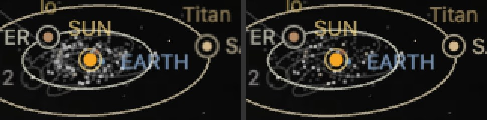
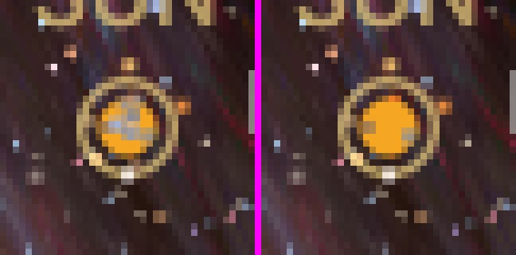

# Marker declutter and a fixed marker order

A headless Chrome trace of a zoom out from the Sun to the farthest zoom (48 wheel notches, 2026-09-30) was idle for most
of its 28 seconds. Its slow stretch was notches 8 to 10, 84 to 582 AU out, where the whole Solar System shrinks to a few
pixels around the Sun. There the page drew 246 to 363 context markers, their centres inside about 40 by 12 pixels.
Counted by their boxes, 5,523 to 21,391 pairs of them overlapped. Every one was published, restyled and composited each
frame, though almost all lay under others.

## Change

- **A marker under another is not drawn** (`packages/renderer/src/universe/world-context/marker-declutter.ts`). After
  label admission, the planner keeps markers in order: the focus, the selection and any hovered or highlighted body;
  then by annotation tier; then those with an admitted label or circle; then by the frame's priority. A marker whose
  drawn dot overlaps a kept one is hidden, and takes no clicks; it returns once clear by 15% more, so a zoom does not
  blink dots. Tier ranks before an admitted label: a label is admitted only once measured, and only a drawn marker is
  measured, so ranking labels first let a labelled moon hide its planet's dot for good. Until this change, crowding hid
  only captions and circles.
- **A fixed marker order** (`createDepthOrder` in `prepared-world-context.ts`). Each body stacks behind the selected
  body's detail when it is farther along the view, in front of it otherwise, so a dot behind a translucent focus (a
  galaxy's image, an atmosphere) stays under it. On each side the order is the bodies' annotation priority, the larger
  body first on a tie. The camera-depth sort it replaces re-ranked every body on each turn's release; a half turn at
  582 AU swapped the order of 13,679 overlapping pairs.
- **Past the system scope, a system is its star** (`setSystemRetired` in `prepared-world-context.ts`). The universe nests
  one inside another: the Solar System in the Milky Way, the Milky Way in the Local Group. The application already
  crosses those levels (its overview scope, `site/overview-context.mts`, with a lower edge on the way back), and passes
  the scope to the universe with each crossing. Once it leaves the system for the Milky Way's (about 6,500 AU from the
  Sun on the way out, 670 AU on the way back), every system retires through the path a system faded past already took,
  and its star stands for it. Inside the system the existing fades still apply. Before, the Solar System's bodies faded
  only with the camera's distance, to a light-year: four trans-Neptunian objects were still drawn at 27,000 AU. Past the
  galaxy's scope (the Local Group's and beyond), the galaxy's placed stars retire the same way and the Sun alone stands
  for them.
- **A retired level leaves the page.** Once its retiring frame has hidden them and the camera is not coasting, a retired
  system's members leave the DOM: marker groups, orbit roots and their stroke groups in the shared orbit svg
  (`PreparedOrbitLines.detach`), and so do the placed stars past the galaxy's scope. A return attaches each again as it
  shows. Before, a marker group stayed mounted, hidden, from its first showing until the page closed: zoomed out from the
  Sun to the Local Group, 435 marker groups were mounted and none drawn.
- **An overview page frames its camera before the world plans** (`frameInitialView` in `site/scene/scene-activation.mts`).
  An overview or satellite-system page opened without a saved view mounts its body's scene, then moves the camera to the
  overview. The world context planned one frame between the two, from the Sun's default view, and its planner fetched
  the 40 Solar System orbit banks that view would draw, on the Nearby Universe page among others. The page now frames
  its overview first.
- **A system card lays out only the rows in view** (`site/shell/maps-shell.css`). Past about 580 AU the card lists the
  Sun's system: 549 rows, 682 KB of HTML, about five shown at once. Inserted mid-zoom, the list laid out 7,649 objects
  in one frame. Its rows now take `content-visibility: auto`.

## Results

| | Main | This change |
| --- | --- | --- |
| Markers drawn at 220 AU | 385 | 162 to 165 |
| Markers drawn at 578 AU | 246 | 65 |
| Overlapping pairs swapped by a half turn at 578 AU | 13,679 | 31 |
| Slow stretch frame, median / 95th percentile / worst | 6.6 / 13.7 / 29.1 ms | 5.5 / 12.4 / 13.0 ms |
| Largest layout of the zoom | 7,649 objects | 596 objects |
| Solar System bodies drawn at 10,600 and 27,000 AU | 4 and 4 | none: the Sun |
| Zoomed out from the Sun to the Milky Way's level (3 ly): marker groups mounted (drawn), orbit groups, elements | 398 (21), 70, 2,803 | 20 (20), 0, 952 |
| Zoomed on to the Local Group's level: marker groups mounted (drawn), orbit groups, elements | 435 (0), 70, 3,942 | 1 (0), 0, 1,866 |
| Milky Way page opened directly: marker groups mounted (drawn), elements | 40 (40), 2,260 | 15 (15), 2,160 |

The five reference views (Earth, Sun, Milky Way, Nearby Universe, Observable Universe) at threshold 0: Sun, Nearby
Universe and Observable Universe are identical. Earth changes 17 pixels, two faint dots under brighter ones. Milky Way
changes at its centre, where the neighbouring stars' dots no longer draw over the Sun's:

The Solar System card renders the same pixels with and without `content-visibility`, at its top and 3,000 px down.

## Limits

Headless Chrome on an M-series Mac; no iPad trace. Timings are one run each, and a single frame varies between runs.
Which of Saturn's and Rhea's captions wins their collision at 220 AU depends on the zoom's timing, on main and with
this change alike.
