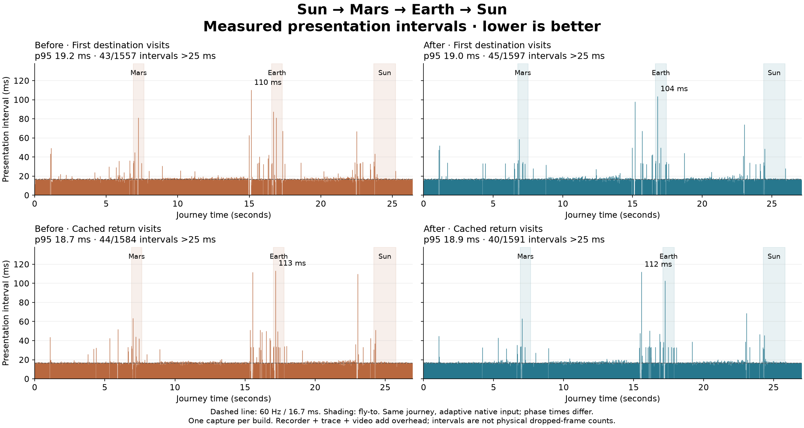

# Navigation style ownership

Changing the selected object used to change CSS scope around the persistent
world as well as the selected detail. The Sun's `.planet-stage[data-object-id]`
selectors were invalidating retained world `<s>` leaves during navigation.
The detail diagnostic snapshot also walked those world leaves again at each
arrival. A viewport observer then measured geometry on the following animation
frame, after scene writes had dirtied style.

The application now owns a stationary world presentation host. The selected
detail keeps its existing stage, input registry, viewport and camera. World
presentation lives alongside the detail stage, outside its changing object
scope. Existing world depth ranks remain below or above the detail's reserved
0–3 band. Exactly one detailed object and one camera remain mounted; the world
is neither removed nor simplified.

ResizeObserver publishes geometry in its after-layout callback. Window resize
and scroll retain their scheduled fallback. Sidebar filtering reuses the result
of an unchanged query, preserves the selected category on reopening, and resets
scroll only after an observed scroll. Diagnostic membership is captured once
per owner, with detail/world totals reported separately. Some measured savings
therefore remove recording overhead as well as application work.

No surface geometry, texture, atlas, color, opacity, camera math, fly-to duration,
or annotation visibility policy is changed. One static wrapper is added.

## Final measured result



| Journey | p95 before → after | Maximum before → after | Intervals >25 ms before → after |
| --- | --- | --- | --- |
| First destination visits | 19.240 → 19.039 ms | 110.140 → 103.531 ms | 43/1557 → 45/1597 |
| Cached visits | 18.695 → 18.881 ms | 113.125 → 111.992 ms | 44/1584 → 40/1591 |

The final `verified-world-boundary` capture confirms the earlier handoff-work
reduction: the cold Mars-to-Sun overview callback is 14.519 ms versus 39.790 ms
before, and layout is 6.407 ms versus 19.441 ms. The cached callback is 14.224 ms
versus 36.508 ms, and layout is 6.863 ms versus 18.628 ms.

The aggregate presentation improvement is **modest and mixed**. The remaining
Earth arrival interval includes about 33 ms waiting for compositor commit in
both passes, with 16–18 ms of style recalculation. The worst cached interval
still reaches 112 ms during overview handoff. This PR removes measured waste;
it does not establish smooth navigation or a repeatable overall frame-rate win.

The final recorder-to-trace clock drift is 29 microseconds, and the video
PTS error is at most 1.14 ms. All 2,306 capture frames are encoded. There are no
page errors or reported trace loss. See [evidence.json](evidence.json) for
source/trace/video/recorder hashes and [comparison.json](comparison.json) for
the plotted measurements.

## Reproduction and provenance

The baseline is main at `3badfb535c106afa80a0888a7e9f488f0d06506b` (PR #50).
The isolated checkout is `cssEarth-navigation-performance`. Captures use the
performance build, Chrome Canary 155.0.8048.0, 1995 × 1236 CSS pixels and DPR 2.
The journey uses native wheel and pointer input: Sun → zoom out → Mars → zoom
out → Earth → zoom out → Sun. The second pass repeats in the same document.
First destination visits begin after Sun startup; this does not measure a cold
initial Sun page load. Input is adaptive, so phase lengths can differ.

Each capture folder under `output/playwright/navigation-consistency/` contains
the recorder JSON, `trace.json.gz`, timestamped `journey.mp4`, synchronization
receipt, source patch, served JS/CSS byte hashes and copies, native inputs, and
analysis. Raw media and full traces remain local rather than entering Git.

```sh
pnpm build:performance
node tools/performance/navigation-capture.mjs unique-capture-name
python tools/performance/navigation-analysis.py output/playwright/navigation-consistency/unique-capture-name
python tools/performance/navigation-comparison.py BASELINE_CAPTURE AFTER_CAPTURE OUTPUT
node tools/performance/navigation-visual-check.mjs BASELINE_CAPTURE OUTPUT
```

Python analysis uses matplotlib and Pillow. Capture uses local Chrome Canary
and ffmpeg/ffprobe. Capture refuses to overwrite an existing label and owns its
headless browser and preview server. It does not intercept requests, override
the camera, or disable browser caches. The separate visual comparison fixes
camera states and serves hash-verified baseline JS/CSS; its reference HTML is
the current shared HTML with the new wrapper reversed. It is not an archived
baseline HTML response or a native graphics oracle.

## Experiments and limits

`baseline-3badfb535` is the original valid baseline. `isolated-world-v3` is the
first valid world-boundary capture. In the recurring Mars-to-Sun overview
handoff, its animation callback decreased from 39.790 to 14.109 ms and layout
from 19.441 to 6.783 ms. Its overall worst intervals still reached 108 ms cold
and 105 ms cached. These are individual measured events, not average user gains.

The `sidebar-retention-v1` content-visibility experiment was rejected. The
`viewport-phase-v2` trace overflowed its buffer and lacks the stop anchor; its
timing is **INVALID**. Its retained early invalidation records identify the
Sun-scoped selector traversing world leaves, but it is excluded from timing
comparisons. `final-style-retention` tested keeping visited object stylesheets;
it did not show a clear aggregate benefit (120 ms cold / 108 ms cached maximum)
and that change was removed. Its worst Earth interval includes 53.71 ms in
`LayerTreeHost::WaitForCommitCompletion`; this is not application JavaScript
execution. Raster/image work and screencast encoding coexist in that window.
Their individual causal contribution remains unproven.

Recorder, CPU profiling and screencast add overhead. Presentation intervals
are not a count of physically dropped display refreshes. Small differences
between single runs do not establish a repeatable improvement. The complete
smooth-navigation target remains unmet.

## Validation scope

- Renderer: 432 tests passed across 68 files; renderer typecheck passed.
- Shell/router/page-data/recorder integration: 77 tests passed, including query
  reuse, category reopening, scroll reset, input ownership and focus cleanup.
- Production executable closure test passed; diagnostic observations are removed.
- Performance-mode Astro build: 814 pages passed.
- Desktop Sun, overview, search, Earth, portrait Earth and cached Sun visual
  checks preserve camera bounds and focal length. The final overview is pixel
  identical; Earth/search/portrait differ by at most 1/255. A 28 × 25 device-pixel
  region of the small Sun thumbnail differs by up to 7/255 in the final repeat;
  no pixel differs by more than 16/255. Earlier captures differed by at most
  1/255. This small thumbnail variation is retained in the evidence rather than
  described as exact pixel parity. Detailed-stage descendants change from 109,264 to 525
  for Sun and 109,727 to 988 for Earth; shared world membership remains present.
- The inherited eight-case depth-transport validation is split into eight named
  tests, retaining its assertions without increasing the individual timeout.

This is focused browser evidence for Sun/Mars/Earth, not all-object browser
conformance. During the work, main advanced to `bd265cf3a` with comet additions
(PR #89); those new assets/catalog entries are outside this baseline. The
measurements must not be relabeled as measurements of that newer main.
