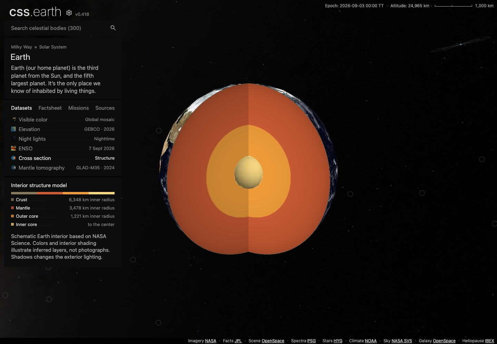

# Planet cross-section repair and Earth mantle tomography

Earth has two separate cutaway datasets:

- **Cross section** retains the original schematic NASA Science layer colors,
  structure legend and thumbnail. All 160 image assets from the earlier repair
  head (`905cb1064`) remain byte-for-byte unchanged.
- **Mantle tomography** adds GLAD-M35 r0.1 (2024) values on the mantle's two cut
  planes and outer shell. Its signed, unshaded palette shows vertically polarized
  shear-wave velocity relative to the area-weighted global mean at the same
  depth. Crust and core remain schematic. The model is not a temperature map.

Both datasets use the same retained cutaway geometry and shared camera. A
selection changes prepared texture addresses and dataset content; returning to
Cross section restores the original textures without remounting anything.
Each has its own thumbnail, legend, source and independent selection.

| Original Cross section | Separate Mantle tomography |
| --- | --- |
|  |  |

## Scientific source and delivery

The checked-in 520 KB numeric subset, upstream metadata, original NetCDF hash,
deterministic extractor, coordinate convention and interpretation are documented
in [Earth's source record](../src/planets/earth/SOURCE.md#mantle-tomography-source-and-interpretation).
Six independently decoded source anchors and six full-volume texel anchors check
velocity, reference mean, sign, latitude, depth and rendered palette. Extraction
reproduced byte for byte from the upstream NetCDF. Other tests check missing
depths, geographic registration and stale-cut rejection.

The 343.8 MB original volume is used only for source extraction. Browser assets
are prepared ahead of time: WebP q90 for the scientific section and shell,
lossless alpha for the poles. The canonical section texture is 111,944 bytes.
Five additional files total **298,921 bytes**, increasing the installed Earth
image inventory by that amount. This is an inventory delta, not a measured
initial-page transfer; it excludes JSON transport. The original structure files
are preserved. [Compression comparison](evidence/planet-cross-sections/tomography/encoding.json)
and [immutable delivery receipt](evidence/planet-cross-sections/tomography/delivery.json).

## Final validation

The branch integrates `main` at `ef2d27b2d`, including the updated dataset cards.

- **60 dataset interactions across all eight planets at DPR 1 and 2**, plus eight
  initial-shell checks, passed. Earth was rerun after adding the second dataset;
  the other seven bodies' prepared fingerprints are unchanged. Every dataset
  was selected and dragged; all four cutaway datasets passed Shadows checks.
  [Browser matrix](evidence/planet-cross-sections/tomography/planet-matrix.json).
- **46 focused tests passed**, including the independent scientific anchors,
  structure/tomography/restored-structure transaction, source lineage, camera,
  polar caps and Mercury lighting. Both typechecks passed, and the final
  production build generated all 301 pages.
- All eight planets passed source closure, asset assembly, prepared leaf-layout
  census and runtime-ownership checks.
  [Contracts](evidence/planet-cross-sections/tomography/contracts.json).
- Production browser checks dragged both Earth datasets and switched back to
  structure, confirming original geometry nodes stay connected and the correct
  textures return. Mercury and Saturn's unchanged cutaways also have production
  drag evidence. [Production receipt](evidence/planet-cross-sections/tomography/production.json).
- A fresh install downloaded and verified all 165 Earth images. The five new
  immutable URLs passed independent HEAD checks.
  [Delivery](evidence/planet-cross-sections/tomography/delivery.json).

[Validation summary](evidence/planet-cross-sections/tomography/validation.json)
and [final fingerprints](evidence/planet-cross-sections/tomography/fingerprints.json)
bind these checks to the implementation and prepared data. Browser evidence is
from desktop Chromium at two densities, not physical mobile hardware. The
aggregate suite was not rerun for this addition; its earlier failures and
memory limits are documented below, so this is not a claim of aggregate readiness.
The existing shared-view URL format saves camera and playback, but does not
encode dataset selection; reloading a link returns to the default dataset.

## Earlier repair evidence (`905cb1064`)

The earlier eight-planet repair evidence below predates tomography. The final
tomography validation and integrated screenshots are recorded separately so the
old schematic images are not presented as evidence of the new data textures.

Earth's cutaway no longer cancels the shared camera rotation. Selecting Cross section makes a 650 ms north-up entry into the cut, preserving the current zoom; subsequent drag rotates the same retained model as the exterior. The mantle and outer-core polar atlases now remove the same wedge as their shells, so those caps no longer cover the opening.

Earth and Mercury now select complete prepared lit/unlit exterior banks when Shadows changes. Schematic layers retain illustrative shape shading; Earth's scientific mantle colors use the legend without lighting tint. No runtime geometry or imagery generation was added. Saturn's existing cutaway was checked without changing its rendering.


## Eight-planet browser sweep

The existing registry-derived conformance harness exercises every authored dataset at a 1440 × 1000 viewport, at DPR 1 and 2. It selects the real controls, drags the rendered geometry, verifies that the original leaves remain connected, checks scene/DOM counts, and rejects browser/network errors. Cross sections additionally require a visible image change when Shadows switches.

| Planet | Datasets at each DPR | Selection and drag | Cross-section Shadows |
| --- | ---: | --- | --- |
| Mercury | 4 | Pass | Pass |
| Venus | 3 | Pass | No cross section |
| Earth | 5 | Pass | Pass |
| Mars | 3 | Pass | No cross section |
| Jupiter | 3 | Pass | No cross section |
| Saturn | 5 | Pass | Pass |
| Uranus | 3 | Pass | No cross section |
| Neptune | 3 | Pass | No cross section |

That is 58 dataset runs, plus eight initial-shell checks. [Measurements](evidence/planet-cross-sections/planet-matrix.json) and [all eight default views](evidence/planet-cross-sections/all-planets.png) are retained. Separate production-build checks used native drag on all three cross sections and verified that their original geometry nodes remained connected: [receipts](evidence/planet-cross-sections/production-drag.json), [Earth entry](evidence/planet-cross-sections/earth-production.png), [Mercury](evidence/planet-cross-sections/mercury-production.png), [Saturn](evidence/planet-cross-sections/saturn-production.png).

To repeat the browser sweep with a development server:

```sh
for planet in mercury venus earth mars jupiter saturn uranus neptune; do
  CSSEARTH_CONFORMANCE_CASES=initial-shell,dataset-interactions,dataset-interactions-dpr-2 \
  CSSEARTH_CONFORMANCE_OUTPUT=output/playwright/cross-sections/$planet \
    node site/test/planet-browser-conformance.mjs http://127.0.0.1:4210 "$planet" || exit $?
done
```

## Preparation, delivery and other checks

- Full Earth and Mercury asset preparation completed. All 300 object envelopes were regenerated, and all 301 Astro pages built successfully with `NODE_OPTIONS=--max-old-space-size=12288`. Production asset assembly verified all eight planets.
- Both preparation and renderer typechecks passed. The focused Earth/asset-parity tests passed (33), as did the new Mercury lighting transaction test. Shared router/lifetime checks passed (35).
- All eight source/runtime asset closure checks passed (24). Seven existing authored-content manifest pins were stale; this change synchronizes them with the already-committed content, without changing those datasets.
- The prepared texture-layout census and runtime-ownership audit also passed for all eight planets: [contract receipt](evidence/planet-cross-sections/contracts.json).
- The 22 changed files were published to immutable content-hash URLs. A fresh install downloaded and verified all 283 Earth/Mercury files, followed by HEAD verification of the 22 changed files. [Delivery receipt](evidence/planet-cross-sections/delivery.json).
- Earth’s total installed image inventory grows by 2,662,796 bytes; Mercury’s by 6,931,370 bytes. These are inventory sizes, not initial-page transfer measurements. Every previously accepted Mercury and Venus image/chart byte is retained.

The aggregate suites are **not green**. The initial planet suite had 326 passes and 23 failures; one camera assertion was updated for the intentional Earth entry and passed in the focused rerun. The other 22 failing test names reproduce on the unchanged `e018ba392` base. The platform suite had 2,059 passes and eight failures: six assertions also reproduce on the base, while two registry-wide audit processes exceeded Node's default heap. These older fixture/retired-feature failures and audit limits are listed in the [baseline receipt](evidence/planet-cross-sections/baseline-failures.json); this PR does not claim aggregate readiness.

[Implementation and prepared-data fingerprints](evidence/planet-cross-sections/fingerprints.json) bind this evidence to the repaired sources. Browser evidence covers desktop Chrome at two densities, not physical mobile hardware.
