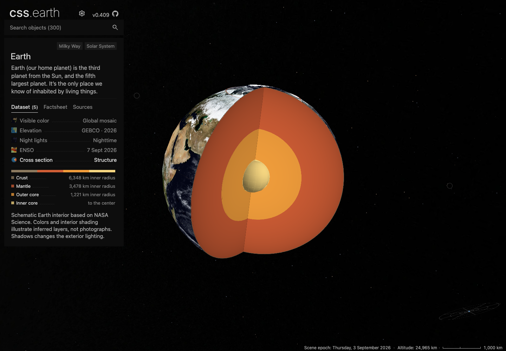

# Planet cross-section repair

Earth's cutaway no longer cancels the shared camera rotation. Selecting Cross section makes a 650 ms north-up entry into the cut, preserving the current zoom; subsequent drag rotates the same retained model as the exterior. The mantle and outer-core polar atlases now remove the same wedge as their shells, so those caps no longer cover the opening.

Earth and Mercury now select complete prepared lit/unlit exterior banks when Shadows changes. Their inferred interior layers retain illustrative shape shading. No runtime geometry or imagery generation was added. Saturn's existing cutaway was checked without changing its rendering.



## Eight-planet browser sweep

The existing registry-derived conformance harness exercises every authored dataset at a 1440 × 1000 viewport, at DPR 1 and 2. It selects the real controls, drags the rendered geometry, verifies that the original leaves remain connected, checks scene/DOM counts, and rejects browser/network errors. Cross sections additionally require a visible image change when Shadows switches.

| Planet | Datasets at each DPR | Selection and drag | Cross-section Shadows |
| --- | ---: | --- | --- |
| Mercury | 4 | Pass | Pass |
| Venus | 3 | Pass | No cross section |
| Earth | 5 | Pass | Pass |
| Mars | 3 | Pass | No cross section |
| Jupiter | 3 | Pass | No cross section |
| Saturn | 5 | Pass | Pass |
| Uranus | 3 | Pass | No cross section |
| Neptune | 3 | Pass | No cross section |

That is 58 dataset runs, plus eight initial-shell checks. [Measurements](evidence/planet-cross-sections/planet-matrix.json) and [all eight default views](evidence/planet-cross-sections/all-planets.png) are retained. Separate production-build checks used native drag on all three cross sections and verified that their original geometry nodes remained connected: [receipts](evidence/planet-cross-sections/production-drag.json), [Earth entry](evidence/planet-cross-sections/earth-production.png), [Mercury](evidence/planet-cross-sections/mercury-production.png), [Saturn](evidence/planet-cross-sections/saturn-production.png).

To repeat the browser sweep with a development server:

```sh
for planet in mercury venus earth mars jupiter saturn uranus neptune; do
  CSSEARTH_CONFORMANCE_CASES=initial-shell,dataset-interactions,dataset-interactions-dpr-2 \
  CSSEARTH_CONFORMANCE_OUTPUT=output/playwright/cross-sections/$planet \
    node site/test/planet-browser-conformance.mjs http://127.0.0.1:4210 "$planet" || exit $?
done
```

## Preparation, delivery and other checks

- Full Earth and Mercury asset preparation completed. All 300 object envelopes were regenerated, and all 301 Astro pages built successfully with `NODE_OPTIONS=--max-old-space-size=12288`. Production asset assembly verified all eight planets.
- Both preparation and renderer typechecks passed. The focused Earth/asset-parity tests passed (33), as did the new Mercury lighting transaction test. Shared router/lifetime checks passed (35).
- All eight source/runtime asset closure checks passed (24). Seven existing authored-content manifest pins were stale; this change synchronizes them with the already-committed content, without changing those datasets.
- The prepared texture-layout census and runtime-ownership audit also passed for all eight planets: [contract receipt](evidence/planet-cross-sections/contracts.json).
- The 22 changed files were published to immutable content-hash URLs. A fresh install downloaded and verified all 283 Earth/Mercury files, followed by HEAD verification of the 22 changed files. [Delivery receipt](evidence/planet-cross-sections/delivery.json).
- Earth’s total installed image inventory grows by 2,662,796 bytes; Mercury’s by 6,931,370 bytes. These are inventory sizes, not initial-page transfer measurements. Every previously accepted Mercury and Venus image/chart byte is retained.

The aggregate suites are **not green**. The initial planet suite had 326 passes and 23 failures; one camera assertion was updated for the intentional Earth entry and passed in the focused rerun. The other 22 failing test names reproduce on the unchanged `e018ba392` base. The platform suite had 2,059 passes and eight failures: six assertions also reproduce on the base, while two registry-wide audit processes exceeded Node's default heap. These older fixture/retired-feature failures and audit limits are listed in the [baseline receipt](evidence/planet-cross-sections/baseline-failures.json); this PR does not claim aggregate readiness.

[Implementation and prepared-data fingerprints](evidence/planet-cross-sections/fingerprints.json) bind this evidence to the repaired sources. Browser evidence covers desktop Chrome at two densities, not physical mobile hardware.
