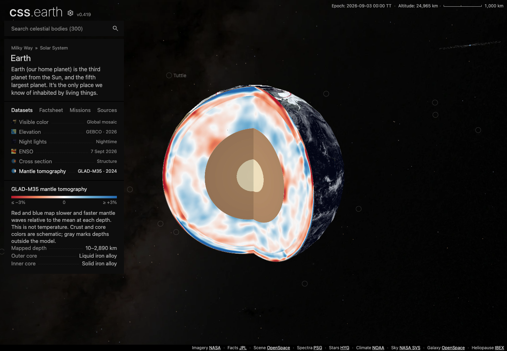

# Planet cross-section repair and Earth mantle tomography

Earth has two separate cutaway datasets. **Cross section** keeps the original
schematic layer palette. **Mantle tomography** maps GLAD-M35 r0.1 mantle values,
with muted bronze and ivory for the schematic cores.

The cut now passes through the inner core, replacing the ball that protruded
through the section. Matching polar openings remove the same wedge throughout.
Both datasets enter at 145° E, 20° N, exposing more of the outer globe at the same
zoom. Labels explain the liquid outer core and solid inner core. The scientific
mantle values and color transfer are unchanged by this polish.

| Previous tomography (`3e5d97551`) | Revised tomography |
| --- | --- |
|  |  |

Matched 1440 × 1000 production captures at 24,965 km altitude, with motion paused.
The entry angle intentionally differs. [Production motion clip](evidence/planet-cross-sections/polish/earth-cutaways.mp4),
[original-color structure](evidence/planet-cross-sections/polish/earth-structure.png)
and [tomography after a drag](evidence/planet-cross-sections/polish/earth-tomography-drag.png).

Both datasets use the same retained geometry and shared camera. Selection changes
prepared textures and dataset content; returning to Cross section restores its
textures without remounting. The revised cut removes 30 hidden inner-core faces:
516 interior leaves instead of 546. Exterior geometry and materials are unchanged.
No runtime rendering feature or shared shell change was added for this polish.

## Scientific source and delivery

The checked-in 520 KB numeric subset, upstream metadata, original NetCDF hash,
deterministic extractor, coordinates and interpretation are documented in
[Earth's source record](../src/planets/earth/README.md#mantle-tomography-source-and-interpretation).
The signed, unshaded mantle palette shows vertically polarized shear-wave speed
relative to the area-weighted global mean at the same depth. Red is slower and
blue faster; it is not temperature. Crust and core are schematic. Gray marks
depths outside the 10–2,890 km model coverage.

Six independently decoded source anchors and six full-volume texel anchors check
velocity, reference mean, sign, latitude, depth and palette. Extraction reproduced
byte for byte from the upstream NetCDF. The 343.8 MB original volume is used only
for source extraction. Runtime textures are prepared offline, using WebP q90 for
the scientific section and shell and lossless alpha for the poles.

The final section atlas is **110,362 bytes**. This polish adds **235,786 bytes** to
the previous head's installed Earth image inventory; the cumulative addition over
repair head `905cb1064` is **534,707 bytes**. The inventory totals 169 images and
39,811,597 bytes. These are inventory deltas, not measured initial-page transfers;
JSON is excluded. Of the repair head's 160 images, 159 remain byte-identical. Only
the original inner-core pole atlas changes to open the cut.
[Initial compression comparison](evidence/planet-cross-sections/tomography/encoding.json)
and [final immutable delivery receipt](evidence/planet-cross-sections/polish/delivery.json).

## Final validation

The final branch integrates `main` at `b1c488c9b`, including Borrelly and the updated dataset cards. Conflicts were limited to Mercury’s prepared runtime and descriptor; the repaired runtime was retained and its shared navigation markers rebound to the new atlas.

- **60 dataset interactions across all eight planets at DPR 1 and 2**, plus eight
  initial-shell checks, passed. Earth and Mercury were rerun after the final integration. The other six
  bodies retain earlier checks; a full runtime comparison proves that integration
  changes only shared navigation marker indices/counts, with body and dataset
  rendering unchanged. Every dataset was selected and dragged; all four cutaway datasets
  passed Shadows checks. [Browser matrix](evidence/planet-cross-sections/polish/planet-matrix.json).
- **46 refreshed focused tests passed**, including scientific anchors, retained
  dataset switching, source lineage, camera and decoded inner-core polar openings.
  The earlier Mercury lighting test also passed. Both typechecks were refreshed,
  and the integrated production build generated all 302 pages.
- All eight planets passed fresh source closure, prepared leaf-layout census and
  runtime-ownership checks. Production asset assembly was refreshed for all eight
  planets. [Contracts](evidence/planet-cross-sections/polish/contracts.json).
- Fresh production browser checks dragged both Earth datasets and switched back
  to structure, confirming retained geometry and restored textures. The clip uses
  native mouse input. Unchanged Mercury and Saturn cutaways retain earlier
  production drag evidence. [Production receipt](evidence/planet-cross-sections/polish/production.json).
- A fresh install downloaded and hash-verified all **169 Earth images**. The seven
  changed immutable URLs passed independent HEAD and size checks.
  [Delivery](evidence/planet-cross-sections/polish/delivery.json).

[Validation summary](evidence/planet-cross-sections/polish/validation.json) and
[final fingerprints](evidence/planet-cross-sections/polish/fingerprints.json) bind
these checks to the implementation and prepared data. Browser evidence is desktop
Chromium at two densities, not physical mobile hardware. The aggregate suite was
not rerun for this polish; earlier failures and memory limits are documented below.
The existing shared-view URL format saves camera and playback but does not encode
dataset selection; reloading a link returns to the default dataset.

## Earlier repair evidence (`905cb1064`)

The earlier eight-planet repair evidence below predates tomography. The final
tomography validation and integrated screenshots are recorded separately so the
old schematic images are not presented as evidence of the new data textures.

Earth's cutaway no longer cancels the shared camera rotation. Selecting Cross section makes a 650 ms north-up entry into the cut, preserving the current zoom; subsequent drag rotates the same retained model as the exterior. The mantle and outer-core polar atlases now remove the same wedge as their shells, so those caps no longer cover the opening.

Earth and Mercury now select complete prepared lit/unlit exterior banks when Shadows changes. Schematic layers retain illustrative shape shading; Earth's scientific mantle colors use the legend without lighting tint. No runtime geometry or imagery generation was added. Saturn's existing cutaway was checked without changing its rendering.


## Eight-planet browser sweep

The existing registry-derived conformance harness exercises every authored dataset at a 1440 × 1000 viewport, at DPR 1 and 2. It selects the real controls, drags the rendered geometry, verifies that the original leaves remain connected, checks scene/DOM counts, and rejects browser/network errors. Cross sections additionally require a visible image change when Shadows switches.

| Planet | Datasets at each DPR | Selection and drag | Cross-section Shadows |
| --- | ---: | --- | --- |
| Mercury | 4 | Pass | Pass |
| Venus | 3 | Pass | No cross section |
| Earth | 5 | Pass | Pass |
| Mars | 3 | Pass | No cross section |
| Jupiter | 3 | Pass | No cross section |
| Saturn | 5 | Pass | Pass |
| Uranus | 3 | Pass | No cross section |
| Neptune | 3 | Pass | No cross section |

That is 58 dataset runs, plus eight initial-shell checks. [Measurements](evidence/planet-cross-sections/planet-matrix.json) and [all eight default views](evidence/planet-cross-sections/all-planets.png) are retained. Separate production-build checks used native drag on all three cross sections and verified that their original geometry nodes remained connected: [receipts](evidence/planet-cross-sections/production-drag.json), [Earth entry](evidence/planet-cross-sections/earth-production.png), [Mercury](evidence/planet-cross-sections/mercury-production.png), [Saturn](evidence/planet-cross-sections/saturn-production.png).

To repeat the browser sweep with a development server:

```sh
for planet in mercury venus earth mars jupiter saturn uranus neptune; do
  CSSEARTH_CONFORMANCE_CASES=initial-shell,dataset-interactions,dataset-interactions-dpr-2 \
  CSSEARTH_CONFORMANCE_OUTPUT=output/playwright/cross-sections/$planet \
    node site/test/planet-browser-conformance.mjs http://127.0.0.1:4210 "$planet" || exit $?
done
```

## Preparation, delivery and other checks

- Full Earth and Mercury asset preparation completed. All 300 object envelopes were regenerated, and all 301 Astro pages built successfully with `NODE_OPTIONS=--max-old-space-size=12288`. Production asset assembly verified all eight planets.
- Both preparation and renderer typechecks passed. The focused Earth/asset-parity tests passed (33), as did the new Mercury lighting transaction test. Shared router/lifetime checks passed (35).
- All eight source/runtime asset closure checks passed (24). Seven existing authored-content manifest pins were stale; this change synchronizes them with the already-committed content, without changing those datasets.
- The prepared texture-layout census and runtime-ownership audit also passed for all eight planets: [contract receipt](evidence/planet-cross-sections/contracts.json).
- The 22 changed files were published to immutable content-hash URLs. A fresh install downloaded and verified all 283 Earth/Mercury files, followed by HEAD verification of the 22 changed files. [Delivery receipt](evidence/planet-cross-sections/delivery.json).
- Earth’s total installed image inventory grows by 2,662,796 bytes; Mercury’s by 6,931,370 bytes. These are inventory sizes, not initial-page transfer measurements. Every previously accepted Mercury and Venus image/chart byte is retained.

The aggregate suites are **not green**. The initial planet suite had 326 passes and 23 failures; one camera assertion was updated for the intentional Earth entry and passed in the focused rerun. The other 22 failing test names reproduce on the unchanged `e018ba392` base. The platform suite had 2,059 passes and eight failures: six assertions also reproduce on the base, while two registry-wide audit processes exceeded Node's default heap. These older fixture/retired-feature failures and audit limits are listed in the [baseline receipt](evidence/planet-cross-sections/baseline-failures.json); this PR does not claim aggregate readiness.

[Implementation and prepared-data fingerprints](evidence/planet-cross-sections/fingerprints.json) bind this evidence to the repaired sources. Browser evidence covers desktop Chrome at two densities, not physical mobile hardware.
