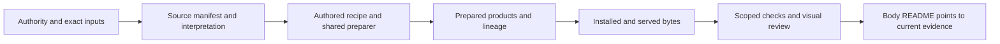

# Celestial provenance, evidence and documentation contract

Status: **PROPOSED v1 — 2026-09-09**. Owner: **PROVENANCE DOCUMENTATION**.
The PR proposes adoption for new or changed work when merged; legacy packages
migrate incrementally, with the four entry-point pilots included here.

This document specifies the proposed contributor contract. “Must” describes
behavior after adoption; it does not claim that existing packages comply today.
See the [audit](audits/2026-09-09/AUDIT.md) and [templates](TEMPLATES.md).

## 1. One traceable chain

For every delivered view or scientific claim, a contributor must be able to
follow the chain from original authority to the interpretation, preparation,
delivered bytes and the evidence supporting the stated result.

This applies to the Sun, planets, moons, dwarf planets, asteroids, comets and
future detailed bodies in `OBJECTS`. Classification does not create another
registry or documentation contract. Catalog-only entries use their catalog's
source owner until they acquire an object package. Shared astronomy, sky,
spacecraft artwork and catalog facts retain their existing owners and are
linked as dependencies rather than copied into every body.

The application contract remains unchanged: one shared shell, camera, generic
adapter and active retained scene; body data owns scientific interpretation;
preparation owns static work. Documentation must describe the actual authored
package and shared preparer. It must not scaffold a private runtime or shell.
Saturn remains the accepted visual-quality reference under `AGENTS.md`; each
body's scientific facts, shape and appearance come from that body's sources.

## 2. Give each fact one owner

| Location | Owns | Must not become |
| --- | --- | --- |
| `src/planets/<id>/README.md` | Small entry point: capabilities, links, current evidence and unresolved work | A copied source manifest or chronological task diary |
| `SOURCE.md` | Source choices, claim-to-source map, interpretation, transformations, limitations and candidate decisions | An unqualified “ready” badge or a dump of commands |
| `NOTICE.md`, applicable `LICENSE*` | Human-readable attribution, reuse obligations and authoritative terms references | An assumption that the repository license covers upstream material |
| `source/manifest.json` | Existing input/document/intermediate IDs, paths and byte pins; credits, rights and consumers | A manually copied evidence report |
| `source/preparation/`, authored `object.json` | Executable acquisition and preparation configuration | A parallel recipe described only in prose |
| `source/reference/` or existing source subdirectory | Necessary original labels, source interpretation details, papers/metadata when retained | Browser logs or a second generic contract |
| `prepared/provenance.json` | Generated `cssearth-object-provenance@1` product lineage | Proof that fresh acquisition, reproduction or browser review happened |
| Other `prepared/` files and `runtime-assets.json` | Existing generated payload and delivery identities | Hand-edited scientific authority |
| `docs/evidence/runs/<run-id>/` | Portable, immutable check receipts and selected review artifacts | A mutable directory named only `final` or `latest` |
| `tools/`, `tests/` | Reusable acquisition, preparation, capture and verification code under current ownership | Scripts hidden in a report directory and imported by production |
| `docs/architecture/` and subject guides | Shared methods, design decisions and reusable explanations | A second list of body facts or completion status |
| Ignored `output/`, `.local/`, `captures/`, `traces/` | Working captures, temporary logs, caches and experiments | The sole location of evidence cited as delivered |

New body documentation uses `README.md`, which is already allowed by the
source-closure test. Do not add a root `EVIDENCE.md` or executable tools inside
the data-only package. New files inside `source/` must enter the existing
manifest's appropriate collection and retain exact pins.

Batch documents can explain an outcome across many bodies. Each participating
body README links to that shared run and its applicable case IDs. Store the
receipt once. Historical batch names remain valid links, not future API names.

## 3. Source records explain the science

Keep existing schema and IDs. `SOURCE.md` must map each delivered dataset and
changed scientific fact to its manifest source IDs, recipe operation and
independent check. This includes geometry, orientation, epoch, orbit, charts,
factsheet values and navigation scale where relevant. Field-level facts whose
lineage is outside the compiled provenance scope need their actual source
field/table and derivation recorded; a bibliography alone is insufficient.

For each selected source, preserve:

- Authority, exact product/release/version or commit, product page and byte
  location, retrieval date or existing acquisition receipt, credit and terms
  evidence. Pin required labels and metadata alongside the data they interpret.
- Meaning: observed quantity, derived measurement, model or illustration;
  instrument/band, observation dates, resolution, units and meaningful uncertainty.
- Coordinate and coverage conventions that affect the result: frame, axes,
  positive longitude, latitude type, projection, pixel centers, datum/reference
  radius, epoch, spin/phase assumptions, no-data and validity rules.
- Processing: calibration already applied upstream; our resampling, correction,
  selection, simplification, color transfer, interpolation and lighting choices.
  Distinguish source resolution, displayed resolution and scientific accuracy.
- Reuse basis for the exact input and derivatives. Use existing `licenseEvidence`
  for new or changed upstream inputs, or explicitly record unresolved terms.
  Missing terms evidence is a documentation gap, not proof of permission or
  prohibition. Unresolved material must not gain an unsupported redistribution claim.

Applicable fields belong near their source or recipe. Do not populate irrelevant
fields for a body or invent a temperature, surface, terrain, mission or oracle.
User-facing labels must disclose interpretation that changes what a view means,
including false color, models, significant gaps and date limits.

Maintain a short candidate table: source link, benefit, included/excluded/
unresolved, reason, and last checked date. Preserve useful unresolved candidates.
A failed download does not establish that a dataset does not exist. Revisit the
survey when expanding affected capabilities, not for every unrelated edit.

## 4. Git contains the reviewable record

| Material | Default disposition |
| --- | --- |
| Authored docs, recipes, manifests, required attribution and small original labels/metadata | Commit with the change |
| Prepared metadata already required by clean-checkout installation | Keep the existing generated-file policy; do not hand-edit or relocate it |
| Large reacquirable raw inputs | Keep outside Git with exact pins and a tested acquisition path |
| Unique, authored or non-reacquirable required inputs | Preserve a distributable authoritative copy and explain its storage exception |
| Served assets | Use existing immutable runtime delivery and inventories; honor existing intentional checked-in assets |
| Evidence | Commit compact receipts, interpretation and selected useful visuals; retain raw originals in Git or approved durable artifact storage |
| Cache, exploratory captures, repeated logs and obsolete working copies | Keep ignored unless explicitly promoted as historical evidence |

Proposed review thresholds: explain any **new evidence file over 1 MiB** or
**evidence run over 10 MiB** in its receipt. These are review triggers, not
scientific-quality limits or deletion rules. Broad capture matrices and traces
normally need an archive with a manifest. A large selected visual can be justified.
Do not lower original capture fidelity just to meet a size target.

An external evidence object must have a stable locator, exact byte count and
SHA-256, archive-member inventory when applicable, and a tested retrieval path
available to repository reviewers. State access requirements and retention owner.
Expiring CI artifacts or local paths alone do not qualify as durable delivery.
The durable evidence store is an adoption decision; until it exists, justified
tracked archives remain valid. No upload or storage migration is authorized by
this document itself.

Original records retain their exact bytes. Upstream pinned text must not be
reformatted; extend `.gitattributes` where byte-preservation requires it.
Generated review metadata may be marked generated without suppressing the
human interpretation. Do not publish credentials, personal browser state or
unrelated machine data. When a shareable derivative is needed, retain its own
hash and transformation receipt; do not silently rewrite a raw result.

## 5. A run binds claims to a candidate

Use `docs/evidence/runs/<UTC>-<scope>-<short-id>/index.json` with a concise
`REVIEW.md`. The UTC timestamp and unique suffix identify one capture/check
attempt, not a claim of acceptance. The proposed envelope is
`cssearth-evidence-run@1`; it references existing tool reports without changing
their schemas. It is documentation-only until the validator is implemented.

The envelope must identify:

1. **Scope and producer:** body IDs, dataset/product IDs or shared capability,
   run time, contributor/task reference if useful, harness and command.
2. **Candidate:** code commit; exact dependency paths and hashes; dirty source,
   recipe, prepared output and ignored assets actually used. Include shared
   renderer/shell/astronomy and lockfile dependencies relevant to the claim.
   Record the candidate before and after checks. Commit identity alone does not
   identify a dirty checkout or served assets.
3. **Environment:** tool versions and execution mode. Browser evidence also
   records browser, viewport, DPR, route/body, camera, selected lens/settings,
   epoch and served response identities. Map localhost capture URLs to portable
   paths; a port number alone does not bind the server to the checkout.
4. **Checks and claims:** exact command, selected cases, actual outcome, exit
   code/signal when applicable, evidence reference, omissions and limitations.
   Keep source integrity, scientific fidelity, reproduction, installation,
   browser behavior, visual acceptance and aggregate readiness separate.
5. **Artifacts:** role, repository-relative path or durable URI, bytes and hash.
   Link original reports, relevant failure logs and original captures as well
   as review composites. A copied report needs a source-to-delivery mapping.
6. **Review and relationships:** reviewer and findings for visual/interpretive
   judgments; prior run superseded or reused, with the exact scope and reason.

Outcome and freshness are separate. Outcomes are `PASS`, `FAIL`, `BLOCKED`,
`NOT_RUN` and `NOT_APPLICABLE` (with a reason). Freshness is `CURRENT`, `STALE`
or `UNBOUND`. A prior pass stays a historical pass if its dependencies change;
it cannot support a current claim until rebound or rerun. An unbound comparison
is **INVALID** for acceptance even when its image looks good.

Avoid a single `complete: true` for a body. The README lists which claims the
evidence supports and which remain open. A failed aggregate suite stays visible
beside successful focused results. Hidden-input automation can prove bindings
but cannot prove public control reachability.

`basis: recovered` in existing prepared provenance binds declared identities.
`basis: prepared` means preparation checked bound bytes. Neither value proves
a fresh source download, clean runtime installation, scientific correctness or
visual acceptance. Preserve the existing compiler's explicit coverage boundary.

## 6. Reproduction, visual review and reuse

Record what was actually reproduced: original-source restoration into an empty
destination, verification of cached bytes, conversion of an upstream derived
product, preparation of this package, or installation of published assets.
List copied/reused inputs. Conversion of an archive mosaic is not reproduction
of the mission's original reduction pipeline.

For affected scientific meaning, use independent source/numerical anchors.
For presentation, inspect useful framing and the relevant seam/pole/limb,
coverage and lighting cases. For matched comparisons, retain the reference,
current result and absolute diff, original capture identities and matching
conditions. Label the reference as native/source, prior product, or diagnostic
reconstruction. Do not call a prior atlas on today's renderer a native capture.
If comparison framing differs, disclose the limit and omit a false parity claim.

Reuse passing evidence when the relevant source, recipe, delivered bytes and
shared dependencies are unchanged. Record a machine-checkable identity comparison
and name what it covers. An unchanged body texture does not carry forward shell,
navigation or camera qualification after those owners change. A documentation
link correction ordinarily needs link/diff review, not a new browser matrix.

Evidence metadata must not create a self-referential commit requirement. Bind
the tested code and data separately from the evidence commit; exclude only
evidence/docs that cannot affect the claim. When a report changes, create a new
run or append a separately identified correction. Do not overwrite historical
failures or relabel old screenshots as a fresh capture.

## 7. Contributor workflow and extension

1. Read `AGENTS.md`, this contract and the body's README/source/notice. Resolve
   actual executable owners and the current candidate before changing files.
2. Update selected source decisions and exact pins as work changes. Keep source
   interpretation with the data and processing parameters in the real recipe.
3. Run existing checks appropriate to the change and project requirements.
   `pnpm test` does not include `test:planets` or `test:preparation`;
   `test:browser` and `test:browser:conformance` are different runners.
4. Promote the necessary evidence from ignored work output into one portable
   run, preserving failure and coverage limits. Review images before claiming
   visual acceptance. Refresh the body README and source/notice links together.
5. Review the staged candidate: exact allowlist, source/asset pins, added binary
   sizes, retrievable artifacts, changed capabilities, attribution and stale claims.
   Publication and merge use the project's existing authorization and gates.

Agents may extend body source notes, candidate tables and evidence links in the
same change without a separate documentation approval ceremony. A genuinely new
shared preparation operation must add its executable provenance binding and
behavioral coverage. A new evidence field must document its meaning and update
the shared envelope/schema once; it must not fork a moon/comet/planet format.

PROVENANCE DOCUMENTATION owns shared-contract revisions and de-duplication.
Additive compatible fields retain the envelope version; incompatible meanings
require a new version with a migration note. Body-specific units, thresholds,
coverage and source limitations remain body data. Do not turn them into global
defaults. Do not write declaration-only tests to make documentation appear proven.

## 8. Adoption without losing evidence

1. Correct the stale root/package onboarding and add links from root `AGENTS.md`,
   the main README and `src/planets/README.md`. Keep this proposal marked as such
   until the maintainer accepts it; then record the adoption revision here.
2. Pilot the format with **Rhea, comet-67p and Earth**, using current sources and
   honest historical evidence links. Exercise shared batches and remote assets.
   Add the Sun as a check that the structure does not assume a solid surface.
3. Add a small schema/link/hash check to the existing tool/test ownership for
   the new envelope. Derive registered IDs from `OBJECTS`; reject unknown IDs,
   unsafe paths, missing delivered artifacts and inconsistent claim references.
   Validate actual bytes where present. Report unavailable remote verification
   separately; syntax validation must never award a scientific/browser pass.
4. Select durable evidence storage and a retention policy before moving large
   archives. Verify replacement downloads and hashes before any authorized
   removal. Preserve existing links or explicit redirects. Do not rewrite Git
   history as part of adoption.
5. Index existing evidence as bodies are next touched. Track unindexed legacy
   runs as legacy, rather than fabricating retrospective receipts. Generate any
   portfolio overview from `OBJECTS` and body/run references; no second registry.

This PR updates onboarding, versions the celestial skill and pilots four body
documentation entry points. It does not implement an evidence-envelope validator,
relocate historical evidence, change scientific data, or qualify any body.
