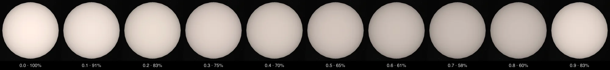

# A pulsating star's light through one cycle

A Cepheid swells and shrinks, and its light rises and falls with the same period. The page of a Cepheid whose light
curve is published shows that cycle as a dataset, **Pulsation**: ten steps, a tenth of a period apart, each the star in
its own color at that moment's share of its brightest light. The steps can be stepped through or played as a loop.

The light is not measured or fitted here. It is the model Gaia DR3 publishes for the star.

## Whose data and whose model

| Step | Whose | What it is |
| --- | --- | --- |
| Light curve and its model | Gaia DR3, table `gaiadr3.vari_cepheid` (Ripepi et al. 2023, [A&A 674, A17](https://doi.org/10.1051/0004-6361/202243990)) | For each Cepheid: the period, and a truncated Fourier series fitted to its G-band time series, published harmonic by harmonic (zero point, reference time, frequency, amplitudes, phases) |
| Reading the model | [`light-curve.ts`](../packages/bake/src/photometry/light-curve.ts) | Reads the row a star's package archives and holds it to the same row's peak-to-peak amplitude, epoch of maximum, R21 and φ21 |
| The ten steps | [`pulsation-steps.mts`](../packages/telescope-cli/src/new-object/pulsation/pulsation-steps.mts) | Evaluates the model a tenth of a period apart from its maximum and turns magnitudes into shares of the light at maximum |
| The page's records | [`surface-maps.mts`](../packages/telescope-cli/src/new-object/maps/surface-maps.mts), the route every map kind uses | Table, manifest entry, raster surfaces, dataset steps, reader text |

The model, as Gaia's [data model page](https://gea.esac.esa.int/archive/documentation/GDR3/Gaia_archive/chap_datamodel/sec_dm_variability_tables/ssec_dm_vari_cepheid.html)
prints it under `phi21_g`:

    mag(t) = zp + Σ A_i cos(i · 2π · ν · (t − T_ref) + φ_i)

with `zp_mag_g`, `fund_freq1`, `reference_time_g`, and the first `num_harmonics_for_p1_g` entries of
`fund_freq1_harmonic_ampl_g` and `fund_freq1_harmonic_phase_g`. The reader holds every row to the row's own published
values and refuses one that fails: the series must span `peak_to_peak_g` to 0.0001 mag, peak at `epoch_g` (within its
stated error, or a thousandth of a period), and give the row's `r21_g` and `phi21_g`. A reading with a sine in place of
the cosine misses the epoch by about a third of a cycle.

A magnitude difference to a share of light is arithmetic: 10^(−0.4 (m − m at maximum)).

## What a step draws

Step *k* is the model at phase *k*/10 after maximum light. Its surface is the star's Color dataset's color with each
channel's light multiplied by that share, then encoded for the display (IEC 61966-2-1): a step at 58% gives 58% of the
light of the step at maximum. Nothing is stretched. The disc is unresolved, so one value is drawn over all of it; the
darkening toward the edge is the Color dataset's limb law, from the same file.

The page keeps the dataset it opened on. A page that already plays the same model over its disc (the Light curves
switch, a black veil whose opacity follows the model) does not draw the veil over a step: the step already holds its
light, and the presentation profile names the step group for that (`lightCurve.stills`).

## Which stars

A star has the steps when its package keeps a Gaia DR3 `vari_cepheid` row that the reader accepts: a fundamental-mode
model whose harmonics reproduce the row's own published values.

Counted on 2026-10-08, of the 477 Cepheid pages:

| Where | Pages | With steps | Why the others have none |
| --- | --- | --- | --- |
| Milky Way | 54 | 49 | Gaia's table has no row for the star's source (Mekbuda, T Mon, TZ Mon, XX Sgr); Polaris has no Gaia source |
| Magellanic Clouds | 41 | 38 | Gaia's table has no row for the star's source (HV 900, HV 2827, HV 12815) |
| M33 | 154 | 34 | No Gaia Cepheid within an arcsecond of the page's place (111); Gaia's period not within 1% of the catalogue row's (6); a first-overtone model (3) |
| M31 | 52 | 4 | No Gaia Cepheid within an arcsecond of the page's place (48) |
| Beyond 2 Mpc | 176 | 0 | Too faint for Gaia. Their own papers print a period, mean magnitudes and amplitudes, with no epochs and no fitted terms (Hoffmann et al. 2016, `J/ApJ/830/10`: 169 pages) |

A Milky Way or Magellanic star's package names its Gaia source, and the row is that source's. A Cepheid of M31 or M33 is
placed by its paper's table and names no Gaia source: `--from-pulsation gaia:HOST` ties it to the one Cepheid of Gaia's
table within an arcsecond of the page's place whose period is within 1% of the one the package's own catalogue row
prints, and writes the row into the package with those two numbers.

The 44 other pulsating star pages (28 long-period variables and candidates, 13 δ Scuti stars, a Mira, a β Cephei and a
γ Doradus star) have no steps. Gaia's Cepheid table does not hold them. Its long-period-variable table prints a
frequency and an amplitude for 8 of them, with no phase and no harmonics: that is not a light curve to draw a cycle from.

## What here is not printed in a paper

1. **Ten steps, a tenth of a period apart, the first at maximum light.** A display choice (`PHASES`). The model is
   continuous, and its faintest moment falls between two steps.
2. **The G band stands for all colors.** Gaia's G band is wide (330 to 1050 nm). The step dims the star's whole color by
   the G-band share; the true change differs from blue to red.
3. **A share of the light at maximum.** The scale's top is the model's own maximum, not a calibrated brightness.
4. **One value over the disc.** The table's four nodes hold the same number: the grid is the file layout the bake
   reads, not a map.
5. **Which row is a star's, in M31 and M33.** One arcsecond (the radius the generator already takes for "the star at
   this place") and 1% in period (`AT_PLACE_ARCSEC`, `SAME_PERIOD`). Each can only leave a star without steps.

## Not drawn, and why

- **Color.** The star's temperature changes through the cycle, and Gaia DR3 publishes the same kind of model in its BP
  and RP bands. Turning that color into a temperature, and so into a drawn color, needs a published calibration that
  covers Cepheids in those bands, with reddening handled as its paper does. None was found (searches of 2026-10-08).
  Mucciarelli, Bellazzini & Massari (2021, A&A 653, A90) calibrate dwarfs and giants, not supergiants. The steps
  therefore keep the star's own color.
- **Size.** The radius changes by several percent through the cycle. A page draws one radius, and no dataset here
  changes it.

## Running it

    node packages/bake/cli/restore-source-inputs.mts --object=ry-cma     # the star's archived Gaia row
    pnpm telescope new-object --from-pulsation ry-cma --out output/pulsation/spec.json
    pnpm telescope new-object output/pulsation/spec.json --bake

`--from-pulsation all` drafts every star whose package keeps a model. A spec may be run again: the records follow it.

## Limits and leads

- The model is Gaia's fit to 2014 to 2017. A step is a phase of the cycle, not a date.
- Gaia measures a star in a crowded field together with whatever shares its window. In M31 and M33 these Cepheids are
  at G magnitudes 18.4 to 20.7; the model is of what Gaia measured there, and nothing here corrects it.
- A page of M31 from Li et al. (2021) takes its place from columns printed to a thousandth of a degree, 3.6
  arcseconds, so a Cepheid Gaia does hold can lie outside the arcsecond. At least four more would be tied by the five
  decimals in the table's own identifier (DIRECT V1791, V1934, V6165 and V7209). Not done: it would move the page's
  place too.
- Leads for the stars Gaia's table does not hold, none read yet: the PAndromeda light curves of 2,686 Cepheids in M31
  (Kodric et al. 2018, VizieR `J/AJ/156/130`, files `lc_g`, `lc_r`, `lc_i`); the B and V light curves of Vilardell et al.
  (2006, `J/A+A/459/321`); the OGLE Collection of Variable Stars for the three Magellanic Cepheids Gaia's table lacks.
- Leads for color: the temperatures measured spectrum by spectrum through the cycle of bright Milky Way Cepheids (Luck
  2018, AJ 156, 171, table 3, and the paper Mekbuda's record cites for its gravity from 125 spectra, bibcode
  2023A&A...678A.195D), and V and I light curves with a calibration its paper applies to Cepheids phase by phase.
