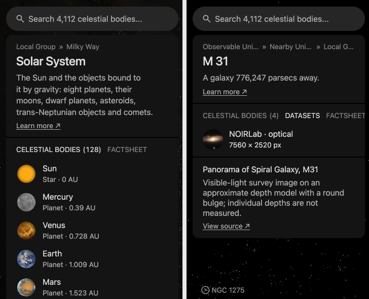

# Reader text

A body's card line, introduction and dataset text live in its `text.json`,
next to `object.json`. The file is outside `source/`, so changing words never
changes the source recipes or adds source-manifest pins. Publishing text still
updates its prepared output and delivery inventory.

## The file

```json
{
  "schema": "cssearth-object-text@1",
  "objectId": "tethys",
  "card": { "text": "…", "sources": [{ "catalogueId": "nasa-saturn-moons", "url": "…", "label": "…", "checked": "2026-09-13" }] },
  "introduction": { "text": "…", "sources": [{ "…": "…" }] },
  "datasets": { "<dataset id>": { "title": "…", "detail": "…", "summary": "…" } }
}
```

| Block | Limit | Notes |
| --- | --- | --- |
| Card | 1 sentence, 110 characters | Also the catalogue description used by search, previews and sharing |
| Introduction | 2 sentences, 180 characters | Say something about the body that its mission and dataset cards do not |
| Dataset title | 40 characters | Specific to the product, not the chooser label |
| Dataset detail | 28 characters | Source, mission or instrument shown beside the chooser label |
| Dataset summary | 2 sentences, 125 characters | Fits the three lines the narrowest dataset card reserves |

Each citation names a [source record](../src/sources/) by `catalogueId`, with
the page checked and the date. An optional `quote` of up to 300 characters gives
a reviewer the words to look for, which helps with numbers. The card and the
introduction need at least one citation. A dataset summary may leave out
`sources` when its prepared product already names its inputs; the dataset card
lists those.

The chooser's right-hand label identifies where the dataset comes from: for
example, **Magellan**, **Kaguya MI**, **USGS** or **VLTI/PIONIER**. For a published
model, use the author or archive. Keep explanations of the quantity in the
summary. Members of a group from the same source share
that source label; dates and other differences belong in the arrow selector.

## Satellite-system introductions

Satellite families keep their short introductions in `site/source/navigation/system-text.json`,
using the same cited text format and introduction limits as bodies.
[`system-packages.mts`](../site/build/prepare/system-packages.mts) checks every
satellite host and citation, then writes each introduction as its system object's
description, the one copy the card and search read. The shared card header renders
it with the body's introduction typography. A star's system shows its star's
description, and a system of bound stars alone a sentence that names its stars.

## Overview navigation

Every object with something inside it lists it under **Celestial bodies**, with
the count, using the same rows as search. One rule builds every list
([`object-children.mts`](../site/content/object-children.mts)): the rows are the objects
whose parent it is in the object tree.

- A child that is a system shows as its host: the Solar System lists Jupiter,
  and the Milky Way lists the Sun.
- A child the map never names is left out: an asteroid or a star drawn as a
  plain dot. A plain-dot star is listed in the system it is inside, where the map
  names it.
- A system's host leads, planets come before other bodies, then nearest first:
  from the host in a system, from the centre of the reader's home galaxy where
  the list holds it, else from the Sun. Then by name.
- A body inside it with no page yet closes the list as a row that opens nothing:
  a moon its host's catalogue names and nobody has packaged, or a star the world
  draws from its orbit alone (33 of the stars around Sgr A*).



A galaxy or a cluster with objects inside it shows the list beside its datasets
and opens on the datasets. An object seen from inside has no body of its own, so
its list leads.

## Dataset groups

Use the existing arrow selector for related maps that readers will compare:
different dates, wavelength bands, mineral amounts, or components of one field.
Similar colors alone are not a reason to group maps. A photograph, a height map
and an interior model answer different questions and keep separate entries.

In the body's `source/content/object.json`, give consecutive dataset controls the
same `label` and `step.group`, with a distinct `step.label` for each member.
The chooser lists the group once. The selected member supplies its description,
source and legend; the arrows select its neighbors. Each member keeps
its original dataset ID and URL. A date group runs in chronological order;
its existing default can remain a middle member.

For example, the Moon's **Mineral composition** group switches between
plagioclase, olivine and the two pyroxenes. Mars groups five chemical elements;
Pluto groups three modeled ice fractions; Ceres groups two mineral absorption
features. Betelgeuse, CE Tauri and WASP-12b group observations by date. BE Ceti,
χ¹ Orionis, HD 29615 and HD 35296 group three magnetic-field directions.

Keep units and limits beside each map. Mars's thorium scale uses parts per
million while its other element scales use weight percent. Ceres's band depths
are absorption strengths, not mineral percentages. Date selectors do not turn
stellar reconstructions into confirmed images of surface changes.

The short summary should explain the quantity in ordinary words. Keep necessary
scientific names, and explain them when first used. Put full measurement methods,
scale examples and qualifications in the body README and linked source records.
Check the group, arrows, direct links and descriptions at desktop and phone
widths; changing the selected map must retain the mounted scene.

## Publish and check

`node site/build/prepare/authored/prepare-text.mts` checks every body, then writes `prepared/text.json` and the
card into `object.json`. If any body fails validation, it writes nothing. Supply
object IDs to limit publication after the shared validation. A changed card
changes catalogue text; regenerate the catalogues with
`node site/build/prepare/catalog/prepare-facilities.mts --catalog-only`. Changed prepared text refreshes the
body inventory and must be published through the usual asset workflow.
`node site/build/prepare/authored/prepare-text.mts --check` verifies without writing.

These errors block publication:

- a dataset without text, or text for a dataset the body does not have;
- a block over its limit, or a sentence block without a full stop;
- a citation that names no source record;
- a dataset summary without sources whose product names no inputs.

Warnings are for the reviewer and never block:

- filler such as "explore" or "in 3D", and process words such as "prepared";
- words about the display in the card or introduction, such as "model" or "mesh";
- "grid", which the dataset legend explains;
- a title that repeats the chooser label, or a sentence used twice;
- a card or introduction that another body shares;
- repetition between blocks shown together: the introduction, one dataset
  summary and the mission, facility and note cards beside it. This check reads
  `site/prepared/prepared-facilities.json`, so run
  `node site/build/prepare/catalog/prepare-facilities.mts --catalog-only` first.

`site/build/prepare/authored/prepare-text.test.mts` runs the check on every registered body.
No repository test measures line wrapping. Inspect affected desktop and phone layouts in a browser
when text or typography changes.
