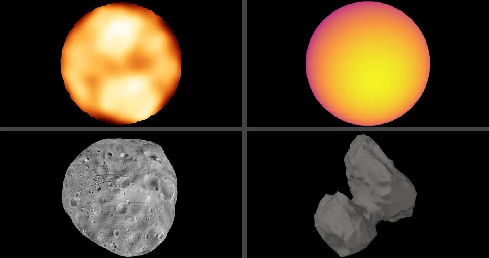

# SEO and sharing

The shared layout emits each object's title, description, canonical URL, and
Open Graph/Twitter metadata in static HTML. Object descriptions come from the
`OBJECTS` registry. `site/content/seo.mts` owns the production origin and the
shared metadata format.

Object routes such as `/earth/` and `/saturn/` are canonical. The homepage opens
on Earth but is its own page: it has the site's title and description and
declares `/` as canonical. Query parameters and shared camera fragments do not
change metadata. The sitemap contains one canonical URL per registered object,
and `/robots.txt` advertises it.

Each page carries one schema.org record in JSON-LD. The homepage has a
`WebSite` record, which lets search results show the site's name. A body page
has a `BreadcrumbList` down its orbit chain (cssEarth › Sun › Mars › Phobos),
built by `site/content/seo-trail.mts` from the prepared world context. A centre without
a page, such as a binary's barycentre, is skipped.

Every page but a cluster's has a share image of its own. The 81 committed
captures in `site/public/social/` are plain screenshots of the actual CSS scene,
with the application controls hidden: 16 Solar System bodies, and the 65 galaxy
and nebula pages, which have no arrival billboard. Every other scene page uses
its arrival billboard:
`site/build/share-images.mts` runs in `pnpm build:deploy` after `astro build`. It
centres each billboard on black at 1200×630 and writes `dist/social/<id>.jpg`
(about 3,570 cards, 24 MB). A billboard it cannot read fails the deploy. A
system's page, such as `/mars-system/`, mounts its host's scene and uses its
host's image. A page with neither a capture nor a billboard falls back to the
Earth capture: the 73 pages of galaxy, globular and open clusters do, and so
does a new galaxy or nebula page until it is captured.
None of these images adds requests to ordinary page loads.



## Refresh previews

Use prepared assets matching the inventories and real Chrome:

```sh
pnpm setup:assets
pnpm build
node site/build/prepare/shell/prepare-social-images.mts                  # all registered objects
# node site/build/prepare/shell/prepare-social-images.mts --object=earth # one object
pnpm build                          # include the new images
node --test site/journeys/seo-discovery.test.mts
```

Inspect the images before committing them. A new object needs its own capture.
The preparer captures a page once its picture has held still for a second: a
page's picture layers show after its ready mark. It captures a page's default
view, except a nebula's: a nebula is turned by 25° and 12° and brought close
enough for its silhouette to span 62% of the frame's height, so its depth shows.
The social-image preparer starts and closes a preview on port 4266; pass
`--base-url=http://localhost:4210` to capture an existing server instead.

## Check metadata and deployment

`site/content/seo.test.mts` checks the homepage metadata, the breadcrumb trails and
that every scene page has a share image of its own. `site/journeys/seo-discovery.test.mts` checks the reachability algorithm with synthetic
page graphs. It does not crawl a running site. Inspect the built HTML and an
already-running preview for titles, descriptions, canonical URLs, headings,
sitemap coverage and image dimensions. The retired `seo-browser.mts` runner and
its `output/seo/report.json` are not current verification entry points.

After deployment, verify HTTPS and host redirects, canonical URLs, robots and
sitemap responses, and real 404 responses on the chosen host. Submit the sitemap
in Search Console and inspect the homepage and representative object pages.
Indexing and real-user Core Web Vitals require deployed-site evidence.
