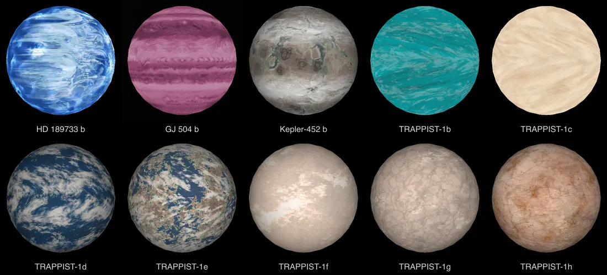
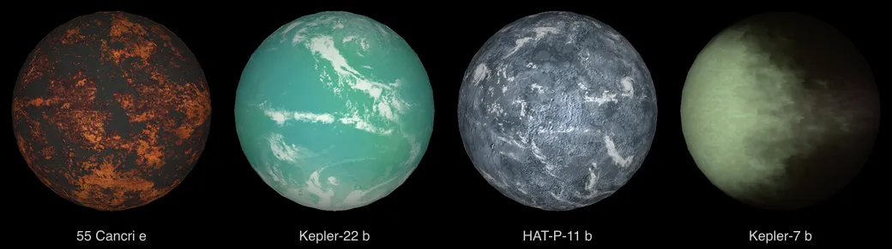
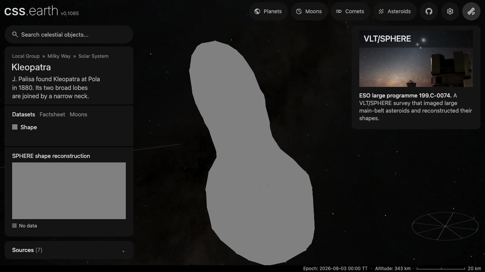
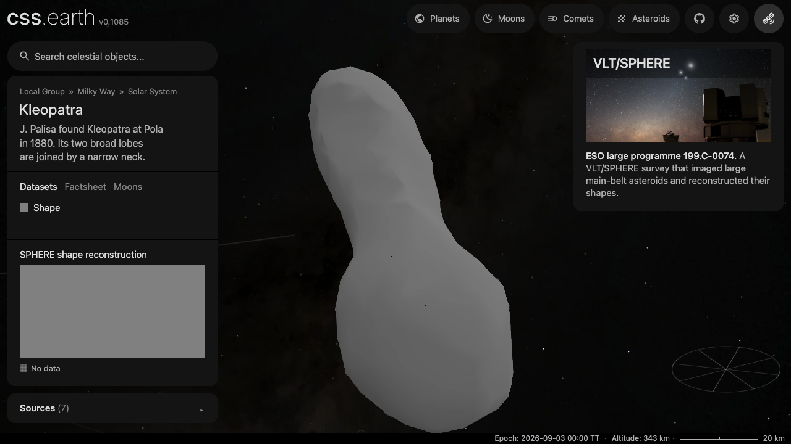
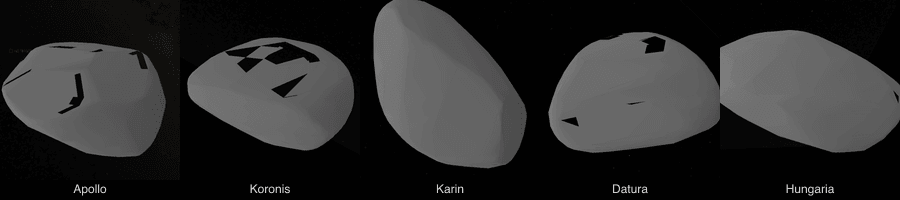
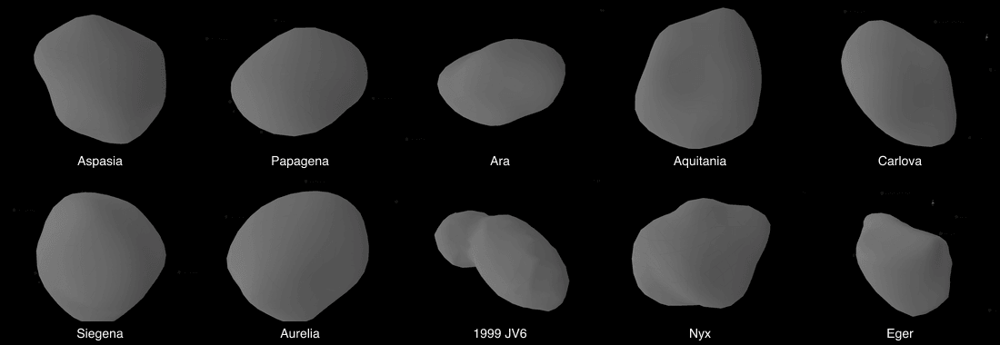

# Shape-only material

Every terrestrial `shapeViews` lens uses the same neutral gray: **#808080 in
sRGB**. This is a cssEarth display convention, not measured color, physical
albedo, or any external standard. The model supplies the shape; the material
adds no craters, mottling, grid lines, or other invented surface detail.

When published whole-disc photometry gives a body's colour indices and V
geometric albedo, its shape view may use that measured colour instead, through
the raster `disc-integrated-color` science kind
([disc-integrated-color.mts](../tools/objects/observation/disc-integrated-color.mts)).
Colour indices relative to the Sun give reflectance at the B, V, R and I effective
wavelengths; a piecewise-linear spectrum through them is integrated with the CIE
1931 observer under D65 and scaled so V reflectance equals the albedo. The colour
is uniform: it is one measured mean, not a map. Makemake and Eris use it on the raster
route; Haumea uses the same method through the shape-model route's `surfaces` list.
All three also carry NASA's illustrative model texture as a second, non-default
lens (`glb-base-color`); it is listed in the package's illustration lenses and is
not an observation. Ten exoplanets (HD 189733 b, GJ 504 b, Kepler-452 b and TRAPPIST-1 b–h)
carry the artist's concept map NASA's Eyes on Exoplanets wraps around them the same way,
through the `equirectangular-illustration` kind.



Kepler-22 b, HAT-P-11 b and Kepler-7 b carry their Eyes maps the same way, and 55 Cancri e carries the texture of NASA's
55 Cancri e 3D model through `glb-base-color`. NASA's WASP-12b model is egg-shaped, so its texture cannot be placed on
the published sphere and is not used ([ledger](../src/objects/wasp-12b/investigations.json)).



An unresolved body measured only in the infrared has no visible colour to reconstruct. When a paper
publishes its flux densities in three bands, the raster `disc-integrated-band-color` science kind
([disc-band-color.mts](../tools/objects/observation/disc-band-color.mts)) paints it one false colour:
the longest wavelength red and the shortest blue, each flux density over one range shared by the
bodies the record names, encoded once through `encodeBandColor`, so band ratios and the bodies'
brightness against each other survive. The surface must declare `falseColor`. The four planets of
[HR 8799](../src/objects/hr-8799/README.md) use it with the JWST/NIRCam photometry of Balmer et al. (2025).

A star with no image may instead show the colour of its catalogued photometric
temperature, through the `stellar-photometric-color` science kind
([stellar-photometric-color.mts](../tools/objects/observation/stellar/stellar-photometric-color.mts)).
A Planck spectrum at that temperature is integrated with the CIE 1931 observer and
converted to sRGB with its D65 white, scaled so the brightest channel is full. The
disc is self-luminous: the colour carries no brightness or spectral lines. WASP-43
uses it with its Gaia DR3 GSP-Phot temperature. Where Gaia DR3 published the star's
BP/RP sampled spectrum, the record names that spectrum instead (`spectrum:
gaia-xp-sampled`) and the measured flux replaces the Planck model: HD 189733 A and B.
A limb-darkening law measured from a transiting planet draws a limb plate, either read
from a published table (WASP-43) or fitted to pinned TESS light curves
([transit-limb-darkening.mts](../tools/objects/eclipse-map/transit-limb-darkening.mts),
HD 189733 A). A star with such a colour stays on the map even without imagery
(discovery `sourceColor`).

Photographic, observed-color, and scientific lenses retain their own pixels.
Their missing-data grid continues to mark rejected or unavailable samples.
A shape-only lens still records that surface imagery is absent.

## Lighting

The material changes the base color. Existing prepared lighting remains separate:
the ordinary mesh path uses interpolated vertex normals and the prepared Sun
direction; models with source-cast lighting keep that source-mesh calculation.
Shadows off uses gentle baked shading from the same interpolated mesh normals
and Sun direction. A broad fill ranges from 55% to 100% of the base gray,
including the back-facing side, so there is no hard terminator or cast shadow.
This is illustrative shape lighting, not a measured brightness map. Shadows on
retains the stronger existing directional and source-cast lighting unchanged.
Context previews retain
their declared camera and full-phase lighting. These display orientations are
not necessarily a measured rotational attitude.

Kleopatra, at the same camera angle with Shadows off: the intermediate uniform
gray material hid its relief; the gentle bake makes the source shape readable.

| Uniform gray | Gentle baked shading |
| --- | --- |
|  |  |

The five DAMIT asteroids added in `5c4324b3c` at their default views, all on the
same shape-only material: the outline is the measured shape model, and nothing in
the surface is invented.



The ten nonconvex DAMIT models added next, in the same material. Seven are ADAM fits to light curves, adaptive-optics
images and occultations; 1999 JV6 adds radar images, which show its two lobes; Nyx and Eger are fitted to light curves alone.



## Preparation

[shape-material.mts](../tools/objects/terrestrial-layers/shape-material.mts) owns
the color. The full terrestrial preparer uses it for every shape view. A constant
material avoids cylindrical image sampling when baking the ordinary mesh atlas;
its encoded default and Shadows-on lighting are checked against the general texture path.

To update only the default lighting in an already-neutral checkout:

```sh
node tools/objects/refresh-shape-lighting.mts stage --all
node tools/objects/refresh-shape-lighting.mts publish --all
node tools/prepare/cli/prepare-facilities.mts
```

Staging prepares replacement atlases without changing the served assets.
Publication checks that the retained packages and lighting generator still match
the staged inputs, atomically replaces only the default atlases, and updates
their asset pins and provenance. Shadows-on, base maps, previews, geometry, and
other datasets are retained. Receipts in `output/shape-default-lighting` record
the original asset hashes and the replacements. Individual body ids may replace
`--all` for a focused browser preview.

For a complete material refresh, run:

```sh
node tools/objects/refresh-shape-materials.mts --all --resume
node tools/prepare/cli/prepare-facilities.mts
```

The refresh retains each lens's triangles, atlas addresses, camera, and other
datasets. It regenerates surfaces, shadows, thumbnails, minimaps, and model
context images, then updates their pins and provenance. The second command
rebuilds the sources catalogue from those updated pins; run it after the batch,
before reopening the app. It replaces local asset
files atomically, preserving the original read-only inodes. `--source-root=PATH`
can supply missing original meshes from another checkout for source-cast lighting;
that checkout is only read. Receipts live in ignored `output/shape-material-refresh`.

Refresh provenance identifies the retained prepared geometry; it does not claim
to have reacquired or rebuilt every original scientific source. The source
recipes and full preparation path remain the reproduction owners.
