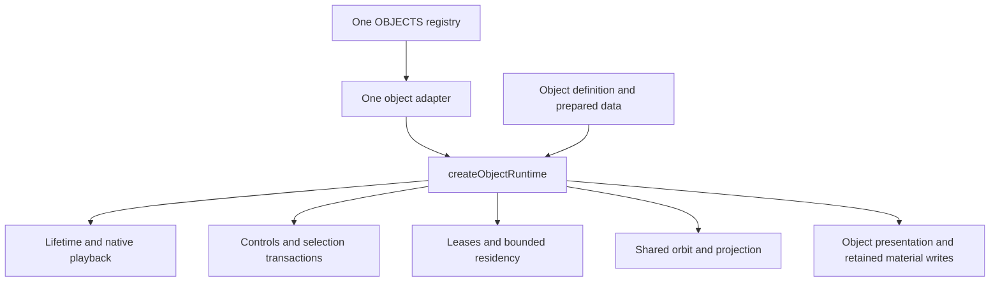

# One object runtime for PR #2

Status: implemented and verified across all eleven existing objects; visual and performance qualifications are recorded in the proof.
Delivery: [PR #2](https://github.com/layoutit/cssEarth/pull/2), `refactor/shared-runtime`.
This document supersedes the earlier proposal that left object-local coordinators in place.

## Architectural goal

One `OBJECTS` registry, one object adapter, one application shell, and one mounted
object scene. Every object uses the same implementation for mounting, readiness,
lifetime, controls, selection transactions, image ownership, residency, playback,
camera binding, and fatal cleanup. Matching method names or sharing helpers while
retaining private coordinators does not meet this goal.

The scope is Sun, Mercury, Venus, Earth, Moon, Mars, Jupiter, Saturn, Uranus,
Neptune, and Pluto. No additional object or route is needed to establish this
contract. The fixed eight-planet list remains a reporting filter.

## Ownership

| Concern | Executable owner | Object contribution |
| --- | --- | --- |
| Registration, loading, shell | `OBJECTS`, object adapter, router, shared shell | Identity, route, source information, actual control content |
| Mount, readiness, disposal, fatal errors | `createObjectRuntime`, scene lifetime | Synchronous construction of retained presentation; registered cleanup |
| Playback permission | Router and runtime policy | None |
| Applying permission and speed | `createPreparedPlayback` | Native animation handles, prepared roles and rates |
| Control listeners and busy state | `createObjectControlBinding` | Actual control-content export |
| Desired/committed state, cancellation, publication ordering | `createObjectSelectionRuntime` | Pure scalar reduction and prepared resource demand |
| Decode, leases, pinning, retry, reuse, eviction | Prepared residency and image store | Catalog, pool limits, retention policy, required/prewarm keys |
| Input, camera, projection, sky and directional Sun | Shared orbit, camera publisher, sky and Sun modules | Prepared plans and retained camera/scene handles |
| Body and material rendering | Shared synchronous invocation boundary | Prepared addresses and writes to owned elements |
| Diagnostics and browser access | Shared runtime observations and browser-profile factory | Read-only material/source facts, audit coordinate fields and view mappings |



All eleven `runtime/client.mjs` files contain only imports and one factory binding:

```js
import { createObjectRuntime } from "../../../platform/object-runtime.mjs";
import { runtimeDefinition } from "./definition.mjs";

export const mountMoonClient = createObjectRuntime(runtimeDefinition);
```

## One definition and presentation contract

`src/platform/object-runtime-contract.mjs` validates `cssearth-object-runtime@1`.
The definition has identity, actual controls, prepared camera/sky/optional Sun,
an input selector, an asset catalog, initial scalar selection, and three hooks:

```js
reduceSelection(selection, action) -> nextSelection
resolvePresentation({ selection, view, previousPlan }) -> {
  required, prewarm, pressedLenses, ...preparedMaterialFacts
}
createPresentation(stage, context) -> {
  cameraElement, sceneElement, bodyLayers, nativeAnimations,
  commitSelection({ selection, plan, view, resources }),
  publishFrame({ selection, plan, view, resources }),
  observe(),
}
```

Hooks are synchronous. The invocation boundary rejects async/generator functions
and ordinary functions that return thenables. Camera and scene handles must
belong to the mounted stage. `bodyLayers` contains actual registrations created
by `registerBodyDependentLayers`; fabricated assertion records are rejected.
Every commit and frame checks connectivity and stable parent identity before
and after the material writes.

`context` provides canonical density, prepared-resource reads, immediate cleanup
registration, native-animation registration, and prepared pose seeking. It does
not provide a private scheduler, image allocator, listener binder, or lifecycle.
The public mount remains `{ ready, pause, resume, destroy }`.

The common runtime loads startup resources, mounts the presentation and shared
celestial layers, registers animations, binds one orbit and one selection owner,
commits the initial presentation, waits for paint, and publishes readiness.
Disposal invalidates the session first and attempts all owned cleanup. Late
requests cannot publish into a retired or replacement scene.

## Selection and residency

The common selection owner holds desired state separately from committed state.
It resolves demand against the current camera, protects the committed working
set while a replacement decodes, rechecks request identity and current demand,
then commits presentation, resources, frame, and playback before promoting state.
A failed lens decode keeps the committed presentation and permits explicit retry.
A partial native publication failure retires the scene through the common fatal
boundary. Camera updates cannot commit a material plan for an outdated view.

Pools declare capacity, concurrency, native-image reuse, decoding hint, retention,
eviction, and an optional stability delay. They do not implement those mechanics.
Explicit leases coalesce identical URLs, including aliases across pools. Batched
ownership changes prevent cancelled queued banks from starting extra decodes.
Required resources stay pinned during transitions. Optional warming is bounded;
a warm-only handoff releases JavaScript ownership while retaining the decoded
CSS image source. This is not a claim of immediate browser memory reclamation.

Assets use the highest prepared density once, independently of DPR. No runtime
density-bank switching, geometry derivation, rasterization, chart generation, canvas,
WebGL, SVG scene rendering, masks, filters, gradients, blend modes, or clip paths
are introduced. Source and provenance remain inside the existing object packages.

## Differences that remain between objects

These are rendering facts or policy data consumed by the same runtime.

| Object | Package-owned rendering and demand |
| --- | --- |
| Sun | Self-lit surface, poles, corona and limb; no directional-Sun plan; selected material group |
| Mercury | Retained interior and pose-addressed native animation; exterior lenses; three reusable lighting rows |
| Venus | Surface/poles plus fixed material composite and prepared light-frame selection |
| Earth | Complete seven-page surface banks; fourteen-page transition capacity with two concurrent decodes; separate three-row lighting and atmosphere pools |
| Moon, Pluto | The same prepared sphere-band presentation recipe, parameterized by each package's source data; mount-retained surface/pole lenses |
| Mars | Prepared surface/poles and a three-row reusable lighting pool |
| Jupiter | Prepared surface/poles, rings and moons; a three-row reusable lighting pool |
| Saturn | Rings, ellipsoid correction, retained interior, independent interior toggle, and exterior/interior material variants |
| Uranus | Prepared body/rings; static lens assets and two protected three-row neighborhoods |
| Neptune | View-sensitive material variants and three lighting rows; required demand follows current camera state |

Saturn's interior is independent of the exterior lens. Its reducer and demand
plan express that relationship; there is no Saturn branch in the shared owners.
Earth's page and row rules likewise supply data to the common residency manager.
Moon and Pluto share their identical rendering recipe as well as all coordination.

## Implementation chain

The executable Burnlist uses stable IDs and removes items only after their tests
and evidence are recorded. The implementation followed this dependency order:

1. B1, B25, B27, B26: freeze source/prepared/browser baselines, preserve incoming
   shell and interaction changes, and seal matching comparisons.
2. B2–B7: executable contract, explicit resource leases, bounded residency,
   common mount/playback, selection/publication, and actual control binding.
3. B24: repair the missing prepared projective-leaf dimensions used by Saturn's
   retained interior, with separate evidence for the intentional visual change.
4. B8–B18: migrate Moon, Pluto, Sun, Venus, Mars, Jupiter, Uranus, Neptune,
   Mercury, Earth, and Saturn, with each package's failure and Chrome evidence.
5. B19: delete private coordinators and enforce real body-layer registration.
6. B20–B21: common observations/profiles, production diagnostic removal, deliberate
   ownership regressions, and actual-owner Chrome instrumentation.
7. B22: complete required gates and the full existing-object visual matrix.
8. B23: scoped normal commit/push and updated PR #2. No merge.

Completion requires executable closure checks, actual package and router tests,
real Chrome DPR 1/2 behavior, and source-bound visual evidence. An ID whitelist,
a declaration-only counter, or an unregistered demo cannot substitute for those
checks. The AST checker is a practical regression barrier, not a formal proof
against arbitrary obfuscated JavaScript.

See [the proof](generic-runtime-contract-proof.md) and
[the implementation record](shared-runtime-implementation.md) for results and
any remaining visual/performance qualifications.
