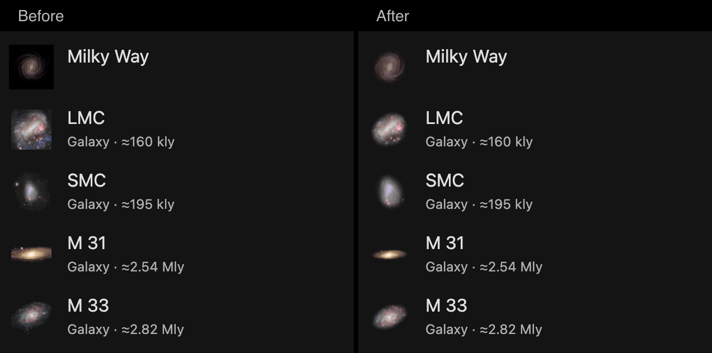
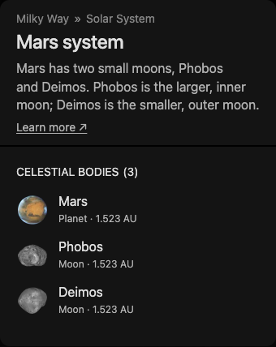
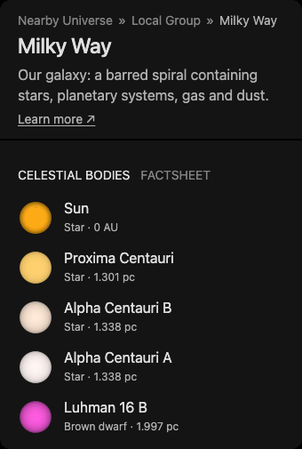
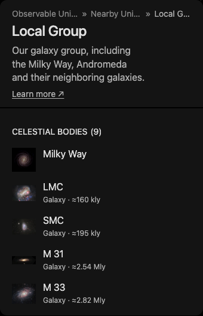
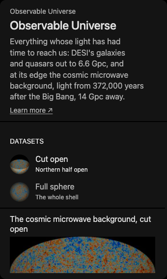
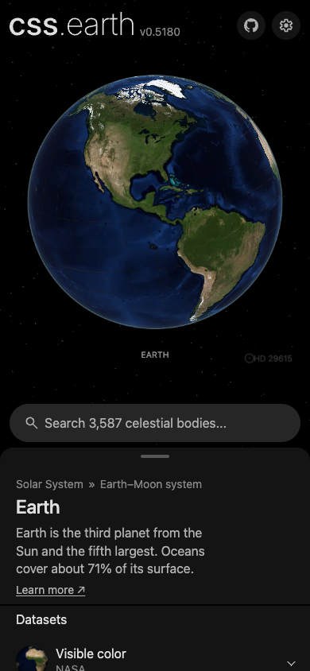
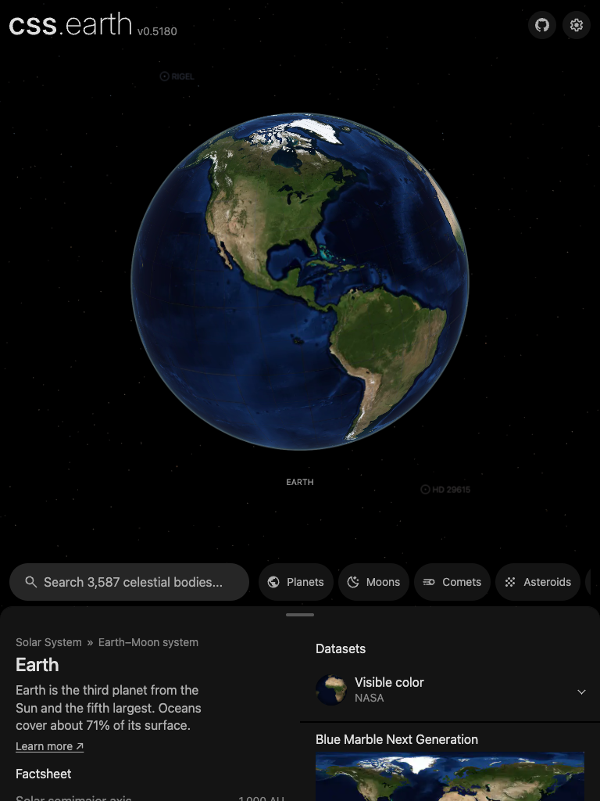

# Sidebar thumbnails

Galaxy and nebula object rows use the default dataset's own image. Dataset rows
use their selected dataset's image. The prepared bank of thumbnails contains 80 px WebPs;
search and overview members display them in the shared 40 px result row. Smaller
navigation markers display them at 14 or 16 CSS pixels. The sidebar does not download
a full preview just for an icon.

Run `node site/build/prepare/prepare-sidebar-thumbnails.mts` after restoring the runtime assets or
changing a prepared dataset preview. Run it with `--check` to reproduce every
thumbnail in memory and compare its bytes with the committed files.

The preparer reads each object's `prepared/presentation.json`, checks that each
dataset names its preview `datasets/<dataset id>.webp`, and fits the complete image inside 80 px squares.
It preserves the image's aspect ratio and published display colors, with transparent
padding. The Milky Way icon resamples its published face-on backing, the same
ESA artist's impression used by the map. It is artwork, not an observation;
its [source recipe](../src/objects/milky-way-volume/source/backing/recipe.json) retains that qualification.
The former slab-derived icon no longer matched the delivered galaxy view.

The [prepared receipt](../site/public/navigation/sidebar-thumbnails.json) records every
input path and byte count, source credit and image URL. Original datasets and repaired
runtime assets are read-only inputs. The preparer writes only its sidebar images
and receipt under `site/public/navigation/`.

An object's own row (a galaxy, cluster or nebula in an overview list or in search) shows
its default dataset's image under one framing rule, `packages/bake/src/site-assets/object-thumbnail.ts`,
written as `focus-object-<id>@2x.webp`. The preparer measures the object's light above the
image's median sky (its centroid and 2.25 standard deviations of its second moments),
cuts the tile to that extent inside a 4 px margin, and fades the light to nothing before
the extent's edge and before the image's own frame. Sky darker than level 32 becomes
transparency in proportion, with the color divided back, so over black the pixels are the
image's own. No edge of the photograph reaches the panel, and a photograph that fills its
frame (the LMC) fades out instead of ending in a rectangle. These tiles are decoration and
take the decorative WebP encoding; dataset rows keep the complete lossless tiles.

A galaxy, cluster or nebula with its own page has an opaque context sprite, the marker's
picture cut to a square. `pnpm prepare:search-thumbnails` gives its search preview the same
framing, read from the complete marker picture (`source/presentation/context.png`) so a wide
disc such as M 31 is not cut at the sprite's sides. To remake those previews after a change
to the rule, delete them first: a preview newer than its sprite is left as it is.

The capture is headless Chromium at 1280 × 900, DPR 2, of the local development server.

Catalogue-only galaxies and clusters without prepared imagery keep the ordinary
circle marker. Their catalogue identity does not imply a photographic dataset.

Featured-star rows in the Milky Way use the same 40 px search previews as search results.
`pnpm prepare:search-thumbnails` resamples each featured star's published arrival image
to 80 px, preserving its prepared photospheric color and limb shading. These are the
existing package views, including their model qualifications; no new surface detail is authored.

The shared shell renders each subject's header, tabs and content with `ObjectCard`,
`ObjectCardHeader`, `InformationTabs` and the common tab-panel padding. Bodies,
planetary systems and overview members all use the search row renderer
(`site/search/object-result.mts`). A level's card is the object card: it lists the
galaxies or clusters it holds with the same row, each with its distance from the
member that holds the stars. Its datasets use the
same `DatasetList` inside a padded, scrollable tab panel, including the Observable
Universe. The shell reads the shared navigation address while native history waits
for camera rest, so the selected dataset's card follows the current choice.

Dataset rows and the phone/tablet native select share `DatasetThumbnail.astro`.
Both use the same image, circular crop and inset limb shading; changing a selection
keeps that common preview styling.

These Chrome 154 viewport captures show the shared rows and responsive picker in
this implementation (DPR 1, default datasets and settings). The desktop card
captures use a 1280 × 720 viewport; the phone uses 390 × 844 and the portrait
tablet 768 × 1024. They are browser viewport checks, not physical iPad recordings.
The resting sheet exposes 280 px on phones and 248 px on portrait tablets, plus
any safe-area inset; other snap states and gestures retain their shared policy.

