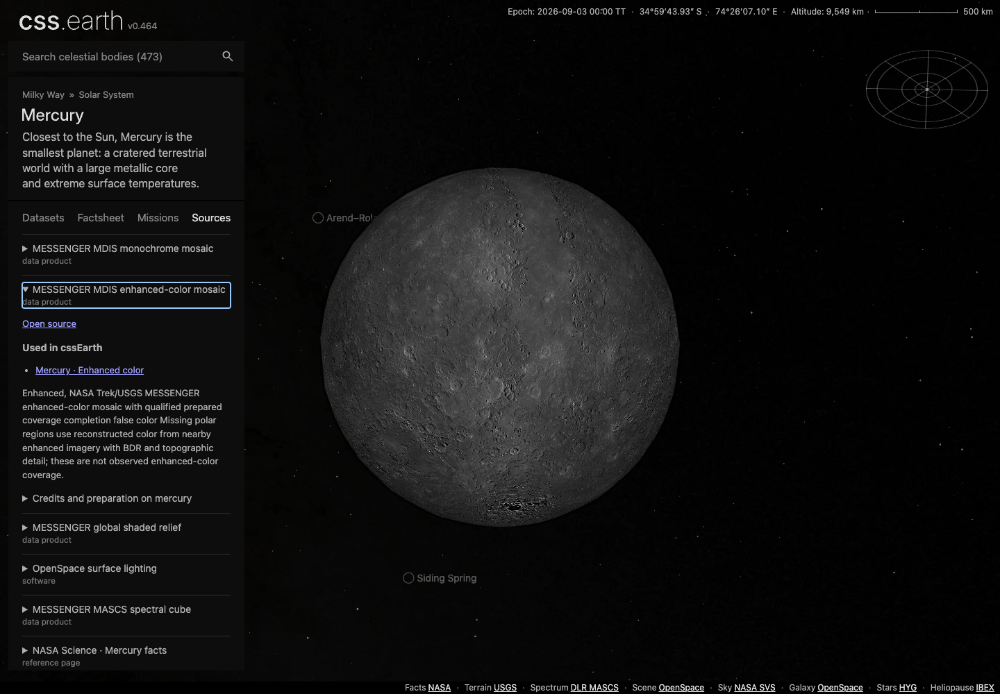
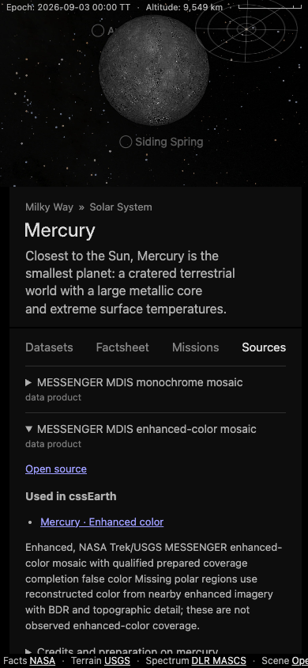

# Sources catalogue

The footer links the current selection's source-and-methods README at the
running build's Git commit. Its `Sources: …` text lists credits from the prepared
source index; Astro prepares the text once per document owner. The catalogue retains citations for factsheets, missions and
shared environments. A shared source has one identity across bodies;
each body keeps its own input bytes, processing, credits and limits.

## Find the record to change

| Record | Content |
| --- | --- |
| [Source records](../src/sources/) (`<id>.json`) | One published identity per file: title, identifiers, version, citation links and evidence |
| Body `source/manifest.json` | Local input IDs, paths, hashes, acquisition, credits and `sourceBinding` |
| Body content recipe, `panel.facts` and `panel.moreFacts` | Citations on individual facts, with the source ID, checked date and evidence location |
| Body `README.md` | Adopted values, source choices, processing, results and known problems |
| [Mission and facility catalogue](../site/source/facilities/catalog.json) | Citations for individual claims, with checked dates and locators |
| [Render library](../site/source/facilities/render-library.json) and [emblem library](../site/source/facilities/emblem-library.json) | Artwork bindings, original credits and file pins |

Approved facility artwork is public domain or CC BY, so the repository carries no
share-alike obligation, with one recorded exception. The Herschel photograph is
CC BY-SA 3.0: its only public-domain alternative is narrower than the card frame
and ESA's own images are share-alike. Each render-library entry carries its own
`license`, so the obligation stays attached to the file it covers. Reusing that
file elsewhere carries the share-alike terms with it.
| Shared environment `source/provenance.json` | The source binding and meaning of that environment |

`site/prepared-sources.json` and `site/prepared-facilities.json` are generated
from these records and the existing product lineage. They are ignored build
outputs; do not edit or commit them.
The [provenance contract](provenance/CONTRACT.md) governs citations, retained data,
evidence and plain language. Keep scientific tables in their existing records.

## Add or update a source

1. Look for the published work or release in the catalogue. Reuse its ID across
   bodies and file conversions. Preserve distinct releases and distinct products
   within a collection. A publisher, shared download endpoint or matching hash
   alone does not establish equivalence.
2. If it is absent, create `src/sources/<id>.json`, with `id` matching the filename.
   Use the existing [source record fields](../src/platform/source-catalog.mts).
   Add its published title, provider identifiers and citation link.
   Record authors, date and version when established by the source. Cite the
   provider page with a checked date and locator, or the repository file and
   field that cites it. Git history records when. Do not invent a release or archive
   identifier. Use `relations` for evidenced versions, parts and derivations.
3. Add a `sourceBinding` to the body's input. It names the canonical ID, the
   source's role (`material`, `method`, `reference` or `artwork`) and the evidence
   connecting it to this input. Keep the local ID and byte pins. Used documents
   and intermediate files also need bindings.
4. Update the body README when the source choice, values, processing or limits
   change. Follow [preparation and checks](#prepare-and-check) below.

A local recipe, measurement or display specification uses `kind: local` with a
specific reason: what the file contains and how the project made or chose it.
For example, “Project-authored grid marking unavailable surface imagery.”
An extracted provider page keeps the provider's attribution. Its location in
the repository does not make it project-authored. External inputs to local
calculations remain connected through product lineage.
A document's `purpose` is optional. Keep it when it explains something the path,
binding or native metadata does not; omit blanket descriptions and repetitions.
A converted image is still derived from its published source; conversion does
not create a new published work.

When consolidating duplicates, verify the published identity, update the current
bindings and remove the redundant records. Each local input keeps its own pins.
Preparation rejects missing, unknown or unresolved bindings. Establish the source
identity from its evidence before publishing the prepared catalogue.

Use the [factsheet fields](factsheets.md#editing-and-reproduction) for a fact
citation. A database citation retains the exact query or model URL, version when
available, and pinned numerical extract. This does not combine the identities of
its native shape or image products. Fact citations never create dataset or
mission-observation links.

Independent additions touch separate files. Changes to the same published source
still need to be reconciled. There is no shared index to update: preparation
reads the files in ID order and rejects duplicate identities.

## Prepare and check

Run `pnpm prepare:sources` after changing catalogue metadata, bindings or capture
records. `pnpm prepare:provenance` and `pnpm prepare:facilities` are aliases for
this coordinated operation. It validates all prospective object provenance and
both catalogues before replacing outputs. Astro checks their dependency hashes
and the source file list, rejecting stale or mixed sets. Missing cited factsheet
documents are restored through their hash-verified acquisition recipes and checked
against their byte count and digest. Existing evidence must already match its pin.
Uncited source files and surface assets are not acquired or rebaked.

Source-refresh tools must preserve bindings, source metadata and capture evidence
while updating byte pins. Newly discovered files need an authored classification;
a refresh must not guess one from a filename or copied template.

For source identities, bindings or catalogue code, run:

```sh
pnpm install
pnpm test:sources
```

This prepares the catalogues and checks identities, bindings, product dependencies,
independent additions and deterministic output. CI runs the same command.
The first run may download missing cited documents; subsequent runs reuse their
verified bytes. No surface bake is needed.
Use the [exploration guide](architecture/exploration-catalog.md#preparing-and-checking-a-change)
for changes to mission attribution or dataset navigation. Scientific changes still
need their body and preparation checks.

## Coverage and delivery

The graph covers manifest inputs, used provenance documents/intermediates,
individual factsheet and spatial-measurement citations, mission and facility citations, approved artwork
and shared environments. The compiler checks and pins each cited factsheet
evidence file. It rejects stale published facts before replacing either catalogue.

Galaxy and cluster bibliography entries bind their original keys to canonical
publication records. The spatial citation compiler validates the crosswalk and
indexes each cited quantity under its object and publication. Catalogue release
and field locators retain their pinned source owner; paper attribution does not
claim that the paper was independently reviewed.

Unused retained inputs create no usage edge. Facts without individual citations,
gallery descriptions, chart annotations and prose citations remain outside the
claim index. A missing edge does not establish that a source is unused throughout
the repository. File checks establish identity; scientific review establishes
whether the source supports the displayed quantity.

The current body's HTML includes prepared mission cards for each dataset.
Source documents remain in the repository: detailed bodies and nebulae use
their own README, while catalogue-only galaxies and clusters use the catalogue
owner's README. Overview links select the Sun, Milky Way, Local Group or Nearby
Universe document. A body's README covers its datasets, so changing a dataset
does not rebuild the footer. Search text does not change the selected source.

Astro prepares link text and commit-pinned destinations, checking that each
document exists. The shell copies the selected link from its retained navigation
rows. It has no separate source-card bank, citation deduplication or source
mutation observer. Desktop shows the link at bottom left; compact screens show
"Sources" beside the view readout, with the full name available to assistive
technology. Source manifests, catalogue identities and provenance checks remain
the authority for preparation. Mission artwork retains its existing credit links.

## Interface examples

These images document the earlier Sources tab. They are historical examples;
the current interface uses the footer link described above.




