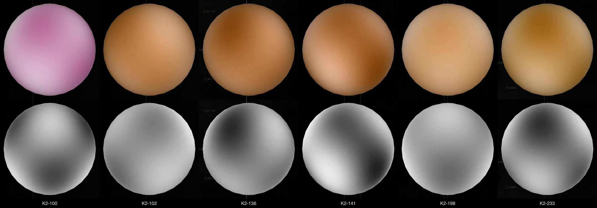
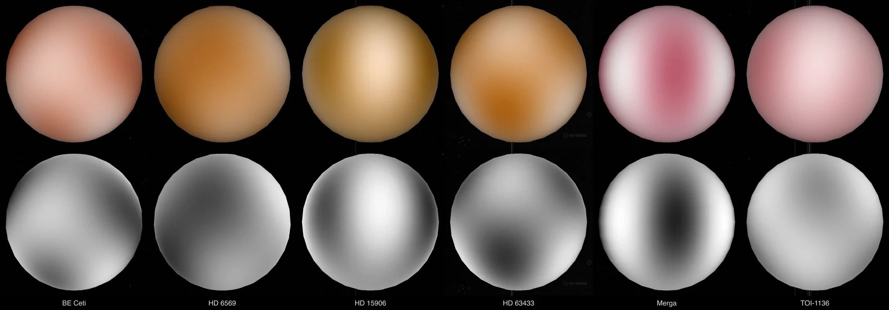
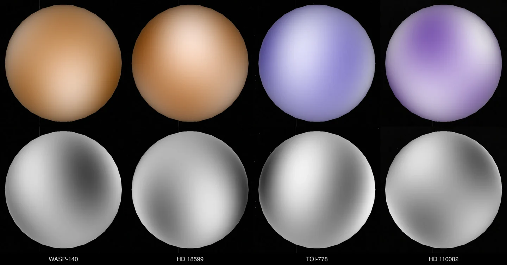
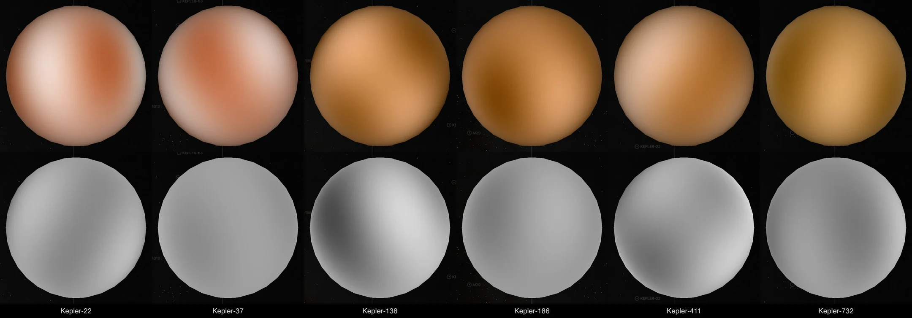
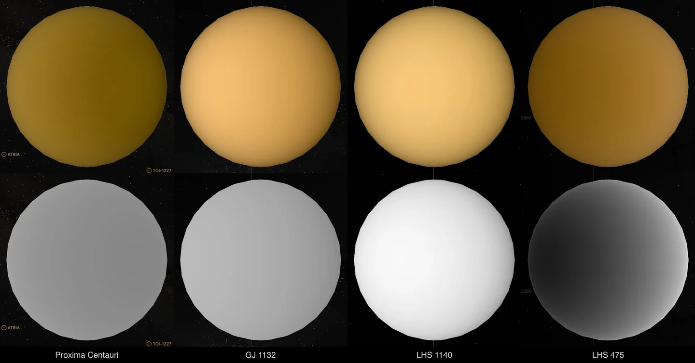
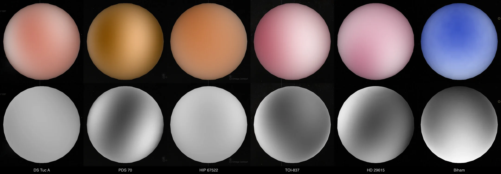
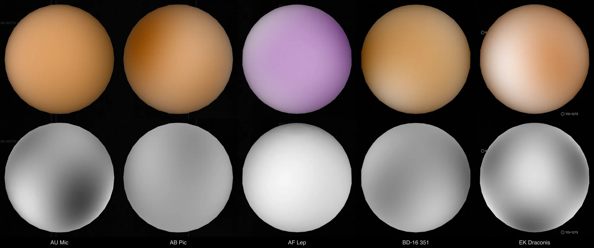
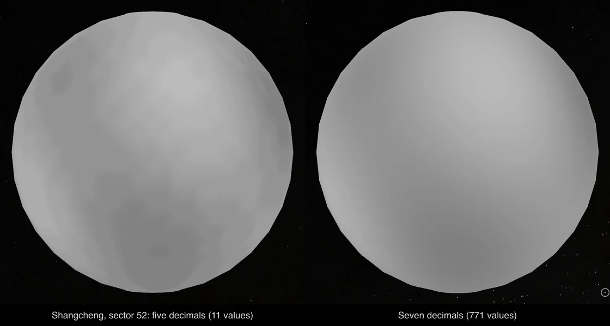

# A star's rotation and brightness map from the TESS, K2 and Kepler missions' light curves

A star with dark spots dims each time the spots turn to face us. The rise and fall of its light gives the time it takes to
turn once, and the shape of that curve says which longitudes of the star are darker or brighter.

Two missions publish light curves of the stars they were asked to watch. K2 (2014 to 2018) watched one field after another
along the ecliptic, some 80 days each, with an image every 30 minutes. TESS has watched since 2018, a sector of some 27
days at a time, and publishes a light curve every 2 minutes for its targets. Each mission's pipeline corrects the flux for
the spacecraft's systematics (PDC-MAP). This note describes how the telescope's tools take those light curves as they are,
have a published method decide whether a star's rotation is seen in them, and make a brightness map from it.

Kepler (2009 to 2013) watched one field for four years, with an image every 30 minutes. For a Kepler star the light curve
read is KEPSEISMIC, which its authors make from the mission's pixels, and the star's rotation is the verdict Santos et al.
(2019, 2021) published on that light curve.

MEarth (2008 to 2022) watched nearby M dwarfs from the ground, one star a field, night after night for years. Such
stars turn once in up to some 150 days, more than a sector or a campaign can show. For a star MEarth-South watched the
light curve read is the MEarth Project's own, from its public data release, and the star's rotation is the verdict
Newton et al. (2018) published on that light curve.

Nothing here is measured from pixels, and no rule of this repository decides whether a star is seen turning. It is
decided by a published method run on the light curves its paper uses, or by a paper's own published verdict on the
star.

A map made this way is **this project's reduction**. It is not a published map, and every dataset made from one says so.

## Whose code does what

Each step of the science is run by the code its authors publish, pinned in
[`toolchain.json`](../packages/telescope-cli/src/archives/tess/toolchain.json) and the telescope's starry toolchain:

| Step | Code | What it does |
| --- | --- | --- |
| Light curve, K2 | The K2 mission's own, from [MAST](https://archive.stsci.edu/missions-and-data/k2) (DOI 10.17909/T9WS3R) | The long-cadence light curve of a campaign with the flux the mission's pipeline corrected (PDC-MAP) |
| Light curve, TESS | The TESS mission's own, from [MAST](https://archive.stsci.edu/missions-and-data/tess) (DOI 10.17909/t9-nmc8-f686) | The 2-minute light curve of a sector with the flux the mission's pipeline corrected (PDC-MAP) |
| Light curve, Kepler | [KEPSEISMIC](https://archive.stsci.edu/hlsp/kepseismic) (Mathur, Santos & García; DOI 10.17909/t9-mrpw-gc07), from MAST | The star's four years as one light curve, made from the mission's pixels in its authors' own aperture, corrected with KADACS (García et al. 2011, MNRAS 414, L6) and high-pass filtered at 20, 55 and 80 days |
| Reading a file | [lightkurve](https://lightkurve.github.io/lightkurve/) 2.6.0 | Reads the light curve's file with its quality flags, as it is |
| Reading a file, Kepler | This repository's FITS reader | Reads a KEPSEISMIC file's table and its mark for each point |
| Light curve, MEarth | The MEarth Project's own, from its [Data Release 11](https://lweb.cfa.harvard.edu/MEarth/DataDR11.html) (1 August 2022; Berta et al. 2012, AJ 144, 145) | A star's differential magnitudes from one telescope, every exposure, with the segment of each and the common mode at its time |
| Reading a file, MEarth | This repository's reader | Reads a release file's header and the columns its release notes list |
| Preparing a light curve, MEarth | [sfit](https://github.com/mdwarfgeek/sfit) (Jonathan Irwin; MIT), pinned to a commit in [its own toolchain](../packages/telescope-cli/src/archives/mearth/toolchain.json) | The model of Newton et al. (2016, 2018): a baseline for each segment, a scale of the common mode and a sinusoid at one period, by linear least squares |
| Verdict, MEarth | The catalogue of [Newton et al. (2018, AJ 156, 217)](https://arxiv.org/abs/1807.09365), at [VizieR J/AJ/156/217](https://cdsarc.cds.unistra.fr/viz-bin/cat/J/AJ/156/217) | The 574 MEarth-South stars the paper searched, each graded: a rotator (A or B), a candidate or a non-detection |
| Period, K2 | [astropy](https://www.astropy.org/)'s generalized Lomb-Scargle, and [star-privateer](https://gitlab.com/sybreton/star_privateer) 1.3.1 (Breton et al. 2024, A&A 689, A229) for the wavelet and the autocorrelation | The three periods that Reinhold & Hekker (2020) compare |
| Period, TESS | [SpinSpotter](https://github.com/rae-holcomb/SpinSpotter) 0.2.0 (Holcomb et al. 2022, ApJ 936, 138) | The period of the light's autocorrelation and the height, width and fit of its peaks |
| Verdict, TESS, when that method refuses | The catalogue of [Colman et al. (2024, AJ 167, 189)](https://arxiv.org/abs/2402.14954), at [VizieR J/AJ/167/189](https://cdsarc.cds.unistra.fr/viz-bin/cat/J/AJ/167/189) | The targets the paper found turning in sectors 1 to 26, each with its period. The paper's code has no licence and is not run |
| Verdict, TESS, for a TESS Object of Interest | The tables of [Canto Martins et al. (2020, ApJS 250, 20)](https://arxiv.org/abs/2007.03079), at [VizieR J/ApJS/250/20](https://cdsarc.cds.unistra.fr/viz-bin/cat/J/ApJS/250/20) | The 1000 TOIs the paper searched in sectors 1 to 22, each in the table of what its authors found: an unambiguous rotation period, a dubious one, ambiguous variability, noise or pulsation. Its periods were chosen by inspection, which cannot be run |
| Verdict, Kepler | The catalogues of Santos et al. ([2019, ApJS 244, 21](https://arxiv.org/abs/1908.05222); [2021, ApJS 255, 17](https://arxiv.org/abs/2107.02217)), at VizieR [J/ApJS/244/21](https://cdsarc.cds.unistra.fr/viz-bin/cat/J/ApJS/244/21) and [J/ApJS/255/17](https://cdsarc.cds.unistra.fr/viz-bin/cat/J/ApJS/255/17) | The Kepler stars the papers give a rotation period, and the stars they give none, with the reason |
| Quarters, Kepler | Tables 1 and 2 of the [Kepler Data Release 25 Notes](https://archive.stsci.edu/kepler/release_notes/release_notes25/KSCI-19065-002DRN25.pdf) (KSCI-19065-002) | The first and last long cadence of each of the mission's 18 quarters |
| Temperature and gravity a record lacks | The TESS Input Catalog v8 (Stassun et al. 2019, AJ 158, 138), in the header of the star's own light curve | The two values Holcomb et al. select their stars by |
| Other stars' light in a TESS target's pixels | The TESS Input Catalog (Stassun et al. 2019, AJ 158, 138), at [MAST](https://archive.stsci.edu/missions-and-data/tess) (DOI 10.17909/fwdt-2x66) | The target's contamination ratio: the other stars' flux in its pixels over its own. A target at the limit two papers print is not read |
| Neighbours | [Gaia DR3](https://cdsarc.cds.unistra.fr/viz-bin/cat/I/355) through [CDS X-Match](http://cdsxmatch.u-strasbg.fr/) | The Gaia sources around the star, counted for its page to say; nothing is refused on them |
| The map | [starry](https://starry.readthedocs.io/) 1.2.0 (Luger et al. 2019, AJ 157, 64) | The brightness over the surface, as spherical harmonics up to degree 5, that reproduces the light curve as the star turns |

What this repository writes is what lies between them: the readers of MAST's answers, the files each code reads, the
published criteria as a table of methods, and the conversion of starry's map to the table the star pages draw.
[`tools.py`](../packages/telescope-cli/src/archives/tess/tools.py) holds calls to those codes and nothing else.

## Finding a star's light curves

A mission's archive is asked only about a star whose kind that mission's method covers (the next section). MAST is asked
which K2 light curves lie at the star's place
([`kepler/light-curves.mts`](../packages/telescope-cli/src/archives/kepler/light-curves.mts)) and, when K2 has none or
its method refuses the star, which TESS 2-minute light curves do
([`tess/light-curves.mts`](../packages/telescope-cli/src/archives/tess/light-curves.mts)).
K2 listed its targets where surveys of about the year 2000 had them, so a star that moves is looked for at its recorded
place and at its places in 2016 and 2000; for TESS, at its places in 2019 and 2025. Each file is read as the mission
publishes it.

A star that none of this gives a rotation is asked for among the KEPSEISMIC light curves
([`kepler/kepseismic.mts`](../packages/telescope-cli/src/archives/kepler/kepseismic.mts)): the target within one Kepler
pixel, 4 arcseconds, of its recorded place or of its places in 2011 and 2000. A star whose record gives a surface
gravity under log g 3.5 is not asked for, because the papers that judge Kepler's light cut their samples there.

## A published method for each kind of star

Whether a light curve shows a star turning is not this repository's judgement, nor anyone's here. A method is taken from
the paper that made it, for the kind of star and the light curves the paper applies it to, with its preparation, its
criteria and its rule for a star observed more than once, as printed
([`methods.mts`](../packages/telescope-cli/src/archives/tess/methods.mts)). A star or a light curve no method covers is
given no verdict, and is not fetched.

| Kind of star and light curve | Method | State |
| --- | --- | --- |
| Between 3250 and 6250 K with log g over 4.2; the K2 mission's PDC-MAP light curve of a campaign, campaigns 0 to 18 without 9 | Reinhold & Hekker (2020, A&A 635, A43) | Wired |
| A dwarf by the cuts of Ciardi et al. (2011); the TESS mission's 2-minute PDC-MAP light curve of a sector | Holcomb et al. (2022, ApJ 936, 138) | Wired |
| A target in the paper's catalogue of rotators; the TESS mission's 2-minute light curve of a sector, sectors 1 to 26 | Colman et al. (2024, AJ 167, 189): the paper's own verdict, read from its table | Wired, for a star Holcomb et al.'s method refuses |
| A TESS Object of Interest in the paper's table of unambiguous rotation periods; the TESS mission's 2-minute light curves of its sectors among 1 to 22 | Canto Martins et al. (2020, ApJS 250, 20): the paper's own verdict, read from its tables | Wired, for a star Holcomb et al.'s method refuses |
| A star of the papers' samples (Kepler's main-sequence stars and subgiants); the KEPSEISMIC light curve of its four years | Santos et al. (2019, ApJS 244, 21; 2021, ApJS 255, 17): the papers' own verdict, read from their tables | Wired, for a star nothing above gives a rotation |
| A star of the paper's sample (nearby M dwarfs MEarth-South watched); its MEarth light curve taken before 2 March 2018 | Newton et al. (2018, AJ 156, 217): the paper's own verdict, read from its table | Wired, for a star nothing above gives a rotation |
| One Kepler quarter, the mission's PDC-MAP light curve | Reinhold, Reiners & Basri (2013, A&A 560, A4) | Read, not wired |
| Giants and subgiants | None for rotation in one campaign or sector | Not wired |
| A star with full-frame images only | None | Not wired |

### K2: Reinhold & Hekker (2020)

Reinhold & Hekker (Sects. 2 and 3) use the mission's PDC-MAP light curves. They divide each by a third-order polynomial,
drop points more than six median absolute deviations from the median, and bin it to three hours. They take the period of
the highest peak of the generalized Lomb-Scargle periodogram, of the wavelet power spectrum summed over time and of the
autocorrelation, and accept a rotation when:

- the periodogram's peak is higher than 0.3;
- the three periods differ by at most one day under 10 days, two days from 10 to 20, and five days beyond;
- their mean, which is the rotation period, is longer than a day and shorter than half the time span;
- the light's variability range (its 95th less its 5th percentile) is not over 10%.

For a star observed in several campaigns they take the mean of the campaigns' periods, and exclude the star when the
periods deviate by more than 20%. The paper measured its own reliability on such stars: 75.7% gave periods within 20% of
each other.

lightkurve reads the mission's file. The periodogram is astropy's; the wavelet and the autocorrelation are
[star-privateer](https://gitlab.com/sybreton/star_privateer)'s (Breton et al. 2024, A&A 689, A229), pinned with the other
codes. Campaigns 10 and 11 were filed in two parts; the second is read, whose 48 days are the "50 to 70 days" the paper
gives for those campaigns.

Of our stars with a Kepler or K2 name, the first it was run on, 67 are in the paper's range and have a K2 light curve.
What the method gave on them:

| Outcome | Stars |
| --- | --- |
| A rotation accepted | 35 |
| Accepted in two campaigns whose periods deviate by over 20%, so excluded | 2 |
| Refused: the periodogram's peak is not over 0.3 | 24 |
| Refused: the three methods' periods do not agree | 4 |
| Refused: the period is not under half the time span | 1 |
| The star's only campaign is one the paper does not analyse | 1 |

Forty of the 67 have a rotation period in the catalogues. The method accepts 26 of them: 20 at the catalogue's period
within 20%, 3 at half of it and 3 at another period. This is a comparison, not a setting: no number above was chosen
from it.

A period is then set beside the one the star's record holds from the catalogues: the same within 20% is kept; half of it
means the star turns once in two of the light's periods (Reinhold, Reiners & Basri 2013 describe spots on opposite sides
giving half the period); any other is not drawn, because two published values disagree.

A star's receipt names the method, the light curve's file and pipeline version, what was measured of each campaign and
the paper's sentence of refusal when there is one. Each accepted campaign becomes one Brightness map of the star, all at
the star's one period.

After that, 32 stars have maps, 37 maps in all: the three whose period is neither the catalogued one nor its half have
none (K2-199, K2-275 and K2-277), and the three at half are drawn at twice the light's period (K2-3, K2-29 and K2-141).
Nine of the 32 have no catalogued period, and the paper's method alone vouches for theirs.

K2-136, a star of the Hyades, is one of them. In campaign 13 (March to May 2017) the three methods give 15.00, 14.63 and
13.75 days, so 14.46, where the catalogues print 15, and the periodogram's peak has a height of 0.56. K2-102 was observed
in three campaigns, which give 11.54, 11.70 and 11.25 days: its period is their mean, 11.5 days, and it has three maps.



### TESS: Holcomb et al. (2022)

Holcomb et al. (Sects. II and III) use the mission's 2-minute PDC-MAP light curves, binned to 30 minutes, with the
transits they know of masked. Their stars are dwarfs by the cuts of Ciardi et al. (2011) on the star's temperature and
surface gravity: log g at least 3.5 at 6000 K or hotter, at least 4.0 at 4250 K or cooler, and at least 5.2 - 0.00028 T
between; a star without either value is left out. Their code, SpinSpotter, is run on each sector and on all of a star's
sectors stitched together. It finds the period of the light's autocorrelation and fits parabolas to its peaks. A period is
valid when:

- the peaks' height is over a quarter of their width;
- their width is between 0.4 and 0.6 of the period;
- the parabolas fit them with an R² over 0.9.

A star with several sectors needs a valid period in at least half of them, rounded up, and in the stitched light curve,
whose period is the star's. A star whose light is lopsided (the midpoint of its 5th and 95th percentiles farther than
0.01 from zero) is removed as a possible eclipsing binary. On the stars its authors inspected by eye, 4.9% of the periods
these criteria accepted were false, and 6.2% on a second set.

The transits masked are those of the star's planets here: each planet's published period and mid-transit time, and the
published duration its transit chart is drawn with.

One reading of the paper is ours and is not printed in it: its sample is sectors 1 to 26, its criteria are stated for
"the TESS 2-minute cadence data", and they are applied here to any sector's 2-minute light curve.

The five stars drawn before this method was wired keep their maps under it. Each valid sector becomes one Brightness
map, all at the period of the stitched light curve: 53 maps.

| Star | Sectors | Valid | Period, days | Catalogued, days | Maps |
| --- | --- | --- | --- | --- | --- |
| AU Mic | 3 | 2 | 4.84 | 4.856 | 2 |
| AB Pic | 41 | 35 | 3.92 | 3.87 | 35 |
| AF Lep | 4 | 4 | 1.01 | 0.966 | 4 |
| BD-16 351 | 3 | 3 | 3.26 | none (3.23 measured here earlier) | 3 |
| EK Draconis | 12 | 9 | 2.68 | 2.64 | 9 |

AU Mic's sectors 1, 27 and 95 give 4.97, 4.89 and 5.00 days. Sector 27 is not valid, because its peaks' width is 0.38
where the paper asks for more than 0.4, so it has no map. All three together give 4.84 days.

### TESS: the verdict Colman et al. (2024) published

Colman et al. (Sects. II.1, II.4 and III) searched the mission's 2-minute light curves of sectors 1 to 26, one sector at
a time. Their targets are those the TESS Input Catalog gives at most 7,000 K or no temperature, fainter than absolute
magnitude 0 in Gaia's G band and between TESS magnitudes 5 and 16. Each light curve is clipped at three sigma, and its
period is the highest peak of its Lomb-Scargle periodogram. Two random-forest classifiers, trained on periods measured
from the ground, say whether the sector shows rotation and whether its period is accurate. A sector that passes both
with a periodogram amplitude of at least 0.01 is a detection, and a period over 12 days was kept only when the authors
confirmed it by eye. On their blind test set the first classifier turned away 82% of the stars with no rotation, and
the second 95% of the inaccurate periods.

Their code carries no licence, so it is not run here. Their catalogue of the 10,909 targets with a detection is
published, and a star's row in it is the paper's own verdict on that star.
[`published.mts`](../packages/telescope-cli/src/archives/tess/published.mts) reads the table through VizieR's TAP
service, for a star whose light Holcomb et al.'s method refuses, and takes from a row only what the paper asserts:

| Column | What the table's description says | How it is read |
| --- | --- | --- |
| `Prot` | The rotation period: the median of the sectors with a detection | The star's period. 120 rows print none, and are not a verdict |
| `f_Prot` | 1 marks a potential half-period: in at least one sector the 2-term periodogram and the autocorrelation both give twice the period | A flagged row gives two candidate periods, and none is taken from it |
| `Sector` | How many of the star's sectors the detections come from | Decides which light the verdict is on (below) |
| `Rvar` | The light's 95th less its 5th percentile | The light's swing |
| `Per` | The adjusted period: doubled where the flag is set | Not read. In the published file it does not follow the flag: 307 of the 1,796 flagged rows hold twice `Prot`, and 1,453 unflagged rows do |
| `Teff`, `Tmag` | The target's temperature and TESS magnitude | Not read. In the rows checked they are another star's: AU Mic's row prints 6,100 K and magnitude 10.29 |

The table says how many of a star's sectors its detections come from, not which ones, and the paper's per-sector output
([Zenodo](https://doi.org/10.5281/zenodo.10684613)) names no sector either. So the verdict is taken only for a star
whose number of 2-minute light curves in sectors 1 to 26 is the number the table gives. Each of them is then a sector
the paper found rotation in, and each becomes one Brightness map at the paper's period. A sector after 26 was not judged
by the paper and gets no map on its verdict. The three checks against what is published of the star (its catalogued
period, SIMBAD's type, the orbit at its surface) apply as they do to a method's verdict.

Nothing is measured or judged here for such a star. Its datasets say that the rotation and its period are the paper's,
and its README gives the sentence with which Holcomb et al.'s criteria refuse the same light. A period a paper published
is not written into the star's record as one measured here.

A star is found in the catalogue by the TIC number in its light curve's file name. Of the 776 stars whose TESS light
curves are read, 33 are in it. Holcomb et al.'s method accepts 17 of them itself and refuses 16. Of the 17, 15
are at the table's period within 20%; HIP 67522 is at twice the period the table flags as a potential half, and TOI-2459
at 11.13 days where the table prints 3.91. For the 16 it refuses:

| What the star's row gives | Stars |
| --- | --- |
| One period, found in as many sectors as the star has among 1 to 26: the paper's verdict is taken | 7 |
| Detections in fewer sectors than the star has | 7 |
| A potential half-period | 2 |

Six of the seven are drawn, with nine maps: BE Ceti, HD 6569, HD 15906, HD 63433 and Merga have one sector each, and
TOI-1136 has four. TOI-2076's 5.43 days is neither its catalogued 7.21 days nor half of it, so it is not drawn. Five of
the six have a catalogued period from another source, each within 20% of the table's (7.78, 7.13, 6.4, 3.7 and 8.19
days); HD 15906's only catalogued period is this table's own. This is a comparison, not a setting.

Six more stars are rows of the table and are not read at all: the TESS Input Catalog gives their targets too much of
other stars' light ([below](#a-star-whose-tess-pixels-hold-other-stars-light)). YSES 1 is one of them, with one period
in its one sector.



### TESS: the verdict Canto Martins et al. (2020) published

Canto Martins et al. (Sects. II and III) searched the mission's 2-minute PDC-MAP light curves of the first 1000 TESS
Objects of Interest with public light curves, in sectors 1 to 22. From each light curve they removed flares and the
transits of the TOI catalogue, corrected jumps, divided each sector by a third-order polynomial and dropped points over
3.5 standard deviations; a star's sectors were joined in one series. They computed its Lomb-Scargle periodogram, its
fast Fourier transform and its wavelet map, and inspected every light curve by eye. A period is confident when the light
holds more than three cycles of it, or 2.5 to 3 when the signal is clear, large and persistent. The period they print is
the peak of the wavelet's global spectrum.

An inspection cannot be run here. The paper publishes its verdict on every one of the 1000 as the table it lists the
star in, and [`canto-martins.mts`](../packages/telescope-cli/src/archives/tess/canto-martins.mts) reads the five tables,
for a star Holcomb et al.'s method refuses:

| Table | What the paper says of its stars | How it is read |
| --- | --- | --- |
| Table 1, 131 stars | "Unambiguous rotation periods" | The star's period is `Prot` |
| Table 2, 32 stars | "Dubious" periods: a possible rotation whose period "could not be disentangled among two or more possibilities", or under three cycles | No rotation with one period |
| Table 3, 109 stars | "Ambiguous variability" | No rotation |
| Table 4, 714 stars | "Noisy" light curves | No rotation |
| Table 5, 10 stars | A pulsation period | No rotation |

| Column of Table 1 | What the table's description says | How it is read |
| --- | --- | --- |
| `Prot`, `e_Prot` | The rotation period and its error | The star's period |
| `tSPAN` | The effective time span of the light analysed: the total less its gaps | Decides which light the verdict is on (below) |
| `Ncyc` | The span over the period | Kept with the row |
| `Sectors` | The TESS observation sectors, taken from the TOI Release Portal | Not read. It is not the list of the sectors analysed: in 28 of the 131 rows the span is over 28 days for each sector named (TIC 271900960 names sector 4 and spans 285 days) |

The table does not name the sectors a period was found in. It gives the time span of the light that was analysed. So a
row is taken only when that span says which of the star's sectors it covers: when it is longer than one sector fewer of
the star's 2-minute sectors among 1 to 22 could hold, and no longer than all of them hold, at 28 days a sector ("the
typical 28-day time span of the TESS sectors", Sect. II). Then every one of those sectors was analysed, and each becomes
one Brightness map at the paper's period. A sector after 22 was not judged by the paper and gets no map on its verdict.

A star whose TESS target is over the contamination limit is not looked up at all. Three checks then apply to a paper's
verdict, Colman et al.'s included. Each can only withhold a map:

- Two papers that print one star periods more than 20% apart contradict each other, and neither is taken. A paper's
  period counts here whether or not its row is a verdict on the star's light.
- A paper's period that is half the star's catalogued period is not doubled, as a period measured here would be. The
  paper states the rotation itself, so the two published values differ, and nothing is drawn at a period the paper does
  not give.
- A star's record adopts no period when its catalogues disagree. A paper's period is then one of the two sides: where
  the record holds a period from another table more than 20% from the paper's, nothing is drawn.

The table prints no measure of the light's swing. A star's is measured here, for its page to say: the mean, over the
sectors mapped, of the 95th less the 5th percentile of each sector's light as SpinSpotter's cleaning prepares it.

Of the targets of our stars' TESS 2-minute light curves, 297 are among the paper's 1000: 29 in Table 1, 10 in Table 2,
36 in Table 3 and 222 in Table 4. The TESS Input Catalog gives 24 of them a contamination ratio of 0.2 or more, and
their light is not read ([below](#a-star-whose-tess-pixels-hold-other-stars-light)): 4 of Table 1 (DS Tuc A, LTT 1445
A, TOI-426 and TOI-1346), 1 of Table 2 and 19 of Table 4. Nine of the other 25 of Table 1 were drawn before, seven by
Holcomb et al.'s method and two on Colman et al.'s verdict, each at the paper's period within 20%. What happened to the
other 16:

| What the star's row gives, and what it is set beside | Stars |
| --- | --- |
| One period, on light the span identifies, the catalogued period within 20%: drawn | 4 |
| Half the catalogued period (TOI-444, TOI-1807 and HD 235088) | 3 |
| A time span that does not say which of the star's sectors were analysed (TOI-1301, TOI-1659 and TOI-1782) | 3 |
| Neither the catalogued period nor its half (HD 183579: 8.6 d beside 24.8 d; WASP-50: 5.49 d beside 16.3 d) | 2 |
| The record adopts no period, and holds another table's more than 20% away (TOI-1775: 5.33 d beside 15.73 d from the ground; WASP-8: 7.25 d beside 15.31 d) | 2 |
| Colman et al.'s table prints another period (HIP 65 A: 13.22 d here, 10.51 d there) | 1 |
| Holcomb et al.'s method accepts a period itself, which is neither the catalogued one nor its half, so the star stays that method's (TOI-1803) | 1 |

| Star | Period, days | Catalogued, days | Span, days | Sectors mapped | Maps | Swing |
| --- | --- | --- | --- | --- | --- | --- |
| HD 18599 | 8.489 ± 0.858 | 8.73 | 42 | 2 and 3 | 2 | 0.68% |
| HD 110082 | 2.149 ± 0.044 | 2.34 | 52 | 12 and 13 | 2 | 0.49% |
| TOI-778 | 2.531 ± 0.160 | 2.584 | 20 | 10 | 1 | 0.10% |
| WASP-140 | 10.229 ± 1.217 | 10.44 | 43 | 4 and 5 | 2 | 0.76% |

Colman et al.'s table also prints another period for one of the three stars whose span does not say their sectors:
5.14 d beside 6.93 d for TOI-1659.

The catalog gives the targets of the four stars drawn contamination ratios of 0.002 (HD 18599), 0.005 (HD 110082), 0.03
(TOI-778) and 0.16 (WASP-140), all under the limit. WASP-140 has a companion 7.2 arcseconds away, two magnitudes
fainter (BD-20 761 B). The header of each of WASP-140's light curves gives the star 85 to 86% of its aperture's light.
The companion has a light curve of its own, whose target the catalog gives a ratio of 4.8, and it is not read.

WASP-140's record adopts the paper's own 10.229 d; the 10.44 d beside it is from another table. One table prints 5.4 d
for HD 18599, measured on the mission's SAP flux (Hojjatpanah et al. 2020), where two others and the paper give 8.5 to
8.7 d; the record adopts 8.73 d. This is a comparison, not a setting.

The paper's Table 1 holds half the catalogued period for three of the stars read here, and for TOI-426 (6.46 d beside
12.37 d), whose target is over the contamination limit. Newton et al. (2022, AJ 164, 115, Sect. 2.1.1) describe one way
that happens: for a star turning in 6 to 12 days, the mission's PDC-MAP correction can change the light so that it
repeats in half the star's period. Whether it happened to these four was not checked here.



On the night these stars were drawn, 7 October 2026, VizieR's TAP service still answered 503. The five tables were read
from VizieR's plain table service, by the columns the entry's queries name, and kept where `reduce.mts` keeps a table.
The queries of `canto-martins.mts` have not yet been answered by the TAP service.

### Papers read and not wired

A paper's table is read as a verdict only when the paper measured on the light curve that is mapped (the mission's
2-minute PDC-MAP light curve), marks its firm detections of rotation, and says which of a star's light a row is of.
These were read on 7 October 2026. "Ours" counts our stars with a TESS 2-minute light curve that the table lists with a
period, and how many of them have no map.

| Paper | Light curve | What a row asserts | Why it is not wired | Ours, without a map |
| --- | --- | --- | --- | --- |
| Stelzer et al. (2022, A&A 665, A30) | 2-minute PDC-MAP, sectors 1 to 26, named for each star | A "reliable" period: found and consistent in all the star's sectors | It qualifies and adds nothing: none of our 8 stars in it has a reliable period | 0, 0 |
| Magaudda et al. (2022, A&A 661, A29) | 2-minute PDC-MAP | A period with a flag: reliable, not reliable or ambiguous | It names no sectors; none of our 4 stars in it has a period | 0, 0 |
| Medina et al. (2020, ApJ 905, 107; 2022, ApJ 935, 104) | 2-minute PDC-MAP, year 1 | A period with its source; one source is "this work using TESS photometry" | It names no sectors; our one star with a TESS period there is drawn already | 1, 0 |
| Günther et al. (2020, AJ 159, 60) | 2-minute PDC-MAP, sectors 1 and 2, one row a sector | A period under 5 days from a Fourier transform, checked by eye, of a flaring star | It adds nothing: its one period for a star of ours without a map, LHS 3844's 0.46 d, is the star's planet's orbit | 3, 1 |
| Doyle et al. (2019, MNRAS 489, 437; 2020, MNRAS 494, 3596) | 2-minute PDC-MAP, sectors 1 to 3 and 1 to 13, named for each star | The period of a flaring star, from a periodogram and its authors' inspection | It adds nothing: our one star in the two is drawn already | 1, 0 |
| Ramsay et al. (2020, MNRAS 497, 2320) | 2-minute PDC-MAP, sectors 1 to 13 | Stars turning in under a day | Its table is not at VizieR, and was not read | not counted |
| Lambier et al. (2025, AJ 170, 168) | 2-minute PDC-MAP and its authors' own full-frame light curves, sectors named | A "real" or "possible" period of a dwarf of type M6 or later | None of its 133 stars is ours | 0, 0 |
| Lin et al. (2024, AJ 168, 234) | 2-minute PDC-MAP, sectors 1 to 72 | The mean of a flaring star's valid periods (a Lomb-Scargle peak, a Fourier fit and an autocorrelation that agree) | It does not say which sectors gave a valid period, nor how many. Proxima Centauri's row prints 4.8 d | 30, 13 |
| Gao et al. (2025, ApJS 276, 57) | 2-minute PDC-MAP, sectors 1 to 67, a star's sectors joined | A periodic variable with a class from a random forest; ROT is one of 12 | The class is no detection of rotation: the paper counts a ROT star as rightly classed when Gaia DR3 calls it a main-sequence oscillator (25.3% of them), and gives the class a purity of 83.3% | 102, 61 |
| Fetherolf et al. (2023, ApJS 268, 4), and Simpson et al. (2023, AJ 166, 72) on its planet hosts | 2-minute PDC-MAP, sectors 1 to 26, one row a sector | A period of variability, with no class: rotation, pulsation and close pairs together | It does not claim rotation | 240, 192 |
| Tu et al. (2022, ApJ 935, 90) | The mission's PDC-MAP light curves, a star's sectors joined | "Periodicity of the star", the Lomb-Scargle peak, up to 346 days | No row is marked a detection, and none is checked | 211, 193 |
| Ren et al. (2026, ApJS 282, 29) and Su et al. (2025, ApJS 276, 44) | TESS 2-minute light curves | A rotation period beside spectroscopic activity, from 0.003 days up | No row is marked a detection; WASP-10's 3.098 d is its planet's orbit | 11 without a map, matched by place |
| Ment & Charbonneau (2023, AJ 165, 265) | 2-minute PDC-MAP, sectors 1 to 42, named for each star | A Lomb-Scargle period used to detrend the light | The paper says its periods "have not been rigorously vetted" as rotation | 3, 2 |
| Wang et al. (2025, ApJS 281, 52) | 2-minute light curves, sectors 1 to 74 | "Period", from 0 to 25,960 days, of a flaring star | The table does not say what the period is of, or where it is from; only its description was read | 384, 319 |
| Schmitt et al. (2026, A&A 709, A180) | 2-minute SAP flux, sectors 1 to 58: the paper finds PDC-MAP overcorrects | A period, with a flag for a possibly bad one | Not the light curve that is mapped | 64, 35 |
| Newton et al. (2022, AJ 164, 115) | 2-minute SAP flux, and its authors' own full-frame light curves | A secure or a candidate period | Not the light curve that is mapped | 2, 2 |
| Howard et al. (2021, AJ 162, 147) | 2-minute SAP flux, with photometry from the ground | A period with a grade | Not the light curve that is mapped | not counted |
| Hojjatpanah et al. (2020, A&A 639, A35) | 2-minute SAP flux, a star's sectors joined | A rotation period beside the star's radial-velocity scatter | Not the light curve that is mapped | 0 without a map, matched by place: HD 18599, the one it gives a period, is drawn on Canto Martins et al.'s verdict |
| Howard et al. (2020, ApJ 895, 140) | Evryscope, from the ground | A rotation period of a flaring star | Not TESS's light | 1, 0 |
| Messina et al. (2022, A&A 657, L3) | Full-frame images, PATHOS | A period with a grade | Not the light curve that is mapped | 2, 2 |
| Anthony et al. (2022, AJ 163, 257) | Full-frame images, its authors' own aperture | A period, reliable under 15 days | Not the light curve that is mapped | 2 without a map, matched by place |
| Seli et al. (2021, A&A 650, A138) | Full-frame images, its authors' own photometry | A period under 5 days | Not the light curve that is mapped | not counted |
| Claytor et al. (2024, ApJ 962, 47) and Hattori et al. (2025, AJ 170, 15) | Full-frame images, their authors' own photometry | A period from a neural network, or beside one from the ground | Not the light curve that is mapped | 9, 9 |
| Oelkers et al. (2018, AJ 155, 39) | KELT, from the ground | A rotation period | Not TESS's light | 50, 41 |
| Gaidos et al. (2023, MNRAS 520, 5283) and Rossi et al. (2026, A&A 705, A142) | None of their own: each row cites the paper its period is from | A period from the literature | Compilations | not counted |

The Virtual Observatory registry lists 169 VizieR tables with a column that names the TESS Input Catalog and a column
for a period. Each was asked for our stars by their TIC numbers. Most hold planets' orbits or eclipsing pairs; the
tables of rotation or variability among them are in the rows above.

### Kepler: the verdict Santos et al. (2019, 2021) published

Santos et al. measure rotation in the KEPSEISMIC light curves of 159,442 Kepler stars: the dwarfs the mission's catalogue
called K and M in the first paper, its F and G dwarfs and its subgiants in the second. For each star they take the period
of the wavelet power spectrum, of the autocorrelation and of the product of the two, in the star's light filtered at 20,
55 and 80 days (2019, Sects. II.1 and III.1).

Their criteria cannot be run here as printed. In the first paper 40% of the periods were chosen by its authors'
inspection of the light curves (Sect. III.1.2). In the second the choice is a random forest trained on the first paper's
stars, a quarter of whose stars were then inspected too (Sects. III.3.2 and III.3.3), and no published code holds the
trained forest. So nothing is judged here. A star's rotation is the papers' own verdict on it, its row in their tables
([`santos.mts`](../packages/telescope-cli/src/archives/kepler/santos.mts)), read through VizieR's TAP service for a star
that nothing above gives a rotation, and its light is the light curve they judged.

| Table | What a row says | How it is read |
| --- | --- | --- |
| Table 3 (2019), Table 1 (2021), column `Prot` | The star's rotation period: the wavelet's, or the product's or the autocorrelation's where the wavelet gives none | The star's period |
| The same tables, first flag set to 1 | A Type 1 classical-pulsator or close-binary candidate, whose signal "may be distinct from the rotational behavior of single stars" (2019, Sect. II.2). The papers print its period and leave it out of their own results | No rotation is taken from it |
| Table 1 (2021), first flag 0 | "No rotation modulation" (six rows) | No rotation is taken from it |
| Table 4 (2019), Table 2 (2021) | No period, and for most stars the reason: no modulation, a possible one, a red giant, an eclipsing binary, a polluted light curve | No rotation, with the papers' reason |
| Table 5 (2019) | Several signals, "likely to be associated with different unresolved sources" | No rotation. No number is read: the file holds a row's periods before its activities, where its description labels them signal by signal |
| The other flags | A Gaia binary or subgiant candidate, a planet candidate, the FliPer class | Kept with the row; the papers keep such stars in their analysis, and nothing is decided on them here |

A period is read in the light of one filter: 20 days for a period under 23 days, 55 days from 23 to 60, 80 days from 60
on (2019, Sect. III.1.1; 2021, Sect. III.3.3).

A KEPSEISMIC light curve is one series of the star's four years, and a star's spots change within months. So it is cut
at the mission's own quarters ([`quarters.json`](../packages/telescope-cli/src/archives/kepler/quarters.json)), and each
quarter has its own Brightness map, all at the papers' period. Two things decide whether a quarter has one:

- The papers remove "Kepler Quarters with anomalously high variance compared with their neighbours" from their rotation
  analysis (2019, Sect. III.1), by the rule of García et al. (2014, A&A 572, A34, Sect. 2). Each quarter's variance is
  divided by the median of the star's quarters; the quarter is removed when that ratio stands more than 0.9 above the
  ratios of the quarter before and the quarter after, on average. A quarter the rule removes is not part of the light
  the verdict is on, and has no map.
- A quarter whose measured light spans less than one turn of the star has no map: not every longitude faced Kepler in it.

The file's authors put the light on a regular grid, fill its gaps shorter than 20 days by in-painting, and take a known
planet's transits out and fill them the same way (2019, Sect. II.1; García et al. 2014, A&A 568, A10). The file holds
one integer for each point, which marks the measured points 1, the filled-in ones 2 and the empty ones 0
([`kepseismic.mts`](../packages/telescope-cli/src/archives/kepler/kepseismic.mts) says how that was checked). A map is
fitted to the measured points only.

Of our stars, 89 have a KEPSEISMIC light curve. The records of 60 put them under log g 3.5, and they are not asked for.
The other 29 are all in the papers' tables. Two of them, Kepler-63 and Kepler-1313, are already drawn from their TESS
light and are left as they are. What happened to the 27:

| What happened | Stars |
| --- | --- |
| Not read: SIMBAD files the star as an eclipsing binary (HAT-P-11, Kepler-78 and Kepler-96; the tables give each a period) | 3 |
| The tables give a rotation period: drawn | 12 |
| The tables give no period: no rotational modulation (4), a possible one (2), an eclipsing binary (1), no reason given (3) | 10 |
| The star's row is flagged as a Type 1 candidate, with a period of 0.7 d (GJ 1245 B) | 1 |
| The star is in Table 5 (2019): several signals, likely of different unresolved sources (Kepler-1651) | 1 |

Holcomb et al.'s method refuses the TESS light of 10 of the 12: their periods, 10 to 50 days, are long beside a sector
of 27 days. The TESS light of the other two, Kepler-22 and Kepler-94, is not read: the TESS Input Catalog gives their
targets contamination ratios of 0.24 and 0.27 ([below](#a-star-whose-tess-pixels-hold-other-stars-light)). That ratio
is of TESS's 21 arcsecond pixels and is not set beside Kepler's light, so the two keep their maps. Three more of the 27
have such a TESS target (Kepler-7, 0.22; Kepler-1651, 0.38; GJ 1245 B, 3.1), and none is drawn: Holcomb et al.'s method
had accepted in the TESS light of Kepler-1651 and GJ 1245 B periods that were neither their catalogued ones nor their
halves, and the tables give no rotation for either.

Each of the 12 has one map for every quarter kept: 154 maps of 205 quarters. The variance rule removes 36 quarters, and
15 hold less than a turn.

| Star | Paper | Period, days | Catalogued, days | Filter, days | Quarters | Removed by the variance rule | Under one turn | Maps | Swing |
| --- | --- | --- | --- | --- | --- | --- | --- | --- | --- |
| Kepler-22 | 2021 | 19.25 | 22.35 | 20 | 18 | 3, 6, 12, 14, 15, 17 | 0 | 11 | 0.05% |
| Kepler-37 | 2021 | 23.54 | 26.01 | 55 | 18 | 4, 13, 16 | 0 | 14 | 0.12% |
| Kepler-93 | 2021 | 27.95 | 29.41 | 55 | 18 | 8, 12 | 0 | 15 | 0.03% |
| Kepler-94 | 2019 | 50.11 | 44.31 | 55 | 18 | 5, 13, 15 | 0, 1, 17 | 12 | 0.25% |
| Kepler-138 | 2019 | 19.12 | this table's own | 20 | 18 | 6, 10, 17 | 0 | 14 | 0.40% |
| Kepler-186 | 2019 | 33.75 | 34.29 | 55 | 17 | 13 | 1, 17 | 14 | 0.80% |
| Kepler-411 | 2019 | 10.32 | 10.4 | 20 | 15 | 2, 5 | 0 | 12 | 2.0% |
| Kepler-538 | 2021 | 24.1 | 25.2 | 55 | 18 | 6, 10, 12 | 0 | 14 | 0.13% |
| Kepler-732 | 2019 | 34.46 | 36.007 | 55 | 17 | 2, 7, 10, 13 | 1, 17 | 11 | 0.95% |
| Kepler-736 | 2019 | 33.05 | this table's own | 55 | 17 | 5, 13, 16 | 17 | 13 | 0.33% |
| Kepler-1656 | 2021 | 18.62 | none | 20 | 14 | 3, 7, 14, 16 | 0 | 9 | 0.10% |
| Kepler-1795 | 2019 | 19.12 | 19.23 | 20 | 17 | 11, 13 | none | 15 | 0.65% |

Nine of the 12 have a catalogued period from another source, each within 20% of the table's. This is a comparison, not a
setting.

On the night these stars were drawn, 7 October 2026, VizieR's TAP service answered 503 for hours. The tables were read
from the catalogue's own files at CDS, by the byte ranges of their description, and kept where `reduce.mts` keeps a
table. The queries of `santos.mts` have not yet been answered by the service.

The variance rule removes a quarter for what the star does as well as for what the instrument does. The variance of
Kepler-186's light is 3.5, 4.2 and 4.4 times the median of its quarters in quarters 11, 12 and 13, and 1.7 times in
quarter 14. Quarter 13 stands far above the quarter after it and is removed; quarter 12, nearly as far above the median,
is not.

Kepler-22 and Kepler-93 are drawn at the tilts their records work out, 17.8° and 18.4°. Seen so nearly from the pole, a
swing of 0.05% and 0.03% takes maps that run from 92% to 108% and from 96% to 104% of the mean surface. Their tables are
therefore not narrow ones. Three tables of the 154 are, and hold seven decimals
([below](#what-the-page-opens-on)): quarter 4 of Kepler-538 and quarters 2 and 11 of Kepler-1656.

Gaia DR3 lists three other stars within 16 arcseconds of Kepler-1795, with 45% of their light and the star's together,
and two within 16 arcseconds of Kepler-732, with 17%. Each star's datasets say so. The papers flag neither row.



### MEarth: the verdict Newton et al. (2018) published

Newton et al. (2018, Sects. II.1 and III) search the MEarth-South light curves of 574 nearby M dwarfs, taken before
2 March 2018, by the method of their northern paper (Newton et al. 2016, ApJ 821, 93, Sect. III.1). A MEarth magnitude
is differential, and two things are left in it on purpose: an offset at every change of the instrument and between the
two sides of the meridian (a "segment"), and the "common mode", the change all the M dwarfs observed in one half hour
share, which each star takes with a scale of its own. So the paper fits them with the star: to each light curve (one
telescope's) a baseline magnitude for every segment, a scale of the common mode and a sinusoid, by least squares, at
each period from 0.1 to 1500 days, after removing exposures more than five scaled median deviations from the median.
The period with the highest F-test statistic is a candidate.

Whether a candidate is a rotation is then decided by eye: "the criteria we use in deciding whether a period is detected
are fundamentally qualitative". The authors ask whether the signal is seen in the binned, phase-folded light, whether
two or more complete, near-consecutive cycles are seen, whether it is uncorrelated with the model's systematics, and
whether light curves taken at the same time agree. An inspection cannot be run here, so nothing is judged here. The
paper publishes its verdict on every star as its row in Table 1, and
[`newton.mts`](../packages/telescope-cli/src/archives/mearth/newton.mts) reads it through VizieR's TAP service, for a
star nothing above gives a rotation:

| Column | What the table's description and the paper say | How it is read |
| --- | --- | --- |
| `Type` A or B | A rotator: a star with a "secure" detection of periodic modulation. Grade A answers each of the authors' questions yes; grade B fails one. The paper limits its own analysis "to grade A and B rotators" | The paper's verdict of rotation |
| `Type` U or N | A "possible or uncertain detection"; a "non-detection or undetermined detection" | No rotation. A candidate's period is in the table and is not read |
| `Per` | The photometric rotation period | The star's period |
| `Amp` | The semi-amplitude of the sinusoid, magnitudes | The light's swing: twice it, as a share of the light |
| `Flag` 1 | "Known contamination by a common proper motion companion or background source". Such stars "are flagged in the table but are not included in the analysis that follows" (Sect. III.2) | No rotation is taken from a flagged row |
| `NDays`, `NPts` | The nights "in longest dataset", and its points with a successful fit | Set beside the light curve read (below) |

A star is found in the table by its place: the row within 3 arcseconds of the star's place in 2000.

The light is the release's own. [`light-curves.mts`](../packages/telescope-cli/src/archives/mearth/light-curves.mts)
reads the release's index of MEarth-South targets and the star's files, one a telescope, by the columns the release
notes list. The notes say that "it is necessary to re-fit" the segment offsets "when modeling the long-term stellar
behavior, e.g. variability", that the common mode's scale is fitted from the star's own light curve, and that they
"strongly advise against" the file's own corrected column "for studies of stellar variability". So the correction is the paper's model, fitted by the paper's
authors' code: sfit, at the paper's period, with the common mode as its one external parameter. What is mapped is "the
data with the common mode and varying baseline magnitudes removed", which is what the paper's authors inspect.

Eleven things on this path are this repository's, and are printed in neither paper:

1. MEarth's light is read last: for a star that no method gives a rotation on its K2 or TESS light, and no row of the
   tables above does. Only the southern paper is wired (see the table of sources below for the northern one).
2. A row the paper flags as contaminated is not taken, though the table prints its period.
3. The paper's verdict is drawn at the paper's period or not at all, as Colman et al.'s and Canto Martins et al.'s are:
   half the catalogued period, or a period more than 20% from another table's where the record adopts none, withholds it.
4. The files read are of the release of 2022, cut at the paper's last day. The paper judged an earlier processing of
   the same exposures.
5. Of a star's light curves the longest is read: the telescope with the most nights. The paper fits them all together,
   each with a sinusoid of its own, so one light curve is corrected the same alone. Some of the others are a few nights
   of one long run of exposures, taken to follow a planet's transit; a baseline cannot be told from a sinusoid of a
   hundred days in them.
6. The model is fitted at the paper's period. No period is searched for here.
7. A night's light is one point: the median of its exposures, as the paper's Figures 6 and 7 show the light of Proxima
   Centauri and of GJ 1132 ("median combined into one day bins"). A night runs from one local noon at Cerro Tololo to
   the next.
8. A light curve is cut into the star's seasons, where the star passes behind the Sun: the day the Sun has the star's
   right ascension, so that the star is up by day (from the Sun's mean longitude, The Astronomical Almanac's
   low-precision formula, good to two days). That day fell inside a gap of 46 to 186 days in the nights of each of the
   four stars, at every season. A season is named by the year of its middle. The paper fits a star's years as one sinusoid, an assumption it makes for "the
   purposes of period detection" (Sect. III.1), and shows GJ 1132's spots changing "on timescales similar to the
   rotation period" (Sect. IV.1).
9. A season whose nights span less than one turn of the star has no map, as a Kepler star's quarter has none.
10. A map is fitted to the first degree: one brighter and one darker side. The paper's model is one sinusoid, and a map
    of the first degree holds what a sinusoid fixes. Measured on five seasons (Proxima Centauri's four and LHS 475's
    one): fitted to degree 5 as a space telescope's light is, a map took 2 to 15 times the contrast of a map of degree
    2, in a pattern of four lobes, for a scatter about the light 1 to 5% smaller. A map of degree 2 left a scatter 16
    and 27% smaller than one of degree 1 in two of the seasons, and 1 to 3% in the other three: a second harmonic is in
    some seasons' light and is not drawn. This is a comparison, not a setting.
11. The Gaia sources near a star are counted within 8 arcseconds, about the radius of MEarth-South's widest aperture
    (8.485 pixels of 0.84 arcseconds).

Six of our stars are in the table. Two are non-detections (LHS 3844 and LP 791-18). Four are grade A rotators, none
flagged, each with a catalogued period within 20% of the paper's; Holcomb et al.'s method had refused the TESS light of
three, and the fourth, Proxima Centauri, has a TESS target over the contamination limit (0.86). What was read of the
four:

| Star | Period, days | Catalogued, days | Telescope | Nights before 2 March 2018; the table's | Semi-amplitude fitted here; the table's, mag | Seasons mapped | Without a map | Swing |
| --- | --- | --- | --- | --- | --- | --- | --- | --- |
| Proxima Centauri | 88.977 | 83.5 | 11 | 601; 600 | 0.0073; 0.0073 | 2014 to 2017 | 2018 (0.92 of a turn) | 1.3% |
| GJ 1132 | 129.15 | 122.3 | 13 | 681; 681 | 0.0024; 0.0041 | 2014 to 2017 | none | 0.76% |
| LHS 1140 | 130.878 | 131 | 11 | 540; 539 | 0.0058; 0.0057 | 2014 to 2017 | none | 1.1% |
| LHS 475 | 79.317 | 79.32 | 18 | 236; 235 | 0.0025; 0.0025 | 2017 | 2016 and 2018 (0.45 and 0.16 of a turn) | 0.46% |

So four stars have maps, 13 in all. A season holds 83 to 236 nights and 1.4 to 3.7 turns of its star; its map runs
within 2% of the mean surface, and leaves a scatter of 0.17 to 0.88% about the nightly light, whose own noise is 0.11
to 0.62%.

The longest light curve's nights are the table's to one night for all four, and its fitted semi-amplitude is the
table's for three. GJ 1132's is not: telescope 13, whose 681 nights are the table's number, gives 0.0024 mag, and
telescope 16, with 533 nights, gives the table's 0.0041. The star's swing on its page is the table's. The code's own
search of the longest light curve, from 0.1 to 1500 days, lands on 80.3 d for LHS 475, 131.5 d for GJ 1132 and 131.0 d
for LHS 1140; for Proxima Centauri's it lands on 0.99 d, the one-day alias, where the paper prints 88.977 d. This is a
comparison, not a setting: the period drawn is the paper's.

Gaia DR3 lists 11 other stars within 8 arcseconds of Proxima Centauri, with 0.15% of their light and the star's
together, and 3 within 8 arcseconds of GJ 1132, with 1.3%; the header of GJ 1132's file marks its detection as
de-blended. The paper flags neither row.



Limits of this path:

- A map from MEarth light is one brighter and one darker side a season, and its scale is within 2% of the mean
  surface. The light of a few hundred nights from the ground does not fix more.
- A map is of a whole season, two to four turns of the star, and the paper itself shows a star's spots changing in the
  time it takes to turn once.
- A map is of 2014 to 2017 only, the seasons before the paper's last day, however long MEarth watched the star after.
- Only the star's longest light curve is read. Where a second telescope watched the star as long, its light is not
  mapped.

Other sources of light longer than a TESS sector were looked up on 8 October 2026 for the 786 stars cooler than
7,500 K that had no map and have a place on the sky. "Ours" counts those stars in the source's table.

| Source | Light | What a row asserts | Why it is not wired | Ours |
| --- | --- | --- | --- | --- |
| Newton et al. (2016, ApJ 821, 93), VizieR J/ApJ/821/93 | MEarth-North, in the same release | A graded period, as in the southern paper | Its one rotator of ours, LSPM J2041+4938 (TOI-6008; grade A, 104.5 d), is flagged for a bright contaminant, and the paper leaves such stars out of its analysis. Its other 15 are 2 candidates and 13 non-detections | 16 |
| Gaia DR3 `vari_rotation_modulation` (Distefano et al. 2023, A&A 674, A20), VizieR I/358/vrm | Gaia's epoch photometry | A rotation period, with the segments of the star's time series it was found in | Not read: it holds two of our stars (Qatar-6 and TIC 178172313), and Qatar-6's 9.49 d is not within 20% of its catalogued 12.75 d | 2 |
| Oelkers et al. (2018, AJ 155, 39), VizieR J/AJ/155/39 table 6 | KELT, all of a star's years as one light curve | The highest periodogram peak between 0.5 and 50 days that a shuffle of the magnitudes does not beat | The paper calls its rows "possible rotation periods" and "candidate" periods, and marks none firm. Of the 22 with a period from another source, 5 are within 20% of it, 3 at half or twice it and 14 elsewhere; 8 of the 38 lie within 10% of one day | 38 |
| Díez Alonso et al. (2019, A&A 621, A126), VizieR J/A+A/621/A126 | The public SuperWASP, ASAS and NSVS light curves, each survey's years as one | A period under a false-alarm probability of 2%, with the survey it is from | Read, not wired. Two of ours have a period on SuperWASP light: GJ 436 (44.6 d) and GJ 806 (19.9 d, half its catalogued 39 to 41 d). Two more are on ASAS light, some 60 points a year | 16 searched, 6 with a period |
| Briegal et al. (2022, MNRAS 513, 420), VizieR J/MNRAS/513/420 | NGTS | A rotation period | Not read: three stars (TOI-712, TOI-4662, and a source 3.8 arcseconds from TOI-4559) | 3 |
| Hartman et al. (2011, AJ 141, 166), VizieR J/AJ/141/166 | HATNet | A period with a quality flag | Not read: two stars (GJ 3929 and TOI-1411) | 2 |
| Lu et al. (2022, AJ 164, 251) | ZTF | A rotation period | None of ours | 0 |
| McQuillan et al. (2014, ApJS 211, 24) | Kepler PDC-MAP | A rotation period, or none | None of ours has a period there; one is in its table of stars without | 0 |

The NASA Exoplanet Archive holds a public SuperWASP light curve (its first data release, 2004 to 2008) within 15
arcseconds of 359 of the 786 stars, and a KELT one of 129. What is missing for them is a published verdict on that
light, star by star: the rotation of a planet's host is mostly a sentence in the planet's own paper, on seasons the
public release does not always hold. That is a lead, not followed here.

### A star K2's method refuses

K2's light is judged first. A star K2 did not watch is judged on its TESS light, and so is a star whose K2 light
Reinhold & Hekker's method refuses: Holcomb et al.'s method is run on its TESS 2-minute light curves as on any other
star's, and the receipt keeps both missions' windows and both verdicts. A rotation K2's method accepts stays K2's,
whether or not it is drawn. Neither paper speaks of the other mission: the order is this repository's, and each method
still reads only its own paper's light curves.

A star that comes to TESS this way is given a light curve only when its target lies within 3 arcseconds of the star's
place: within a pixel, the nearest target of a faint companion is its bright neighbour.

K2's method refuses 40 of our stars: the periodogram's peak for 32, the three periods for 4, two campaigns apart for 2,
the period's range for 1, and 1 has no campaign the paper analyses. Of those 40, 38 have TESS 2-minute light curves of
their own. WASP-104's are not read: the TESS Input Catalog gives its target a contamination ratio of 0.86
([below](#a-star-whose-tess-pixels-hold-other-stars-light)). Holcomb et al.'s method accepts none of the other 37: 30
have no valid period in any sector, 5 have one sector, which is outside the criteria, and 2 have one sector with no
repeating peaks. WASP-157 has no 2-minute light curve, and the one nearest K2-122 B is of a target 18.9 arcseconds from
it. So this rule draws no star today.

### A star whose record holds no temperature or no surface gravity

Holcomb et al. (Sect. III) take a star's temperature and surface gravity from the TESS Input Catalog v7, and leave out
a star without either. The primary header of a 2-minute light curve carries the catalog's values for its target
(`TEFF` and `LOGG`, with the catalog's version in `TICVER`). When the record of a star lacks one of the two, the star's
sectors are listed, lightkurve reads the header of the first, and the missing value is taken from it. A value the record
holds is never replaced, and a header may leave either value blank. The paper's cuts are then applied as to any star.

The header's values are those of the light curve's target. They are taken only when that target lies within 3
arcseconds of the star's place, the distance at which the metadata pass takes a catalogue's row as a star's. The
2-minute light curve nearest HD 189733 B is HD 189733 A's, 11.3 arcseconds away, and nothing is taken from it.

The records of 40 of our stars lack one of the two values: 34 the surface gravity, and 6 both. Of those 40, 23 have a
2-minute light curve of their own, whose headers are of catalog versions 8.2 (12 stars), 8.1 (10) and 8 (1). The header
fills a value for 11 of them and is blank where the record lacks for 12. Ten stars are judged that were not before (HD
189733 A, HD 209458, HD 110067, Malmok, Gnomon, KELT-9, Acubens, Aerostaticus, Alruba and Rukbat), and Holcomb et al.'s
method accepts none: each has a valid period in fewer than half its sectors, Alruba in 16 of 34 where 17 are asked.
TRAPPIST-1's header gives a gravity and no temperature, so it is still left out. For two more, HD 189733 B and Kulou,
the nearest light curve is another target's. So this rule draws no star today either.

### A star whose TESS pixels hold other stars' light

A TESS pixel is 21 arcseconds wide, and the mission publishes a light curve of its own for a target a few arcseconds
from a brighter star. HD 222259 B (DS Tuc B) lies 5.4 arcseconds from DS Tuc A. Its own light curve gave 2.85 days,
which is A's rotation, and a map of it drew A's spots on B's page.

Holcomb et al., Colman et al. and Canto Martins et al. print no limit on such blending. Two papers that read the same
light curves do. Fetherolf et al. (2023, ApJS 268, 4, Sect. II.1) search the 2-minute PDC-MAP light curves of sectors 1
to 26 for periodic variability only in stars "not severely blended with neighboring stars (CONTRATIO < 0.2)". García
Soto et al. (2023, AJ 165, 192, Sect. II.2) "limit the contamination ratio to <20%" for the rotation periods they
measure in them. The contamination ratio is the TESS Input Catalog's: "the ratio of the total contaminant flux to the
target star flux" in the target's pixels (Stassun et al. 2019, AJ 158, 138, Sect. III.2.1).

That limit is applied here before any TESS light is read
([`verdict.mts`](../packages/telescope-cli/src/archives/tess/verdict.mts), `blended`).
[`reduce.mts`](../packages/telescope-cli/src/archives/tess/reduce.mts) asks MAST for the ratio of the star's target. At
0.2 or more no method judges the star's light curves, and no paper's verdict is taken for them. A target
the catalog gives no ratio is read, because the paper's own catalogue holds such stars: of the 4,662 stars in its table
of autocorrelation periods ([MAST](https://archive.stsci.edu/hlsp/tess-svc), DOI 10.17909/f8pz-vj63), 1,334 have no
ratio, and the largest ratio is 0.19994.

The receipts of 900 stars list a TESS 2-minute light curve. The catalog gives the targets of 842 a ratio, and of 102
of those 0.2 or more (24 of them over 1). One of the 102 is a giant no method covers. Holcomb et al.'s method had read
the other 101. It accepted 8: 6 had maps, and 2 a period that was not drawn. It refused 93, and one of those, YSES 1,
had a map on Colman et al.'s verdict. The seven lose their 35 maps:

| Star | Contamination ratio | Period its light gave, days | Maps withheld | The target's share of its aperture's light |
| --- | --- | --- | --- | --- |
| HD 222259 B | 2.2 | 2.85 | 8 | 30% |
| LTT 1445 A | 1.3 | 1.41 | 2 | 42% |
| EQ Pegasi A | 0.93 | 1.08 | 2 | 51% |
| YSES 1 | 0.83 | 5.46, Colman et al.'s | 1 | 57 to 62% |
| TOI-1860 | 0.45 | 4.46 | 11 | 99% |
| DS Tuc A | 0.43 | 2.85 | 10 | 70% |
| TYC 486-4943-1 | 0.38 | 3.78 | 1 | 83% |

Their pages show what they showed before the maps, and no period measured here stays in their records. LTT 1445 A's
1.41 days is the 1.4 days Winters et al. (2019, AJ 158, 152) found in the target's TESS light and suspect comes from
one of its two companions, 7 arcseconds away.

The last column is not the catalog's. It is the mission's own number for the aperture it used: the header of each
light curve gives the share of the aperture's light that is the target's (`CROWDSAP`) and the share of the target's
light the aperture holds (`FLFRCSAP`). The TESS Science Data Products Description Document (EXP-TESS-ARC-ICD-TM-0014
Rev F, Table 14) defines both and sets no limit on either. lightkurve reads them, and a receipt keeps them beside each
light curve it read. Nothing is decided on them: no paper found prints a limit on that share for a rotation. The two
numbers do not always agree. The catalog's ratio withholds TOI-1860, whose header gives it 99% of its aperture's
light, and DS Tuc A, whose 2.85 days is its catalogued rotation. It reads TOI-1227 (ratio 0.12), whose header gives it
43 to 59%. Both are stated here as measured; the limit applied is the published one.

The four stars drawn on Canto Martins et al.'s verdict are under the limit, WASP-140 nearest it at 0.16.

The ratio is worked out for TESS's pixels, 21 arcseconds wide, and is applied to TESS light only. Reinhold & Hekker
print no limit on blending for K2's light. Santos et al. print none on a ratio for Kepler's: they list apart the stars
whose light holds several signals, "likely to be associated with different unresolved sources", and no rotation is taken
from those rows. So no published limit on blending is wired for K2 or for Kepler, whose pixels are 4 arcseconds wide,
and their light is read as before. A star whose TESS light is not read is still asked for among Kepler's light curves:
Kepler-22 and Kepler-94 are drawn from them.

### Every star

The counts in the sections on the two methods are of the first stars each was run on. `reduce.mts --all` has since judged
every star with a page, 3,118 on 6 October 2026. On 7 October the stars whose TESS target is blended, the stars asked
for among Kepler's light curves and the stars of Canto Martins et al.'s Table 1 were judged again. These numbers are
counted from the receipts.

| What happened | Stars |
| --- | --- |
| Not read: no method covers its kind (evolved, or outside both methods' temperatures) | 1,438 |
| Not read: SIMBAD files it as a pulsating star or a close pair | 534 |
| Not read: neither its record nor a light curve's header holds both its temperature and its surface gravity (162 of them are not stars) | 192 |
| Not read: the TESS Input Catalog gives its TESS target a contamination ratio of 0.2 or more, and neither K2's nor Kepler's light of it is read | 98 |
| Not read: a method covers its kind, and its mission publishes no light curve of the star | 28 |
| Read by Holcomb et al.'s method, on TESS light curves | 776 |
| Read by Reinhold & Hekker's method, on K2 light curves | 87 |
| Read on its KEPSEISMIC light curve, on the verdict Santos et al. published | 12 |

The rows of TESS and K2 share 37 stars, which K2's method refused and TESS's then read, and 10 of the 12 Kepler stars
are among the 776, refused there first: 828 stars are read. Of them, 125 have a rotation that is drawn: 59 by Holcomb et
al.'s method on TESS light, 44 by Reinhold & Hekker's on K2 light, 6 on the verdict Colman et al. published, 4 on Canto
Martins et al.'s and 12 on Santos et al.'s. Why the other 703 have none, by the last light that was judged:

| Reason | TESS | K2 |
| --- | --- | --- |
| A valid period in fewer of the star's sectors than half, rounded up (in none of them for 519) | 599 | |
| The star's one sector is outside the criteria | 36 | |
| No valid period in all the star's sectors together | 26 | |
| No repeating peaks in the autocorrelation of the star's one sector | 25 | |
| Lopsided light: removed as a possible eclipsing binary | 4 | |
| Refused by K2's method, and no TESS light of the star is read: none is published, the nearest is another target's, or its target is blended | | 3 |
| Accepted by the method at a period that is neither the catalogued one nor its half: not drawn | 7 | 3 |

Of the 697 under TESS, 37 are the stars K2's method refused first, for the reasons given above, 10 are in Colman et
al.'s catalogue and 11 in Canto Martins et al.'s Table 1 without a verdict that could be taken or drawn, and 9 were
asked for among Kepler's light curves, where Santos et al.'s tables give them no rotation period.

No period was refused as shorter than an orbit at the star's surface.

The two methods accept 113 stars, and 81 of them have a rotation period in the catalogues. The method's period is the
catalogued one within 20% for 64 (TESS 35, K2 29), half of it for 7 (TESS 1, K2 6) and another period for 10 (TESS 7,
K2 3). The 10 have no map; the 7 are drawn at twice the light's period. The other 32 have no catalogued period, and the
method alone vouches for theirs: BD-16 351 is one, because the 3.23 days its record holds were measured in this project
under the rule since removed. This is a comparison, not a setting.

So 125 stars have maps, 488 maps in all:

| Light | Whose verdict | Stars | Maps |
| --- | --- | --- | --- |
| TESS | Holcomb et al.'s method | 59 | 269 |
| TESS | Colman et al.'s table | 6 | 9 |
| TESS | Canto Martins et al.'s table | 4 | 7 |
| K2 | Reinhold & Hekker's method | 44 | 49 |
| Kepler | Santos et al.'s tables (2019: 7 stars, 91 maps; 2021: 5 stars, 63 maps) | 12 | 154 |

That is 69 stars with 285 maps from TESS, 44 with 49 from K2 and 12 with 154 from Kepler. A star TESS has watched often
has a map for each valid sector: TOI-1224 has 9, and four more stars have 8. A Kepler star has a map for each quarter
kept, up to 15.

The light of 20 of the 125 stars swings by under 0.1%, Kepler-93 and Kepler-22 among them, and 10 of the 20 are hotter
than 7,000 K (Stellio at 9,131 K swings by 0.012%, the least). Holcomb et al. (Sect. III) exclude no star by how much
its light varies, and write that some, the hotter ones above all, "may warrant additional inspection" to tell rotation
from pulsation. They print no cut for it, and none is applied here.



### What here is not printed in a paper

Twenty-three things around the methods are this repository's, and a reader should know them as such:

1. Holcomb et al.'s criteria are applied to sectors after their sample's 26.
2. A star's temperature and surface gravity are read from its record here; Holcomb et al. read them from the TESS Input
   Catalog v7. A value the record lacks is the catalog's, from the header of the star's own light curve: v8, v8.1 or
   v8.2 there, not the paper's v7, and only when the light curve's target lies within 3 arcseconds of the star.
3. A star that SIMBAD files as a pulsating variable, an eclipsing or interacting pair is not read. Holcomb et al. write
   that such stars give periodic signals that are not rotation, and had no catalogue to remove them with.
4. A period shorter than an orbit at the star's surface, from its recorded radius and mass, is refused: no star turns
   faster.
5. A period is set beside the catalogued one as described above: kept within 20%, doubled at half, not drawn otherwise.
6. K2's light is judged before TESS's, and a star K2's method refuses is judged on its TESS light, when the target of
   a 2-minute light curve lies within 3 arcseconds of it. A rotation K2's method accepts is not set beside a second
   method's.
7. Colman et al.'s table is looked up only for a star Holcomb et al.'s method refuses. A row is taken only when the
   star's 2-minute sectors among 1 to 26 are as many as the detections the table counts, and never when the paper flags
   its period as a potential half-period.
8. A map on Colman et al.'s verdict is made from the sector's light as SpinSpotter's cleaning prepares it (30-minute
   bins, the star's known transits masked), as every TESS map here is. The paper judged the light clipped at three
   sigma.
9. Kepler's light is read last: for a star that no method gives a rotation on its K2 or TESS light, and no row of
   Colman et al.'s or Canto Martins et al.'s tables does. No criteria are run on it; its rotation is a row of Santos et
   al.'s tables or nothing.
10. A star whose record gives a surface gravity under log g 3.5 is not asked for among the Kepler light curves. That is
    the cut Santos et al. (2021, Sect. II.2) put on their sample, applied to the record's value.
11. Santos et al.'s tables do not print the filter a row's period was read in, and a period chosen by eye may come from
    another. The light curve mapped is the one the papers call appropriate for the period.
12. A row flagged as a Type 1 classical-pulsator or close-binary candidate is not taken as a star's rotation, though the
    papers print a period for it.
13. A KEPSEISMIC file's mark for each point is described by neither its README nor the papers. It is read as empty,
    measured or filled in after being set beside the mission's own light curves of two stars, and the filled-in points
    are left out of a map's fit.
14. García et al.'s rule is printed for a quarter with two neighbours. A star's first and last quarters are judged on
    their one neighbour. The variance is taken over every point the file holds of the quarter, filled-in ones included.
15. A quarter whose measured light spans less than one turn of the star has no map. No paper prints that limit.
16. A Kepler star's swing is measured here, as the 95th less the 5th percentile of the light of the quarters mapped.
    The papers print another measure of it, S_ph.
17. Canto Martins et al.'s tables are looked up for a star Holcomb et al.'s method refuses, after Colman et al.'s. A row
    of their Table 1 is taken only when its time span says that every one of the star's 2-minute sectors among 1 to 22
    was analysed: longer than one sector fewer could hold, and no longer than they all hold, at the paper's 28 days a
    sector. The sectors the table names are not read.
18. The paper judged a star's sectors joined in one series, each divided by a third-order polynomial, with flares and
    transits removed. Here each of those sectors has its own map at the paper's period, made from the sector's light as
    SpinSpotter's cleaning prepares it.
19. The swing of a star drawn on Canto Martins et al.'s verdict is measured here: the mean, over the sectors mapped, of
    the 95th less the 5th percentile of each sector's light. The table prints none.
20. A period of Colman et al.'s or Canto Martins et al.'s table that is half the star's catalogued period is withheld.
    A period measured here is doubled in that case (item 5); a paper's is its statement of the rotation itself. A row of
    Santos et al.'s tables is still set beside the catalogued period as a measured one is: none of the 12 Kepler stars
    is at half, so none is drawn at a doubled period.
21. Where a star's record adopts no period because its catalogues disagree, a paper's period that is more than 20% from
    a period the record holds from another table is withheld.
22. Two papers that print one star periods more than 20% apart give it none, whether or not each row is a verdict on
    the star's light.
23. A star's TESS light is not read when the TESS Input Catalog gives its target a contamination ratio of 0.2 or more.
    The limit is printed by Fetherolf et al. (2023) and García Soto et al. (2023) for their own searches of the same
    light curves. Holcomb et al., Colman et al. and Canto Martins et al. print none, and setting it before their
    verdicts is this repository's. So is reading a target the catalog gives no ratio, as Fetherolf et al.'s own
    catalogue holds such stars. The ratio is of TESS's pixels: it is set before a method's verdict on TESS light and
    before a paper's, and not beside K2's or Kepler's light, for which no published limit is wired. A star left unread
    this way is still asked for among Kepler's light curves (item 9).

## What the map is and is not

A light curve is one number at each moment: the star's whole disc added up. It fixes how bright each longitude is. It does
not fix the latitude of a spot, and it cannot tell one large pale spot from several small dark ones. starry returns the
smoothest map that reproduces the curve; the map's dark and bright regions are at the right longitudes, and their latitudes
and shapes follow from that choice.

The map is made at one tilt of the star's axis:

1. the tilt the star's page draws, when its rotation record holds a measured one;
2. otherwise the tilt its measurements record works out from its rotation speed, period and radius;
3. otherwise 60°, the middle tilt of axes that point at random (half of them are tilted less).

Each map's text says which. A brightness map never changes the axis a page draws.

For AU Microscopii the method gives a period of 4.84 days (the NASA Exoplanet Archive prints 4.856) and a light that varies
by 7.9%. The map of sector 95 leaves a scatter of 0.30% about the light, where the light's own noise is 0.14%: spots that
change during the sector, and flares, are not in a map of one fixed surface.

## What the page opens on

A star with a brightness map opens on **Color + brightness**: the star's own color, darker where the map says its light
was darker. The page then lists the **Brightness map** itself, on a gray scale with its legend and the measured values, and
the flat **Color** the star had.



| Drawn | From |
| --- | --- |
| Which longitudes are darker | The light curve |
| How much darker | The Brightness map's own scale, drawn from a darker, richer tone of the star's hue up to its color: far stronger than the real contrast |
| The color | The star's Color dataset: the scale's bright end is drawn at that color |
| The darkening toward the edge | The Color dataset's limb law, drawn 1.5 times as strong (its light raised to the power 1.5), still toward black: chosen by eye |
| The latitude and shape of each patch | Not measured: the smoothest map that reproduces the light |
| Any change of hue inside a spot | Not drawn: none is measured. The darker tone keeps the star's hue |

The contrast is drawn stronger because the measured one cannot be seen. AU Microscopii is among the most spotted stars
here: its darkest longitude gives 21% less light than its brightest, which is one tenth on a display, and most stars swing by
1 or 2%. Two weaker stretches were tried on the page and were still faint, and a scale that ran toward black read as shadow
on the star. So the darkest part is drawn as a darker, richer step of the star's own hue (0.4 lower in lightness and 0.12
higher in chroma, in OKLCH), chosen by eye from sheets of options. Each dataset's text says so with the star's own number, and the Brightness map carries the measured
values on its scale. Every star's scale is its own, so a faintly spotted star is drawn as strongly as a heavily spotted one;
the scale's ends and the text tell them apart.

A scale ends at the smallest of 1, 1.2, 1.5, 2, 2.5, 3, 4, 5, 6 or 8 times a power of ten that holds the star's maps. A
receipt gives a map's range to a tenth of a percent; a map that reads 100% to 100% there takes its range from its table.
Biham's light swings by 0.01%, and its Brightness maps are drawn from 99.96% to 100.04%. A scale is only how a map is
drawn: no star is kept or left out by it.

A table holds a map's values to five decimals of its mean, or to seven when at five the map's whole range would hold
fewer than 256 steps, the levels of the 8-bit picture drawn from it
([`map.mts`](../packages/telescope-cli/src/archives/tess/map.mts), `written`). The narrowest map here (Shangcheng in
sector 52, 99.995% to 100.005%) held 11 distinct values at five decimals and holds 771 at seven. This is how a number is
written: no star gains or loses a map by it. Of the 488 maps, 61 are written with seven decimals, those of 18 stars: 56
from TESS's light, 2 from K2's and 3 quarters of two Kepler stars (Kepler-538 and Kepler-1656). The other 427 tables
are as they were, byte for byte. A table with seven decimals is filed under `fine/` beside the others, because the
source mirror keeps the first bytes published at a path.



The dataset's text gives the month the sector was observed, because spots come and go within weeks or months.

## Running it

```sh
node packages/telescope-cli/src/archives/tess/toolchain.mts install
node packages/telescope-cli/src/archives/mearth/toolchain.mts install     # sfit, for a star read from MEarth light
node packages/telescope-cli/src/archives/tess/reduce.mts <star id>...     # or --all: every star not yet judged
pnpm telescope new-object --from-pixels all --out output/tess/specs/all.json
pnpm telescope new-object output/tess/specs/all.json --bake
pnpm telescope new-object --metadata <star id>...
node packages/telescope-cli/src/new-object/new-object-cli.mts --pixel-light --all
```

`reduce.mts` asks MAST for the star's K2 light curves and, when K2 has none or its method refuses the star, its TESS
2-minute ones, each only when a method covers the star's kind, and has that method judge them. Before a TESS light curve
is judged it asks MAST for the TESS Input Catalog's contamination ratio of the star's target. For a star the TESS method
refuses it looks the star up in Colman et al.'s table and in Canto Martins et al.'s five, each one request to VizieR
for all stars, kept under `output/tess/published/`. For a star still without a rotation it asks MAST for the star's KEPSEISMIC light curves and
looks the star up in Santos et al.'s tables (five requests to VizieR, kept the same way), fetches the file of the
filter its period is read in, and writes one light curve a quarter. `--all` leaves a star alone once it has a receipt; a star judged before a change to the
route is judged again by name. It writes a receipt for each star under ignored
`output/tess/<star id>/`: the mission, each sector, campaign or quarter with the request that fetched it and the pipeline version
that made it, the method, what it measured, the verdict with its reason, and the codes' versions. Each light curve is kept
beside it as the method prepared it. A star's files are fetched eight at a time and its maps are made in one starry
process. Gaia's answer for all stars is one request of some ten minutes, kept under `output/tess/` so a star is asked once.

Every star takes hours on one run: about 13 s a star with light curves and 8 s a map, measured over 336 stars. Several
runs share the stars, each taking every Nth (`--all --shard=K/N`, K from 0 to N-1); MAST answers requests sent side by
side, and six runs were four times as fast as one:

```sh
for k in 0 1 2 3 4 5; do node packages/telescope-cli/src/archives/tess/reduce.mts --all --shard=$k/6 & done; wait
```

The map's table (108 KB a star) is not tracked: its manifest input names `reduce.mts` as its generator, and it is published
to and restored from the source cache (`node packages/bake/cli/publish-source-cache.mts --file=<table> --key=<star id>/<its path under source/>`).

`--pixel-light` writes what the reduction found into the record of every star it looked at, mapped or not: the verdict in
the reduction's own sentence (a rotation, or why none is accepted, or why the star was not read), the mission and its sector
or campaign, and the scatter of the star's light over it.

The spec lists each star whose receipt holds a map. Writing it adds a "Brightness map" dataset to the star's page and three
values to its measurements record: the measured period, where it was measured, and the light's swing. The metadata pass then
counts the measured period among the star's catalogued ones when it adopts a rotation period.

## Limits

- A star no mission published a light curve of is not judged: no published method is wired for full-frame images.
- No method is wired for giants or for stars hotter or cooler than a method's own range. No method is run on a Kepler
  star: it has the verdict Santos et al. published, or none.
- A Kepler star's maps are of 2009 to 2013, and only of the quarters the papers' rule keeps. That rule also removes a
  quarter in which the star itself varied far more than in the quarter before or after.
- KEPSEISMIC's apertures are larger than the mission's own (Santos et al. 2019, Sect. II.1), so more of a neighbour's
  light falls in them.
- A star of Colman et al.'s catalogue with more 2-minute sectors among 1 to 26 than the table counts detections has no
  map on that verdict: the table does not say which sectors they are.
- A map on Colman et al.'s verdict is of sectors 1 to 26 only (2018 to 2020), however often TESS has watched the star
  since.
- A map on Canto Martins et al.'s verdict is of sectors 1 to 22 only (2018 to 2020), and only for a star whose row's
  time span says which sectors were analysed. The paper's periods come from its authors' inspection of each light curve;
  for three of the stars read here its unambiguous period is half the catalogued one, and those stars are not drawn.
- A TESS target is left out at the published limit on the catalog's contamination ratio. The catalog's ratio is an
  estimate from star positions and brightnesses, and it does not always agree with the share the mission's own header
  gives for the aperture: a star may be withheld whose aperture is nearly all its own light, and one read whose aperture
  is half other stars'.
- No published limit on blending is wired for K2's light or for Kepler's: Reinhold & Hekker print none, and Santos et
  al. none on a ratio. A K2 target is the star's when it lies within one of
  the mission's pixels (4 arcseconds) of it, so two stars that both lie that near one target are given the same light
  curve: K2-29 and WASP-152 B, 4.3 arcseconds apart, both have a map of the light of EPIC 211089792, which lies 1.4 and
  2.9 arcseconds from them.
- The Gaia sources near a star are counted for its page to say, and nothing is refused on that count.
- A periodic light is taken as rotation. A pulsating star or a close pair that SIMBAD does not file as one, with a period
  longer than the surface orbit's, would pass as a turning, spotted star.
- A star with no catalogued period whose light repeats twice a turn is given half its true period.
