# Image and surface preparation

Use this guide when changing how an image or mesh becomes a CSS surface.
The body's recipe selects the inputs, method and parameters. Shared tools do
the processing; the browser loads the resulting images and scene data.

```text
Original images, meshes and labels
  → verify bytes and decode values
  → locate each sample on the source surface
  → bake texture tiles, geometry and lighting
  → write prepared assets and provenance
```

## Find the processing step

| Step | Implementation |
| --- | --- |
| Restore missing inputs; reject changed bytes | [Acquisition](../tools/objects/operations-acquisition.ts), [source file validation and transport](../tools/objects/source-files.ts) and [checkout restoration](../tools/assets/restore-source-inputs.mts) |
| Read PDS metadata without guessing empty or ambiguous fields | [PDS label helpers and limits](pds-labels.md) |
| Reproduce authored ellipsoid tables from pinned measurements | [Source table tools](../tools/objects/source-authoring/README.md) |
| Read the authored recipe and dispatch its capabilities | [prepareAuthoredObject](../tools/objects/prepare-authored.ts) |
| Prepare solid-body imagery, scientific layers and meshes | [prepareTerrestrialLayers](../tools/objects/terrestrial-layers/index.mts) |
| Record input, recipe and output identities | [Provenance bindings](../tools/objects/provenance-recipes.mts) and [record generation](../tools/objects/provenance.mts) |

Terrain preparation separates source loading, mesh operations and material output.
[The loader](../tools/objects/terrestrial-layers/radial-terrain.mts) assembles the
source surface, atlas layout and retained leaves. It uses
[mesh sampling and simplification](../tools/objects/terrestrial-layers/radial-mesh.mts),
which can also run independently of source loading.
[Material preparation](../tools/objects/terrestrial-layers/radial-materials.mts)
consumes that prepared layout and writes textures through the shared
[raster emitter](../tools/objects/terrestrial-layers/raster-output.mts).
[Lens selection](../tools/objects/terrestrial-layers/alternative-lenses.mts)
only selects a model or terrain entry; it does not import their preparers.

The [implementation map](../.agents/skills/celestial-skill/references/implementation-map.md)
locates other preparation families. Earth selects among offline atlas levels
according to projected CSS size, independently of DPR; dataset selection remains
manual. Each surface page takes that level only while its faces may be seen: a
page off screen or behind the globe keeps the first level, because a browser
decodes a whole image to draw any of it. Preparation measures where each page's
faces sit at rest; while the globe spins, every page takes the selected level. A map whose source
holds less detail than the finest level stops earlier (`maximumTextureWidth` in the paged recipe): its
finer levels read that level's files, and its lens keeps the matching camera limit. The camera's
closest approach follows the atlas density, so a denser atlas also lets the camera come closer. These texture levels are separate from its retired geographic paging.
The [texture-level implementation and measurements](https://github.com/layoutit/cssEarth/blob/cc01831f595e0b73ab6699d6235cf7b466f76cfc/docs/earth-prepared-texture-levels.md)
record that change; [Earth's README](../src/objects/earth/README.md) describes the
current datasets and retained source history. The shared raster lane prepares
each image once, at the canonical @2x density, so its bodies have no texture
levels; the lane refuses a `densities` field and a presentation `textureLevels`.

## Decode the source before choosing its display

### Preserve photographic detail through preparation

A large source can still produce a soft texture if preparation resizes it to an
intermediate map and then samples that map again for an atlas or pole. Trace the
actual path before increasing texture dimensions. Latitude-band packing itself
copies pixels and adds gutters; it does not need an image filter.

The direct photographic paths sample the pinned original grid at the final
texture coordinates. Terrain atlases use the existing leaf transforms and a
2 × 2 subpixel footprint. Polar sprites retain their existing projection and
footprint. Earth samples Blue Marble and clouds on their separate native grids,
then applies the declared display transfer and cloud composite. These changes
affect preparation, without adding faces, runtime work or decoded texture pixels.

Source coordinates, validity and presentation still govern the result:

- Respect pixel centres, map origins, positive-east/positive-west conventions
  and cropped extents. A projection's central meridian is not its left edge.
- Reject interpolation footprints that include missing source contributors.
  Apply the gray coverage grid afterwards; valid black pixels remain observations.
- Preserve required mosaicking, spectral calculations, photometric correction
  and authored presentation transforms. Bypassing a necessary composite is not
  an image-quality improvement.
- Resize an unpacked map before copying it into latitude bands. Filtering an
  already packed map can mix stored strips and their gutters.

Compare identical product views, including shadow settings, and keep encoding
quality fixed in a control comparison. Record compressed bytes separately from
decoded dimensions. A higher WebP quality can help independently of sampling;
neither method creates detail absent from the observations. Source coverage and
photograph-to-shape registration require their own evidence.

The current native sampling recipes cover these existing presentations:

| Preparation path | Bodies | Affected views |
| --- | --- | --- |
| Retained terrain atlases | Bennu, Deimos, Dione, Enceladus, Eros, Gaspra, Ida, Mathilde, Mimas, Phobos, Rhea, Ryugu, Steins, Tethys, Vesta | 22 photographic views |
| Spherical polar sprites | Ariel, Callisto, Ceres, Charon, Europa, Ganymede, Iapetus, Io, Mars, Miranda, Oberon, Pluto, Titan, Titania, Triton, Umbriel, Venus | 23 photographic views; latitude-band maps keep their existing pixels |
| Unpacked resizing | Mercury | Three 1× maps; the three canonical 2× maps reproduce their previous hashes |
| Paged surface and poles | Earth | Clear surface and cloud composite, including their existing lower resolution pages |
| Observed polar atlas | Neptune | Visible color; the atmospheric calibration remains before sampling |

This is not a blanket bypass of image processing. Controlled camera mosaics,
observed-color registration, scientific fields, solar products and giant-planet
composites keep the processing that defines their meaning. The Moon retains the
LROC mosaic delivered in #151; Europa and Io retain that change's 8K photographic
bands and Io's corrected feature positions. Low-resolution or unobserved source
areas cannot gain measured detail from this change.

The 12 September 2026 review used revision `3dc424757`: all 51 selected views
across 35 bodies were captured in Chromium at DPR 1 with Shadows on and off
(102 captures), then inspected for visible texture, coverage and lighting.
There were no script errors in those captures. Some unchanged scientific-view
thumbnails were unavailable in the local checkout; this was not a full catalogue
delivery or browser-conformance pass. [Earth's close-zoom limitation](../src/objects/earth/README.md#known-problems)
occurred with both the previous and new photographic bytes.

The [Enceladus comparison](../src/objects/enceladus/evidence/native-source-sampling.png)
separates source sampling from WebP quality at an identical camera position.
[Dione's enhanced-color capture](../src/objects/dione/evidence/native-source-enhanced.png)
shows a complete product view. These examples demonstrate the prepared result;
they do not establish new observational resolution or remove the sources' seams.
The [Enceladus Pixelmatch evidence](../src/objects/enceladus/README.md#evidence)
adds fresh matched crops on the `e0487eff5` / `c13f3643b` merge: Pixelmatch diffs
at threshold 0.1, an independent repeat, byte pins and reproduction commands.
Anti-aliasing is included. The repeat has zero mismatches; most photographic
changes are subtle.

On that merge, Europa's Monochrome and Io's Monochrome/Enhanced color views
were recaptured at DPR 1 with Shadows on and off (six inspected views, no script
errors). Their six native pole files reproduce their inventory hashes with the
merged preparer; their bands retain #151's hashes. Unselected scientific
thumbnails remained unavailable locally. The earlier 102 captures continue to
document their recorded revision; they are not relabeled as a new full sweep.

### Format and field references

- [DAMIT documentation](https://damit.cuni.cz/projects/damit/pages/documentation)
  defines mesh units, spin and coordinate frames. The body’s model record identifies
  the selected model, version and published fields. `Lambda` and `Beta` are the
  ecliptic pole in degrees; `Period` is in hours. Mesh volume and extents in our
  record are calculated from the original geometry, not copied from the webpage.
- [NEOWISE v2 column definitions](https://irsa.ipac.caltech.edu/data/WISE/NEOWISE_SB/gator_docs/neowisesbprop_colDescriptions.html)
  define thermal-fit fields, units and flags. Keep the selected catalogue rows and
  their interpretation with the body.
- [JAXA/ISAS data policy](https://www.isas.jaxa.jp/en/researchers/data-policy/)
  describes reuse terms for AKARI data; the body NOTICE retains the attribution.
  AcuA v1 is restored through each body’s acquisition plan and checked against its
  manifest. Its selected measurements remain in the calibration record.

### Image and numeric readers

[readObservation](../tools/objects/terrestrial-layers/observation-raster.mts) selects
the decoder named by the recipe. Ordinary images use Sharp; PDS, FITS, ISIS and
GeoTIFF observations use format-specific readers that check the expected grid
and encoding. [Acquisition tools](../tools/objects/acquisition/) handle
instrument-specific calibration and geometry. The
[surface-observation pipeline](../tools/objects/surface-observations/README.md)
also fits and validates cameras and applies photometric corrections.

[loadScienceSurface](../tools/objects/terrestrial-layers/scientific-raster.mts)
keeps numeric values available for sampling. Unit conversion, palette and
optional relief follow that sampling. The displayed RGB value is therefore a
presentation of the source quantity; it cannot replace the original numeric input.
A numeric palette on a lossless surface (`displaySampling: "nearest"`) is looked
up through 256 steps across its declared range, finer than any legend stop and
than the 8-bit channels. Lossless WebP pays for the noise between steps, so this
trims those files: baked on 2026-09-22 against 1024 steps, Moon heat anomalies
9.35 → 7.52 MB, rock abundance 9.02 → 7.87 MB, Titan interpolated 2.59 → 1.19 MB,
and pixelmatch finds no differing pixel ([Moon heat anomalies](images/moon-heat-anomalies-pixelmatch.png)).
A lossy surface keeps 1024 steps. Its size does not depend on colour count, and a
coarser ramp's flat one-level steps raised the quality-88 encoder's own error on
Miranda's elevation from 41 to 66 at the worst texel although the raw pixels
differed by at most 2 ([Miranda worst crop](images/miranda-elevation-worst-crop.png)).
Relief shading multiplies the looked-up colour afterwards.

Validity comes from the selected product's mask, alpha or no-data rule. Numeric
bilinear sampling rejects a footprint containing an invalid neighbor. Categorical
and quality-mask paths use their declared sampling rules. Some image paths use
other resampling methods; inspect the selected decoder before changing them.
The [coverage guidance](../.agents/skills/celestial-skill/references/surface-preparation.md#coverage)
explains why darkness alone cannot define missing data.

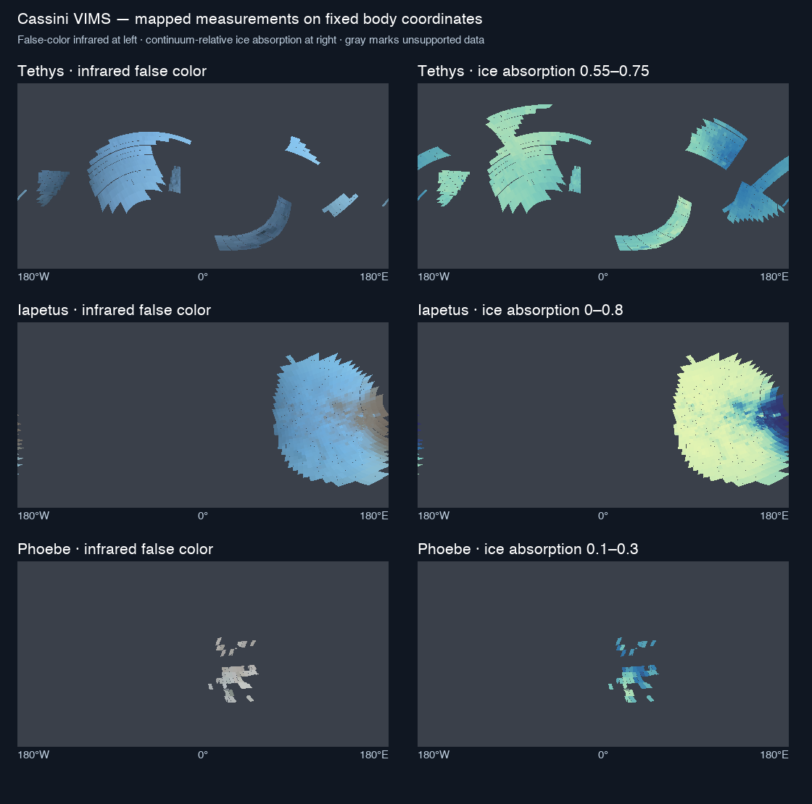

Cassini VIMS example: infrared false color at left, ice absorption at right;
gray marks unsupported data. The [original input record](https://github.com/layoutit/cssEarth/blob/cc01831f595e0b73ab6699d6235cf7b466f76cfc/docs/moons/b9-cassini-ice-surfaces/source-review/source-maps.json)
identifies the cubes and processing behind this illustration.

## FITS support

FITS decoding happens during preparation, never in the browser. The shared
[reader](../packages/fits/README.md) (`@cssearth/fits`) preserves native pixel/axis order and physical numeric
values. Every other FITS reader in `tools/` reads headers and HDU bounds through it.
Product adapters still own units, quality masks, camera registration,
spectral selection, missing-data policies and display transforms. Sky images do not
own their orientation: the package's [`skyImageAxes`](../packages/fits/src/sky.ts) reads it from the WCS. An axis-aligned image is flipped into
display order; a rotated gnomonic (TAN) image is resampled through `skyProjection`, which refuses distortion terms and frames
other than ICRS or FK5 and is checked against Astropy in both directions.

| Input | Supported contract and owner |
| --- | --- |
| Primary images and IMAGE extensions | 2D images or explicitly selected 3D planes; unsigned 8-bit, signed 16/32-bit, IEEE float32/64, big-endian. `BSCALE`/`BZERO` are applied once; integer `BLANK` becomes `NaN` before scaling. Zero and negative measurements remain values. |
| Large archive products | `readFitsFileHdus` locates every HDU by reading headers only; `readFitsFileRegion` reads one rectangle of one image extension from disk. A mosaic of hundreds of megabytes is never loaded whole. |
| Multi-HDU observations | Encounter, LORRI/L'LORRI and MVIC adapters require their exact instrument layout, units and quality conventions. Named HDUs do not imply a camera model. |
| Spectral and geometry cubes | LEISA uses bounded sample access without expanding a whole cube. PDS4 geometry labels must agree with FITS axes, element types and offsets; label special constants remain authoritative. |
| Fixed facet tables | Only the declared `1J + 5E` BINTABLE profiles, with their mesh identity and centroid checks. Column scaling (`TSCAL`/`TZERO`) and null (`TNULL`) declarations are rejected, not ignored. |
| OIFITS and ESO pipeline tables | [fits-table.mts](../tools/objects/interferometry/fits-table.mts) reads `D E I J K L B A` and complex `C M` columns, returns an integer column's `TNULL` as `NaN` and refuses to read or write a column scaled by `TSCAL`/`TZERO`. |
| ESO headers | HIERARCH keywords keep their namespace (`ESO DET NAME`, MATISSE's `PRO DISP COEF0`). Raw primaries reach 2,480 cards, so a header may span 256 records. Lower-case exponents are read as Astropy reads them. The archive's header service text is read one card per line. |
| Sky images | A celestial image states RA along columns and Dec along rows, unprojected (SQUEEZE) or with one zenithal projection, through `CDELT`, `CD`, `PC` or `CROTA2`. The display raster puts north on the first row and east on the first column. Rotated, skewed or axis-swapped images, other projections, a `LONPOLE` other than 180 and a reference point on a pole are refused, since a flip cannot display them. |
| Nebula Lab transport | Uses the shared image reader, then reverses rows once for top-down arrays. Missing/nonfinite pixels and float32 overflow are rejected; metadata cannot override structural fields. |
| Pallas SPHERE metadata | ESO `HIERARCH` names and scalar values are decoded without stripping cards. The four released LAM Deconv frames have exact Astropy comparisons for all 777 extended keywords and all 65,536 pixels per frame. Decoding alone does not qualify a camera or a registration; Kleopatra's `zimpol` lens adds that separately, by computing the camera from the release's own spin record and an ephemeris rather than from the frames' inherited world-coordinate solution, which describes an uncropped frame and not the product. |
| MUSE acquisition | The existing [Python converter](../tools/objects/acquisition/muse-spectral-maps.py) remains an exact six-card, 180×90 float64 product reader. Its complete header allowlist rejects scaling and additional conventions; it is not a general FITS reader. |

Value cards support quoted strings (including slashes and doubled quotes),
booleans, finite numbers with `D` or `E` exponents and undefined optional values.
The [ESO HIERARCH convention](https://fits.gsfc.nasa.gov/registry/hierarch/hierarch_20Aug2007.pdf)
is supported for uppercase ESO namespace tokens. For example,
`readFitsImage(bytes).header['ESO OBS AIRM']` holds its numeric value;
`.cards` retains the original 80-byte records, including commentary and `END`.
Duplicate value keys are rejected; `COMMENT` and `HISTORY` can repeat. Required
fields cannot be undefined. Released SDO quoted values without a space after
`=` and the unquoted JSOC `T_OBS`/`T_START`/`T_STOP` TAI strings are accepted
explicitly as text, without time conversion. Header scans stop after 64 records; HDU extents,
padding and safe-integer sizes are checked before reading. Image-plane decoding
defaults to a 512 MiB allocation limit. Scanning a BINTABLE does not decode its columns.

SDO's floating-point maps also contain a `BLANK` card. As in Astropy, the
reader retains that card and reports a warning but does not mask matching
finite floats: `BLANK` applies only to integer arrays; floating gaps are `NaN`.

This is a tested product subset, not arbitrary FITS support. Compressed images,
random groups, int64 image decoding, variable-length/general tables, complex
values, non-ESO/generalized `HIERARCH` names, `CONTINUE` and general WCS interpretation are unsupported.
FITS `CHECKSUM`/`DATASUM` are retained metadata, not verified checksums. The current
source manifest does not supply a SHA-256 integrity check. Oracle fixtures can
check recorded byte counts; exact-byte evidence needs its own retained identity.

### FITS checks

The focused tests compare decoder results with Astropy and NASA's PDS4 reader;
neither runs in the application. The shared oracle reader checks declared paths
and recorded byte counts, not manifest hashes. The Charon spectral-map test
also compares regenerated maps with its retained reference outputs.
The [test-only Pallas acquisition record](../tests/fixtures/fits/archive-inputs.json)
names the four native files, sizes and source URLs independently of production
body acquisition. They are restored under ignored `.local/fits-reference/`;
no Pallas body recipe or surface output changes here.

`node tools/oracles/test-fits.mts --unit` runs the offline subset, including small checked-in
Astropy-generated FITS files. CI runs this subset. It does not prove that the
large archive files are available or that complete body preparation passed.
Regenerate the small reference fixtures with `node tools/oracles/setup.mts`, then
`node tools/oracles/run.mts fits/core`; normal tests need no Python environment.

The retained runner's full and `--restore` paths still name four removed per-body
test files under `tests/objects/unit/`. They are not a working complete gate.
Until that runner is repaired, restore the affected body's inputs with
`node tools/assets/restore-source-inputs.mts --object=<id>` and select the existing
FITS tests (`node tools/oracles/test-fits.mts --unit` runs the package's own tests and its
Astropy comparisons) and the affected preparation owner's tests. Report missing
archive inputs and source-dependent skips; do not claim a full FITS pass from
the offline subset. A retained local copy must match the intended provider
product and version, not merely its filename.

## Map a surface point to source pixels

UV coordinates locate a point in an image. Source UVs select the original values;
atlas coordinates locate the baked tile that the CSS surface will display.

| Source representation | How sampling works |
| --- | --- |
| Geographic or projected map | [scienceMapPoint](../tools/objects/terrestrial-layers/scientific-raster.mts) applies the declared projection; grid origin, spacing and pixel-center rules locate the sample. [Solid-body reprojection](../src/platform/prepare-solid-body-surface.mts) handles the display surface and poles. |
| Mesh with released UVs | [obj-uv-fits.mjs](../tools/objects/terrestrial-layers/obj-uv-fits.mts) keeps each face corner's original texture index, including seams. It transfers a prepared point to the closest original triangle within the recipe's distance limit. |
| Registered photograph | The [surface-observation pipeline](../tools/objects/surface-observations/README.md) projects the point through the photograph's camera and checks source geometry, footprint continuity and visibility. [levels.mts](../tools/objects/surface-observations/levels.mts) selects among qualified frames. |

For released OBJ UVs, the matched triangle supplies three barycentric weights:
fractions describing the point's position within that triangle. The sampler
uses those weights to interpolate its three corner UVs, then reads the image:

```text
u = weightA × uA + weightB × uB + weightC × uC
v = weightA × vA + weightB × vB + weightC × vC
x = u × width − 0.5
y = (flipV ? 1 − v : v) × height − 0.5
```

The reader clamps these pixel coordinates to the image edges. `flipV` is explicit
because file row order can differ from texture-coordinate order. [Arrokoth](../src/objects/arrokoth/README.md)
is a worked example with independent PNG/FITS anchors. Adjacent triangles can
tie for the closest point at a seam; a distance bound alone does not prove which
triangle supplies the correct texel.

The current released-UV path accepts triangular OBJ geometry and float32 FITS
maps. It samples the original UVs during baking; the reduced mesh receives new
atlas addresses.

Longitude direction, latitude convention, physical scale, pole and meridian
belong to the source recipe. A generic image resize cannot establish them.

A global map's west and east edges meet at one meridian. When a georeferenced
source spans 360° of longitude, to within one of its pixels, its recipe declares
`wrapLongitude: true`, and interpolation reads across that meridian. Without the
declaration, a target pixel whose footprint crosses the edge counts as missing
and receives the gray coverage grid. That drew a one-pixel line at 180° on Io's
8K maps. Preparation rejects the declaration for a source that does not span 360°.

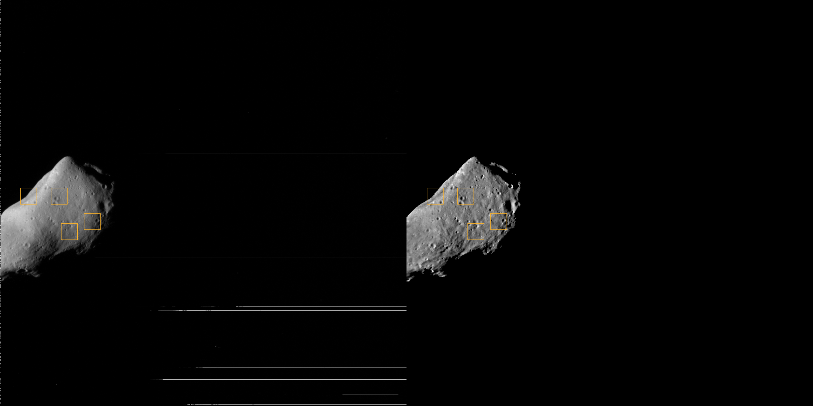

Gaspra registration example: detector image at left, published mosaic reprojected
through the archived camera at right. Compare the marked landmarks; the display
stretches differ. Both use related observations, so this is a registration check.
[Gaspra's README](../src/objects/gaspra/README.md) records the source, residuals and limits.

## Reduce geometry and bake the atlas

[radial-mesh.mts](../tools/objects/terrestrial-layers/radial-mesh.mts)
supports both a sampled radial surface and reduction of the original mesh.
A radial surface supplies one radius per direction. `source-meshoptimizer`
reduces source triangles instead; it can retain surfaces that a single radius
cannot describe. Face budgets, open boundaries and error limits are checked by
that path. The simplifier's error estimate and the measured source-transfer
distance are separate quantities.

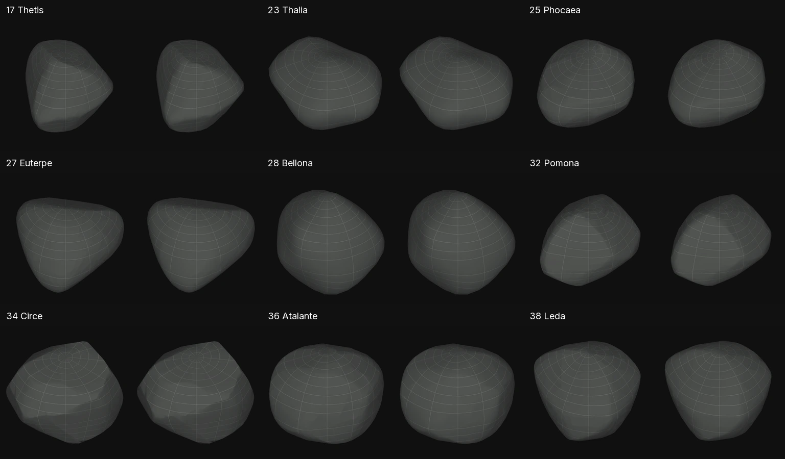

Mesh reduction example: each pair shows the source mesh at left and prepared mesh
at right. Each is normalized to its own maximum radius, so compare shape rather
than physical scale. The [original comparison method](https://github.com/layoutit/cssEarth/blob/cc01831f595e0b73ab6699d6235cf7b466f76cfc/docs/main-belt-asteroids.md)
records the camera settings and remaining views. These three illustrations are
historical processing examples, not new browser checks.

For mesh surfaces, preparation samples each retained triangle into its own
raster rectangle and emits a native PolyCSS `u` triangle with prepared CSS addresses.
As in PolyCSS raster sizing, the rectangle is sized by the triangle, so every
triangle of a body has the same texel density. The leaf shows its rectangle like
any `@2x` image, at two atlas texels per CSS pixel, and its matrix scales it back
onto the face. WebKit backs each composited leaf at its box size times the device
pixel ratio and ignores the transform: at one texel per CSS pixel, Itokawa's 794
faces held 486 MB of layer memory on a DPR 3 iPhone, and 173 MB at two. Every
textured leaf follows the same rule, `TEXELS_PER_CSS_PIXEL` and `leafRasterScale`
in [projective-surface-raster.mts](../src/platform/projective-surface-raster.mts):
faces, polar caps, band leaves, ring tiles, volume slices and image layers hold
their widest image, over every lens, level and page, at two texels per CSS
pixel, with the recipe's raster scale as a ceiling. On the iPhone 17 simulator
Jupiter's page went from 2,823 to 133 MB of layers and Saturn's from 703 to 374 MB,
with at most 4 of 3.16 million pixels changed at rest. A leaf names no image of its
own: each lens's variant writes the surface and pole textures every leaf reads
(`scene/projector.ts`, `presentation/composite.ts`), which is what made Uranus's
and Neptune's lenses draw their own maps. On a body with a dense map the texture
is drawn at half the resolution at maximum zoom and softens there (Ceres, Mars,
Mercury).

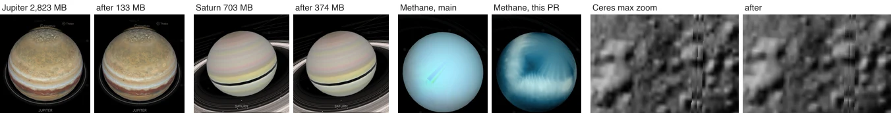

At rest on Itokawa, 739 of 3.16 million screen pixels change; at maximum zoom each face is drawn
at half the resolution, so a seam can show as a faint light line ([seam repair](#seam-repair-and-the-globe-interior-disc)).

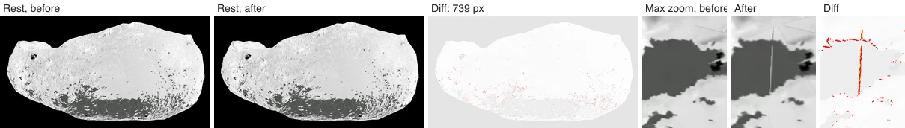

### Leaf boxes follow the body on screen

Two texels per CSS pixel is what a leaf needs at maximum zoom. At rest the same box is several times larger than the
leaf on screen, and WebKit still backs all of it. So every projective leaf reads a factor, `--leaf-box`: its box,
background size and position are `calc(<length> * var(--leaf-box, 1))`, and its matrix is followed by
`scale(calc(1 / var(--leaf-box, 1)))`, so each texel lands where it did at any factor. Without a factor the leaf keeps
its full box. [leaf-box.mts](../tools/prepared/leaf-box.mts) holds the rule:

- **The factor** is `min(1, step × density)`. A leaf's density is what its box needs per pixel of the body's silhouette:
  two box pixels per screen pixel (`LEAF_BOX_SCREEN_PIXELS`) at its most magnified edge, from its measured scene frame.
- **Steps** grow by √2 from 16 silhouette pixels to the first step at which every leaf holds its full box.
- **Groups.** The presentation bindings measure every leaf in a browser at each `prepare:object-json`, so every generator
  shares the rule. Surface leaves join blocks of about eight leaves by direction (`LEAF_BOX_GROUP_LEAVES`), each with a
  placement like a texture page's; other leaves (rings, shells, cutaways) form groups of eight. The bindings also record
  each group's full box area, for the memory estimate below.
- **Runtime** ([prepared-leaf-box-blocks.ts](../packages/renderer/src/rendering/prepared-leaf-box-blocks.ts)): a block's step
  is the body's diameter as it would look at the block's nearest depth, the first step when it is behind the body or off
  screen; the other groups follow the silhouette. A step is written on the group's own leaves, so only they restyle.
  - **Only at rest.** A step change redraws its leaves, so nothing switches while the camera moves, including inertia and
    the gaps between notches of a stepped wheel: 750 ms after the last view change the final steps are applied.
  - **Paced.** The switches are queued, sharpest need first, and the leaves written per frame follow the frame time.
  - **Kept within a budget.** Detail the view no longer needs stays until it passes 32 MiB, estimated from each
    group's prepared box; then the groups needed longest ago shrink first. A zoom out within the budget changes nothing.
    No browser reports its layer memory to the page, so the cap is fixed, as a tile cache's is.

Earth's generator opts out (`leafBox: false`) while its paged surface levels are reworked on their own branch.

Measured in the iPhone 17 simulator (WebKit layer memory from the inspector), zooming 40× in over 3 s and back:

| Body | At rest | Zoomed in | Back at rest |
|---|---|---|---|
| Moon, full boxes | 291 MB | 260 MB | 291 MB |
| Moon, leaf boxes | 187 MB | 162 MB | 191 MB |
| Saturn, full boxes | 382 MB | 374 MB | 382 MB |
| Saturn, leaf boxes | 379 MB | 373 MB | 381 MB |

Saturn barely changes because its default phone view already draws the rings larger than their boxes, so they keep
every texel. While the camera moves, frames match full boxes in Chrome (a recorded wheel zoom: no frames with missing
content, the same raster work) and in the simulator. The switch after the camera stops costs Chrome seven style passes of
1–3 ms; in the simulator it costs one frame of 35–104 ms on Saturn.

The recipe's `texelsPerFace` sets the body's budget: its face count times that value.
The triangle's base is the edge that least shears the `u` leaf's bottom-edge and
top-centre shape. A fixed square per triangle would give large and thin triangles
several times fewer texels per metre than small ones, at the same bytes.

The `u` leaf cuts its triangle with `corner-shape: bevel` on its two top corners.
Safari 26 and Firefox have no `corner-shape`, so they round those corners into an
ellipse and each face shows an oval of its slice. For every atlas a `u` face reads,
[triangle-alpha-atlas.mts](../tools/objects/terrestrial-layers/triangle-alpha-atlas.mts)
therefore writes a second copy, `<name>-alpha@2x.webp`, whose slices are transparent
outside their triangle. The mask is the union of the faces that read that atlas in
some variant, antialiased over one texel and never grown: at the raster sizing's
roughly 60× leaf scale, even a one-texel margin showed as spikes past narrow apexes.
The runtime declares the copies as `corner-shape` resource fallbacks and swaps them in
once per page when `CSS.supports` reports the capability missing
([prepared-resource-fallbacks.ts](../packages/renderer/src/rendering/prepared-resource-fallbacks.ts)),
and `triangle-faces.css` then drops the leaf's rounded corners. A browser with
`corner-shape` never requests the copies.

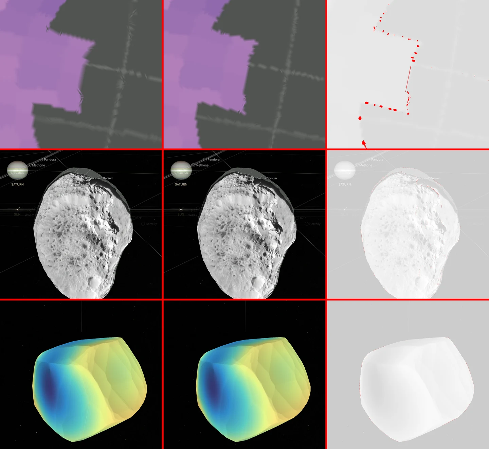

Same pose before and after the change (main, raster atlas, pixelmatch at threshold 0.1). Every face gets
texels at one density, but where the source map is smoother than the old texels the screen does not
change: the largest difference across all lenses of these three bodies was 0.45%, along a coverage edge.
Ordinary mapped imagery is sampled from the lossless surface map at this step.
For banded surfaces, [projective-surface-raster.mjs](../src/platform/projective-surface-raster.mts)
packs latitude bands and gutters; poles have separate prepared tiles.
Atlas dimensions, tile sizes and padding must agree with those addresses.
Padding hides sampling seams; it does not add observed coverage.

Chrome antialiases each leaf edge separately and paints each leaf's texture only
up to that edge. Two leaves that meet exactly therefore leave a faint see-through
line, and a magnified seam shows where one leaf's texels stop. A fixed overlap
that stretches the texture cannot hide both at every zoom. Venus's former 0.8%
overlap was 0.4 CSS pixels per edge at the default view, too little for every
edge, and 1.9 pixels at feature zoom, where the stretched texture showed as a
band along each seam.

When a [CSS geometry profile](../src/renderers/css/preparation/scene/profile.ts)
declares a seam outset, preparation writes two corrections instead:

- **Matched raster overscan.** Each surface leaf's texture address and its
  geometry both extend by half a canonical source texel, one displayed texel of
  real neighbouring imagery past each edge. A magnified seam then blends into the
  neighbouring texels.
- **Stepped seam outset.** Each surface leaf gets a scale per axis, and the body
  a table of silhouette steps
  ([seam-outset.ts](../src/renderers/css/preparation/scene/seam-outset.ts)). At
  runtime the body publishes the value for its projected diameter as
  `--surface-seam-outset`, and each leaf scales about its centre by
  `1 + outset × scale`. From a 16-pixel disc to the closest zoom, every step adds
  0.38–0.6 CSS pixels on each edge. The runtime only selects a prepared step.

The [historical seam browser test](https://github.com/layoutit/css.earth/blob/6e32bc459b%5E/site/test/surface-seams-browser.mts)
measured saved Venus radar views over black and white backdrops and compared
brightness across seams. The current
[`rendered-page.test.mts`](../site/test/rendered-page.test.mts) checks built HTML
structure; it does not measure seam pixels.
These corrections do not change breaks in the source imagery itself, such as
the one-pixel border columns at the edges of the Venus radar, Mars and Ceres
source maps.

### The lossy lane

A prepared image's size is a cost the reader pays on a phone, and it must still
look identical. Every lossy image a bake writes goes through the lossy lane
([lossy-lane.ts](../src/preparation/raster/lossy-lane.ts)): WebP at quality 80
with sharp YUV chroma (`smartSubsample`). Numeric and categorical images stay
lossless and never enter it.

Quality 80 is the lowest at which the lane changes nothing a reader can see.
Each sample below was encoded at 75, 80 and 85 and compared with the file it
replaces using pixelmatch at threshold 0.1. The count is pixels flagged.

| Map | Pixels | Today | q75 | q80 | q85 |
|---|---|---|---|---|---|
| Europa normal | 8320×6144 | 6.98 MB | 3.64 MB, 549 | 5.00 MB, 0 | 6.16 MB, 0 |
| Moon surface | 8320×6144 | 13.45 MB | 7.24 MB, 1717 | 10.66 MB, 0 | 12.21 MB, 0 |
| Phobos normal | 5010×5217 | 7.68 MB | 2.36 MB, 1798 | 3.14 MB, 0 | 3.97 MB, 0 |
| Mercury interior (outer, unlit) | 4096×2048 | 5.49 MB | 1.49 MB, 10 | 1.82 MB, 0 | 2.22 MB, 0 |
| Saturn interior section | 4096×4096 | 10.06 MB | 0.11 MB, 0 | 0.12 MB, 0 | 0.21 MB, 0 |
| Deimos normal | 5019×5222 | 1.61 MB | 0.47 MB, 471 | 0.58 MB, 485 | 0.76 MB, 447 |

Deimos was already lossy WebP. Its few hundred flagged pixels (0.002 %) are
one lossy encoding against another and do not shrink with quality.

Navigation images go through the lane too, with exact alpha (`alphaQuality: 100`),
measured the same way on 2026-09-25 against the lossless files they replaced:

| Image | Pixels | Lossless | q80 | Flagged |
|---|---|---|---|---|
| Body-marker pages (three) | 8192×32, 8192×32, 6080×32 | 482 KB | 284 KB | 13, 6, 6 |
| Lens-billboard atlas | 1024×1024 | 247 KB | 98.5 KB | 4 |
| Star point atlas | 1024×32 | 14.0 KB | 0.7 KB | 0 |

The per-body marker tiles the pages are packed from stay lossless.

Facility thumbnails (spacecraft artwork and telescope photographs, 592×296) go
through the lane too; the artwork keeps alpha quality 40. Measured on 2026-09-25
against lossless encodes, artwork shown on the card colour:

| Images | Quality 90 before | Lane | Flagged before → lane |
|---|---|---|---|
| NASA spacecraft artwork (21 files) | 427 KB | 263 KB | 346 → 245 |
| Telescope photographs (11 files) | 485 KB | 315 KB | 679 → 197 |

These still set their own encoding:

- Earth's full pages keep the qualities its recipe declares; its smaller
  texture levels follow their page, lossy ones through the lane.
- Lighting rows and their billboards carry shading in alpha and stay lossless.
- Mercury's JPEG maps keep their recipe quality (85). Chrome decodes them about
  three times faster than lossy WebP, which costs about 30 % more bytes.
- Saturn's layered and spectral materials keep their encodings.
- Image-layer galaxies (M31, M33), the LMC and SMC volume banks and the Milky
  Way sky keep their recipe qualities.
- Volume atlases (density in alpha, seen as stacked slices) and the
  staging-only sphere-photograph refresh tool keep their encodings.
- Navigation context images (`<id>-context.webp`, a body's large marker) keep
  quality 85.
- Decorative images take quality 40
  ([`DECORATIVE_WEBP`](../src/preparation/raster/lossy-lane.ts)): the sidebar
  dataset maps (`prepared/minimaps/`) and the volume dataset previews
  (`datasets/<sha>.webp`, 600 px). Measured on 2026-09-25 over all 1,327 maps
  against the quality 90 maps they replaced: 15.8 MB became 4.8 MB with 0.074 %
  of pixels flagged; quality 30 flagged 0.119 %. A nearest-sampled category map
  keeps lossless when that is smaller, as it is for 11 noisy geology and region
  maps.

To repeat the measurement, run
[`tools/prepare/lossy-lane-sweep.mts`](../tools/prepare/lossy-lane-sweep.mts)
on the files a lane change replaces.

[raster-output.mts](../tools/objects/terrestrial-layers/raster-output.mts) writes
WebP assets and records their dimensions, sizes and hashes. Normalized maps stay
lossless; display output is written in the lossy lane unless the recipe selects a
quality setting.
`pds3-scalar-map`, `facet-scalars`, `vtk-cell-categories` and `obj-uv-fits` atlases
use lossless output, as do nearest-sampled layers and image-plane DEMs.
Check decoded pixels after encoding. Rebuild affected atlases and CSS addresses
together when their layout changes.

### Shared lighting banks

The phase-lighting rows and billboard of an opaque sphere lit by the Sun with no
atmosphere do not depend on the body: 61 bodies carried the same lighting block
and encoded the same 7 MB one by one. Such a block is now a bank named once in
[lighting-banks.ts](../src/preparation/raster/lighting-banks.ts) and baked once
into `public/lighting/<bank>/` (tracked, like the navigation atlases) by
`node tools/objects/dist/prepare-lighting-bank.js`. A body's raster recipe names
it, `"lighting": { "bank": "sphere", ... }`, keeping only its presentation
fields and metadata; the parser fills the bank's fields in, and the bake copies
the bank's files into the body's scene directory instead of encoding them, so
the body's prepared output, inventory and published files are what encoding
would give. `prepare-lighting-bank.js --check`, run by
[its test](../tools/objects/prepare-lighting-bank.test.ts), bakes each bank afresh
and compares it with the tracked files byte for byte, so the copy is never stale.
A body whose lighting differs (Neptune, Uranus, the HD 110067 planets) keeps its
inline block and its own encode. The `sphere` bank's law is authored: a 0.35
limb floor with shadows off, a 0.05 ambient term and a terminator ramp. A body
with a published law leaves the bank, as the planets below do.

### Planet limbs from published laws

A planet map is flattened: its makers divided out how bright each point looked
at its viewing angle. The planets' lighting overlays put that back with the
same published law, so the limb in the app is the limb the instrument saw.

- **The law.** Each planet keeps its model in `source/photometry/`, one
  [model record](../tools/photometry/README.md#model-records) per colour channel.
  [limb.mts](../tools/photometry/limb.mts) evaluates it relative to the flood-lit
  disc centre, where incidence, emission and phase are all zero. The centre of
  the default view shows the map as published; every other pixel follows the
  paper, including its phase term where it has one. Toward the limb the law is
  held at the largest emission angle its data reached: the paper's fitted range,
  or for an OPAL map the outermost pixel of the Hubble disc at its epoch. A
  Minnaert law extrapolated past that edge runs to white or black in a thin rim.
  Nothing is added: no floor, ambient term or terminator ramp.
- **Sources.**

  | Planet | Law | Source |
  | --- | --- | --- |
  | Mercury | Kaasalainen–Shkuratov KS3 at 748.7 nm | [Domingue et al. 2016](https://doi.org/10.1016/j.icarus.2015.11.040), the correction of the MDIS maps |
  | Venus | Minnaert, k 1.32 to 1.36 | [Pérez-Hoyos et al. 2018](https://doi.org/10.1002/2017JE005406), MESSENGER MASCS |
  | Mars | Hapke, surface only | [Vincendon 2013](https://doi.org/10.1016/j.pss.2012.12.005), OMEGA and CRISM |
  | Jupiter | Minnaert per channel | [Simon et al. 2015](https://doi.org/10.1088/0004-637X/812/1/55), OPAL |
  | Saturn, Uranus, Neptune | Minnaert per channel | the OPAL README of each map |
  | Earth | Minnaert per channel | fitted here to six [DSCOVR EPIC](https://epic.gsfc.nasa.gov/about) Level 1B frames ([fit-epic-limb.mts](../tools/photometry/fit-epic-limb.mts)) |
  | Moon | Hapke at 643 nm | [Sato et al. 2014](https://doi.org/10.1002/2013JE004580), the correction of the LROC WAC mosaic; w, b and h_S are medians of its PDS parameter map |
  | Ceres (dwarf planet) | Hapke at 749 nm | [Li et al. 2019](https://doi.org/10.1016/j.icarus.2018.12.038), Dawn Framing Camera |
  | Pluto, Charon | Lunar-Lambert, A 0.70 | [Buratti et al. 2017](https://doi.org/10.1016/j.icarus.2016.11.012), LORRI approach images; the limb limit is the outermost pixel of the finest image in its Table 1, derived here |

  The Galilean moons, Titan, Iapetus, the five large Uranian moons, Triton,
  Eris and Makemake keep the shared `sphere` bank. Each
  has a `limb-law` entry in its `investigations.json` that says what was found
  and what is missing: no law exists, the published one could not be read, it
  states no emission range, or it covers regions rather than the whole body.

  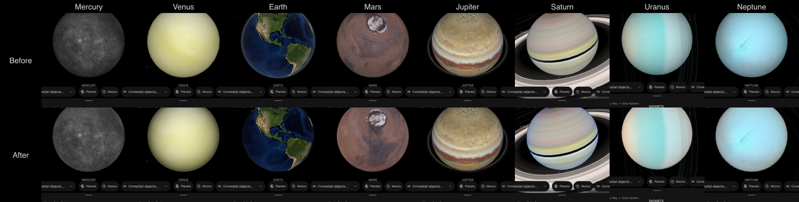

  Ceres, the Moon, Pluto and Charon, each on css.earth with the shared bank
  (left) and with its published law (right), 25 September 2026. The shared
  bank darkened the flood-lit limb to an overlay alpha of 0.49 at 0.98 of the
  radius; the laws give 0.004 for Ceres and the Moon and about 0.19 for Pluto
  and Charon. The globes turned between the two captures, and css.earth still
  showed Charon's coarse texture level.

  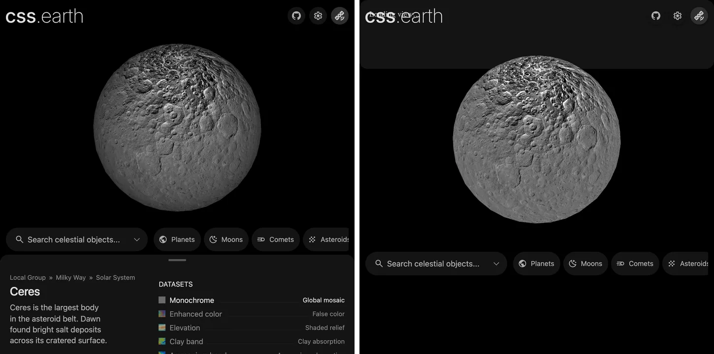
  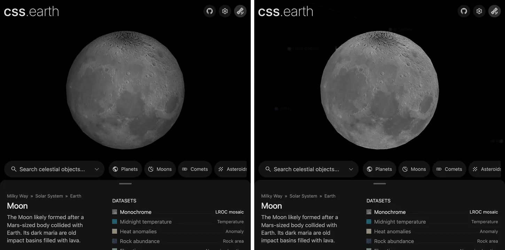
  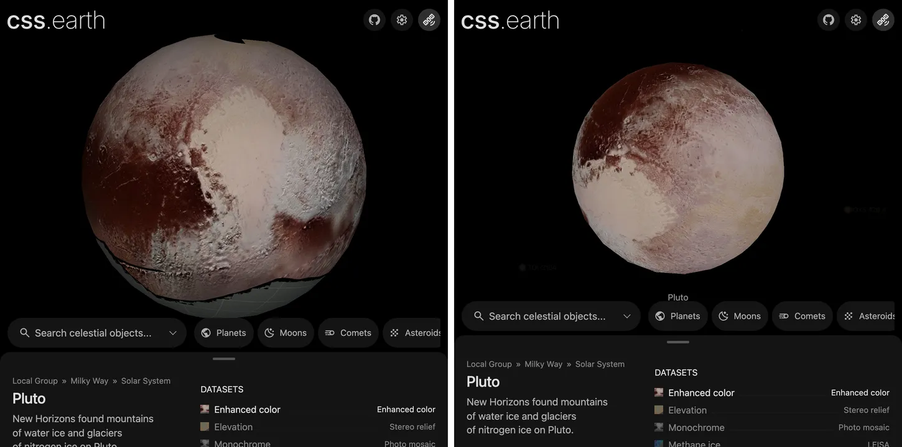
  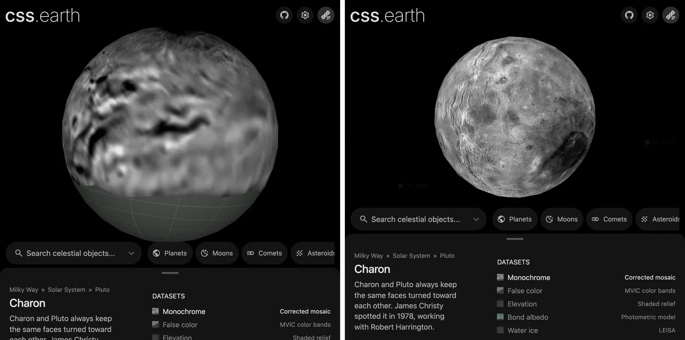
- **One overlay per pixel.** A CSS overlay has one colour and one alpha, and
  blend modes are not used. The overlay is exact for the map's mean colour,
  measured at bake, and for every pixel in the channel that sets its alpha. A
  pixel far from the mean colour is off by (mean − pixel) × (spread of the
  channel factors), which is largest near the limb.
- **Colour tie.** A colour map whose archive scaling is arbitrary (Saturn's
  OPAL TIF) names a whole-disc colour computed once from a published spectrum
  ([whole-disc-colour.mts](../tools/photometry/whole-disc-colour.mts)). The map's
  green and blue are scaled by one gain each so that, once the limb law is put
  back, the flood-lit disc integrates to that colour: the target ratios are the
  colour's divided by each channel's disc mean of the law, 2/(2k+1) for Minnaert.
  The tie keeps red, so the map then gets back its untied mean luminance with
  one factor on all three channels, and texels whose brightest channel passes
  0.8 are compressed by a soft shoulder instead of clipping, ratios kept.
  The tie is the Uranian moons' band-ratio tie; the
  [Saturn README](../src/objects/saturn/README.md) reports its gains and factor.

  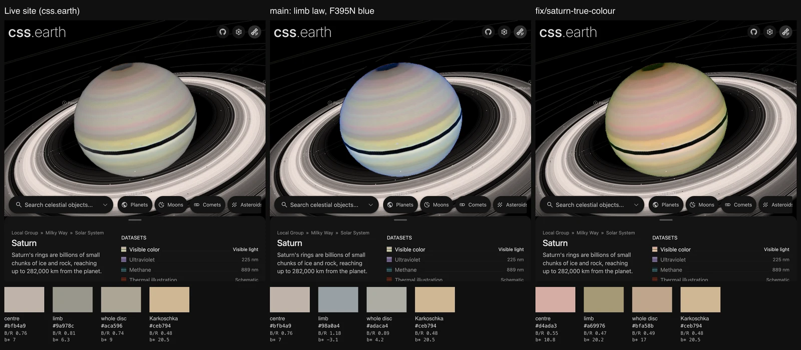
- **Halo.** Venus and Mars draw a halo from a NASA [PSG](https://psg.gsfc.nasa.gov/)
  limb profile with the Sun behind the viewer, lit where the tangent point faces
  the Sun. [acquire-psg-limb-table.mts](../tools/photometry/acquire-psg-limb-table.mts)
  computes it once, against PSG's own disc centre, and
  [halo.mts](../tools/photometry/halo.mts) reads it. PSG computes limb lines of
  sight with single scattering only
  ([handbook](https://psg.gsfc.nasa.gov/images/help/handbook.pdf), p. 96), and
  its single-scattering limb receives no sunlight with the Sun exactly on the
  tangent point's horizon, so the tool puts the Sun one degree above it. The
  real halo, most of all Venus's low haze, may therefore be brighter. The halo's
  lowest altitude sits at the visible disc edge, the lane's content scale (0.992
  of the frame's silhouette), and there it replaces the dark ring the disc
  overlay draws to hide the mesh edge. The first
  local runs returned the same radiance at every altitude because PUMAS had
  quietly switched to a plane-parallel two-stream solver to save memory. The tool
  now splits each band into narrow windows (10 nm for Mars, 5 nm for Venus, whose
  aerosols need a longer phase function) and refuses any answer that did not run
  the requested single scattering. Earth keeps the model atmosphere it had
  before, drawn over its lit disc in the same image (the
  [Earth README](../src/objects/earth/README.md) lists its sources). PSG's
  Earth template has no aerosols, and then its single-scattering limb scatters
  Rayleigh light the same in every direction, so the tool refuses it.

  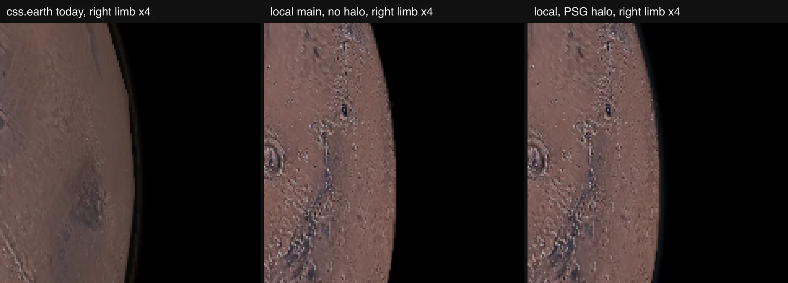
  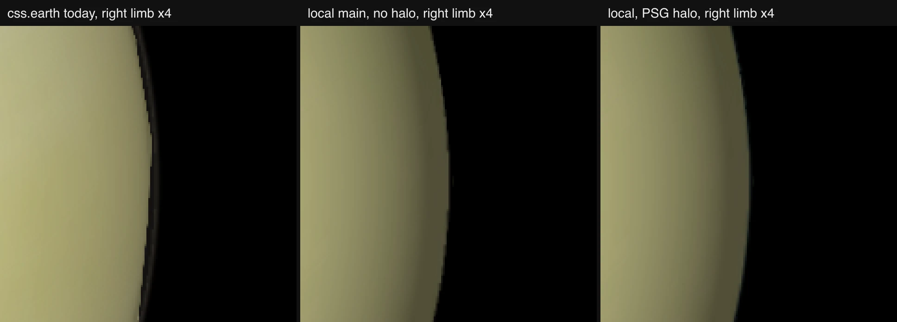
- **Why not one model for every disc.** PSG's default atmospheres were checked
  against Hubble's measured coefficients and missed them. In red, PSG gives
  Uranus k 1.16 where OPAL measured 0.57. In F395N, it gives Saturn 0.73 where
  OPAL measured 0.40. For Venus it gives about 1.05 where MASCS measured 1.35.
  Each disc therefore uses its measured law. PSG is kept for what nothing
  measured: the halo.

## Run and check a change

Use the [build and preparation commands](../.agents/skills/celestial-skill/references/implementation-map.md#commands-and-test-routing)
to build the tools, restore inputs and prepare the selected body. For example,
after building the tools and restoring Arrokoth's inputs:

```sh
node tools/objects/dist/operations.js acquire arrokoth --verify-only
node tools/objects/dist/prepare-authored.js arrokoth --write
node --test tools/objects/terrestrial-layers/obj-uv-fits.test.mts
```

The UV test checks interpolation, row order, missing values and bounded transfer.
For the changed body, compare independent source coordinates or numeric anchors,
then decode the corresponding atlas texels. Inspect the rendered seam, poles,
silhouette and coverage boundaries. Shared browser conformance checks interaction;
it cannot establish scientific registration.

Put the body's selected parameters, source interpretation and measured limits
in its README and recipe. Keep shared algorithm explanations here. Add a
[provenance binding](object-provenance.md#ownership-and-data-flow) when a new
operation consumes inputs or emits products, and retain its original check results
under the [evidence rules](provenance/CONTRACT.md#save-enough-evidence-to-check-the-result).

## Refresh photographs without rebuilding geometry

Existing single-model spacecraft observation lenses can refresh through the same
surface-observation and triangle-atlas preparers used by a full preparation:

```sh
node --experimental-strip-types tools/objects/refresh-surface-observations.mts itokawa amica
node --experimental-strip-types tools/objects/refresh-surface-observations.mts lutetia osiris
```

Update the recipe and declare its source inputs first. This command checks the retained atlas's
layout and transform matrices, prepares only the selected lenses, and updates
their photographs, thumbnails, minimaps, source indices and delivery pins.
It records each refreshed surface's billboard colour and the lens catalogue's
control colour with the same steps as a full preparation.
Geometry and other lenses remain retained. Provenance uses the
existing `recovered` basis because this is a partial refresh. The run's timings,
source recipe hash and changed asset list are kept in ignored
`output/surface-observation-refresh/<body>/refresh.json`. Alternative models or
source-lighting changes require full preparation. Run one body at a time.

For a `density-before-pack` raster with separate pole sprites, a surface may set
`resolutionScale` to a positive integer. It multiplies that photograph's map
size at both prepared densities. Gutters scale with the map, preserving normalized
atlas coordinates; polar sprite dimensions, lighting and scene geometry stay fixed.
This setting does not change runtime texture selection or add a renderer feature.

After updating the changed recipe and content, use the shared preparer:

```sh
pnpm build:tools
node tools/objects/dist/refresh-photographs.js moon surface
node tools/objects/dist/refresh-photographs.js europa normal enhanced
node tools/objects/dist/refresh-photographs.js io normal enhanced
```

Run one body at a time. The command verifies the selected source closure, prepares
its images and small minimaps, and updates the existing asset inventories and
captions. It rejects scientific/emissive selections and new resource names.
Unselected maps and the scene remain retained products; provenance records this
as a partial refresh rather than a new full-package preparation. The ordinary
full preparer uses the same image code.

LROC's `pds-float-map` interpretation reads attached PDS3 labels, validates the
product version, band, projection and lunar reference sphere, then integrates
source pixel footprints before applying display gain/gamma. Source special values
are masked before sampling; observed black is retained. It reads one row strip
at a time and supplies the same interpretation to the globe and sidebar map.

A scientific lens with format `pds3-float-map` (for example Titan's heights and
Ceres's Dawn VIR band depths) reads 32-bit float maps through
[pds-float-map.mts](../tools/objects/terrestrial-layers/pds-float-map.mts). The
label may be attached or detached (`labelPath`); byte order, west- or
east-positive longitude, latitude extent and missing value come from the label
and must equal the recipe's grid. Pixels outside the label's latitude limits
and missing pixels stay missing.

## Seam repair and the globe interior disc

**Polar caps.** Every lane closes a band mesh at the poles the same way
([polar-cap.ts](../src/renderers/css/preparation/scene/polar-cap.ts)): a flat plate rounded to a disc, facing out of
the body and culled when it turns away. Generated spheres used to grow their bands by a 24-unit seam bleed and draw
square lids from both sides; on iPad Safari that pushed past the outline at the poles:

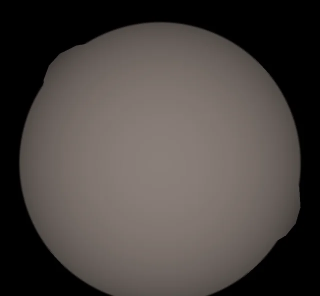

Generated spheres now take their seams from one shared setting
([sphere-projection.mts](../tools/objects/sphere-projection.mts)): exact tiling, a half-texel overscan and the stepped
silhouette outset, with the overlap derived from each map's texels per cell.

Spherical and ellipsoidal objects share one retained interior disc behind their
leaves. An irregular body cannot use it: the disc's inner ellipsoid is limited by
the nearest leaf plane to the centre, 0.39 of Alphonsina's mean radius, so cracks
outside it stay open. Irregular bodies close their cracks with seam repair in the
leaves themselves, as PolyCSS prepares any solid mesh
(`RADIAL_SEAM_REPAIR` in `tools/objects/terrestrial-layers/radial-terrain.mts`):

- `buildSeamBleedPolygonEdges` names the edges each face shares with a
  neighbour. A shared edge overlaps it by 12 CSS pixels; a face with no shared
  edge, at an open boundary, keeps the solid-triangle bleed of 0.75.
- The atlas rectangle covers the overlapped triangle, and every texel it draws is
  sampled, so the overlap continues the surface instead of repeating an edge.
- Texels beyond the drawn triangle by more than two take the nearest sampled
  texel in their row; they are never displayed.

Measured on Alphonsina, Ida, Itokawa, Mathilde, Achlys, Amalthea and comet 1P
(DPR 2, five poses, zoom 1.1 and 4, surface leaves painted white with back faces
hidden, so any crack is a thin non-white line inside the body):

| Body | Open crack pixels without overlap | With 12 CSS pixels |
| --- | --- | --- |
| Itokawa | 14,147 | 7 |
| Ida | 16,708 | 24 |
| Amalthea | 5,746 | 4 |
| Achlys | 5,574 | 0 |

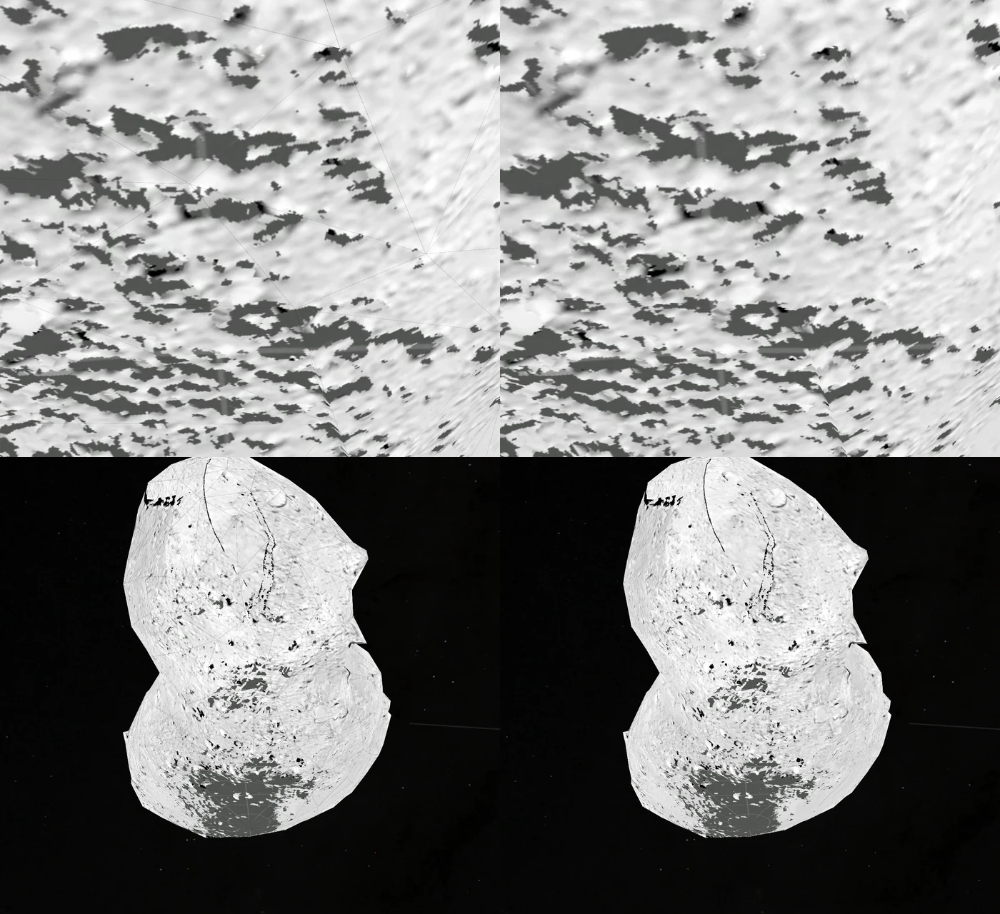

Surface detail is unchanged: Itokawa's mean surface detail (absolute Laplacian
over pixels that are neither crack nor sky) is 1.572 without overlap and 1.669
with it; Ida's is 0.912 and 0.918. These counts were measured with leaves at
one texel per CSS pixel. At two, Safari draws each face at half the
resolution: at Itokawa's maximum zoom on a DPR 3 iPhone, a seam that was barely
visible shows as a faint light line across a dark patch. The crack census has not been repeated at two texels per pixel.

Pixelmatch between two overlap sizes differs
across the whole surface, because the atlas is packed again and every texel moves
by a fraction of a pixel; only same-layout comparisons measure a change in what is
drawn.

The disc for globes works as follows. The common presentation compiler measures the actual
surface leaf planes in the body's frame and fits an inner ellipsoid behind
them. It reserves two raster pixels around the 512px disc for antialiasing.
Every point on the camera-facing disc stays inside those prepared bounds as the
camera moves; it does not enlarge the exterior silhouette.

The disc uses the alpha-weighted mean of the active prepared surface images,
including all pages of a paged dataset. Dataset selection changes that prepared
color. Cutaway views hide the disc. The runtime only transports its prepared
shape with the shared physical camera; it does not read image pixels or build
surface geometry.

The common compiler prepares this during normal object finalization. To refresh
only this metadata from existing local assets, run
`node tools/prepare/prepare-interior-fills.mts --all` (or supply object ids). The command
preserves surface assets, motion, lighting and depth partitions, and regenerates
scene and page metadata. Source graphs are retained only after checking that
their inputs changed solely in those scene references.
