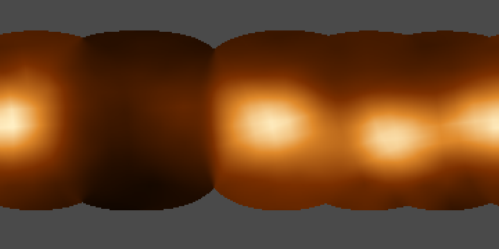
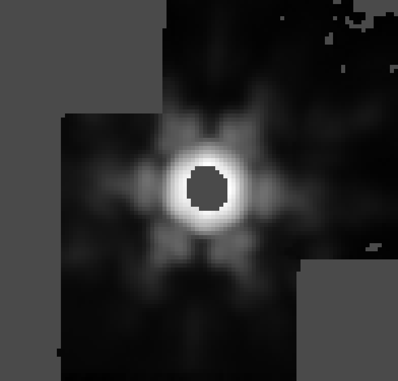
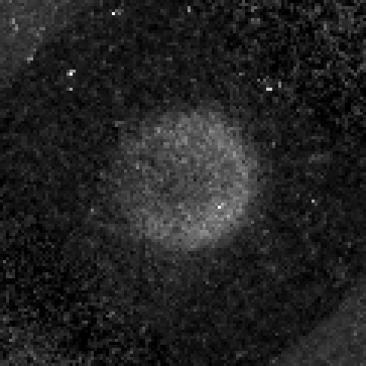
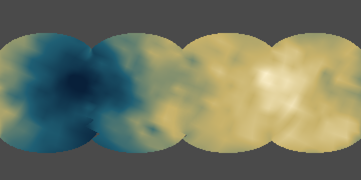
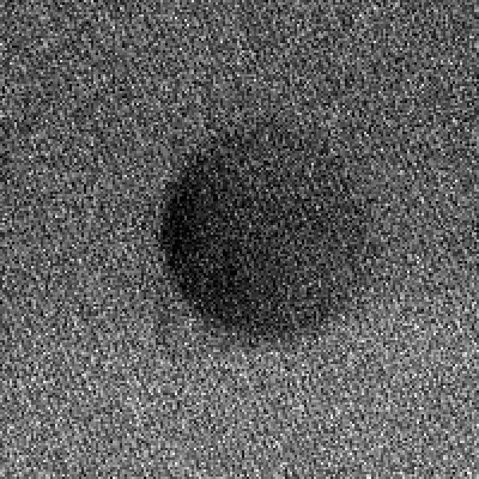
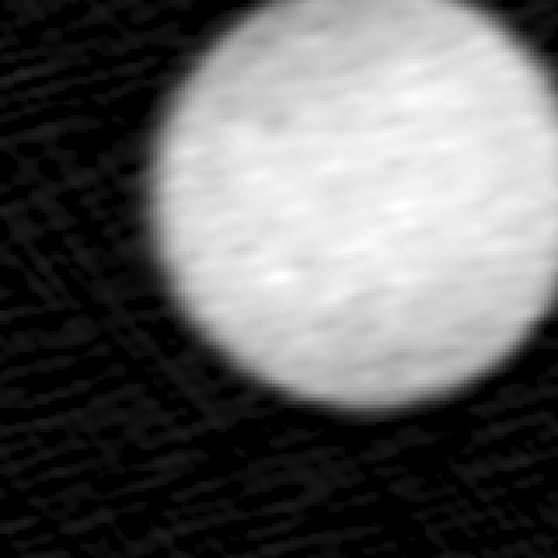
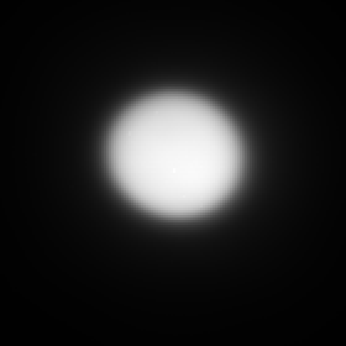
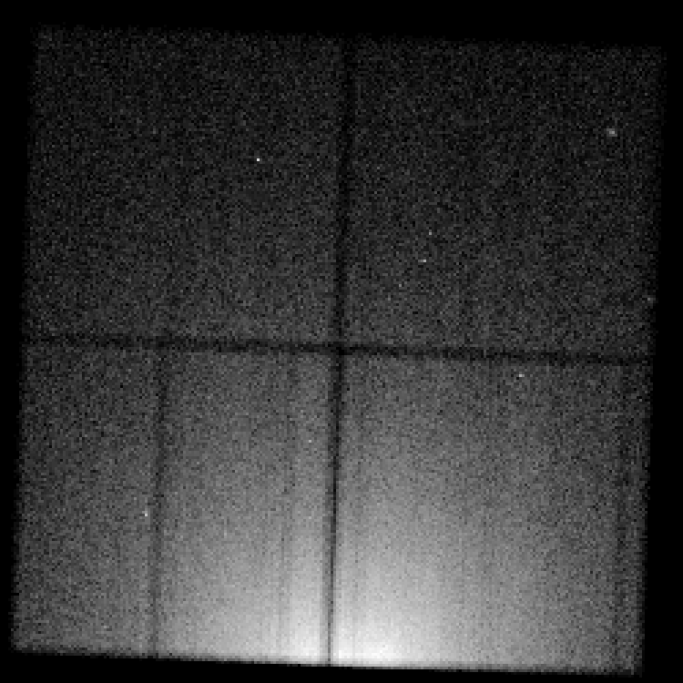
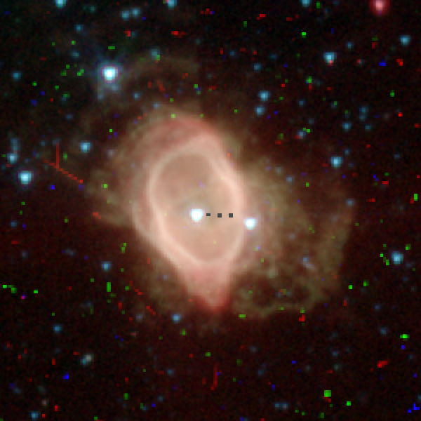
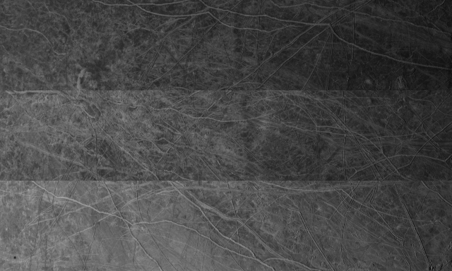

# One example picture per telescope

Each virtual telescope in this repository re-runs an observatory's own software on archive data and writes a product: a
FITS image, a map, or a list of detected photons. This page shows one picture per telescope, made from a product that
toolkit has already produced here. Nothing on this page is an archive preview or a press image.

Every picture comes from one renderer, `tools/objects/telescopes/example-picture.mts`, and one checked-in recipe,
`tools/objects/telescopes/examples.json`. The recipe states the file, the extension, the pixel window, the unit the
numbers are in, the two values drawn as black and white, the stretch between them, which way up the picture is, the
whole-number enlargement and the colours. Every source sample becomes a square block of output pixels. Nothing is
smoothed, sharpened, interpolated or cleaned up, and a value outside the stated range is clipped rather than rescaled.
The recipe also pins each product's sha256 and the command that makes it, so the whole chain can be re-run:

```
<the toolkit command listed below>            # re-makes the product
node tools/objects/telescopes/example-picture.mts   # re-makes every picture in docs/telescopes
```

Products live in the git-ignored `output/` and `.local/` directories of the worktree the toolkit ran in, so the recipe
records that directory too. The commands below are written as they are run from the repository root.

Still to follow: Keck and Gemini. Their toolkits are being built and neither has produced a finished image yet, so this
page has no entry for them rather than a stand-in.

## JWST, NIRSpec: carbon dioxide on Europa



Four NIRSpec integral-field cubes of Europa, taken between 24 November 2022 and 17 November 2023 through G395H/F290LP,
measured band by band and laid onto a longitude-latitude grid of the whole body. Brightness is the depth of the carbon
dioxide band near 4.25 microns, from 0 (black) to 0.18 (cream), linear. Row 1 is the north pole, column 1 starts at 0
degrees east longitude, and east runs to the right. Grey is where no cube saw the surface, or saw it too obliquely to
measure. The four bright patches are the four visits; the brightest is Tara Regio, on the leading hemisphere.

`node tools/objects/jwst/cubes/author-body-maps.mts europa`

## JWST, MIRI: Europa at 12.8 microns



The MIRI imager's F1280W filter on 23 November 2022, re-run through the level-3 image stage. Brightness is surface
brightness in MJy/sr, from 0 to 96,000, with an asinh stretch softened at 3,000 so the faint wings show beside the
bright disc. The frame is rotated on the sky: north lies 70.6 degrees and east 340.6 degrees clockwise from up, measured
from the image's own world coordinates.

Two grey areas are honest holes. The corners were never on the detector: four dithered exposures cover a cross-shaped
area. The hole in the middle of the disc is saturation. Europa is bright enough at 12.8 microns to saturate the
detector there, every contributing pixel was rejected, and the level-3 combination gives those output pixels zero weight
and no value at all, so they cannot be drawn. What is left around it is mostly the telescope's point spread function,
including the six-spike pattern of the mirror segments, not surface detail.

`node tools/objects/jwst/imaging/image3.mts europa-1250 MIRI-F1280W output/miri-image`

## Hubble, three stages

Hubble has three finished stages here, so all three are shown, small.

### Oxygen aurora



Every STIS far-ultraviolet visit to Europa from 1999 to 2015, 58.4 hours in all, summed on a grid fixed to the body at
the oxygen line at 135.6 nm. Brightness is surface brightness in Rayleighs, from -20 R (black) to 200 R (white), linear;
negative values are possible because the background is subtracted. The grid is 0.0496 Europa radii a pixel, body north
up and celestial east left. Be careful with this one: the background scatters about 30 R either side of zero, so most of
the frame is noise. What is real is the disc-shaped rise in the middle, which is the aurora.

`node tools/objects/hst/line-stack.mts europa-oxygen-aurora .local/hst/europa-aurora output/europa-aurora --mirror --receipt`

### The 450 nm sodium chloride band



Four STIS CCD slit scans of Europa between 28 June and 29 August 2017, each scan stepped across the disc, turned into a
longitude-latitude map. Colour is the strength of the 450 nm absorption attributed to sodium chloride, as an equivalent
width in Angstroms, from -150 (dark blue) to 200 (cream), linear, on the stated blue-to-cream ramp. Row 1 is the north
pole, column 1 starts at 0 degrees east longitude, east to the right. Grey is where no scan reached, or where the
surface was seen more than 60 degrees from face on. The leading hemisphere, on the right, is the strong side.

`node tools/objects/hst/slit-scan-map.mts europa-salt-map .local/hst/europa-14650 output/europa-salt-map --mirror --receipt`

### Europa in front of Jupiter



STIS far-ultraviolet time-tag events from 26 January 2014, binned into a frame that follows Europa, 35 km a pixel.
Brightness is count rate in counts per second per pixel, from 0.004 to 0.020, linear, north up and east left from the
frame's own world coordinates. Jupiter's ultraviolet disc fills the frame and Europa is the dark patch on it. The grain
is photon noise and there is a lot of it: about 20 counts a pixel over the 2,023 second exposure.

`node tools/objects/hst/timetag-frame.mts europa-transit-2014-01-26 .local/hst/europa-13438 output/timetag-europa-2014 --receipt`

## ALMA: Europa's thermal disc



ALMA Band 6 continuum at 232 GHz, observed on 26 November 2015, calibrated, self-calibrated and imaged here, then
converted to brightness temperature. Brightness is temperature in Kelvin, from 0 to 100 K, linear, north up and east
left from the image's own world coordinates. The disc is 768 milliarcseconds across and the restoring beam is 48 by 21
milliarcseconds, so the soft edge is the beam, not the limb, and the mottling inside is at the scale of the beam. The
faint ripples in the background are the usual leftovers of interferometric imaging.

`node tools/objects/interferometry/alma-disc-selfcal.mts <calibrated continuum .ms> --body Europa --radius-km 1560.8 --out output/alma-europa/selfcal --scratch output/alma-europa/scratch`

## VLT, NACO: Ceres from the ground



NACO adaptive optics imaging of Ceres on 11 November 2007 in the Ks filter through the S13 camera, re-reduced on ESO's
own pipeline and combined. Brightness is detector counts, from 0 to 6,300 ADU, linear. The reduced frame carries no
world coordinates, so no sky direction is claimed here; the picture is the detector rows with the first at the bottom.
Ceres is resolved, about 52 pixels across at half its peak brightness, but this is a small, blurred disc: the wide glow
around it is the adaptive optics halo, which is in the data, and there is no surface detail to see at this scale.

`node tools/objects/naco/reduce.mts ceres-080C0881 .local/naco/ceres-080C0881 --template 2007-11-11T02:38:47`

## Chandra: the X-ray halo around the Crab Nebula



A 20.0 ks ACIS-I observation from 14 April 2002, reprocessed from level 1 on Chandra's own software, with the resulting
events binned here into squares 9 by 9 sky pixels, 4.43 arcseconds a bin. Brightness is counts per bin, from 0 to 254,
asinh softened at 8. One speck is one detected X-ray photon, so this is counts, not brightness. North is up and east is
left.

There is no nebula in this picture, and that is the observation, not the rendering. The programme is named CRAB NEBULA
HALO and it points 10.5 arcminutes north of the Crab pulsar, so the nebula falls off the bottom of the array
altogether. What fills the lower chips is the halo around it, rising steadily toward the nebula's direction. The dark
lines are the gaps between the four ACIS-I chips. Chandra's other finished product here, an object-centred Jupiter
event list from HRC-I, was tried first and is background-dominated: its 990,546 events show no concentration at
Jupiter's place at all, so it would have made a picture of nothing.

`node tools/objects/chandra/reprocess.mts m1-crab-halo 2798 .local/chandra/m1-crab-halo`

## Spitzer, IRAC: NGC 3132 at 3.6 microns



The IRAC channel 1 mosaic of NGC 3132 from 17 February 2004, re-made here from the archive's own level-1 frames.
Brightness is surface brightness in MJy/sr, from 0.05 to 30, asinh softened at 0.2. The mosaic keeps the observation's
own rotation: north lies 303.4 degrees and east 213.4 degrees clockwise from up, measured from the mosaic's own world
coordinates, and the picture is the stored rows with the first at the bottom. The grey lines and the dotted arcs are
where the re-made mosaic has no coverage. At 3.6 microns most of what is bright is stars; the nebula's shell is there
but faint.

`node tools/objects/spitzer/mosaic.mts ngc3132-4416768`

## Juno, JunoCam: one strip set of Europa



The JunoCam flyby of Europa on 29 September 2022, from 1,515 km up. This is the archive's calibrated push-frame image as
the instrument records it, not a cast or projected picture: JunoCam builds colour by sweeping three filter strips across
the scene as the spacecraft spins, and this is one set of three strips from frame 11, blue at the top, then green, then
red, in the order they were read out. Brightness is reflectance, from 0 to 0.30, linear. Nothing is rotated and the
strips are not combined, which is why the same terrain repeats three times with a small shift. The window keeps 640 of
the 1,648 columns, so the strips are cut at both ends. The JunoCam toolkit's cast stage, which would place these strips
on the body, has not been run in this worktree.

`node tools/objects/juno/archive.mts europa-pj45 JNOJNC_0024 EUROPA 502 IAU_EUROPA --orbit 45 --kernels ...`
