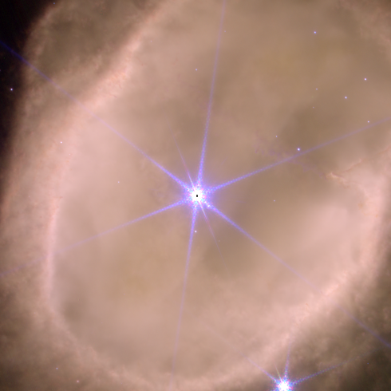
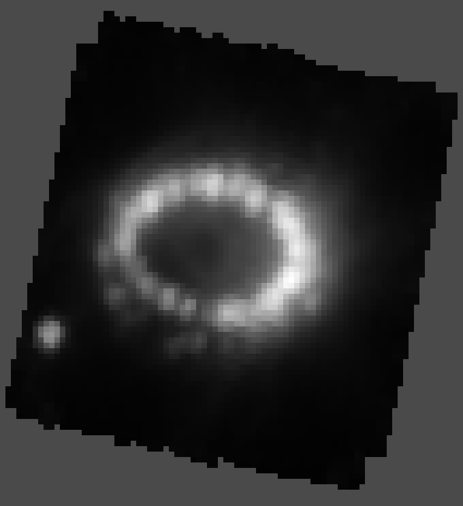
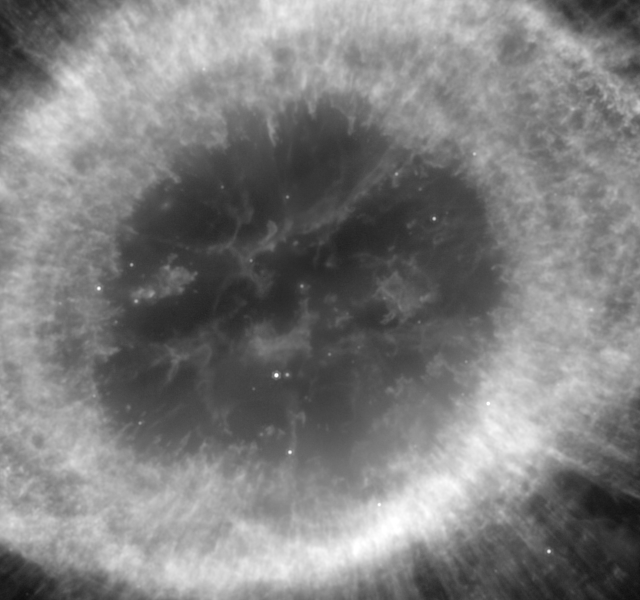
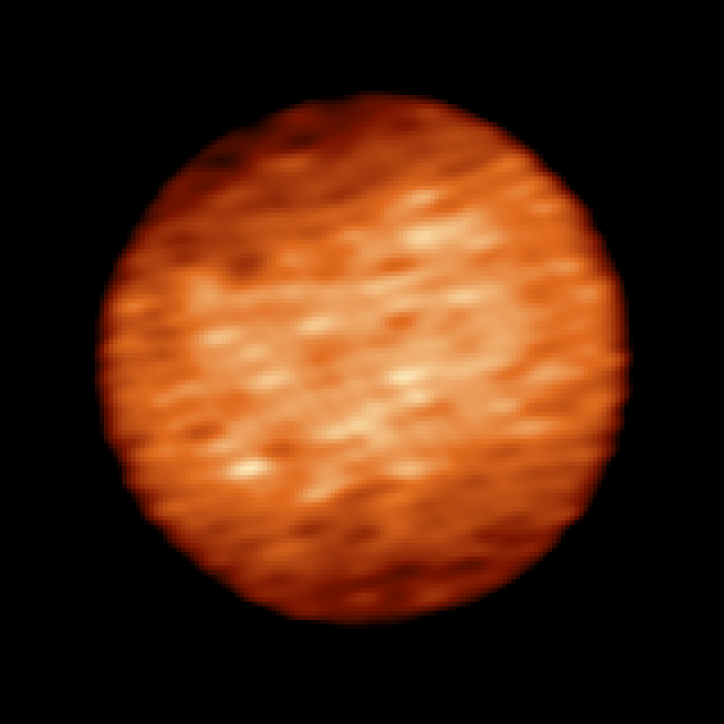
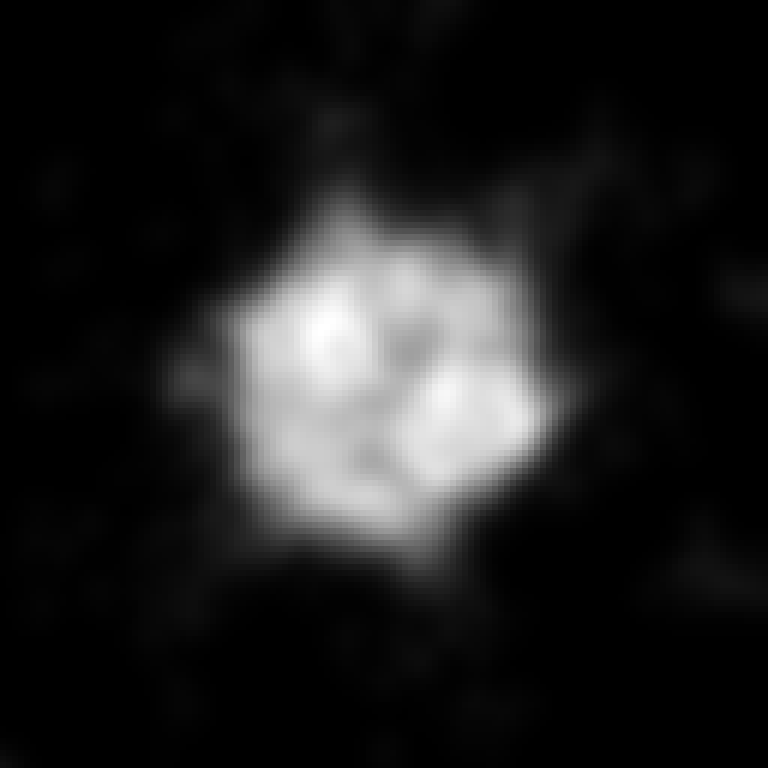
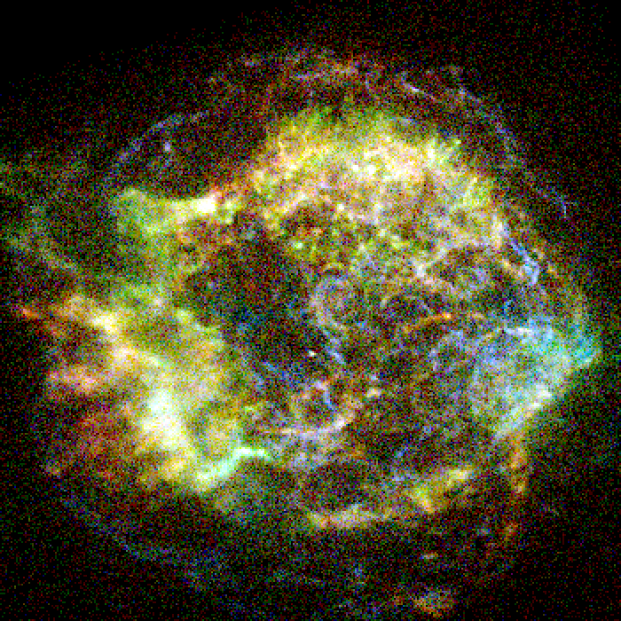
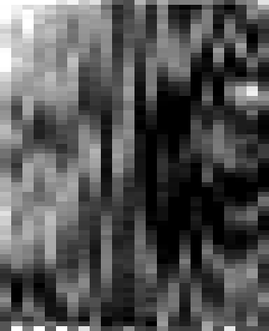
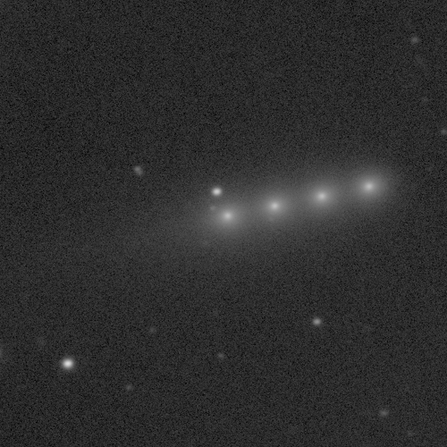
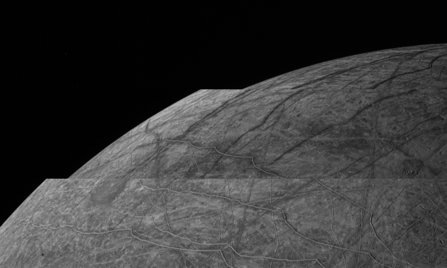

# One example picture per telescope

Each virtual telescope in this repository re-runs an observatory's own software on archive data and writes a product: a
FITS image, a cube, a map, or a list of detected photons. This page shows one picture per instrument, made from a
product that toolkit has already produced here. Nothing on this page is an archive preview or a press image.

Every picture comes from one renderer, `tools/objects/telescopes/example-picture.mts`, and one checked-in recipe,
`tools/objects/telescopes/examples.json`. The recipe states the file, the extension or plane, the pixel window, the unit
the numbers are in, the two values drawn as black and white, the stretch between them, which way up the picture is, the
whole-number enlargement and the colours. Three pictures are in colour, because three measurements of the same target
exist on one pixel grid: each measurement is stretched on its own limits in its own unit and put straight into red,
green or blue. That is representative colour, not what an eye would see, and each caption says which band is which
channel. Channels that do not share a grid are refused rather than resampled onto one another. The rest are grey
because there is only one measurement to draw. Every source sample becomes a block of equal output pixels. Nothing is
smoothed, sharpened, interpolated or cleaned up, and a value outside the stated range is clipped rather than rescaled.
The recipe also pins each product's sha256 and records the command that made it.
The NGC 3132 NIRCam example has a missing grid recipe, as noted below; its
product chain cannot currently be rerun from this checkout. For the other
examples, rerun the chain with:

```
<the toolkit command listed below>                  # re-makes the product
node tools/objects/telescopes/example-picture.mts   # re-makes every picture in docs/telescopes
```

Products live in the git-ignored `output/` and `.local/` directories of the worktree the toolkit ran in, so the recipe
records that directory too. The commands below are written as they are run from the repository root.

## JWST, NIRCam: the Southern Ring Nebula



NGC 3132 on 3 June 2022, three NIRCam filters re-run here through the pipeline's level-3 image stage onto one grid.
Representative colour, not what an eye would see: red is F405N at 4.05 microns from 0 to 45 MJy/sr, green is F187N at
1.87 microns from 0 to 180, blue is F090W at 0.90 microns from 0.2 to 25, each asinh softened at 2, 4 and 1. North is up
and east left, from the mosaics' own world coordinates. F187N and F405N are narrow filters on hydrogen lines, which is
why the shells stand out and the stars, bright in the wide blue filter, come out blue-white. The two stars in the middle
are the pair at the heart of the nebula; the dying star that made it is the fainter one.

The recorded `image3.mts` command for this picture uses
`--grid src/objects/ngc-3132/source/sky-bands/jwst-nircam.json`. That grid
recipe is absent from this checkout, and no current NGC 3132 shared-grid recipe
was found. The program record at
[`ngc-3132-2733.json`](../tools/objects/jwst/imaging/programs/ngc-3132-2733.json)
still identifies the exposures, but it does not replace the missing grid.

## JWST, NIRSpec: the ring around SN 1987A



One plane of a NIRSpec integral-field cube of SN 1987A, taken on 16 July 2022 with G140M/F100LP and re-run here through
the pipeline's level-3 spectral stage onto a 0.05 arcsecond grid. The plane is at 1.0842 microns, the helium line that
is the brightest thing in this cube. Brightness is surface brightness in MJy/sr, from 0 to 19,200, asinh softened at
100. North is up and east left. The knots on the ring are where the shock from the 1987 explosion is running into gas
the star shed long before it died. Grey is outside the cube's footprint.

`node tools/objects/jwst/cubes/spec3.mts sn-1987a-1232 NIRSPEC-G140M-F100LP .local/sn-1987a-1232/spec3-0.05`

## JWST, MIRI: the Ring Nebula at 7.7 microns



NGC 6720 on 20 August 2022 through MIRI's F770W filter: eight dithered exposures, 444 seconds in all, fetched and
re-run here through the level-3 image stage. Brightness is surface brightness in MJy/sr, from 4.3 to 28, asinh softened
at 1.5. The mosaic keeps the observation's own rotation, so the picture is the stored rows with the first at the bottom;
north is 132.9 degrees and east 42.9 degrees clockwise from up, measured from the mosaic's own world coordinates. The
central white dwarf and a few stars run past the top of the range and clip to white. This one is new here: the toolkit
had no MIRI product of an extended target, so the programme was pinned and the stage re-run, and the toolkit's own
comparison against the archive's mosaic agrees to about 2 parts in 10 million of the RMS brightness.

`node tools/objects/jwst/imaging/image3.mts ngc-6720-1558 MIRI-F770W output/jwst-ngc6720`

## Hubble, STIS: the 450 nm sodium chloride band on Europa


Four STIS CCD slit scans of Europa, on 23 May, 29 June, 1 August and 6 August 2017, each scan stepped across the disc,
turned into a longitude-latitude map. Colour is the strength of the 450 nm absorption attributed to sodium chloride, as
an equivalent width in Angstroms, from -150 (dark blue) to 200 (cream), linear, on the stated blue-to-cream ramp. Row 1
is the north pole, column 1 starts at 0 degrees east longitude, east to the right. Grey is where no scan reached, or
where the surface was seen more than 60 degrees from face on. The strong side is the right-hand half of the map, around
270 degrees east longitude, the hemisphere that faces the direction Europa travels.

`node tools/objects/hst/slit-scan-map.mts europa-salt-map .local/hst/europa-14650 output/europa-salt-map --mirror --receipt`

## ALMA: Europa's thermal disc



ALMA Band 6 continuum at 232 GHz, observed on 26 November 2015, calibrated, self-calibrated and imaged here, then
converted to brightness temperature. Colour is temperature in Kelvin, from 55 K (black) to 102 K (pale yellow), linear,
on the stated heat ramp, north up and east left. The warm band across the middle is the equator, where the Sun stands
highest, and the cooler edges are the poles and the limb. The disc is 768 milliarcseconds across and the restoring beam
is 48 by 21 milliarcseconds, so the soft edge is the beam, not the limb. Be careful with the fine east-west streaks:
they are about 2 K, which is the image noise at the beam scale, not surface features.

`node tools/objects/interferometry/alma-disc-selfcal.mts <calibrated continuum .ms> --body Europa --radius-km 1560.8 --out output/alma-europa/selfcal --scratch output/alma-europa/scratch`

## VLTI, MATISSE: the surface of Betelgeuse



Betelgeuse in February 2020, during the Great Dimming, reconstructed here from MATISSE interferometry in the L band
continuum. Brightness is normalised intensity, from 0 to 4.93e-4, linear. North is up and east left, 0.78
milliarcseconds a pixel. This is a reconstruction, not a photograph: the interferometer measures a handful of spatial
frequencies and the image is the one that fits them, so read the bright and dark patches as that fit's best account
rather than as resolved features. The toolkit convolved it with a 4 milliarcsecond beam, as interferometric images are
shown; nothing further is smoothed here.

`node tools/objects/interferometry/image-star.mts tools/objects/interferometry/seasons/betelgeuse-matisse-2020-02 output/stars/betelgeuse-matisse-2020-02 --raw output/calibration/raw-matisse`

## VLT, NACO: Ceres from the ground


NACO adaptive optics imaging of Ceres on 11 November 2007 in the Ks filter through the S13 camera, re-reduced on ESO's
own pipeline and combined. Brightness is detector counts, from 0 to 6,300 ADU, linear. The reduced frame carries no
world coordinates, so no sky direction is claimed here; the picture is the detector rows with the first at the bottom.
Ceres is resolved, about 52 pixels across at half its peak brightness, but this is a small, blurred disc: the wide glow
around it is the adaptive optics halo, which is in the data, and there is no surface detail to see at this scale.

`node tools/objects/naco/reduce.mts ceres-080C0881 .local/naco/ceres-080C0881 --template 2007-11-11T02:38:47`

## Chandra: Cassiopeia A in X-rays



Cassiopeia A on 27 August 1999, a 3.6 ks ACIS-I observation reprocessed from level 1 on Chandra's own software, with
the resulting events binned here into squares 2 by 2 sky pixels, 0.98 arcseconds a bin. Representative colour, not what
an eye would see: the same event list split by photon energy into the conventional soft, medium and hard bands, red 0.5
to 1.5 keV from 0 to 25 counts a bin, green 1.5 to 3.0 keV from 0 to 30, blue 3.0 to 7.0 keV from 0 to 6, each asinh
softened at 1. All three are the same bins of the same list, so nothing is resampled. North is up and east left. One dot
is one detected X-ray photon, so this is counts, not brightness, and the graininess is the photon statistics of a short
exposure rather than anything in the rendering. This observation is new here: the Chandra product
already on disk was a deliberately offset pointing that keeps the Crab Nebula off the detector, so Cas A was pinned and
reprocessed, and the toolkit's event-by-event comparison against the archive matched all 839,545 events.

`node tools/objects/chandra/reprocess.mts casa-acisi 210 .local/chandra/casa-acisi`

## Spitzer, IRAC: NGC 3132 in the infrared


Three of the four IRAC channels of NGC 3132, re-made here from the archive's own twelve level-1 frames of AOR 4416768
and mosaicked onto one grid. Representative colour, not what an eye would see: red is channel 4 at 8.0 microns from 2.6
to 25 MJy/sr, green is channel 2 at 4.5 microns from 0.07 to 20, blue is channel 1 at 3.6 microns from 0.05 to 20, each
asinh softened at 0.5, 0.2 and 0.2. The mosaics keep the observation's own rotation: north lies 303.4 degrees and east
213.4 degrees clockwise from up, and the picture is the stored rows with the first at the bottom. The nebula is pink
because its shell is brightest at 8 microns, and the stars are blue-white because they are brightest at 3.6. The
scattered single-colour specks are cosmic ray hits that survived in one channel only; a few dark pixels near the centre
are missing from channel 4. This is the same nebula as the NIRCam picture above, at nearly seven times the pixel size.

`node tools/objects/spitzer/mosaic.mts ngc3132-4416768`

## Keck II, KCWI: a patch of the Orion Nebula



The only M42 science cube this toolkit has reduced so far: a 5 second KCWI exposure from 9 December 2023, run through
the instrument's own data reduction pipeline here. The picture adds the eleven wavelength planes from 5004 to 5014
Angstroms, which is the bright doubly ionised oxygen line at 5007 Angstroms; adding planes moves no sample and smooths
nothing. Brightness is detector electrons, from -4,000 to 10,000, linear, and negative values are possible because the
sky is subtracted. A column is one 0.68 arcsecond slice and a row 0.29 arcseconds along the slit, so each sample is
drawn as a rectangle 14 pixels across and 6 down, which keeps the sky nearly square.

Be blunt about this one: it is mostly noise. Five seconds on a 24 by 69 spaxel field leaves the line barely above the
background, and the vertical striping is slice-to-slice calibration residual, not structure in the nebula. It is here
because it is what the Keck toolkit has actually produced, and it should be replaced once a real science exposure is
reduced.

`node tools/objects/keck/reduce.mts m42-kcwi-2023b-u124 KB.20231209.37031.94.fits`

## Gemini South, GMOS: the interstellar comet 3I/ATLAS



3I/ATLAS on 5 September 2025: four 25 second GMOS-S r band frames stacked by the observatory's own DRAGONS recipe on
this toolkit's master bias and flat. Brightness is detector electrons, from 3,400 to 20,000, asinh softened at 60. The
picture is the stored rows with the first at the top, which puts north up: measured from the stack's own world
coordinates, north is 0.1 degrees and east 269.9 degrees clockwise from up. The stack is registered on the field stars,
and the comet moved between the four exposures, so it appears as a row of overlapping images whose comae run together
into one smear rather than as a single object. Some of the points near it are ordinary stars.

`node tools/objects/gemini/reduce.mts comet-3i-gs2025bdd102 .local/gemini/work science`

## Juno, JunoCam: one strip set of Europa



The JunoCam flyby of Europa on 29 September 2022, from 1,515 km up. This is the archive's calibrated push-frame image as
the instrument records it, not a cast or projected picture: JunoCam builds colour by sweeping three filter strips across
the scene as the spacecraft spins, and this is one set of three strips from the sixth frame of the image, blue at the
top, then green, then red, in the order they were read out. Brightness is reflectance, from 0 to 0.30, linear. Nothing
is rotated and the strips are not combined, which is why the limb steps sideways between them: each strip was taken a
fraction of a second after the one above it, with the spacecraft spinning. The window keeps 640 of the 1,648 columns.
The JunoCam toolkit's cast stage, which would place these strips on the body, has not been run in this worktree.

`node tools/objects/juno/archive.mts europa-pj45 JNOJNC_0024 EUROPA 502 IAU_EUROPA --orbit 45 --kernels ...`
