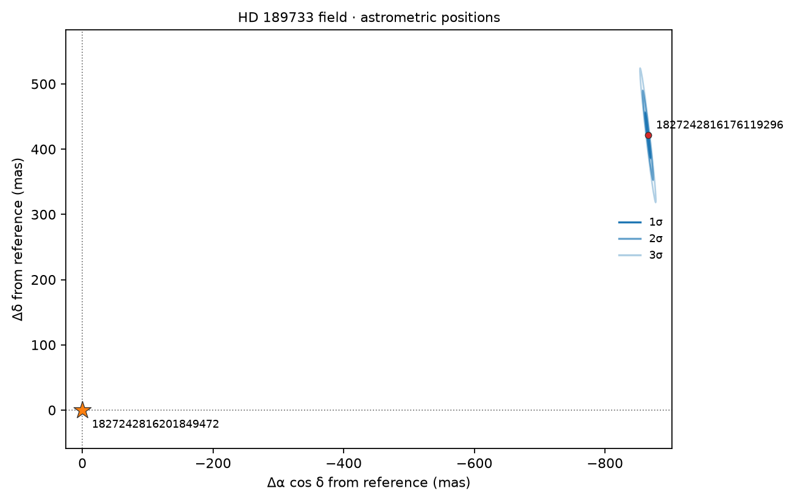

# Telescope family examples

The [test fixtures](../../tests/fixtures/telescope-family-examples/) pin one compact, reviewable public-path example for every F01–F18 family. The [manifest](../../tests/fixtures/telescope-family-examples/manifest.json) is the source of truth: every row records the real source URL and byte pin, exact CLI command, committed output pin, product-record/readback proof, owner, independent check, and scientific limit.

Each row carries `exampleProven: true` and `proposalBaseline.status: "complete"` because its family baseline is now executable through a public owner. The examples remain deliberately bounded: completeness applies to the recorded format profile and operations, not every format that could belong to the family.

| Family | Review artifact | Public path | What it proves |
| --- | --- | --- | --- |
| F01 | [F01.csv](../../tests/fixtures/telescope-family-examples/artifacts/F01.csv) | `telescope export` | Native 2D image values |
| F02 | [F02.json](../../tests/fixtures/telescope-family-examples/artifacts/F02.json) | `telescope family-run` | Mixed time, Stokes and spectral slicing with FITS/WCS context |
| F03 | [F03.csv](../../tests/fixtures/telescope-family-examples/artifacts/F03.csv) | `telescope family-run` | Standalone spectrum export |
| F04 | [F04.json](../../tests/fixtures/telescope-family-examples/artifacts/F04.json) | `telescope family-run` | Pinned slit-scan inspection |
| F05 | [F05.csv](../../tests/fixtures/telescope-family-examples/artifacts/F05.csv) | `telescope family-run` | Discrete photometry export |
| F06 | [F06.csv](../../tests/fixtures/telescope-family-examples/artifacts/F06.csv) | `telescope family-run` | Explicit time selection |
| F07 | [F07.csv](../../tests/fixtures/telescope-family-examples/artifacts/F07.csv) | `telescope family-run` | Native dynamic-spectrum window |
| F08 | [F08.json](../../tests/fixtures/telescope-family-examples/artifacts/F08.json) | `telescope family-run` | Typed table inspection |
| F09 | [F09.csv](../../tests/fixtures/telescope-family-examples/artifacts/F09.csv) | `telescope family-run` | Astrometry export |
| F10 | [F10.csv](../../tests/fixtures/telescope-family-examples/artifacts/F10.csv) | `telescope family-run` | Selected event rows with lineage |
| F11 | [F11.json](../../tests/fixtures/telescope-family-examples/artifacts/F11.json) | `telescope family-run` | Selected UVFITS visibilities with package-owned UV preview |
| F12 | [F12.json](../../tests/fixtures/telescope-family-examples/artifacts/F12.json) | `telescope family-run` | OIFITS V2 diagnostics |
| F13 | [F13.json](../../tests/fixtures/telescope-family-examples/artifacts/F13.json) | `telescope family-run` | Declared Stokes spectrum and explicit polarization policy |
| F14 | [F14.json](../../tests/fixtures/telescope-family-examples/artifacts/F14.json) | `telescope family-run` | Native HEALPix NESTED pixel selection |
| F15 | [F15.json](../../tests/fixtures/telescope-family-examples/artifacts/F15.json) | `telescope family-run` | Native delay-Doppler profile |
| F16 | [F16.json](../../tests/fixtures/telescope-family-examples/artifacts/F16.json) | `telescope family-run` | Existing physical point-field inspection |
| F17 | [F17.json](../../tests/fixtures/telescope-family-examples/artifacts/F17.json) | `telescope family-run` | Pinned NEAR MSI raw/calibrated/label closure |
| F18 | [F18.json](../../tests/fixtures/telescope-family-examples/artifacts/F18.json) | `telescope family-run` | Exact compound-member enumeration |

F09 also draws the relative astrometry chart used in companion and direct-imaging papers. `astrometry-offset-preview` takes a reference row ID and optional row IDs. It plots gnomonic offsets in mas with east on the left and draws 1σ, 2σ and 3σ ellipses for every row that states a position covariance or RA and Dec errors. Tables load from the Gaia archive column names (`source_id`, `ra`, `dec`, `ra_error`, `dec_error`, `ra_dec_corr`, `pmra`, `pmdec`, `parallax`, `parallax_error`, `ref_epoch`). The [HD 189733 Gaia DR3 fixture](../../tests/fixtures/telescope-families/f09-gaia-hd-189733/manifest.json) exercises it on real rows.



The chart above is the closest pair in that fixture. The faint source has a 34 mas declination error correlated 0.97 with its RA error, so its ellipses are long and tilted. Most Gaia errors are far smaller than a pixel on an arcsecond-scale chart; radio and imaging tables are where ellipses usually show. It was made with:

```bash
telescope family-run tests/fixtures/telescope-families/f09-gaia-hd-189733/descriptor.json astrometry-offset-preview --params tests/fixtures/telescope-families/f09-gaia-hd-189733/offset-chart.params.json --out astrometry-offset-chart
```

Every figure is transparent by default. Set `"figureBackground": "opaque"` in the parameters of any family operation that draws a figure, or pass `--figure-background opaque` to `telescope export`, to fill the PNG and SVG with the figure's own background colour.

Descriptor member paths are relative to each descriptor, so the examples contain no checkout-specific absolute paths. Runtime `output.product.json` receipts are deliberately not copied here; the manifest points at focused tests that reopen and verify those records.
