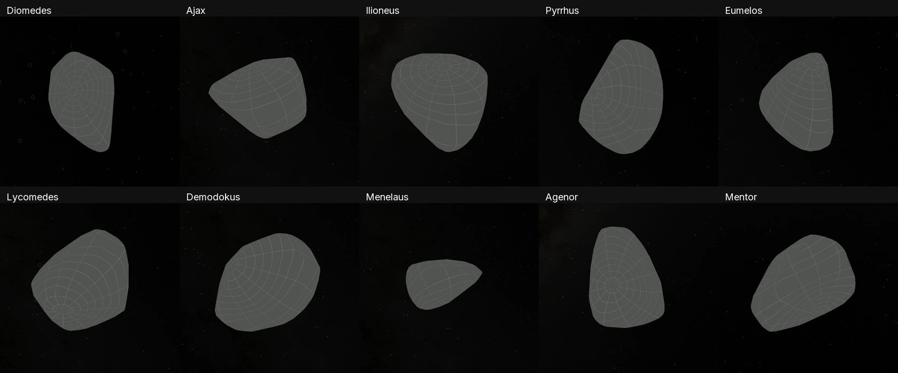
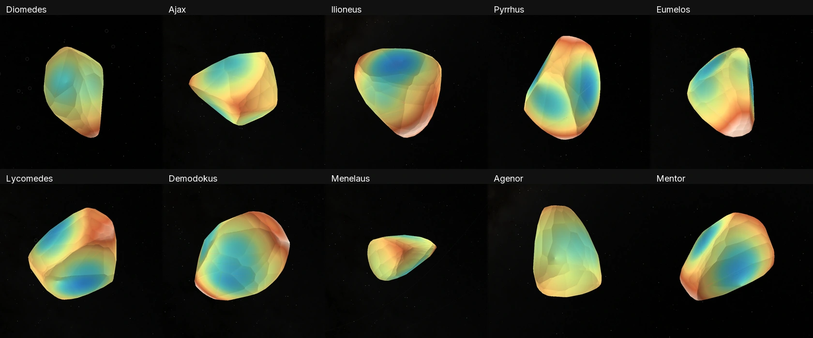
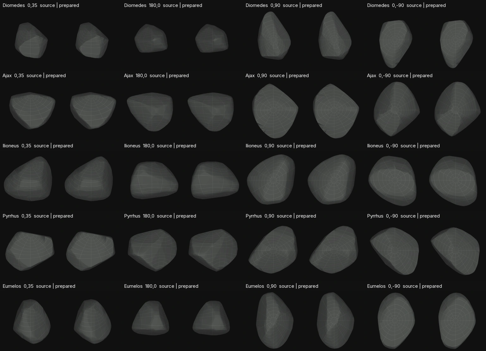
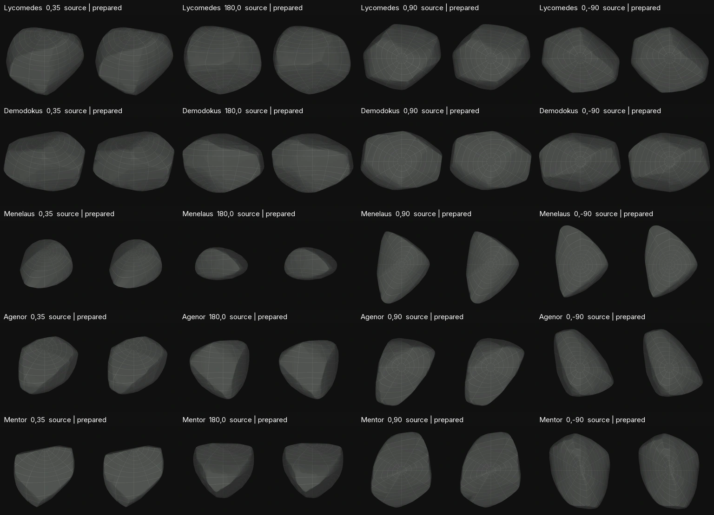

# Jupiter Trojan population

This PR adds ten Jupiter Trojans: Diomedes, Ajax, Ilioneus, Pyrrhus, Eumelos, Lycomedes, Demodokus, Menelaus, Agenor and Mentor. This takes the seven registered Jupiter Trojan primaries to seventeen. Each uses the established published-mesh recipe, with the shared **Shape** grid and shape-derived **Elevation** view. Shadows and asteroid orbits start off. The shared application mounts one selected body at a time.

## Added bodies

These are convex light-curve reconstructions. No new object has a resolved global image map. Diameters below determine a uniform physical scale; quoted errors are source fit errors, not local shape accuracy or total uncertainty.

| Number | Body | Camp | DAMIT model | Diameter (km) | Size interpretation |
| --- | --- | --- | --- | ---: | --- |
| 1437 | [Diomedes](../src/planets/diomedes/SOURCE.md) | L4 | [ 4215 ](https://damit.cuni.cz/projects/damit/asteroid_models/view/4215) | 118.8 ± 0.6 | Occultation fit to this mesh |
| 1404 | [Ajax](../src/planets/ajax/SOURCE.md) | L4 | [ 3327 ](https://damit.cuni.cz/projects/damit/asteroid_models/view/3327) | 83.99 ± 1.279 | Approximate thermal-size transfer |
| 5130 | [Ilioneus](../src/planets/ilioneus/SOURCE.md) | L5 | [ 4172 ](https://damit.cuni.cz/projects/damit/asteroid_models/view/4172) | 60.711 ± 0.982 | Approximate thermal-size transfer |
| 5283 | [Pyrrhus](../src/planets/pyrrhus/SOURCE.md) | L4 | [ 4373 ](https://damit.cuni.cz/projects/damit/asteroid_models/view/4373) | 48.356 ± 0.423 | Approximate thermal-size transfer |
| 5436 | [Eumelos](../src/planets/eumelos/SOURCE.md) | L4 | [ 3920 ](https://damit.cuni.cz/projects/damit/asteroid_models/view/3920) | 37.696 ± 0.329 | Approximate thermal-size transfer |
| 9694 | [Lycomedes](../src/planets/lycomedes/SOURCE.md) | L4 | [ 4284 ](https://damit.cuni.cz/projects/damit/asteroid_models/view/4284) | 31.736 ± 0.243 | Approximate thermal-size transfer |
| 11429 | [Demodokus](../src/planets/demodokus/SOURCE.md) | L4 | [ 3896 ](https://damit.cuni.cz/projects/damit/asteroid_models/view/3896) | 37.63 ± 1.307 | Approximate thermal-size transfer |
| 1647 | [Menelaus](../src/planets/menelaus/SOURCE.md) | L4 | [ 8131 ](https://damit.cuni.cz/projects/damit/asteroid_models/view/8131) | 42.716 ± 0.517 | Approximate thermal-size transfer |
| 1873 | [Agenor](../src/planets/agenor/SOURCE.md) | L5 | [ 4273 ](https://damit.cuni.cz/projects/damit/asteroid_models/view/4273) | 50.799 ± 1.181 | Approximate thermal-size transfer |
| 3451 | [Mentor](../src/planets/mentor/SOURCE.md) | L5 | [ 4281 ](https://damit.cuni.cz/projects/damit/asteroid_models/view/4281) | 126.288 ± 1.642 | Approximate thermal-size transfer |

## Scientific interpretation

**Diomedes:** Dutra et al. (2025) fit the same 574-vertex, 1,144-facet DAMIT model to three stellar-occultation chords. Their volume-equivalent radius is 59.4 ± 0.3 km; this presentation uses twice that radius, a pole of (153.73°, 12.69°) in ecliptic J2000, and sidereal period 24.4984 h. The raw shape is preserved, and the original archive spin is recorded separately from the refined fit. [Publication](https://doi.org/10.1098/rsta.2024.0187), [author manuscript](https://arxiv.org/abs/2412.01568).

**Other nine:** published DAMIT shape and sidereal spin plus the official NEOWISE v2 `Gr12b` effective spherical diameter. Each selected catalog row has a fitted diameter (`D` in `FIT_CODE`). A thermal sphere diameter is an approximate mesh-volume scale, and the visible lens description says so. Formal fit errors exclude additional shape, spin and thermal-model effects. The source query, returned rows, definitions and original paper are pinned. [IRSA definitions](https://irsa.ipac.caltech.edu/data/WISE/NEOWISE_SB/gator_docs/neowisesbprop_colDescriptions.html), [Grav et al. 2012](https://arxiv.org/abs/1209.1549).

The model's +Z spin axis and +X reference meridian are retained. Alternative poles remain possible where the archive lists them. Absolute rotational phase and accelerated display spin are illustrative. Convex inversion does not resolve concavities, regolith or craters. Elevation is the model's radius minus its declared volume-equivalent reference sphere, in kilometres; it is a shape-derived scalar rather than gravitational height or an independent terrain measurement.

## Source selection and remaining gaps

- The Hanuš et al. (2023) population survey adopts the existing models for Ajax, Ilioneus, Pyrrhus, Eumelos, Lycomedes and Demodokus in Table B.3. Menelaus uses its 2022 archive model from the Gaia DR3 study.
- Agenor and Mentor have revised 2023 solutions, but their numerical replacement meshes are unresolved in the current public target query. This PR identifies the downloadable older archive model and preserves its matching pole; it does not combine newer poles with old geometry.
- Agamemnon and Nestor are deferred: the 2023 study calls their older archive pole solutions inconsistent. The newer downloadable meshes are not qualified.
- Deiphobus, Antenor and Priamus have published newer reconstructions; the bounded survey did not locate their original numerical mesh release. Paper illustrations are not converted into geometry.
- The bounded non-Jovian Trojan survey did not qualify a numeric mesh for an Earth, Mars or Neptune Trojan. This does not establish that no data exist; these populations remain gaps.

[Hanuš et al. 2023](https://arxiv.org/abs/2308.05380), [CDS source tables](https://cdsarc.cds.unistra.fr/ftp/J/A+A/679/A56/ReadMe).

## Preparation and validation

The original counted meshes have 570–574 vertices and 1,136–1,144 faces. Intake independently checks coordinate anchors, connectivity, positive volume, closed consistent winding and genus-zero topology. The existing `source-meshoptimizer` recipe targets 800 native PolyCSS `u` triangles with 128 px raster cells, using the source-size-dependent error allowance. Geometry, scalar atlas values and lighting are prepared before runtime.

All ten source and package checks pass, including physical scale, spin, original coordinates/connectivity, signed volume, closed topology, runtime hashes, legend ranges and both 640×320 minimaps. Each body retains 800 triangles. Default framing uses the existing camera `framingScale` with the original source's maximum radius, following the Lucy target convention; that metadata update leaves terrain and every image-bank hash unchanged.

The independent numerical checks compare the original source with the prepared result:

- 8,192 area-stratified nearest-surface samples in each direction per body. The largest sampled distance is 147.31 m. These are sampled distances, not exhaustive Hausdorff bounds or source measurement accuracy.
- 81,920 radial directions have one surface intersection each.
- 8,292 scalar queries, including every retained triangle centroid, six source extrema and decoded-atlas interior/bleed coordinates, agree with independent NumPy full-source planar/edge projection. Maximum coordinate disagreement is 7.13e-9 m; scalar disagreement is 3.31e-12 km. These measure numerical agreement, not scientific precision.
- The 116 accepted interior atlas anchors differ by at most three RGB channel levels after WebP decoding, within the existing twelve-level tolerance. Shared-edge/bleed RGB remains diagnostic because incident face normals are nonunique.
- Forty source/result views have been visually inspected at four orientations per model. Source and result have separate normalization by their maximum radius; this proves silhouette comparison, not physical framing or browser pixel parity.

At the browser capture revision, the registry had 416 objects and 297 asteroids. All 406 original navigation tiles retain their visible RGBA pixels exactly at both densities. Ten new source-owned tiles, the Sun's 415 authored destination records, marker bindings and the minimap point index are updated. Main's generic routes are used: each new package supplies CSS and scene-bound page metadata, without per-body Astro wrappers. Shared page metadata and navigation/router checks are recorded with the evidence.

All thirty original inputs restored into empty destinations through the existing acquisition operations, using twelve distinct source downloads. All 350 runtime images, totaling 78,053,296 bytes, were published and freshly installed into an empty destination with every hash verified and zero cache reuse.

The final Astro build emits **834 static pages** and all ten production image inventories pass assembly. The ten focused source tests, two asteroid ephemeris tests, five minimap tests and 46 generic-page/router cases pass. These are focused checks; no full-catalog browser pass is claimed.

**Twenty headless Chrome cases pass**: every new body at DPR 1 and 2, both datasets, both shadow states, canonical density 2, one scene and retained node identity. All use the freshly installed scene images with checked hashes. Forty default/rotated browser views were visually inspected. The Asteroids category exposes all ten additions among 297 entries; searching for Mentor and navigating from Diomedes mounts one scene/camera. The inherited long dataset detail was shortened in the source content so the Shape label remains readable in the shared panel.

Diomedes's representative three-cycle vertical drag in Elevation records **372 frame sequences with zero dropped without presentation**, RAF median 16.7 ms and p95/max 16.8 ms, zero interaction requests and stable identity for all 112,052 stage nodes (including the shared environment; the body itself has 800 triangles). This is one measured headless workload on the recorded Mac, not a guarantee for every device or orientation.

Browser and drag evidence use the explicit **`performance` build mode** at revision `c09191cb2d8dd20b2a0ff218cfdb20251677730d`. It uses the production page/styles/assets with inspection APIs enabled by `site/diagnostics-policy.mjs`; this is not an uninstrumented production trace. Exact decoded hashes are recorded for loaded JavaScript, prepared-object JSON and selected atlases. Chrome evicted the HTML document from its inspector body cache, so HTML has request sizes/status only, following the existing comet delivery capture.

The [summary](evidence/trojan-population/summary.json), [browser report](evidence/trojan-population/browser.json), [drag report](evidence/trojan-population/drag.json) and [evidence archive](trojan-population-evidence.tar.gz) bind the results and reproduction helpers. The [capture inventory](evidence/trojan-population/browser-capture-inventory.json) identifies the full screenshots bundled here and those retained locally.

## Browser views

These are cropped, resized regions of the inspected default browser screenshots. Framing is independent per body; sizes and false-color ranges are not a physical comparison.




Full frames: [Diomedes Shape](evidence/trojan-population/diomedes-shape.png), [Diomedes Elevation](evidence/trojan-population/diomedes-elevation.png), [Mentor Elevation](evidence/trojan-population/mentor-elevation.png), [Asteroids search](evidence/trojan-population/asteroid-category-search.png).

## Source/result comparison

Original mesh is on the left of each pair, prepared 800-face mesh on the right. Four fixed longitude/latitude views are shown for every body. These comparison renders use the existing snapshot renderer; they are not browser captures.




## Orbit model

Pinned JPL Horizons osculating elements and vector fixtures use the existing two-body propagation. At the queried epoch, the largest numerical residual is 2.20 mm; the largest selected ±30-day endpoint residual is 1,462.60 km. Each added body has a regression ceiling tied to its sampled endpoint residual. Those checks neither bound the whole interval nor establish long-term accuracy; the existing TDB-as-TT approximation and physical ephemeris limitations remain.

## Reproduction

After normal repository dependency and compiler setup, use the existing body operations. Replace `diomedes` with another table id and prepare one body at a time:

```sh
node tools/objects/dist/operations.js acquire diomedes
node tools/objects/dist/prepare-authored.js diomedes --write
node --test tests/objects/unit/diomedes/source.test.mjs
pnpm setup:assets --object=diomedes
```

The qualification helpers are packaged in the evidence archive. They require NumPy and Pillow; the saved runner records this workstation's Python path, which should be adjusted on another machine. `author.py` records initial authoring and intentionally refuses to add existing ids; ordinary reproduction uses the checked-in recipes instead.

```sh
tar -xzf docs/trojan-population-evidence.tar.gz
node output/trojan-population/catalog-audit.mjs
node output/trojan-population/qualify-body.mjs diomedes
```

Fresh delivery can be replayed with `verify-runtime-install.mjs`, then `browser-check.mjs` using its returned `CSSEARTH_FRESH_RUNTIME_ROOT` and an existing preview on port 4278. The final Astro invocation was `pnpm exec astro build --mode performance`, followed by the existing `operations.js assemble` operation for each new body. The final capture did not run the all-object preparation or browser suites.

After catalog navigation changes, `prepare-navigation.mjs` preserves the pinned baseline tiles and prepares only the new source tiles. `refresh-transports.mjs` updates marker bindings and hash-bound page metadata without recompiling presentations. Finish by running `node site/minimap/prepare.mjs` and its point-range/coverage tests before Astro. Full object preparation or raster rebakes are unnecessary for navigation-only changes.

## Latest-main integration

Integrated main `bd265cf3a091c4ef17e9be76dfeb23410364884f` (Encke and LINEAR) after the browser captures. The current catalog has **418 objects**, **297 asteroids** and **417 Sun destinations**. Incoming comet science is preserved. All **408 main marker tiles** retain their visible RGBA pixels at both densities; only the ten Trojan tiles are added. Marker bindings, scene-bound page metadata and the minimap point index are refreshed through their existing writers.

The [integration receipt](evidence/trojan-population/main-integration.json) proves all ten Trojan scenes, terrain and image inventories are byte-identical and every non-marker runtime field is unchanged. The eight focused page/minimap cases and ten package closures pass on this integration. No body bakes or repeat browser matrix were needed. Screenshots and the trace remain explicitly bound to their recorded capture revision; their catalog count predates the two comets.
