# Virtual telescopes

A virtual telescope here is not a picture taken from an archive. It is an observation this repository runs again:

1. **Pin** the exact files the observatory holds: every input by name, byte count and sha256.
2. **Re-run the observatory's own software** on them, from a pinned toolchain, with the calibration the observatory used.
3. **Compare** the result with something outside this repository: the archive's own product, an author's published value,
   the geometry the mission's kernels state, or a second reduction of our own.
4. **Write a receipt** of that comparison, and a record of the run beside what it produced.

Nothing here is retouched by eye. When a re-run and the archive disagree, the receipt says so and the number stands.

One route does none of that on purpose. Where an observatory has retired a pipeline and frozen a calibration, there is nothing
to run again, and the archive's own final product is all there is. That product is pinned and read whole rather than re-made,
and the difference is kept visible everywhere: see [two capabilities, never one](#two-capabilities-never-one).

## Saved questions with the Telescope CLI

`pnpm telescope` provides a saved query and retrieval workflow over this API. The
`@cssearth/telescope` npm package exposes the same command as `telescope`; it uses an
existing css.earth science workspace for the catalogue, archive clients and instrument
pipelines. See [package setup](../packages/telescope/README.md). It does not bundle
Python environments or download the repository during installation.

Start with only a target to preserve the difference between discovery and a scientific request:

```sh
pnpm telescope explore eris
pnpm telescope explore eris --kind cube --wavelength 2.2,2.4 --out output/eris-exploration
```

The terminal flow saves `explore.json`, shows bounded archive and package observations with their
advertised or verified basis, and retrieves only the identity the person selects. Omitted filters
remain omitted; no wavelength, time, product kind or resolution requirement is invented. `--json`
and redirected input or output never prompt. Without `--out`, the command creates a unique directory
under `./telescope-runs/`. An exploration delivery retains “no scientific acceptance criteria
requested” through later outputs.

`explore` also asks the PDS Ring-Moon Systems Node's
[OPUS search](https://opus.pds-rings.seti.org/api/) which spacecraft images exist of the body.
This covers Voyager, Galileo, Cassini, New Horizons and the other missions OPUS indexes. OPUS
only answers for the 101 bodies it computes surface geometry for, mostly planets and moons from
Jupiter outward. The command matches the object's catalogue name and aliases against that list.
If the body is not on it, the OPUS entry says `unknown-target`: OPUS cannot tell us whether
images exist, which is different from finding none. For a known body the entry gives the total
image count and the sharpest image from each instrument: its OPUS id, start time and resolution
at the body centre in km per pixel, as OPUS returns them. It also gives pixels across, which is
the body's mean diameter from `@cssearth/astronomy` divided by that resolution. For elongated
bodies such as Kerberos, the mean diameter gives fewer pixels than the long axis would. The
explore filters (kind, wavelength, time) are not sent to OPUS, and these images are listed for
reading only; they do not become numbered choices for `get`. A failed request, including the
HTML error page OPUS returns for an invalid query, is reported as `unavailable`, never as an
empty result. The entry sits in `services` with the ESO, ALMA and PSA searches:

```sh
pnpm -s telescope explore kerberos --json
# "service": "https://opus.pds-rings.seti.org/api/", "state": "sampled", "images": 2292,
# "sharpest": [{ "instrument": "New Horizons LORRI", "centreResolutionKmPerPixel": 1.96379,
#   "pixelsAcross": 4.8, ... }]
```

`telescope outputs ARTIFACT.json` is the second human entry point. It identifies the artifact and
its source context, keeps unavailable operations and blockers visible, and prints the parameters and
explicit command template for each available next operation. In a terminal it asks which available
operation to run, then prompts only for that operation's reported inputs and output directory. The
same explicit-command parser validates the answers before the existing export owner runs. Enter
cancels without starting that output; JSON and redirected execution never prompt. It accepts
supported delivery records, derived product records and prepared point/volume object packages,
not arbitrary raw science files.

### Papers that already used the data

Before reducing archive frames yourself, check whether a paper already did it:

```sh
pnpm -s telescope papers io --instrument JIRAM
pnpm -s telescope papers io --instrument JIRAM --json --out output/io-papers
```

`papers` resolves the target name the same way as `explore`, then asks OpenAlex for articles,
reviews, letters and preprints whose title or abstract names the target and, if given, the
instrument. It keeps up to 20, open access first, then by OpenAlex relevance, then newest first.
Each work shows its title, year, DOI, first three authors, licence and open-access link.

For each open copy the command makes one plain request and reports the result:

- `fetchable`: the text downloaded (HTML or PDF).
- `blocked`: the publisher answered with a browser check (Wiley and AGU usually do). The command
  does not try to get past it. Open the link in a browser instead.
- `failed`, `closed` or `skipped`: an error, no open copy, or the request limit was reached.

For HTML texts it prints figure captions and table titles that mention a map, mosaic, radiance,
scale or colour bar, or that list orbits, times or distances. They are quoted as written, cut at
300 characters. That is usually enough to see whether the paper made the map you want and which
frames it used. For Io with JIRAM, Mura et al. (2024) shows up as fetchable with its list of
observations (Table 1) and radiance maps (Figure 2).

Requests run one at a time, with a 20 second timeout and at most 25 per run. Nothing is written to
disk unless you pass `--out`. Then the command saves `papers.json` and the downloaded HTML texts.

Use `query` when the wavelength, time, product kind and resolution are actual acceptance criteria:

```sh
pnpm telescope query eris --wavelength 2.2,2.4 --kind cube \
  --any-time --min-arcsec 1 --out output/eris-query
pnpm telescope get output/eris-query --pick 1
```

Choose a number from the saved observation list. `get` reloads the same target and
observation identity, uses the current qualification action, and reassesses the original
question. It does not execute commands from the saved JSON. Archive changes can make a
choice unavailable, in which case a new query is required. A declared wavelength or
resolution never becomes verified merely because a file was decoded.

The delivery contains the native product's complete recorded output set (including
pinned labels and dependencies), evidence, SHA-256 pins and a `result.json` verdict.
For the repository script, use `pnpm --silent telescope … --json` to suppress pnpm’s own preamble.
Progress goes to stderr; `--json` keeps stdout machine-readable, including when a
native reducer prints to its inherited stdout. `--verbose` retains the full query report.
Exit 3 can accompany a valid delivered cube: it means scientific requirements remain
unresolved. Repeating `get` revalidates current qualifications and the exported files
before reporting reuse. It refuses modified deliveries rather than overwriting them.
Queries preserve their numbered choices; reuse an existing query directory with `get`,
not another `query`. Interrupted operations retain a PID-bearing `.session.lock`;
inspect that process before removing a stale lock. Qualifications share a workspace
lock because current reducers update shared archive records.

Current source-qualified products also use the common selected-artifact interface.
Their existing receipt and decoded facts supply the reference, without copying
unverified wavelength or resolution declarations into the verified facts.

### Telescope API v1 boundary

The public chain has four supported transitions:

| Current artifact | Supported next operation | Required addition |
| --- | --- | --- |
| Qualified native delivery | Supported image, spectrum, band, aperture or feature export | The selectors listed by `outputs` |
| Exported 2D measurement | Registered body map | Explicit pinned navigation |
| Registered body map | Standalone interactive sphere | An embeddable standard body package |
| Existing prepared point field or density volume | Renderer handoff | None |

The command coordinates the existing archive, qualification, Astropy, PlanetMapper and renderer
owners. It does not imply that every observation can traverse every transition. Discovery is
limited to configured archive routes and bounded profiles, so an empty target-name search is not
a universal absence claim. A product-kind declaration also does not establish a decoder,
scientific operation or exporter for those bytes. `outputs` checks the current artifact through
the same prerequisite validators used by export and reports the routes it can actually support.

Native deliveries retain their recorded files. Intermediate image and map records may retain
absolute references to their verified workspace sources; relocation does not make those
dependencies portable. Sphere HTML and physical renderer handoffs are self-contained within
their published artifact. Missing sources are reported rather than searched for, rebased or
reconstructed. Export always checks again, because an earlier inspection is only a snapshot.

Query success means retrievable choices exist. Export success means the selected transformation
completed. Neither means the original scientific request was fulfilled: its fulfilled,
unresolved or refused verdict remains in every derived product record.

## Package-owned observations through the same API

`telescope:query` also reads exact observations already pinned in each object's source package.
These observations do not need a new telescope adapter or a synthetic archive ledger. An optional
`src/objects/<target>/source/observations.json` uses schema `cssearth-source-observations@1` and
references input IDs in the existing source manifest. The declaration supplies the instrument,
mode, native product kind, exact archive identity, decoder, header assertions, measurement meaning,
units, citation and explicit limitations. Optional wavelength intervals, UTC time bounds and achieved-resolution fields can support request fulfillment. Achieved resolution requires a stated measurement basis; source sampling is never promoted into that field. Hashes and sizes remain in the manifest.

The available decoders are numeric FITS images/cubes (including supported RICE compression) and
supported PDS3/PDS4 images, cubes and tables through pinned `pdr`. ISIS3 Real cores use the
shared tiled/band-sequential raster decoder, including multiband cores and detached pinned data. Source intake reads bounded headers
from manifest-pinned FITS and attached or detached PDS products to produce this same contract
automatically. Local headers are preferred; retrieved headers are cached with origin, time and
digest. Header discovery does not verify the complete file. The query reports `sourceIntakeIssues`
for unavailable, unsupported or incomplete inputs, rather than treating them as empty archives.
Labels and dependencies can be pinned under `inputs`, `documents` or `generatedIntermediates`.
Origin requests reuse matching download headers from the existing acquisition plan; those headers
are not sent to the source mirror. Every referenced input must be pinned, including detached labels, metadata and
external format definitions. PDS pointers to files outside that set are refused before decoding.
Adding an unsupported format still requires a decoder; declaring a format does not implement it.
For explicit `pds-product` declarations, `labelPath` identifies a pinned label relative to the
source directory; it may name the science input itself for an attached-label product. Tables retain
`pdr` column types and decoded values; array scaling and missing-value handling are reported separately.

For example:

```sh
node tools/cli/run-typed-module.mjs tools/objects/telescopes/query.mts --target sun --wavelength 0.0170,0.0172 \
  --any-time --min-arcsec 2 --kind image --result telescope-product --json
```

Execute one of the returned `qualificationActions` exactly as emitted. The action verifies/acquires
its entire input set, checks declared FITS/PDS identity fields, decodes the native samples, and writes
`output/telescopes/<target>/<observation>/qualification.product.json` and `decoded.json`. Downloads
report each 10 MB to stderr. The science product remains the original file, with its original grid
and missing values. The decoded report contains full-array statistics, metadata and limitations.

Run the same query again: a current receipt exposes a selectable program. `source-qualified` means
**pinned source bytes and decoding**, with production method `archive-retrieval` and evidence
`archive-origin`. It does not claim archive-final calibration, a reproduced pipeline, agreement
with another reduction, or a scientifically qualified surface map. `package-sources` coverage is
separate from the archive's search coverage and never asserts that the archive was fully searched.

Qualification reuse checks the complete input pins, observation parameters, implementation digest,
runtime and output bytes. Changed or missing files invalidate the receipt. A mode with one qualified
observation still offers actions for its other observations.

### Verified product versus answered question

The public qualifier records a small, immutable result under
`output/telescopes/<target>/qualifications/`. It links the exact observation and
program to the produced file, its producing record and its comparison receipt.
Queries read these results back and check all three file pins. A missing or changed
artifact invalidates this local qualification; the archive's discovery records remain.
All public qualification result paths are absolute. Stored local results use
repository-relative paths so that the checkout can move.

Qualification reads FITS observation times in the header's time scale, independently
of the machine's timezone. UTC is the default for dates from 1972 onward. Split
`DATE-OBS`/`TIME-OBS` values retain the time of day; unsupported time scales and
incomplete or invalid intervals remain unknown.

Selection includes the matching `product` and assesses its verified facts. For example,
a qualified 2.2–2.4 µm cube cannot answer a 4.24–4.28 µm request. Other observations
still expose qualification actions. Unmeasured resolution remains unknown, even when
the cube's identity, kind and wavelength coverage are established.

For JWST cubes classified as `POINT` in both the proposal and SCI headers, the
qualifier fits an elliptical Gaussian plus background independently in every
wavelength plane, using the pinned Astropy/SciPy toolchain and SCI/ERR samples.
Both axes, fitted background, SCI/ERR masks, DQ flags, convergence and residuals matter. A missing,
faint, clipped or unsuitable plane leaves resolution unknown for the whole cube.

An accepted fit supplies an **observed source-profile upper bound**, conditional
on that archive point-source classification. This is not a deconvolved instrument
PSF: intrinsic source extent can broaden it. The bound uses the worst axis and
wavelength, three residual-scaled formal fit errors and one output pixel of margin,
with a two-pixel floor. These are explicit conservative policy margins, not a
calibrated confidence level or a model of correlated noise. The immutable receipt
pins the cube, implementation and software and preserves every plane's fit result.
It is pinned with the qualified product, so changing either invalidates readback.
A bound remains unknown unless the caller explicitly accepts both named assumptions:
`--accept-assumptions jwst.archive-point-source,jwst.profile-margin-bound`.
The verdict reports each assumption and its acceptance. With both accepted, a bound
within the requested angular resolution can answer yes; a tighter request remains
unknown rather than becoming a measured rejection.

Map resolution carries a typed basis. Measured fits and calibrated beams need a
receipt pinned to the map run and its input files. Sampling, nominal optics, models
and historical prose-only values cannot satisfy angular resolution, surface resolution
or resolution-element requirements. Existing maps must be reauthored to acquire this
evidence; old metadata is not retroactively promoted. Map time constraints require
explicit observation start/end bounds: midpoints and summed integration times are
not temporal extents. Qualified telescope products remain selectable as inputs to a
body-map author; only publication can establish the requested final result.

Astropy owns the [weighted fitting](https://docs.astropy.org/en/stable/api/astropy.modeling.fitting.TRFLSQFitter.html).
The wavelength-by-wavelength assessment accommodates the spatial PSF variation
described in [STScI's IFU guidance](https://jwst-docs.stsci.edu/methods-and-roadmaps/jwst-integral-field-spectroscopy).

Source descriptions remain declarations. Source qualification and reducer qualification now
use one `product-science.mts` readback owner. `facts.nativeMetadata` records each science array,
units, wavelength coordinates, usable samples, uncertainty association and remaining limitations.
Instrument catalogue values never become verified product facts.

Astropy (the existing pinned Python environment) owns unit parsing and FITS WCS transforms.
Linear, nonlinear and table-backed separable wavelength/frequency coordinates are supported;
velocity coordinates require a recorded rest wavelength or frequency. Tabulated centers do not
invent bin edges. Spatially coupled spectral coordinates and air wavelengths remain explicit
limitations. Multiple science HDUs retain separate metadata: aggregate wavelength coverage is
their intersection, never a mosaic. A companion ERR/VAR/IVAR or DQ/MASK must match exactly one
science array by EXTVER and shape. Uncertainty dimensions must agree with the science unit.

The conservative usable-sample policy requires finite science, zero supplied DQ/MASK and valid
supplied uncertainty. Negative unmasked errors are refused; missing uncertainty units remain
unknown and cannot justify usable coverage. No uncertainty array is explicitly recorded as
unknown. Fully masked wavelength planes do not establish coverage. Numeric validity does not
independently establish radiometric accuracy or correctness of the observatory's error model.

ISIS BandBin coordinates are count-checked and strictly monotonic, with explicit units or the
recorded VIMS RC19 convention. Named geometry backplanes are ancillary data, not spectra.
Singleton ancillary FITS axes do not turn a two-dimensional image into a spectral cube.
PDS ordinal UTC timestamps and absent optional processing-level labels are handled directly.
Centers alone do not establish passband widths. pdr owns PDS scaling and special-value masks;
PDS4 special constants are scoped to their own array. Ambiguous PDS science arrays remain
unresolved. Extracted PDS labels whose attached pointers lie outside the pinned file are not
advertised as complete observations.

Recorded CRDS and ISIS calibration references resolve to exact official archive files. Each
retrieved file is hashed, checked on reuse, and included in delivery. Retrieval is bounded to
16 MB per file and 64 MB per qualification; missing, timed-out or oversized references remain
explicitly unresolved. Instrument/configuration selectors are compared where available. VIMS
band-center references can additionally be checked against recorded original-band indices.
A pin proves which bytes were used; selector agreement does not independently prove calibration
accuracy. The product's recorded calibration is not a new raw-data recalibration.

Applicable FITS BMAJ/BMIN or a complete channel-indexed BEAMS table establishes the recorded
restoring beam for Jy/beam-equivalent units. Per-plane resolution uses the worst usable major
axis. Missing or ambiguous beam identities remain unknown. Pixel spacing and nominal optics
never become a measured PSF.

Product, label, calibration dependency, reader, package lock or output mutations invalidate
qualification reuse. Unknown science requirements remain unknown in request satisfaction,
even when the delivered bytes are fully verified.

For reproducible empirical delivery checks:

```sh
node tools/objects/telescopes/survey-delivery.mts output/survey --random 20
# Repeat with the seed written in output/survey/survey.json:
node tools/objects/telescopes/survey-delivery.mts output/replay --random 20 SEED
```

The pool comprises body packages with a locally available numeric product under 256 MB,
without filtering on prior success. Bodies and eligible observations are sampled separately.
If fewer bodies are locally available, the survey tests the whole pool and records both counts.
The report retains the seed, complete pool, chosen targets, failures, blocked cases and delivered
request-satisfaction results. It exercises saved query → qualification → delivery with existing
local observations; it is not a fresh all-archive discovery survey or raw pipeline rerun.

Source observations and explicit selections expose `requestSatisfaction` and `satisfaction`,
respectively. Published body-map descriptors also carry `satisfaction`. Its status is `fulfilled`,
`unresolved` or `refused`, with a verdict for each requested constraint and the explicit acceptance
rule `all-requested-constraints`. Selecting an executable program does not establish fulfillment. A published map whose provenance does not establish the requested native input kind retains that requirement as unknown.

Coverage is evaluated for each product, never by joining spectral intervals from different
observations. A central wavelength cannot establish a passband; pixel scale cannot establish
achieved resolution; a readable native image cannot establish body-map registration. Missing
facts remain unknown. Qualification actions can still be useful when a later mapping stage is
missing, and that blocker remains visible.

The Sun declarations cover 28 HMI continuum segments, an HMI radial-field synoptic map and AIA
171/304 synoptic maps. HMI's stripped segment headers retain only structural checks; the continuum
keyword table is pinned alongside the segments. Observation time/geometry from that table is not
promoted to qualified metadata. Synoptic maps span multiple epochs. Neither those limitations nor
missing uncertainty/achieved resolution are repaired by labelling the existing display textures
as scientific body maps.

## Selected cubes and band-map recipes

The JWST band-map author accepts `--selection <file>` for a saved selection, `--recipe <file>`
for an explicit recipe and `--map-id <id>` to select one map. A supplied selection must match
its recipe cube and a current qualification. The author reads that exact artifact, and publication
checks that its byte count and digest occur in the map's recorded inputs. This establishes input
kind from the qualified product; an author name alone cannot establish it.

Band depth needs the band and both continuum windows. Add `--continuum LEFT_FROM,LEFT_TO,RIGHT_FROM,RIGHT_TO`
to a cube query, or set `CapabilityRequest.continuumMicrometres`. The requested wavelength remains
the measurement's band; qualification actions use the enclosing range of all three windows. A
previously qualified cube missing either continuum cannot be selected for that recipe. Selection
commands retain the windows, and publication checks that the author's estimator uses the same ones.
Native source selection does not establish that a scientifically registered body map exists.

## Archive acquisition

The virtual-telescope routes use one pinned archive client where Astroquery has the required public operation. Install it with
`node tools/cli/run-typed-module.mjs tools/objects/astronomy-packages/toolchain.mts install`. The hashed lock installs Astroquery 0.4.11 and its exact Python dependency closure into the
ignored `output/toolchains/astroquery` directory.

Astroquery is the archive client for MAST catalogue queries and complete-file downloads, ALMA TAP and DataLink, and the VizieR
JMDC cone query. cssEarth does not implement those protocols beside it. cssEarth still checks catalogue fields, observation
identity, byte counts and hashes, and owns the reducers, product records and evidence. A bounded MAST HTTP range read remains
for FITS primary-header validation because Astroquery exposes only complete-file downloads; it is not a second catalogue or
download route.

The boundary is capability-based. The ESO `dbo.raw` TAP query remains direct because Astroquery's ESO client exposes the legacy
WDB forms rather than that TAP table. Chandra CDA, Keck KOA and the retired Spitzer Heritage Archive also have no equivalent
Astroquery client used by these routes. DataCite is publication metadata, not an observatory archive. These are explicit
non-overlapping exceptions rather than fallbacks for the same operation.

Astroquery stays an external dependency: no upstream source is copied into cssEarth. Its BSD 3-Clause license, attribution,
citation and the separate status of archive-data rights are recorded in
[`tools/objects/astronomy-packages/NOTICE.md`](../tools/objects/astronomy-packages/NOTICE.md). Acquisition alone supplies no scientific evidence.

## The product record

Every producing stage writes one `cssearth-telescope-product@1` record beside its output, named `<product>.product.json`
([`tools/objects/product-record.mts`](../tools/objects/product-record.mts)). It holds:

| Field | What it states |
| --- | --- |
| `telescope`, `stage` | Which instrument, and which step of the route made this file. |
| `inputs` | Every file that went in: its role, its identity in the archive, its byte count and its sha256. |
| `parameters` | Everything else that decided the product: pipeline settings, calibration context, the script's digest. |
| `software`, `toolchainDigest` | The versions that ran, and the digest of the pin they were installed from. |
| `outputs` | Every file that came out, by path, byte count and sha256, with its units and conventions. |
| `evidence` | What was checked afterwards, each entry naming its kind, its receipt and the exact product it checked. |

New comparison evidence carries a `receiptPin` (bytes and SHA-256). Adding evidence
copies the receipt to a content-addressed file beside the exact product. A later run
may update an archive's latest/index receipt without changing an earlier product's
evidence. Reuse verifies these receipt pins as well as output pins. Older unpinned
receipts remain historical records; running a new comparison replaces the corresponding
legacy entry with pinned evidence.

JWST cube comparisons use `jwst-cube-samples@1`: identical finite/nonzero coverage,
at least one shared sample, and a maximum absolute difference divided by
`max(abs(archive sample), median absolute archive brightness)` of at most `1e-5`.
The tolerance is a numerical reproduction criterion, not an astrophysical accuracy
claim. Image and coronagraph comparisons apply the same sample criterion as
`jwst-image-samples@1` and also require an identical pixel grid; a comparison made
by interpolating sky positions remains a comparison without accepted agreement.
Every new receipt names its rule and acceptance result and pins the local
cube. A failed comparison retains its measurements and does not attach agreement.
Historical JWST receipts without an explicit acceptance rule are retained but no
longer counted as checked agreement. They need a fresh comparison, not an inferred pass.

Body-map publication reads the actual FITS value and uncertainty planes. Each must
exist exactly once, match the declared grid and units, and share a finite/NaN mask;
finite uncertainties must be nonnegative. Hash agreement alone cannot publish a map.

MAST transport failures leave the affected association lookup `unanswered` while
independent archive results remain available. Wrong collections, missing identities
and malformed contracts still fail integrity checks. Every successful MAST service
response is retained with its exact request, timestamp, package version and digest
under `output/archive-cache/mast/responses/`; association evidence carries its pin.
`replayMastResponse(pin, request)` permits explicit replay after checking the digest
and request. A failed live request never silently selects an old response.

A record carries no clock time, so the same run writes the same bytes. The run that made the outputs writes the record, from
what it actually used; nothing later rewrites those facts. Evidence is the one thing added afterwards, by the stage that did
the checking, through `addProductEvidence`: it refuses unless the files on disk are still the ones the record pins.

## Sky association

A measured position on the sky raises one question: which body is it? The answer needs the bodies of a system placed at the
observation's epoch, with their uncertainty, and a distance from the measurement to each one. This repository owns neither
half of that science, and calls the tools that do.

```sh
telescope candidates beta-pictoris --epoch 2026-05-02T12:28:00 --out candidates
telescope associate measurements.csv --system beta-pictoris --out association
```

`candidates` asks [whereistheplanet](https://github.com/semaphoreP/whereistheplanet) for each hosted planet of a star. That
tool propagates the planet's published orbit posterior and reports the median offset from the star and its standard
deviation per axis. Every planet names its own key in that tool in its orbit record, beside the published orbit the record's
elements come from; a body whose record names none is left out of the candidates and listed as excluded rather than guessed.
The orbit drawn behind each planet is the site's own display model of the same published orbit, not the posterior.

`associate` reads relative astrometry in the [orbitize!](https://orbitize.readthedocs.io) CSV layout, which is how
direct-imaging astrometry is published and fitted: `epoch` in MJD, `raoff` and `decoff` in mas from the host star, their
errors and `radec_corr`. For every row it asks for the candidates at that row's epoch, and SciPy measures the Mahalanobis
distance R from the measurement to each candidate under the two covariances summed, the chi-square tail p of R in two
dimensions, and the one-sided normal σ with the same tail. Where a double cannot hold p, the record keeps SciPy's log of it
and leaves σ null.

The chart is a view of that result: the star at the origin, each candidate as a disc carrying its letter with its prediction
ellipses, the measurement with its 1σ, 2σ and 3σ ellipses, orbits behind them, and east to the left, as
[Ortiz Ceballos, Berger and Cendes (2026)](https://arxiv.org/abs/2609.16720) print it for the radio detection of β Pictoris b.

Both halves of this route are checked against one paper that publishes both. *A Candidate Innermost Fifth Planet in the
HR 8799 System* ([arXiv:2609.10507](https://arxiv.org/abs/2609.10507)) measures the four known planets and a candidate fifth
source with JWST on 2023 August 3, and prints the whereistheplanet prediction it judged them against. `candidates` returns
that prediction to within 0.1 mas, `associate` puts every measured planet on itself and every other body beyond R 25, and
the candidate fifth source is beyond R 6 from all four known planets, which is the paper's claim. See the
[fixture](../tests/fixtures/telescope-families/sky-association-hr-8799/README.md) for the one cell of its table that does not
follow from its own numbers.

What it does not do: it compares offsets from a host star, and converts no absolute sky position into one. whereistheplanet
reports a spread per axis and no correlation, so a candidate's ellipse has none. The verdict is a distance, not a detection
claim: a measurement can sit closest to a body it does not belong to.

## Two capabilities, never one

What a repository can do with an instrument is two questions, and they have different answers:

1. **Can it be re-calibrated here?** Is the observatory's own pipeline in our pinned toolchain, and has an observation been
   re-run through it and compared with the archive's product?
2. **Does the archive hold a final calibrated product, and have we read one?** Is there a complete product to pin (science
   values, wavelengths or a world coordinate system, uncertainty, quality flags), and has one been downloaded, checked against
   the archive's own catalogue and measured here?

An instrument that is retired loses the first and keeps the second. Its pipeline stops being distributed and its calibration is
frozen, but every observation it took is still in the archive, still calibrated, still usable. Reporting the two as one
capability would make thousands of real observations vanish from a ledger because a piece of software is no longer installed,
which is not what happened to them. So the ledgers carry both, and what is only the second is never reported as the first.
Hubble's retired instruments under that rule are in
[Hubble](hubble.md#archive-final-products-of-retired-instruments).

## The five kinds of evidence

A receipt's existence establishes nothing. Each entry names what its check is worth:

- **`archive-agreement`**: our re-run matches the observatory's own published product, sample by sample or event by event.
  It establishes that we ran their software the way they ran it. It does **not** establish that the observatory's product is
  right, nor that anything downstream of it is.
- **`archive-origin`**: the bytes we hold are the observatory's own final product, retrieved from its archive and pinned by
  size and sha256, with the archive's catalogue and the file's own headers agreeing on which observation it is. It establishes
  origin and integrity. It does **not** establish that anything here reproduces that calibration, because nothing was re-run
  and nothing was compared: it is not `archive-agreement`, and a caller asking whether a route reproduces an observatory's
  pipeline is never answered with it.
- **`internal-consistency`**: two of our own reductions of the same data agree (two nod halves, two templates, two subsets).
  It establishes that the result does not depend on that choice. It does **not** establish agreement with anyone else, and a
  shared mistake stays invisible to it.
- **`geometric-registration`**: the product lands where the mission's kernels and ephemerides say it should, measured as a
  residual in pixels. It establishes placement. It does **not** establish that the brightness is calibrated.
- **`published-value`**: a number we measured matches one a paper published. It establishes agreement with that paper at that
  paper's precision. It does **not** establish that the pixels behind it are reproducible, and it inherits the paper's own
  limits.

A caller asks for the kind it needs (`evidenceFor(record, product, kind)`); evidence of another kind, or for another product,
does not answer.

## Reusing what is already on disk

An observatory reduction takes hours, so a stage may skip one, but only when `sameRun` says the record beside the product was
written by this very run: the same inputs at the same digests, the same parameters, the same software and toolchain pin, and
the outputs still byte for byte the files that run wrote. Anything else (no record, another run, a changed or missing output)
runs the stage again. That is what keeps a receipt from describing processing that did not make the file beside it.

The same rule holds for archives of checks: a mode, observation or product counts as *checked* in a ledger only when a receipt
exists that parses, validates, and names that exact observation and product. A receipt that cannot be read is reported as a
problem, never counted as a check.

## The telescopes

| Telescope and route | Guide | Producing stage | Checked by | Evidence kind |
| --- | --- | --- | --- | --- |
| JWST imaging (calwebb_image3, coron3) | [JWST imaging](jwst-imaging.md) | `jwst/imaging/image3.mts`, `jwst/imaging/coron3.mts` | `jwst/imaging/compare.mts` against MAST's level-3 product | `archive-agreement` |
| JWST cubes (calwebb_spec3) | [JWST imaging](jwst-imaging.md) | `jwst/cubes/spec3.mts` | `compareCubeWithMast` against MAST's cube | `archive-agreement` |
| Hubble (calacs, calwf3, calstis, AstroDrizzle) | [Hubble](hubble.md) | `hst/calibrate.mts`, `hst/drizzle.mts` | `hst/compare.mts` against MAST's own product | `archive-agreement` |
| Hubble retired instruments (WFPC2, FOS, GHRS) | [Hubble](hubble.md#archive-final-products-of-retired-instruments) | nothing of ours: `hst/archive-final.mts` pins and reads the archive's own final product | the catalogue against the files' own headers, by digest | `archive-origin` |
| IHW/PDS Halley near-nucleus images | [IHW Halley](ihw-halley.md) | nothing of ours: the archive's edited relative-intensity image is pinned and read | the IHW index, PDS label and FITS header, by digest | `archive-origin` |
| Hubble STIS line stacks | [Hubble](hubble.md) | `hst/line-stack.mts` | its own subsets, and the paper's published brightness | `internal-consistency`, `published-value` |
| VLT/NACO (ESO pipeline) | [VLT/NACO](naco.md) | `naco/reduce.mts` | `naco/compare.mts`, two of our own reductions | `internal-consistency` |
| Chandra (CIAO `chandra_repro`) | [Chandra](chandra.md) | `chandra/reprocess.mts` | `chandra/compare.mts`, event by event against the archive | `archive-agreement` |
| JunoCam (push-frame casting) | [JunoCam](junocam.md) | `juno/measure.mts` | the limb fit against the Juno kernels | `geometric-registration` |
| ALMA (CASA restore and self-calibration) | [Interferometric imaging](interferometric-imaging.md) | `interferometry/alma-restore-manual.mts`, `alma-disc-selfcal.mts` | the archive's own delivered image | `archive-agreement` |
| VLTI (PIONIER, GRAVITY, MATISSE, AMBER) | [Interferometric imaging](interferometric-imaging.md) | `interferometry/calibrate-*.mts` | the authors' published visibilities and images | `published-value` |

The ledgers say how much of each archive these routes have been proved on:
[JWST](jwst-ledger.md), [Hubble](hubble-ledger.md), [NACO](naco-ledger.md), [Chandra](chandra-ledger.md),
[JunoCam](junocam-ledger.md), [Spitzer](spitzer-ledger.md), [Gemini](gemini-ledger.md), [Keck](keck-ledger.md) and [IHW Halley](ihw-halley.md).

## Asking which observations might measure something

The ledgers say what each archive holds per object and per mode. Where an archive exposes a stable observation identity, a
ledger can also retain the complete observation index; Spitzer records every AORKEY, programme and observing interval. The capability
query ([`tools/objects/telescopes/query.mts`](../tools/objects/telescopes/query.mts)) turns that into an answer to one
question: *which observing modes have ever pointed at this body, and could any of them, in principle, measure the thing I
care about?* These commands require Node 22.18.x or Node 24+. When the shell's Node is older, the package launcher uses the
newest compatible Node already installed under NVM, or `CSSEARTH_NODE`; it reports a concrete recovery only when neither exists.

```
node tools/cli/run-typed-module.mjs tools/objects/telescopes/query.mts --target europa --wavelength 3.4,3.6 --kind cube \
  --any-time --range-km 630000000 --radius-km 1560.8 --min-elements 8 --result body-map
```

`node tools/cli/run-typed-module.mjs tools/objects/telescopes/query.mts --help` prints the complete grammar. A minimum-resolution option is the largest acceptable scale, so a
smaller `--min-arcsec` or `--min-km` asks for sharper data. For machine input, `pnpm --silent telescope:query ... --json`
writes JSON alone; ordinary `pnpm` prints its script banner before the program's stdout.

Every archive enters that command through the same adapter contract. JWST, HST, NACO, Chandra, JunoCam, Spitzer, Gemini,
Keck, IHW and PDS each own how their ledger becomes candidate modes, how mode keys and evidence names are interpreted, what
absence means, and whether target-specific inputs must be prepared. The shared query only compares the resulting candidates
with the scientific request. Instrument-specific reducers remain separate because their processing and validation are
different science, not archive plumbing.

The target is resolved through the source object descriptors that generate the shipped catalogue. An id, display name or
catalogue alias resolves to one canonical id. A near spelling is never silently substituted: it returns the distinct
`unknown-target` endpoint with ranked suggestions and no archive negatives. This matters because "the target is not shipped"
and "the archives contain no observation of a shipped target" are different scientific results.

An archive target is the name of the pointing, not a complete inventory of its field. Source-backed exceptions live in
[`data/telescopes/target-associations.json`](../data/telescopes/target-associations.json). Each one names a canonical target,
the MAST collection, exact observation ids, and the source that establishes the body was in those fields. It deliberately
does not copy the programme, instrument, filter, time, or archive target. The query asks current MAST rows for those facts
through the pinned Astroquery client and refuses missing, duplicate, extra, or wrong-collection results. It therefore can find
Nix in Hubble programme 10427's two ACS/WFC F606W visits while still reporting that MAST calls those pointings `PLUTO`; it
does not turn every Pluto exposure into a Nix observation. `node tools/cli/run-typed-module.mjs tools/objects/hst/target-associations.mts` exercises that live boundary.

MAST owns HST observation and product metadata. The checked-in HST ledger is a reproducible discovery snapshot and offline
index, not an independent authority; it also records the cssEarth-specific layer MAST cannot know—available reducers, pinned
programs, accepted receipts, archive-final qualification, and whether the repository can answer a requested workflow. Exact
observations and products are resolved again from MAST when a workflow uses them. The same shared MAST adapter serves HST and
JWST; telescope code does not implement the archive protocol.

Every ledger also returns a target-coverage state: `observed`, `searched-empty`, `unsupported-products`, `not-searched` or `unanswered`. Only
`searched-empty` is an archive negative. A query with no candidates and any incomplete coverage ends at `index-incomplete`
with `target-index-unavailable` or `archive-query-unanswered`; it cannot silently turn an unattempted lookup into “no data.”
Spitzer retains every successfully searched target id, including completed empty searches, so an object added after an older
snapshot remains `not-searched`. TAP-backed ledger builders likewise accept rows only when PyVO reports query status `OK`;
an overflow is an incomplete result and stops the ledger build.

PDS uses `unsupported-products` when Peppi returned registry products but none could be normalized into a supported
observation. The result retains the search scope, registry count, admitted count and each rejection reason. That state is
never presented as an empty archive.

It returns one candidate per mode that observed the target, the ones that cover the requested wavelengths first, and each
candidate answers four separate things:

1. **What the mode allows.** One answer per constraint (yes, no, partial or unknown) with its reason.
   - *Wavelength* comes from the mode's recorded intervals, one per documented window, filter or channel. A mode is never
     given an enclosing minimum and maximum, because the gap between two windows is not coverage: NIRCam coronagraphy
     observes 1.8 to 2.2 and 2.8 to 5.0 micrometres, so a request for HD 181327 at 2.4 to 2.6 is answered no.
   - *Sharpness* is two different facts, kept apart. What the **optics** resolve is the diffraction limit of the aperture, or
     a point spread function the documentation states where diffraction says nothing useful, as for Chandra's grazing
     incidence mirrors. How finely the **detector** samples that image is two pixels. Only the optics can support a definite
     no. Coarse pixels make the answer unknown, never no, because dithering, subpixel positioning and event centroiding
     recover part of what pixels lose and no ledger says whether an observation did. Where only sampling is recorded, the
     answer is unknown as well.
   - *Time* is unknown unless the ledger dates that object in that mode. A complete observation index can answer yes or no;
     a partial date sample can answer yes when it finds an overlap, but remains partial when it does not.
   - *Kilometres on the ground* and *elements across the disc* are the same two facts converted, and they need the range to
     the body, which only the caller knows.
2. **What the toolkit can do.** One of four summary answers, and whether one of those programs is a program of this target: no toolkit;
   a tool with no checked program; *archive-final products qualified, not re-made here*, which is the archive's own final
   product pinned and read whole for a mode nothing here re-calibrates; or *recalibrated here and checked*. The third is never
   reported as the fourth: a retired instrument can reach it and can never reach re-calibration. The machine answer also
   states `productionMethod`, `evidenceBasis` and `acceptanceCriterion` separately, so the summary level never has to stand in
   for how bytes were made, what evidence exists, or why the ledger accepted it.
3. **Whether it can end as a body map.** This is separate from reduction: a proven reducer may correctly end at detector
   pixels. The query names the registered author for modes that reach the shared body-map contract and says no where none is
   registered.
4. **What supports it, and what is still unknown.** The ledger and the date the archive was read, receipts by name, body maps
   beside the object whose observations carry a measured resolution, investigation entries, and a list of what nobody here
   knows until an observation is pinned and read.

Each candidate also carries a `selectionAssessment` derived from these same facts: `selectable`, stable blocker codes, and a
structured next action for every target-qualified program only when the explicit selection command can run. If qualification
is the only blocker, `qualificationActions` asks the registered route whether an indexed archive observation can be run.
Spitzer supplies an AOR and channel, JWST an observation and band, NACO a programme, archive target spelling and observing
night, and PDS supplies an exact target LID and product LIDVID. The executable `telescope:qualify` command checks those fields against the index, then hands the work to the
telescope-owned reducer and comparison. Route lookup is shared; selection and scientific processing remain telescope-owned.
An action means the observation can be qualified. It does not turn an observation-level wavelength or achieved-resolution
unknown into a yes; those facts remain unresolved until the qualified product states them. The top-level `endpoint` is `unknown-target`,
`request-incomplete`, `no-selectable-candidate`, or `selectable-candidates`; it reports the number that can proceed and the
blocker codes present across the answer. Consumers do not need to reverse-engineer workflow state from prose.

Evidence reaches a candidate only by naming it. A body map's observation states the telescope, the exact ledger mode and the
pinned program separately from its instrument setting; an investigation entry must contain that mode key in its own words. Anything
that resolves to several modes, or to none, is listed separately as unassigned evidence with what it could have meant. A
Hubble STIS/CCD map says nothing about STIS/FUV-MAMA, which sees other wavelengths through another detector, so it is never
carried there.

The authored capability input is [`modes.json`](../tools/objects/telescopes/modes.json): each mode's wavelength intervals, aperture,
pixel scale, documented point spread function where there is one, and product kind, with the handbook page every number was
read from. JWST's cube modes take their intervals from `jwst/imaging/bands.mts`, which already states them band by band. A
mode nobody has sourced is left out, and the query says "capabilities not recorded" for it rather than inventing numbers. A
mode may still have a sourced product kind while wavelength and sharpness remain unknown, as with the heterogeneous IHW image
collection; useful facts no longer require making up the missing ones.
Fifteen Hubble configurations (aggregates such as `STIS` and `ACS`, which name no one detector, and retired instruments such
as the FOC, the WF/PC and the HSP) and nine NACO techniques whose own pages state no wavelength range are in that position
today. The FOS and GHRS detectors left that list when their handbooks' own ranges were read for the archive-final route; being
sourced is not being re-calibrated, and the query keeps those two apart. All Spitzer archive modes carry instrument-handbook
wavelength intervals, product kinds, sampling and a documented point-spread function where one is available. TEXES, HIRES and
NACO cube are also sourced: TEXES is 5–25 micrometre spectroscopy, HIRES is 0.2–1.1 micrometre spectroscopy, and NACO cube is
an infrared imaging-cube storage form whose exact filter and specialized technique remain observation-level facts. Other Gemini
and Keck modes remain visible where those sourced capability facts have not been written yet; affected constraints stay unknown.

## From a question to a publishable layer

The query can make an explicit selection instead of silently treating the first candidate as the answer:

```
node tools/cli/run-typed-module.mjs tools/objects/telescopes/query.mts --target europa --wavelength 4.24,4.28 --kind cube \
  --any-time --min-arcsec 0.3 --result body-map \
  --select-telescope JWST --select-mode NIRSPEC/IFU --program europa-1250
```

Exploratory queries may omit constraints. An explicit selection must state time (a range or `--any-time`), one required
angular or surface resolution, product kind and whether it needs a telescope product or body map. Selection is refused when
any requested constraint is `no`, the mode has no usable toolkit, or a body map was requested but no body-map author is
registered. The full mode-level constraint table is retained, and every `partial` and `unknown` answer is copied into the
selection. Observation wavelength remains explicitly unknown until the selected program's filter, grating or channel is
qualified. The selected program must belong to this target in this mode. `assessObservationSelection` returns every blocker
as typed data; `selectObservation` reports them together rather than making a caller repair them one at a time.

Candidate output keeps three program facts separate: programmes the archive records for this target, programs pinned to the
toolkit, and programs with checked receipts or qualified archive-final products. An archive programme is therefore visible
without being presented as something the local route can already run. Where present, complete archive observation records are
returned under the candidate's observation count; the human output shows the first eight and the JSON answer retains all of them.

Spitzer IRAC Map was the first registered qualification route. For a request contained in one IRAC channel, the query can emit
one action per time-matching AOR. For example, the Bennu 3.5–3.9 micrometre request selected channel 1 and AOR 21415424. Running
that action pinned the archive inputs, produced and compared the mosaic, refreshed the ledger's program and receipt identities,
and changed the same query from `target-program-unqualified` to a selectable `bennu-21415424` program.

`telescope:query` is the scientific search entrypoint. Its PDS adapter combines committed Peppi/PDS4 results with complete
PDS3 products already pinned by object source manifests. A caller does not run archive commands before asking a scientific
question. For example, Wild 2's exact Stardust NAVCAM labels and science-file pins become query candidates directly; their
PDS3 labels establish product identity, time, filter, units and surface sampling while leaving the undocumented filter width
unresolved.

`telescope:discover` is an operator command for auditing or refreshing one archive. It resolves the object's names and
source-label target names against PDS context products through Peppi; cssEarth keeps no target-LID lookup table. PDS discovery
is a complete search within an explicit scope, rather than an exact-product lookup disguised as discovery:

```
node tools/cli/run-typed-module.mjs tools/objects/pds/discover.mts --archive pds --target charon --write
```

Peppi exhausts the target's `Product_Observational` records across processing levels. cssEarth verifies every returned label against the Registry,
retains each target's search scope and total without replacing earlier searches, and indexes only product profiles whose scientific metadata it understands. The Charon
acceptance route reads all 28 registry products in the committed search and admits the mapped MVIC color product because its own PDS4 label supplies
four wavelength bins, cartography and 1 km grid sampling. Its emitted qualification action pins the complete label and image,
uses pdr to decode all 29,001,728 array elements, applies the label's finite missing-value constant to the recorded statistics,
and writes an `archive-final` receipt. A fresh 0.5–0.7 micrometre Charon request then selects the qualified product directly;
angular resolution remains unknown because map sampling is not an achieved optical-resolution measurement.

Hydra exercises the same route with a different PDS4 layout. Its MVIC product is one FITS file containing four separate
68 by 68 image extensions rather than one three-dimensional array. The label supplies the Blue, Red, NIR and CH4 intervals,
so discovery and qualification retain four equal-sized decoded structures and require a one-to-one filter match. The selected
product remains a detector image: the label supplies no value units, celestial WCS, surface registration, uncertainty or
quality array, and the query preserves angular resolution as unresolved.

The instrument author then writes the final map, its `*.body-map.json`, and the shared `*.product.json`. Resolved images from
JWST, ALMA and NACO meet at `tools/objects/resolved-disc-map.mts`: an adapter supplies a north-up/east-left value plane, its
one-sigma uncertainty, plate scale and observation identity; the shared stage fits the limb and owns the ephemeris, rotation,
camera, projection and complete body-map observation. Hubble's slit scan has different image formation and joins at the final
body-map contract. The product record pins the recipe, observation products, ephemerides and rotation model that the map stage
read, along with the output plane and its body-map metadata.

Publication performs the query and verifies the whole chain in one command:

```
node tools/cli/run-typed-module.mjs tools/objects/body-map-publication.mts --target europa --wavelength 4.24,4.28 --kind cube \
  --any-time --min-arcsec 0.3 --result body-map \
  --select-telescope JWST --select-mode NIRSPEC/IFU --program europa-1250 \
  --map src/objects/europa/source/jwst/carbon-dioxide.fits.body-map.json \
  --out src/objects/europa/source/jwst/carbon-dioxide.telescope-layer.json
```

It refuses a missing map contract with the selected telescope, mode and program in the error. It also refuses a changed
plane, stale product record, changed measurement definition, frame, grid or combination policy, a map
whose observations omit their exact mode or program, a map that does not contain the selected program, or measured resolution
and observation times that fail the original question. Its output keeps
the original scientific request, unresolved constraints, selected toolkit level, exact product record, quantity, units,
definition digest and observations. A body package can therefore expose the layer without recreating a scientific claim in
presentation code.

### Europa between 3.4 and 3.6 micrometres

Asked for a cube, at Europa's typical range of 630 million kilometres, with at least eight resolution elements across the
disc, the query finds the recorded modes that have observed Europa. In plain language:

- **JWST NIRSPEC/IFU**, 13 observations: covers the wavelengths, produces cubes, and the route is proven on `europa-1250`,
  a program of Europa itself. Its optics hold the disc to at most 7.8 elements and its pixels sample 5.1, so the eight asked
  for are out of reach whichever figure is used, and this one is a definite no.
- **VLT/NACO spectroscopy**, 98 frames of the object: covers the wavelengths and is proven on `europa-088C0833`, but it
  produces spectra, not cubes. Its optics allow about 9.8 elements and its pixels 9.4, so the elements answer is *possible*
  rather than yes.
- **JWST NIRCAM/IMAGE**, 6 observations: covers the wavelengths, produces images rather than cubes, and its checked program is
  of another object.
- **Juno JUNOCAM**, 52 colour images, and the Hubble configurations: proven or partly proven routes, none covering 3.4 to 3.6
  micrometres, so they sort below the three above.
- One investigation entry about JWST carbon dioxide is left unassigned: it names the telescope but no single mode, and four
  JWST modes observed Europa.
- Gemini and Keck modes also appear as candidates, while constraints absent from their ledgers remain *unknown*. Keck's
  pinned NIRSPEC holdings are kept separate from its one runnable, checked KCWI program.

Chandra holds no record of Europa at all, and the query says so instead of leaving it out.

### What this does not establish

A candidate is a place to look, never a result. The query does not say that an observation exists at those exact wavelengths,
that it is public, that the target was resolved in it, or that it is usable: not whether an exposure saturates, not which
filter or grating it used inside the mode's intervals, not what resolution it reached, not where the body was pointed or lit.
Saturation is the plainest case: whether a grating saturates on a given body is learned by pinning an observation and reading
it, and it then belongs in that object's investigation ledger, which the query reports as evidence. No archive ledger knows it.
The sharpness figures are bounds on an instrument and its detector, not measurements: *possible* means only that the mode is
not ruled out, and *unknown* often means the pixels are coarser than the optics and nobody here knows what a given exposure
recovered. Nothing becomes a fact until an observation is pinned, re-run and compared, which is what the rest of this page is
about.

Cube agreement uses finite SCI samples, including valid zeros, and requires matching
validity masks. A zero reference scale accepts only exact zero. Receipts produced by
the previous zero-excluding policy do not establish agreement under the new policy;
recompare existing cubes to renew them. No pipeline rerun is needed for unchanged
products and inputs. The scope states the actual compared archive planes, including
aligned subsets supplied without a request interval.

## Observational families and local products

The artifact contract no longer assumes that every observation is a spatial raster. A versioned
product descriptor names pinned members, components, axes or columns, quantity and calibration
semantics, dependencies, uncertainty, flags, time and frames. Static handlers cover F01–F18:
images, cubes, spectra, slit profiles, photometry, time series, dynamic spectra, tables,
astrometry, events, radio and optical interferometry, polarimetry, maps, radar, physical fields,
raw/calibration products and compound closures. One descriptor may name several families.

Run `telescope families` for the derived coverage ledger. Every F01–F18 family now has one
complete, evidence-backed baseline reachable from the public workflow. Coverage is bounded to
those declared profiles: additional formats and operations may still report `partial` or remain
unavailable, and missing dependencies stay visible.

Local files use the same bounded intake boundary:

```sh
telescope import import-spec.json --out imported-observation
telescope outputs imported-observation/import.json
```

The data-only specification names files/directories, roles and byte/member limits. Import copies
regular files without following symlinks, pins every byte and proposes handlers from bounded
content inspection. When one declared family selects an existing content validator, import also
writes a pinned `descriptor.json`; `outputs` exposes that descriptor's package-owned family
operations only after reopening every member pin. A family operation that applies to several
components requires an explicit `componentId`; its receipt names exactly the component used and
hashes the dispatcher, registry, selected scientific owner and pinned Python toolchain. The
operation record is itself inspectable as a terminal artifact. Ambiguous inputs stay pinned and say which family choice is missing. Recognized
profiles that still lack the metadata or dependency closure their handler needs remain explicitly
unsupported. Target, origin, units, frame, calibration and family hints supplied by the
user remain declarations until a handler validates them. A content hash proves integrity, not
archive origin or scientific fitness.

`telescope family-assess` reports descriptor compatibility as `matched`, `unresolved` or
`refused`; it never calls that structural result fulfillment of the original request. It compares
the target and selected family, delegates spectral-unit conversion to Astropy, and considers every
eligible component. Requested observation bounds or measured-resolution thresholds remain
unresolved when the descriptor does not carry those facts. Criteria that do not apply to the
selected family are not inherited from the legacy query shape. Every requested scientific
criterion must hold for one selected component; facts from different components cannot be
assembled into a match without an explicit combining operation. A membership request may inspect
an explicitly declared dependency bundle, such as the Stokes components retained from one FITS
member. That bundle establishes which components are present; it does not lend one component the
quantity, support, resolution or depth facts of another.

Planetary depth products use the same F16 descriptor instead of a separate workflow. Their axes
name delay, geometric depth, pressure, altitude, radius, projected coordinates, body-fixed
coordinates or path distance. Every admitted component separately retains its supported domain,
sampling, resolution evidence, uncertainty, measurement operator and inference method. A FITS
interval is sampling only; it cannot satisfy a requested resolution maximum. Derived depth
conversion requires a named method and explicit parameters. Published reconstructions and model
ensembles require their inference evidence and source members.

Axis roles also retain a qualified physical dimension. The F16 FITS owner asks Astropy WCS to
normalize only separable linear coordinates into the descriptor's zero-based index convention and
uses Astropy units to verify their dimensions. Coupled matrices, nonlinear WCS, and contradictory
units are refused. Body attachment additionally requires an explicit Cartesian, spherical,
projected-and-vertical, located-profile, or symmetry placement; a depth axis and named frame alone
do not establish a location. Placement axes must be distinct and carry the required spatial roles
and physical dimensions. A complete body-fixed Cartesian grid needs no separate scalar depth axis.
Projected vertical and located-profile placements bind their qualified physical-depth coordinate;
the located profile cannot leave additional planetary axes unmapped.
Astropy validates Cartesian anchor units as lengths and longitude/latitude anchor units as
angles before a source constructor can publish the placement.

Output availability follows those retained facts. Native export preserves every qualified product.
Slices require a fully supported grid whose validity is handled by the operation, profiles require
an explicit depth-like axis, and coverage views require the exact tracks, rays, stations, channels
or profiles. Unhandled masks and support geometry refuse extraction. Delay and pressure coordinates cannot be
attached to a body as geometric depth. Sparse rays cannot become a measured volume. Gravity and
magnetic fields retain non-unique localization; a posterior model may be rendered only with an
inference label on every visual output. The generic FITS profile validates one- to three-dimensional linear grids through
Astropy, but archive adapters must supply the source-backed semantic qualification. Local user
declarations cannot admit a planetary product. This architecture change includes no planetary
dataset.

Archive product terms retain the source label and map against the dated IVOA product-type
vocabulary. This proposes a family route; product bytes and metadata must still confirm the
handler profile. Preliminary and unknown vocabulary terms remain marked as such.

Archive and package observations carry that classification as
`cssearth-observation-family-evidence@1`. It names the family, source term, vocabulary version,
responsible adapter or source product, and supporting evidence. Exploration filters consume this
record directly; they do not reconstruct a family from a bare product kind. Format-specific
profiles may make a narrower claim only after their declared archive identity matches. The first
such profile is the NASA STEREO/SECCHI COR1 electron-density reconstruction: its FITS axes
(`CRLN`, `CRLT`, `HECR`), units and instrument identity establish an F16 spherical physical grid.
The profile classifies the observation; it does not certify the tomography or invent a rendering
route.

The qualified COR1 profile now also writes a pinned F16 descriptor. `telescope outputs` exposes
`spherical-grid-inspect` and `spherical-grid-prepare-volume` from that delivered observation. The
latter uses Astropy to validate the archive FITS and its default-UTC time convention, SciPy to
resample the longitude/latitude/radius field into explicitly sized Cartesian voxels, and the
existing cssEarth density-volume preparer and loader for the result. The transfer remains an
explicit caller choice. The native source and resampled float FITS remain available beside the
RGBA8/KTX2 display approximation; transparent voxels outside the measured 1.5–4.0 solar-radius
shell do not become zero-density measurements.

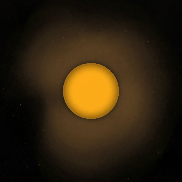

```sh
pnpm telescope explore sun --family F16 --out work/sun-f16
pnpm telescope get work/sun-f16 --pick 1
pnpm telescope outputs work/sun-f16/pick-1/result.json
pnpm telescope family-run work/sun-f16/pick-1/files/output/telescopes/sun/stereo-cor1a-n3d-cr2053p1-m1/descriptor.json \
  spherical-grid-prepare-volume --params TRANSFER.json --out work/sun-cor1-volume
pnpm telescope outputs work/sun-cor1-volume/physical-grid-volume.json
```

Family-operation receipts identify the complete local TypeScript module closure discovered by the
build graph, plus the pinned scientific toolchain. Changing a helper imported by the selected
operation therefore invalidates reuse even when its public owner module is unchanged.

## From a delivered product to an output

`tools/objects/telescopes/outputs.mts` is the final boundary after `session.mts` delivery.
The CLI exposes `telescope outputs RESULT_JSON` and `telescope export RESULT_JSON`.
[The command guide](../packages/telescope/README.md#outputs) covers selectors and files.

Executable outputs include a native FITS plane, a pixel spectrum, a wavelength-weighted
band image, a background-subtracted region mean spectrum and a continuum-subtracted feature map. Astropy owns coordinates and units; the shared scientific reader applies the
same uncertainty and quality policy used by qualification; Astropy NDData owns aggregate
arithmetic and uncertainty propagation. Astropy WCSAxes owns sky-coordinate axes,
ImageNormalize owns display scaling, and quantity_support owns spectral unit conversion.
Matplotlib renders PNG/SVG, tightly bounded around the chart, labels and legend
with a 0.12-inch gutter. PNG backgrounds are transparent; the light labels suit
dark backgrounds. Astropy also writes reusable FITS images or ECSV spectra;
CSV and a product record accompany every export. The record pins the original delivery,
its files, the chosen HDU/plane/pixel, the implementation, package versions and derived bytes.
No plotting stage upgrades the original scientific request's satisfaction.

There is no embedded viewer or viewer service. The command returns ordinary files; Jdaviz
is neither installed nor launched. It can be used separately to explore the original cube.
Static export does not depend on a browser or notebook.

Image FITS files retain the source's separable celestial WCS on the unchanged pixel grid,
physical BUNIT, a MASK extension (1 = missing), and ERR when uncertainties are available.
Absent or coupled celestial coordinates produce explicit pixel axes and a recorded reason;
malformed WCS is refused. Spectral ECSV files retain wavelength and value units, missing-value
masks, standard deviations, selection and uncertainty policy. Both formats refer to the pinned
receipt. CSV remains a simple numeric convenience, with semantics in that receipt.

Display scaling is linear over the finite range; feature maps use a range symmetric around
zero. The receipt records limits, colormap, coordinate frame and WCS warnings. No reprojection,
smoothing or change to the exported measurements is performed. These are recorded sky
coordinates, not a new astrometric calibration or body registration.

The package APIs are documented by [Astropy visualization](https://docs.astropy.org/en/stable/visualization/index.html).
css.earth retains the measurement definition, explicit selection, missing-sample policy and
provenance. This is a thin file export boundary, not another plotting toolkit.

### Example exports: Eris, JWST NIRSpec IFU

These figures come from the local level-3 cube
`jw01191-o019_t002_nirspec_g235m-f170lp_s3d.fits`, SCI HDU 1, with shape
191 wavelengths × 55 rows × 51 columns. Its SHA-256 is
`fbeeb9737ecf46c2b1aad5e27cb55a50e6e8f83fc8e7e347c3aa80d3e07f4bab`.
These figures use the product's MJy/sr units and quality mask. Pixel and plane selectors
are zero-based. Astropy 8.0.1 reads the product; Matplotlib 3.11.2 renders the figures.

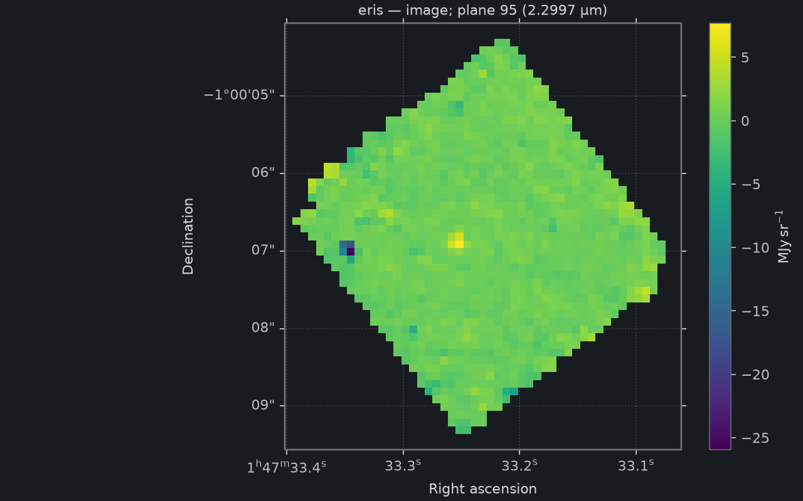

**Image:** plane 95 at 2.2997 µm, shown on the native image grid with source ICRS sky coordinates. The diamond-shaped
footprint is the cube's sampled field, not Eris's surface. Masked samples are omitted.

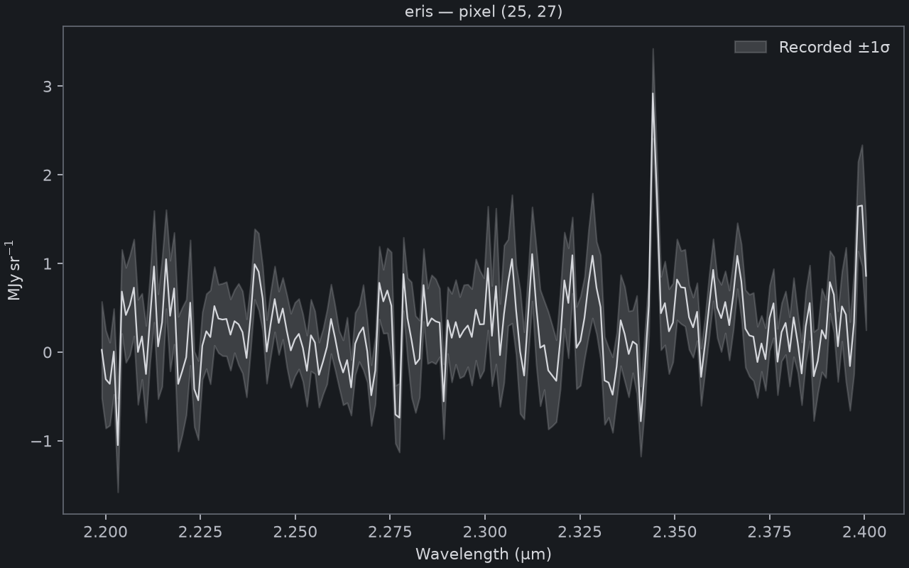

**Spectrum:** one selected pixel, `(25, 27)`, across the cube's approximately
2.2–2.4 µm interval. Shading shows the recorded ±1σ uncertainty. This is not an
aperture-integrated spectrum or a claim about the significance of spectral features.

Given this cube's delivered `result.json`, reproduce the selections with:

```sh
telescope export result.json --output image --hdu 1 --plane 95 --out eris-image
telescope export result.json --output spectrum --hdu 1 --pixel 25,27 --out eris-spectrum
```

The delivery still reports unresolved angular resolution because the caller has not
accepted its profile-model assumptions. Exporting these figures does not change that verdict.

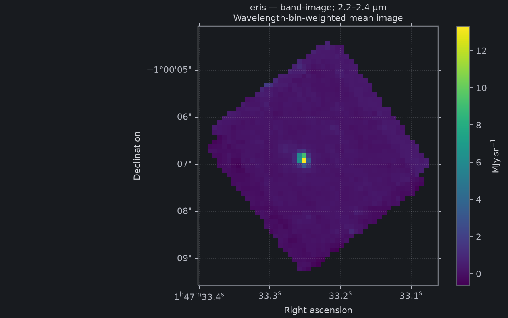

**Band image:** mean surface brightness over 2.2–2.4 µm, weighted by the overlap of each
qualified wavelength bin with that interval. Each visible pixel has every selected sample.
The image retains its native grid; this is not a registered body map.

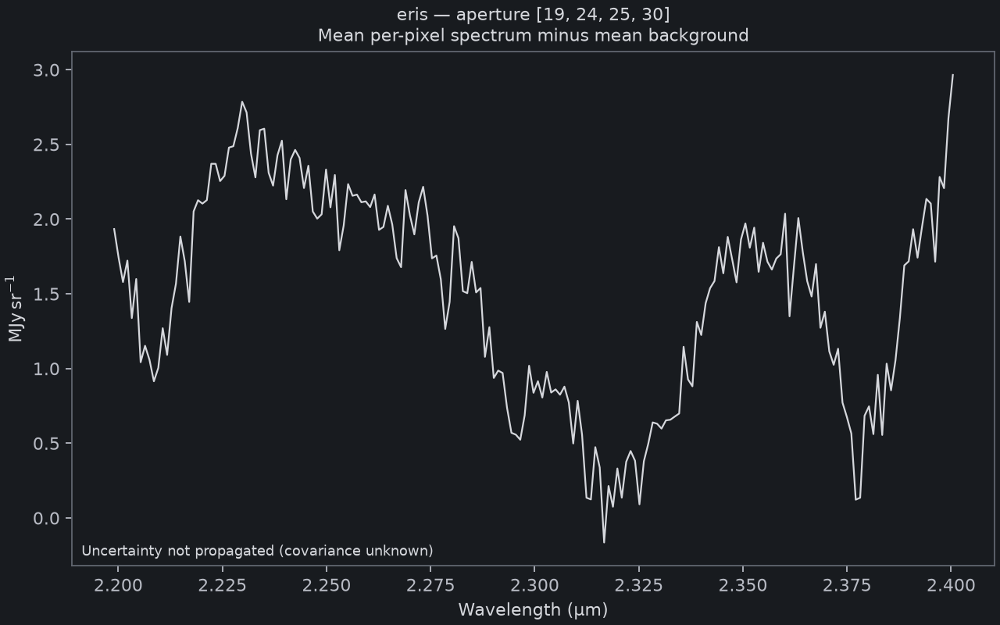

**Aperture spectrum:** mean over the fixed box `[19,24,25,30]`, minus the mean over
background box `[29,24,35,30]`. Coordinates are zero-based, upper bounds exclusive;
these are two disjoint 6 × 6 pixel regions. The result remains mean surface brightness
in MJy/sr, without a total-flux or aperture-correction claim. A missing sample in either
region masks that channel instead of changing the measured area.

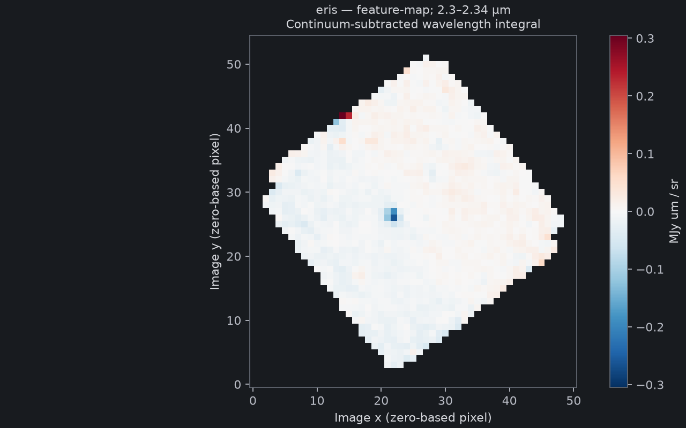

**Feature map:** the wavelength integral over 2.30–2.34 µm after subtracting a linear
continuum anchored by weighted means over 2.26–2.29 and 2.35–2.38 µm. The colour scale
is symmetric around zero: blue is negative (absorption relative to this continuum), red
is positive. Values are MJy µm/sr, not total flux. This selected-window example does not
establish a chemical identification or detection significance; field-edge residuals remain.

```sh
telescope export result.json --output band-image --hdu 1 --band 2.2,2.4 --out eris-band
telescope export result.json --output aperture-spectrum --hdu 1 --aperture 19,24,25,30 --background 29,24,35,30 --out eris-aperture
telescope export result.json --output feature-map --hdu 1 --band 2.30,2.34 --continuum 2.26,2.29,2.35,2.38 --out eris-feature
```

All three examples use the same pinned cube above and the default `--uncertainty omit`:
spatial/spectral covariance has not been supplied. The API can propagate sample variances
with `--uncertainty independent`, including background and continuum errors, but its receipt
and spectrum legend identify that assumption explicitly. No smoothing, PSF matching or
resampling is applied. FITS/ECSV data, PNG, SVG, CSV and a pinned product record accompany each export.


### Independent numerical references

The new output arithmetic uses Astropy NDData. A separate reference tool reads the original
FITS cube and computes spectra with Photutils aperture sums and spectral integrals with
specutils. It does not call the production reducer. These comparisons cover all finite output
samples; units and missing-sample masks match exactly. Reproduction commands are in the
[CLI guide](../packages/telescope/README.md#independent-output-checks).

| Eris output | Independent reference | Valid samples | Maximum absolute difference |
| --- | --- | ---: | ---: |
| Band image | specutils 2.4.0 `line_flux`, divided by wavelength width | 1,309 | 4.45e-15 MJy/sr |
| Aperture spectrum | Photutils 3.0.0 rectangular aperture sums divided by area | 191 | 4.45e-16 MJy/sr |
| Feature map | specutils 2.4.0 integration after explicit continuum subtraction | 1,312 | 1.12e-16 MJy µm/sr |

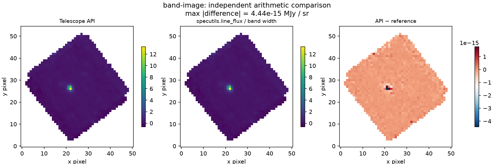

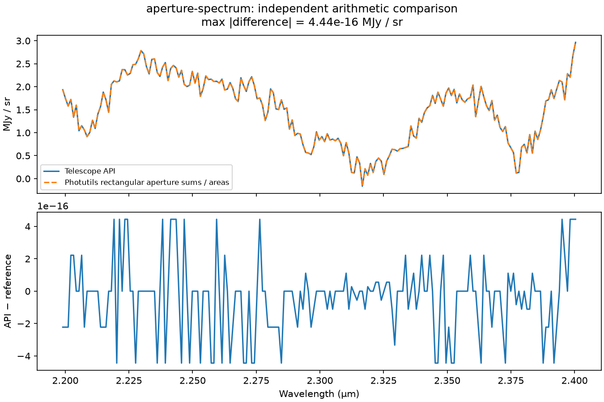

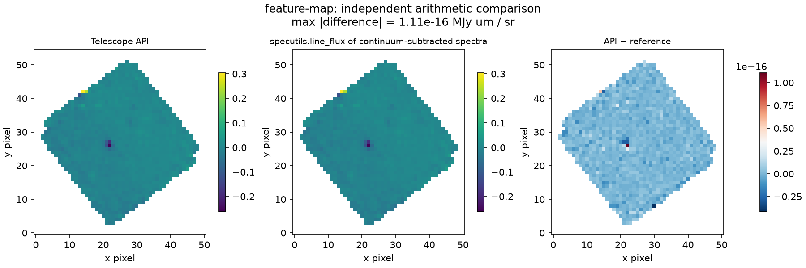

The residual colour scales are in the stated physical units, at floating-point roundoff levels.
They are not science signal. Known-answer fixtures separately verify uncertainty propagation,
including continuum and background contributions. These checks validate the extraction
arithmetic; they share Astropy FITS/WCS decoding and do not establish calibration accuracy,
unknown error covariance, molecular identity or detection significance.

Output ownership and remaining adapters:

| Output | Required scientific input | Existing owner / remaining adapter |
| --- | --- | --- |
| Native image | Qualified pixel array and mask | Astropy FITS/WCSAxes output adapter; native sky or pixel coordinates, not body coordinates |
| Spectral chart | Qualified wavelength axis and explicit pixel or fixed region | Executable FITS output adapter; optional background subtraction and explicitly conditional uncertainty |
| Band image | Qualified units and wavelength bin edges | Executable wavelength-weighted mean; partial boundary bins included |
| Feature map | Qualified bins plus feature and bracketing continuum windows | Executable continuum-subtracted wavelength integral; signed residual, no detection claim |
| Surface map | Measurement definition, viewing geometry, rotation/frame and resolution evidence | PlanetMapper-backed `telescope export --output body-map`; scientific publication remains `body-map-publication.mts` |
| Body sphere | Qualified surface map plus a prepared layer | Standalone HTML from `telescope export --output sphere`, using the existing PolyCSS renderer |
| 3D scatter/volume | Explicit coordinate frame, units and measured or explicitly modeled depth | Existing point-field and density-volume owners; `--output points` or `volume` packages a physical `object.json` |

`telescope outputs ARTIFACT.json` validates current telescope artifact pins and exposes this table as an
executable transition: delivery to scientific output, image output to registered body map,
body map to standard sphere, or an existing physical object to its point/volume handoff.
It does not advertise a later stage when the exact prerequisite outputs are absent, and terminal
sphere and spatial records have no further output. The original request satisfaction travels in
the derived records; rendering or projection does not upgrade it.
The point/volume export performs the full object-package, resource, provenance and licence
validation before it writes a handoff.

A wavelength axis, radial velocity or image intensity cannot silently become physical depth.
PDS arrays pass through `pdr`; ISIS3 cores use the existing shared reader. Both feed
Astropy and Matplotlib through temporary file-backed arrays. `--structure NAME`
selects an ambiguous PDS array, with `--hdu 0` addressing its normalized FITS array.
The original labels, input hashes, decoding versions and limitations remain in the receipt.
The recognized IMAGE / SIGMA_MAP_IMAGE / QUALITY_MAP_IMAGE convention preserves
standard deviations and conservatively accepts only zero quality flags. This is the
[OSIRIS documented all-science-cases criterion](https://rosetta-osiris.eu/documents/SCIENCE_USER_GUIDE.PDF),
not an assertion that every flagged pixel is useless for every analysis.

There is no one-million-pixel CLI cap. Extraction writes NumPy files instead of
serializing pixel arrays through JSON. PNG/SVG previews use a recorded nearest-sample
stride when an axis exceeds 1600 pixels; FITS and CSV keep the entire native grid.
Format readers and serialization still need memory and disk space proportional to their inputs.

### Native examples and physical handoffs

```sh
telescope export enceladus/pick-1/result.json --output spectrum --hdu 0 --pixel 10,10 --out enceladus-spectrum
telescope export comet-67p/pick-10/result.json --output image --structure IMAGE --hdu 0 --out comet-image
telescope export src/objects/stellar-neighbourhood/object.json --output points --out stars-handoff
telescope export src/objects/milky-way/object.json --output volume --out volume-handoff
```

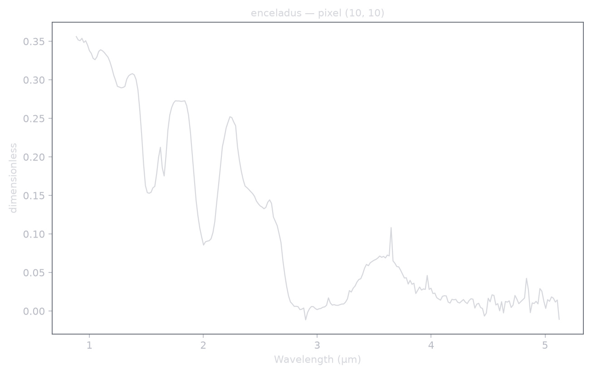

Enceladus: Cassini VIMS cube C1487299582_1_ir.cub, pixel (10,10), recorded spectral
centres and dimensionless I/F. No spectral bin edges or uncertainty are invented.
The source request remains unresolved; a figure does not upgrade qualification.

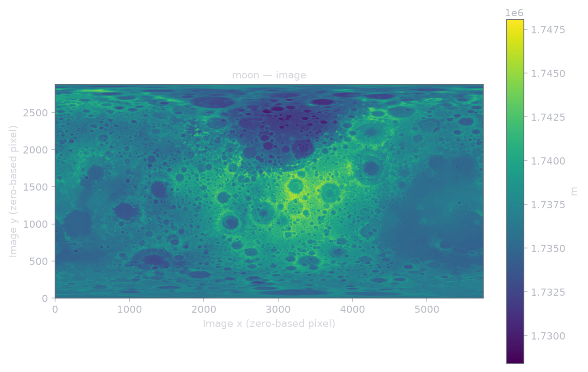

Moon: LOLA LDEM_16, 5760 × 2880 (16,588,800 cells). `pdr.get_scaled` applies
both the label's factor 0.5 and offset 1,737,400 metres. Values span
1,728,418.5–1,748,085.5 m; the figure's native pixel axes do not assert a new
planetary projection. Its preview samples every fourth pixel; FITS and CSV retain
all samples. Supplied uncertainty is unavailable and remains unknown.

The 2048 × 2048 OSIRIS image n20151026t125938783id40f22.img also exported, retaining
its sigma map and all 4,194,304 grid cells. Only 26,917 cells pass the conservative
zero-flag criterion. Its mostly masked preview is not a useful picture of the comet;
the flags remain in the pinned original product for a measurement-specific policy.

The physical handoffs copy the existing prepared object, point bank or volume slices,
textures, frame, source recipe and credits. The application's loaders validate them;
a second renderer is not added. HYG's 109,389 stars retain the source astrometry and
its stated epoch limitations. The Milky Way retains its model interpretation.
The exports reproduce every renderer file byte-for-byte and reject changed textures.
Raw source catalogues/grids are referenced, not bundled: this is a renderer handoff.
An ordinary RA/Dec/wavelength cube still needs a justified physical reconstruction
before it can enter either 3D owner; this command does not supply one.

### Projection and sphere

```sh
telescope export europa/pick-1/result.json --output band-image --hdu 1 \
  --band 4.2,4.3 --uncertainty independent --out europa-band
telescope outputs europa-band/output.product.json
telescope export europa-band/output.product.json --output body-map --geometry navigation.json --out europa-map
telescope outputs europa-map/map.fits.product.json
telescope export europa-map/map.fits.product.json --output sphere --out europa-sphere
```

The body-map export uses PlanetMapper 1.14.0 for image navigation and nearest-neighbour
surface resampling. PlanetMapper owns its SPICE geometry through SpiceyPy;
its projection dependency is pyproj/PROJ. Astropy owns the numerical FITS
output and Matplotlib the figure. The sphere is one standalone HTML file,
using the target's existing standard sphere—the same lane as Mercury. The
prepared mesh, camera, facing/depth bindings and physical frame are reused;
the shared raster lane packs the measurement into a surface lens. The exporter
serializes the scene and compiles the existing native CSS camera ahead of time.
CSS and base64 images are embedded; the document contains no script elements
and prohibits both scripts and network
requests. Inactive image bindings (including Mercury’s unused interior images) are
cleared without changing the prepared geometry or camera. There is no export-owned mesh or camera. A target without the existing
standard sphere package is refused. The export also embeds the prepared world
context for provenance and publishes the application's physical-camera view at export time. Prepare that context
with `pnpm prepare:world-context` before exporting.

The projection uses the pinned navigation ellipsoid. The display keeps the
body package's standard reference sphere and physical scale; both are recorded.
Quantitative colours are unlit. The output contains no PlanetMapper GUI, remote
scripts, canvas or WebGL.

Native resize handles store drag displacement in element dimensions. CSS view
timelines read those dimensions to rotate the camera; a separate native scroll
surface controls zoom. Dragging does not change zoom, and releasing the pointer
holds the view. No JavaScript executes in the exported file. Preparation tools
still run on Node.js.

This portable view stays on the detailed sphere: zoom spans 0.7–3 times the
initial camera distance, with a minimum viewport of 240px. Rotation uses two
axes with roughly 3.4 turns of travel in each direction; reloading resets it.
It does not provide the application's unbounded trackball, keyboard rotation,
interior views or Solar System navigation. The enlarged resize handle requires
Chromium's scrollbar/resizer styling and CSS view timelines. Firefox and real
mobile hardware are not qualified. Unsupported prepared camera bindings are
refused instead of producing an incomplete view.

Check real exported documents with scripting disabled:

```sh
node tests/experiments/native-scroll/sphere-browser.mts europa-sphere/sphere.html mercury-sphere/sphere.html
```

The browser check compares the CSS rotation with native DOMMatrix arithmetic,
checks repeated drags, release and independent zoom, and rejects script elements
or external resource requests. It retains screenshots and a numerical report
under `output/playwright/telescope-no-js/`.

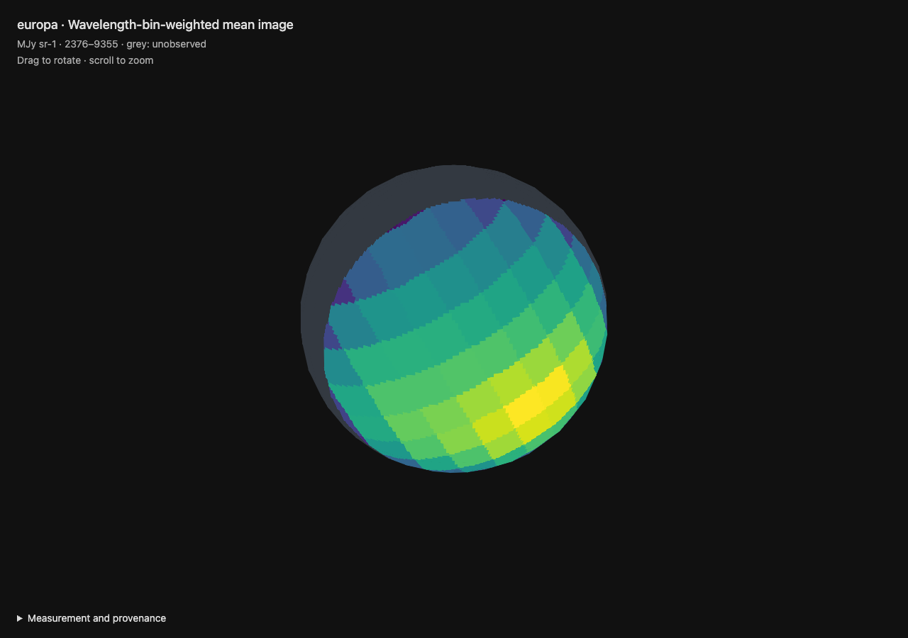

The script-free export was checked in Chromium 153.0.8010.48 with Europa's
457 prepared nodes and Mercury's 910. Rotation differed from DOMMatrix by at
most `8.3e-8` per matrix component (budget `1e-6`); first-drag radius and zoom
were unchanged. These are camera and interaction checks, not new scientific
measurement qualification or a cross-browser guarantee.

Navigation is an explicit scientific input. `navigation.json` contains:

```json
{
  "schema": "cssearth-navigation-input@1",
  "observer": "JWST",
  "kernels": [
    {"file": "pck00011.tpc", "role": "rotation", "source": "https://naif.jpl.nasa.gov/pub/naif/generic_kernels/pck/pck00011.tpc", "bytes": 131226, "sha256": "3dff7b1dbeceaa01f25467767d3fa25816051c85d162d1edf04acb310ee28bb1"}
  ],
  "registration": {"method": "wcs", "explanation": "Header WCS; no independently fitted centre"},
  "width": 360,
  "height": 180,
  "maximumEmissionDegrees": 65
}
```

The example shows the rotation pin; supply the complete ordered kernel set
(leapseconds, shape/rotation, target ephemeris and observer ephemeris) for the
observation. Paths are relative to the navigation file. No kernels are found
implicitly in a home directory or downloaded by the projection command.
A fitted registration uses `method: "disc"`, `parameters: [x, y, radius, rotation]`
in PlanetMapper's zero-based native-image convention, an explanation, and an
`evidence` file with its `file`, `bytes` and `sha256`. WCS must still be valid;
there is no silent image-centre fallback. WCS registration establishes a
coordinate model, not an independently measured pointing accuracy.

The current route accepts bounded two-dimensional intensive measurements
(dimensionless or per steradian) with supplied uncertainty, a celestial WCS,
a matching target/telescope header and `DATE-BEG`/`DATE-END`. Flux per pixel,
missing uncertainty, unresolved discs and unsupported WCS distortion are
refused. This bounded route does not yet cover every instrument's metadata
conventions or target-in-field associations.

`map.fits` contains VALUE, SIGMA and EMISSION planes. Its existing body-map
sidecar records east-positive longitude, planetocentric latitude, the frame,
measurement and mask. Nearest sampling preserves the original value/error
pair; repeated cells are correlated. Navigation uncertainty, beam smearing
and rotation during the exposure are not propagated. No missing hemisphere
is synthesized. Source request satisfaction is retained separately; projection
**does not qualify surface publication or turn pixel sampling into a PSF**.

The HTML preserves the target's prepared reference sphere and physical camera
frame. It opens directly at the measurement with no startup flight; shared
controls own drag and zoom. Colour is not relit. Grey is unobserved.

#### Europa projection, standalone sphere and independent checks

The example uses the archive cube
`jw01250-o002_t001_nirspec_g395h-f290lp_s3d.fits`, SHA256
`838c59a8b0ddcb8e7f464324e1a1515dcfe8f4a42c7c79b7d10e8f23f5ffe64a`,
already pinned by the Europa 1250 reproduction record. This run checks those
archive bytes; it does not claim a new Spec3 reproduction. Its 4.2–4.3 µm
brightness image uses the explicit independent-sample uncertainty assumption.
The disc registration reuses the [previous Europa fit](https://github.com/layoutit/css.earth/blob/4ac4a4a9eb076d63760768e9f4ca3408882f2bcc/src/objects/europa/evidence/jwst-band-maps.json), converted from top-row-first
coordinates to native FITS coordinates; the map excludes emission angles above 65°.

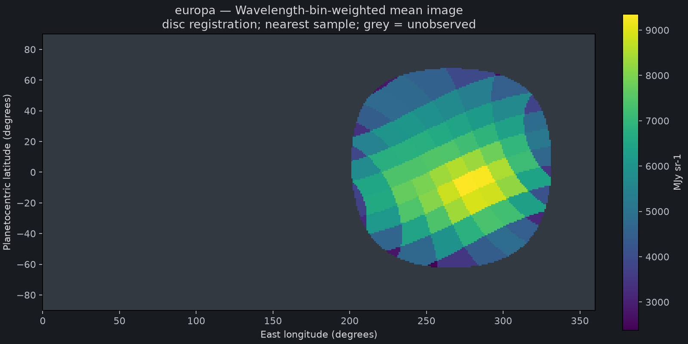

The actual standalone HTML export, rotated through the shared drag controls
(61 browser frames, resized from 1280 × 720 to 960 × 540 and played at 12.5 fps):

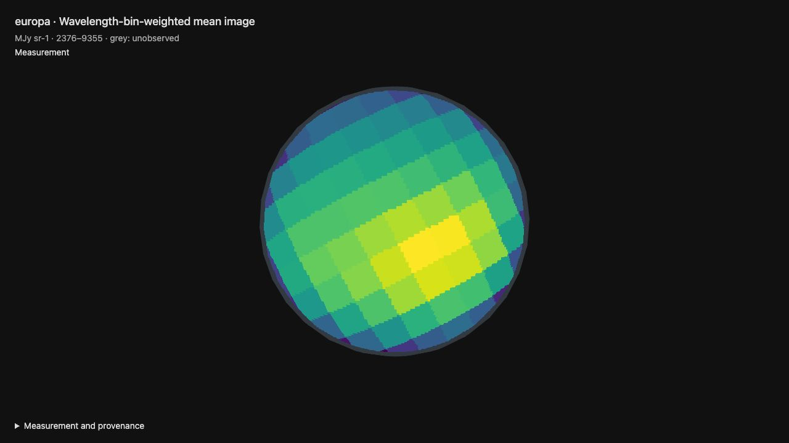

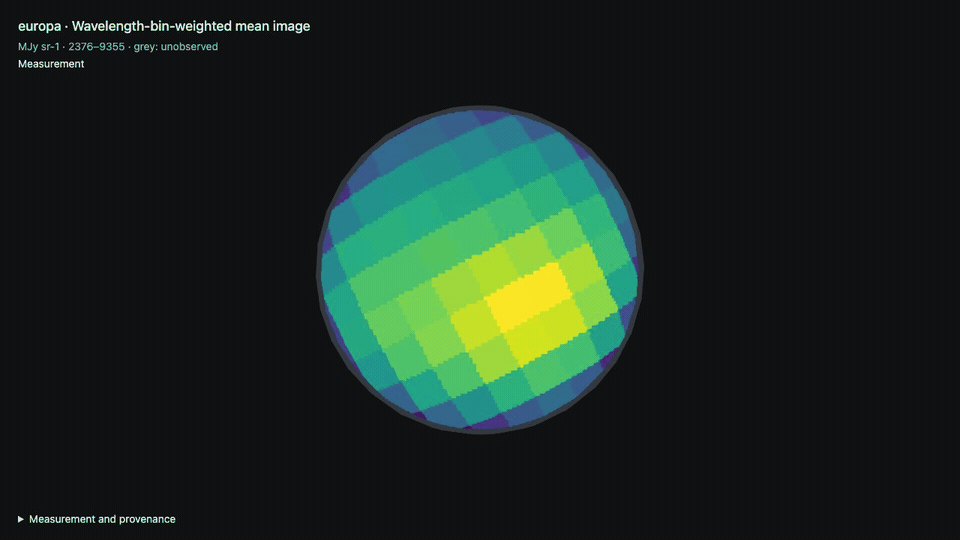

The independent reference traces orthographic rays through the pinned triaxial
ellipsoid using NumPy and draws their sampled values using Matplotlib. It checks
the emission mask and exact preservation of measurement/error pairs. Separately,
the export oracle compares the HTML's prepared tree, camera, facing/depth bindings,
surface-hit geometry and sky against the hash-pinned original body runtime.
Those records must be identical. The reference image below checks the projected
measurement; it is not a screenshot or a second rendering implementation.

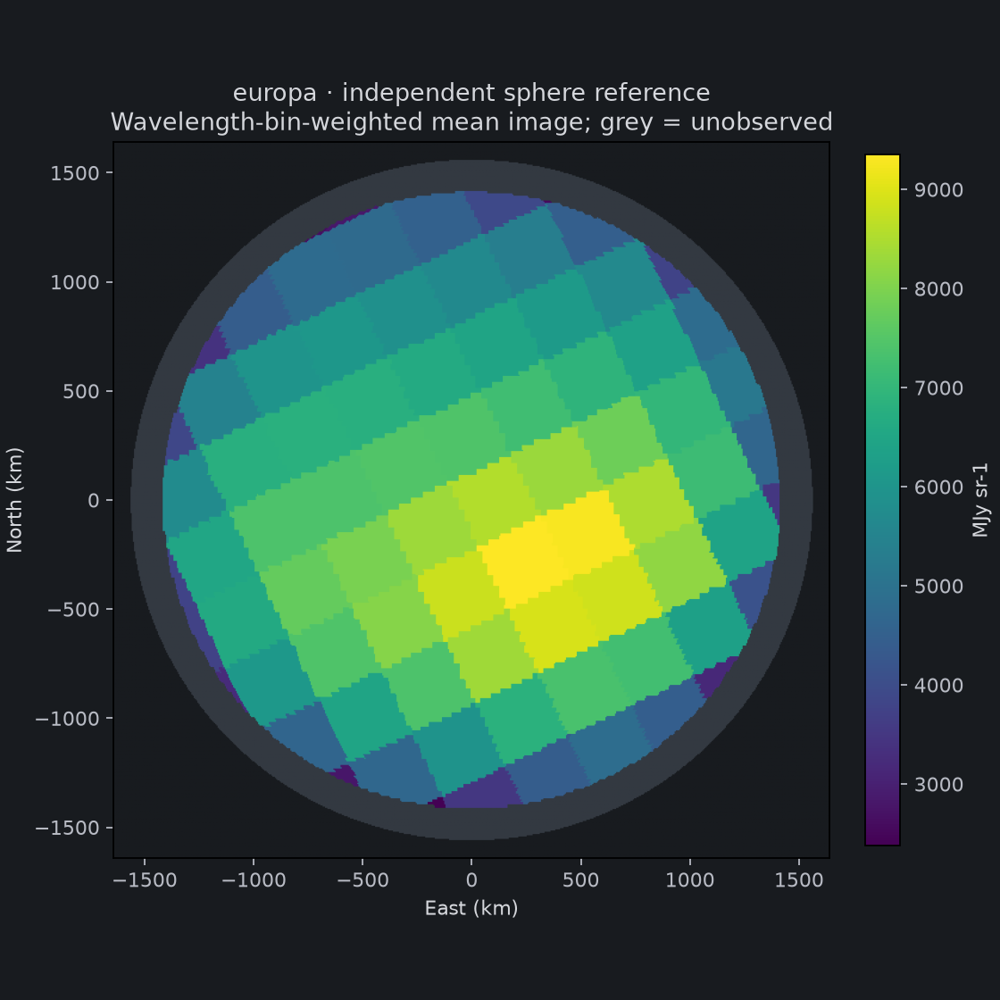

The preceding reference is separate from the HTML rotation preview above. The standalone
Europa HTML was inspected through a local HTTP preview: initial rendering, drag
rotation and wheel zoom remained visible with no browser errors. There is no
startup flight; the first drag preserves camera distance. Screenshot
comparison has not been performed; the draft does not claim pixel parity.
The [navigation recipe](../tests/fixtures/telescope-projection/europa-navigation.json),
[registration evidence](../tests/fixtures/telescope-projection/europa-registration.json) and
[numerical report](../tests/fixtures/telescope-projection/europa-oracle.json) pin this example.
Place each downloaded kernel under the recipe's `kernels/` directory; changed archive bytes
are refused. The executable oracle is:

```sh
node tools/objects/telescopes/sphere-oracle.mts \
  europa-map/map.fits.product.json europa-sphere/sphere.product.json \
  europa-band/image.fits output/sphere-oracle
```
