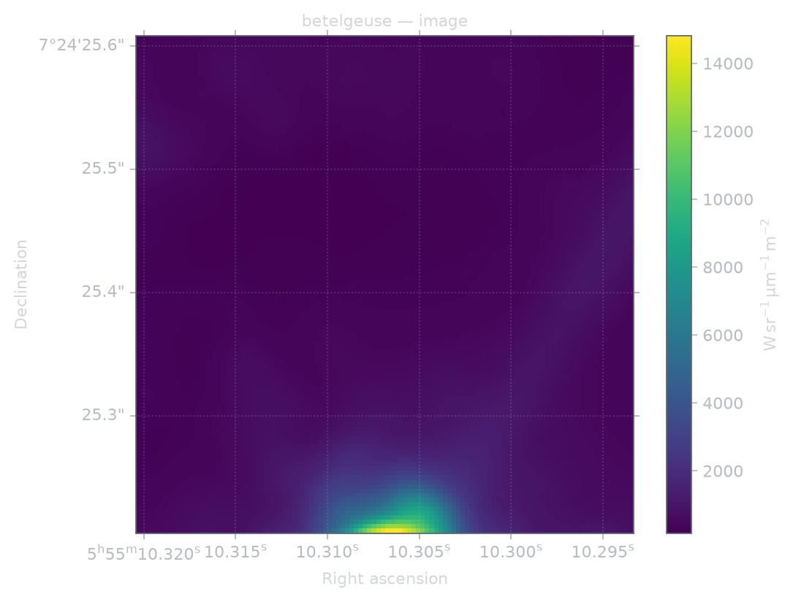

# VO observation access

The Telescope CLI uses the same saved query, numbered choice, qualification and delivery flow for VO archive products. PyVO 1.9.1 owns TAP, VOTable, DataLink and synchronous SODA protocol operations in `astronomy-packages/client.mts`. The `telescopes/vo/` modules own archive identity, target association, access choices and receipts. Existing native-product qualification and figure exporters read the acquired FITS file.

```sh
telescope query betelgeuse --wavelength 0.78,0.85 --kind image \
  --any-time --min-arcsec 1 \
  --icrs-circle 88.792938,7.407063,0.00005555555555555556 --out observations
telescope get observations --pick N
telescope outputs observations/pick-N/result.json
telescope export observations/pick-N/result.json --output image --hdu 0 --out figure
```

Select the number actually returned by the query. A cutout does not establish achieved angular resolution, wavelength coverage, calibration accuracy or complete usable coverage of the requested region. Those verdicts come from qualification of the returned product and can remain unresolved.

`--spectral-frame barycentric` explicitly permits a SODA BAND request in barycentric metres. A wavelength tuple without a frame is not silently converted into that request. BAND includes the continuum support needed by a band-depth request. CIRCLE is optional, explicitly ICRS, and never inferred from a moving target's name or requested resolution. A service that advertises CIRCLE but no BAND cannot execute a BAND request. Unsupported requested constraints are rejected.

A target that the application catalogue does not ship is resolved by SIMBAD through the pinned PyVO TAP client (`telescopes/sky/target.mts`). The search uses SIMBAD's identifiers and a footprint circle of SIMBAD's position error around its position. That circle only selects records; it never cuts a product. Only `--icrs-circle` asks for a cutout, and then the search uses that circle instead. SIMBAD's main identifier, identifiers, position, position error and the position's bibcode are saved in the exploration request, so `get` reuses them; SIMBAD's pinned answers are saved beside it as `skyResolution`. They stay out of the request because SIMBAD names each result table after the request time, and a request that changed with every call would give every re-exploration new record keys. A name SIMBAD does not resolve (for example plain `S2`, which SIMBAD calls `[EG97] S2`) is reported as unknown.

The initial service profiles cover ESO and ALMA ObsCore 1.1 and ESA PSA EPN-TAP 2.0. They perform bounded name/alias searches with the applicable product, instrument (`--instrument`, matched to `instrument_name`) and wavelength filters, not complete inventory searches. With `--icrs-circle`, an ObsCore search also returns records whose footprint intersects the circle. EPN-TAP has no ICRS footprint, so the region is not applied there and the recorded scope says so. Each sample is taken in the service's declared identity order (`ORDER BY obs_publisher_did, obs_id`, or `granule_uid` for EPN-TAP), so the same query returns the same rows while the archive is unchanged. Each result retains its exact ADQL, sample limit, original response pin, schema and resource metadata. Overflow preserves useful rows and remains distinct from completed empty results in the recorded scope. A service failure does not turn other archives into failures or become a negative observation claim.

A malformed advertised `access_format` names no decoder; ALMA declares the column as `char(9)` and serves `applicati`. The access URL is then read as a DataLink service, and anything that does not answer as one is refused. Some services stamp every answer with the query time, so a saved archive choice is found again by its observation and acquisition identity; the saved reference still records the response it was chosen from.

Observation, publisher/dataset, selected file, acquisition operation and received-byte identities are separate. EPN granules are service/table scoped. Repeated or absent row identifiers produce snapshot-and-row-bound keys with an explicit limitation. Target names and classes are compared with the application catalogue; sky overlap alone is not an association. A record that a region search returned under another archive name is marked `in-field`, with that name in its reason, and never `confirmed`. Archives file a crowded field under names such as `SgrA_star` or `Circumnuclear_Disk`, so the S-stars around Sgr A* are only found this way. An `in-field` product qualifies only when usable pixel centres of its own WCS fall inside the circle. Native qualification checks the actual FITS target header and arrays.

DataLink previews are not science choices. Multiple science links remain separate. Both direct links and advertised DataLink service descriptors can lead to nested responses. Dispatch follows the advertised standard; a DataLink descriptor is not treated as SODA. PyVO resolves fixed and referenced parameters, and the public query forwards them unchanged. The visited identity includes the endpoint and bound parameters, so two datasets at one endpoint remain distinct; nesting and request bounds still apply.

Archive-advertised access and DataLink URLs must use HTTP(S) without credentials. Private, loopback, link-local and other non-public IP destinations are refused during access planning. The Python transport checks resolved addresses at connection time and checks every redirect. Local fixture tests pass an explicit host allowlist; the CLI has no such override. Non-raster table, spectrum, photometry, event and strip products may remain visible as archive metadata, but they are not offered as `get` or `qualify` choices until a native qualifier exists.

SODA parameter validation uses the standard name/UCD/unit declarations, including `meta.ref.url;meta.curation` for ID and `em.wl;stat.interval` for BAND. The separate ESO compatibility rule accepts its captured fixed-ID `meta.id;meta.dataset` declaration only for its advertised service. ALMA's captured malformed nine-character MIME field is retained and refused; correcting nested dispatch does not qualify that separate route or justify guessing a protocol from its hostname.

The default limits are 1 GiB per science acquisition, 32 MiB per metadata response, three nested DataLink edges, 32 access-description requests per public query, and 1 GiB / 1024 members per expanded package. Override them with `--max-science-bytes`, `--max-metadata-bytes`, `--max-link-depth`, `--max-link-requests`, `--max-expanded-bytes` and `--max-package-members`. Overrides affect acquisition identity. Metadata estimates are advisory; received bytes enforce the bound. Transfers stage before publication, do not retry automatically, and never replace failed subsets with whole-product downloads. ZIP/tar access is limited to one unambiguous FITS image/cube with a complete pinned member set. Unsupported science formats and ambiguous multiple science members are refused; package availability does not imply a new PDS decoder.

`archive-subset-origin` means the archive returned these exact bytes for this parent and operation. `archive-retrieval-origin` records direct retrieval without asserting a final calibration level. Neither means local recalibration, agreement with a parent array, unchanged sampling or fulfillment of the scientific request. Qualification retains uncertainty/quality arrays, reads units and wavelength metadata from the product, and keeps unavailable calibration evidence explicit.

Top-level coordinate/time systems are preserved. EPN time normalization resolves referenced TIMESYS and row-level scale/reference-position declarations, refusing contradictions and unresolved references. EPN's UTC default applies only when no explicit scale overrides it; it is not a universal JD default. Conversion still requires day units and a compatible origin, so the captured PSA missing-unit limitation remains explicit. UTC scale conversion does not apply a light-travel-time correction. The standard `spatial_coordinate_description` field survives normalization. Transfer errors expose typed `authentication`, `no-content`, `byte-limit`, `protocol`, `transport`, `interrupted`, `identity` or `local-io` codes.

Region assessment uses Astropy celestial WCS and the returned valid-pixel mask. Missing boundary samples or invalid in-region pixel centers can establish partial coverage. Successful discrete checks leave continuous coverage unknown; they do not prove that every point in the requested sky circle was measured.

Acquisition records, original responses, the discovery snapshot, science file and qualification receipt travel together in `cssearth-telescope-delivery@3`. Each delivered file and each producing output carries a SHA-256 digest and byte count; changed bytes invalidate reuse and figure export even when the size is unchanged. Older deliveries without content pins cannot be reopened as verified artifacts. Save a new query or exploration directory and run `get` again to create a pinned delivery. `telescope get observations --pick N --offline` verifies an already delivered local artifact without refreshing an archive; it cannot perform a new acquisition. This is replay of historically qualified bytes, not requalification with the current software. Normal get requires a current implementation binding. Qualification records carry the qualifier source digest separately from acquisition software.

The legacy `loadQueryInputs(root, targetString)` overload keeps its earlier archive-loading behavior. Callers supplying a full scientific request receive VO discovery and access planning too. Existing saved choice keys are preserved; VO choices use an explicit acquisition-key variant.

Protocol fixtures and their limits are documented in [the fixture inventory](../tests/fixtures/telescope-vo/README.md). Fixture tests do not replace live acquisition/delivery evidence. Primary contracts: [ObsCore 1.1](https://www.ivoa.net/documents/ObsCore/20170509/REC-ObsCore-v1.1-20170509.pdf), [EPN-TAP 2.0](https://www.ivoa.net/documents/EPNTAP/20220822/REC-EPNTAP-2.0.html), [SODA 1.0](https://www.ivoa.net/documents/SODA/20170517/REC-SODA-1.0.html), [DataLink](https://www.ivoa.net/documents/DataLink/) and [the pinned PyVO implementation](https://github.com/astropy/pyvo/tree/v1.9.1).

## Live evidence and validation

On 2026-09-20 the public query/get/outputs/export flow delivered a 169,920-byte ESO Betelgeuse FITS cutout (112×112 usable samples). A second 95,040-byte cutout and the 8,458,560-byte direct FITS product passed the same saved-session acquisition/qualification/delivery owners and public output commands. Those additional runs reused the retained live ObsCore discovery response and fetched fresh access descriptions and science bytes. All three have distinct acquisition keys and science hashes; this alone does not prove every cross-subset cache rejection case.

[Machine-readable evidence](../tests/fixtures/telescope-vo/live-evidence.json) records the received bytes and delivery/figure digests. The example is a requested sky crop, not a centered stellar portrait; the bright emission is clipped at its edge. Wavelength coverage and achieved resolution remain unresolved.



Tests cover descriptor/ref binding, separate subset choices, native qualification, portable delivery, offline replay, tampered evidence and failure without a full-product fallback. New deliveries explicitly record the producing output directory; identical bytes stored at different package paths cannot be mistaken for one another. ZIP/TAR tests retain labels and referenced format files, refuse missing dependencies and unsafe member paths, and enforce both streamed expansion and member-count limits.

These live captures predate the final path-binding and package-hardening changes. Those changes are exercised by the offline integration tests, and do not change the retained live science bytes or the plotting algorithms. The pinned responses are evidence for the documented query scope, not an inventory or certification of every service.

## Moving-object observation packages

The Emilylakdawalla proposal supplies useful consumers for the shared pipeline. Its reported observation counts and photometry are proposal claims until their source bytes and scientific checks are reproduced; this integration does not publish those measurements.

- **Designations:** the object catalogue owns explicit aliases, including numbered and provisional designations. The target resolver consumes them, preserves collisions as ambiguity and never repurposes `systemName` as a designation. Archive queries carry those declared names and retain the archive's own target identifier.
- **Discovery versus detection:** SSOIS footprints and predicted WISE intersections belong in the existing investigation records. An image crossing is not a detection, and a catalogue association is not calibrated photometry. A future promotion needs a pinned exposure, epoch, positional residual, motion/quality/background checks and a receipt for the intended measurement. Name-only empty searches remain explicitly scoped; they cannot exclude incidental detections.
- **Native source closure:** use the existing source manifest and source-observation intake for pinned images. Preserve original compressed bytes separately from decoded files, and include headers, labels, external format files and calibration companions required by the selected decoder. Archive or packaging success establishes origin and integrity only.
- **Measurement products:** MPC ADES astrometry and SDSS MOC photometry need shared importers and native table qualification before they can enter selectable products. `photometry` is already a product kind, but the generic source decoder does not yet qualify that catalogue product; `astrometry` has no supported product route. Neither gap should be hidden by relabelling those rows as images. An astrometry request must not invent a wavelength band merely to satisfy the current query contract; positional uncertainty must remain distinct from image PSF resolution. Keep MPC magnitudes as heterogeneous reported attributes until calibrated; retain SDSS errors, flags, passbands and frame identities.
- **Rendering:** unresolved multiband color is integrated photometry. It cannot become a geographic surface map or supply invented shape, radius, albedo or rotation values. Geometry and a body display package are independent of these pipeline changes.

The relevant next provider implementations are MPC ADES and SDSS catalogue/frame qualification through the existing acquisition, source-product, qualification and output owners. They require pinned upstream fixtures and reviewed attribution/reuse terms. Body-specific packages, SSOIS discovery and WISE detection qualification remain separate work; no per-asteroid query branch is introduced.

The VO interoperability review adds standards-derived cases and local HTTP integration coverage: 25 access, metadata, coverage and saved-session tests; six EPN normalization cases; and two PyVO/public-query parameter-forwarding tests pass. Scoped Telescope TypeScript passes. This pass fixes standard SODA declarations, descriptor-based DataLink nesting and EPN time/spatial metadata; it does not repeat live archive transfers.

Earlier validation at `3472201eeb` includes 11 package-extraction tests, 44 target/query tests, product-record tests, legacy sessions and native export/handoff checks. Those owners are unchanged by this review. The catalogue alias-loader assertion passed, while its containing object-schema suite retains one unrelated discovery-path expectation failure (6/7). The full tools typecheck remains blocked by missing generated modules; these are not reported as full-suite passes.
